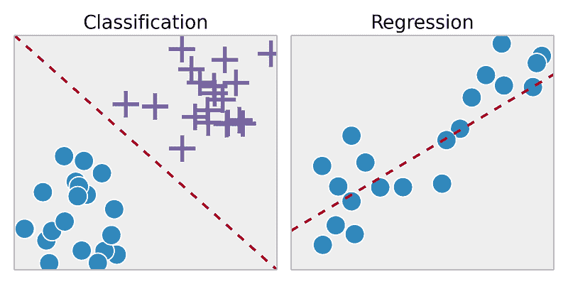
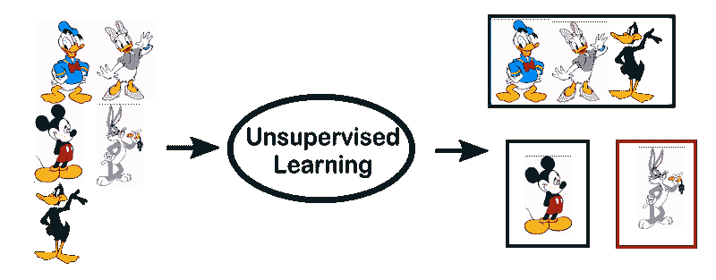
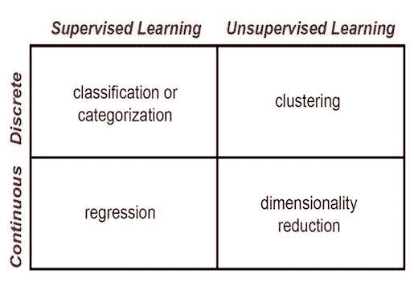

# 监督学习与无监督学习

> 原文：[`www.kdnuggets.com/2018/04/supervised-vs-unsupervised-learning.html`](https://www.kdnuggets.com/2018/04/supervised-vs-unsupervised-learning.html)

 评论

**由 [Devin Soni](https://www.linkedin.com/in/devinsoni/)，计算机科学学生**

在机器学习领域，有两种主要的任务类型：监督学习和无监督学习。这两种类型的主要区别在于，监督学习是使用**真实值**进行的，换句话说，我们事先知道样本的输出值应该是什么。因此，监督学习的目标是学习一个函数，该函数在给定数据样本和期望输出的情况下，最佳地近似输入和输出之间的关系。而无监督学习则没有标签输出，因此其目标是推断数据点集中的自然结构。

* * *

## 我们的前三名课程推荐

 1\. [谷歌网络安全证书](https://www.kdnuggets.com/google-cybersecurity) - 快速进入网络安全职业的快车道。

 2\. [谷歌数据分析专业证书](https://www.kdnuggets.com/google-data-analytics) - 提升你的数据分析技能

 3\. [谷歌 IT 支持专业证书](https://www.kdnuggets.com/google-itsupport) - 支持你在 IT 领域的组织

* * *

**监督学习**

监督学习通常在分类的背景下进行，当我们想将输入映射到输出标签时，或在回归的背景下进行，当我们想将输入映射到连续输出时。监督学习中的常见算法包括逻辑回归、朴素贝叶斯、支持向量机、人工神经网络和随机森林。在回归和分类中，目标是找到输入数据中的特定关系或结构，以便我们能够有效地生成正确的输出数据。请注意，“正确”的输出完全由训练数据决定，因此尽管我们确实有一个模型会假设为真的真实值，但这并不意味着数据标签在现实世界中总是正确的。噪声或错误的数据标签将显著降低模型的有效性。

在进行监督学习时，主要考虑因素是模型复杂性和偏差-方差权衡。请注意，这两者是相互关联的。

模型复杂性指的是你试图学习的函数的复杂程度——类似于多项式的度数。模型复杂性的适当水平通常由你的训练数据的性质决定。如果你拥有的数据量较小，或者数据在不同可能场景中的分布不均匀，你应该选择一个低复杂度的模型。这是因为高复杂度的模型如果用于少量数据点，会**过拟合**。过拟合是指学习一个能够很好地拟合你的训练数据的函数，但不能**泛化**到其他数据点——换句话说，你只是严格地学习如何生成你的训练数据，而没有学习导致这些输出的实际趋势或数据结构。可以想象在两个点之间拟合一条曲线。理论上，你可以使用任何度数的函数，但实际上，你会节俭地增加复杂性，并选择线性函数。

偏差-方差权衡也与模型的泛化能力有关。在任何模型中，存在偏差，即恒定的误差项，以及方差，即误差在不同训练集之间的变化量。因此，高偏差和低方差的模型是指在 20%的时间里始终错误的模型，而低偏差和高方差的模型则是指根据用于训练的数据，模型可能在 5%-50%的时间里出现错误。注意，偏差和方差通常是相反的；增加偏差通常会导致方差降低，反之亦然。在构建模型时，你的具体问题和数据的性质应该使你能够做出关于偏差-方差谱上位置的明智决策。一般来说，增加偏差（并减少方差）会导致具有相对保证的基准性能的模型，这在某些任务中可能是至关重要的。此外，为了生成具有良好泛化能力的模型，你的模型方差应随训练数据的大小和复杂性而变化——小而简单的数据集通常应使用低方差模型来学习，而大而复杂的数据集通常需要高方差模型才能充分学习数据的结构。

**无监督学习**

无监督学习中最常见的任务是聚类、表示学习和密度估计。在所有这些情况下，我们希望在不使用显式提供的标签的情况下学习数据的内在结构。一些常见的算法包括 k 均值聚类、主成分分析和自编码器。由于没有提供标签，因此在大多数无监督学习方法中，没有具体的方法来比较模型性能。

无监督学习的两个常见使用案例是探索性分析和降维。

无监督学习在探索性分析中非常有用，因为它可以自动识别数据中的结构。例如，如果分析师尝试对消费者进行细分，无监督聚类方法将是分析的一个很好的起点。在人类提出数据趋势不可能或不切实际的情况下，无监督学习可以提供初步的见解，然后可以用来测试个别假设。

维度减少，即指通过使用较少的列或特征来表示数据的方法，可以通过无监督方法完成。在表示学习中，我们希望学习个别特征之间的关系，从而使用潜在特征表示数据，这些特征相互关联。这个稀疏的潜在结构通常使用比最初使用的特征要少得多的特征来表示，因此可以使进一步的数据处理变得更加轻便，并且可以消除冗余特征。

**TLDR:**

**个人简介：[Devin Soni](https://www.linkedin.com/in/devinsoni/)** 是一名计算机科学学生，对机器学习和数据科学感兴趣。他将在 2018 年成为 Airbnb 的**软件工程实习生**。可以通过[LinkedIn](https://www.linkedin.com/in/devinsoni/)与他联系。

[原始](https://towardsdatascience.com/supervised-vs-unsupervised-learning-14f68e32ea8d)。经许可转载。

**相关：**

+   机器学习算法：为你的问题选择哪一个

+   k-最近邻介绍

+   马尔可夫链介绍

### 更多相关主题

+   [停止学习数据科学以寻找目标，并寻找目标以...](https://www.kdnuggets.com/2021/12/stop-learning-data-science-find-purpose.html)

+   [数据科学学习统计的顶级资源](https://www.kdnuggets.com/2021/12/springboard-top-resources-learn-data-science-statistics.html)

+   [90 亿美元的人工智能失败，解析](https://www.kdnuggets.com/2021/12/9b-ai-failure-examined.html)

+   [成功数据科学家的 5 个特征](https://www.kdnuggets.com/2021/12/5-characteristics-successful-data-scientist.html)

+   [是什么使 Python 成为初创公司的理想编程语言](https://www.kdnuggets.com/2021/12/makes-python-ideal-programming-language-startups.html)

+   [每个数据科学家都应了解的三个 R 库（即使你使用 Python）](https://www.kdnuggets.com/2021/12/three-r-libraries-every-data-scientist-know-even-python.html)
