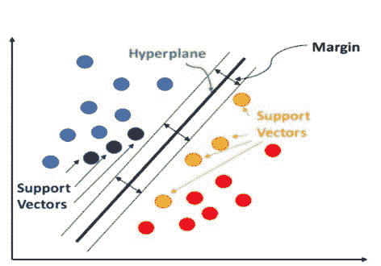
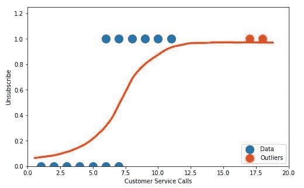
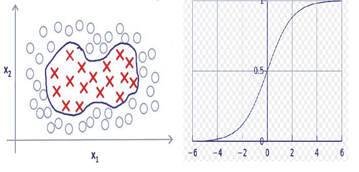
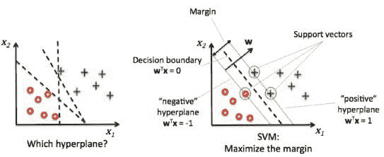
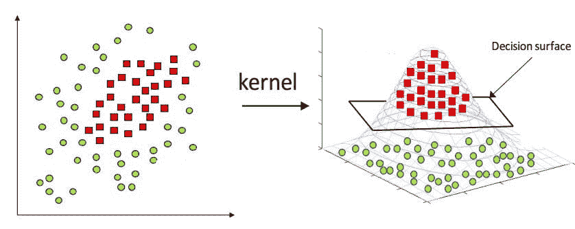

# 支持向量机：直观方法

> 原文：[`www.kdnuggets.com/2022/08/support-vector-machines-intuitive-approach.html`](https://www.kdnuggets.com/2022/08/support-vector-machines-intuitive-approach.html)

图片来源 [freepik](https://img.freepik.com/free-vector/learning-concept-illustration_114360-6186.jpg?w=996&t=st=1660494575~exp=1660495175~hmac=ea22e5e0a1e466bbc0d4e9d728e693f76e49f854bc3af1a5eaf5ebfa151c258a)

# 介绍

* * *

## 我们的前三个课程推荐

 1\. [谷歌网络安全证书](https://www.kdnuggets.com/google-cybersecurity) - 快速进入网络安全职业轨道

 2\. [谷歌数据分析专业证书](https://www.kdnuggets.com/google-data-analytics) - 提升您的数据分析技能

 3\. [谷歌 IT 支持专业证书](https://www.kdnuggets.com/google-itsupport) - 支持您的组织的 IT 工作

* * *

支持向量机（SVM）是最受欢迎的机器学习算法之一，尤其是在预提升时代（提升算法引入之前），它用于分类和回归任务。

SVM 分类器的目标是找到最佳的 n-1 维超平面，也称为决策边界，它可以将 n 维空间分隔成感兴趣的类别。值得注意的是，超平面是一个其维度比其环境空间少一个维度的子空间。

SVM 识别支持这个超平面的端点或终端向量，同时最大化它们之间的距离。这就是它们被称为支持向量的原因，因此算法被称为支持向量机。

下面的图示显示了被超平面分隔的两个类别：

来源：[`datatron.com/wp-content/uploads/2021/05/Support-Vector-Machine.png`](https://datatron.com/wp-content/uploads/2021/05/Support-Vector-Machine.png)

# 为什么 SVM 如此受欢迎？

与更简单的算法例如逻辑回归相比，SVM 识别最大间隔使其在处理噪声时成为一种稳健的选择。特别是当一个类别的样本越过决策边界到达另一侧时。

另一方面，逻辑回归对于这种噪声样本非常脆弱，即使是少量噪声观察样本也会破坏结果。基本观点是逻辑回归并不试图最大化类别之间的分离，只是在一个决策边界处任意停止，该边界能够正确分类两个类别。

来源：[`kajabi-storefronts-production.kajabi-cdn.com/kajabi-storefronts-production/blogs/2147494064/images/N5bIuCEvQL6ZFNY3GCiX_LR3.png`](https://kajabi-storefronts-production.kajabi-cdn.com/kajabi-storefronts-production/blogs/2147494064/images/N5bIuCEvQL6ZFNY3GCiX_LR3.png)

拥有一个软边界还允许一定的误分类预算，因此使 SVM 对跨类的情况具有鲁棒性。

来源：[`vitalflux.com/wp-content/uploads/2015/03/logistic-regression-vs-SVM.png`](https://vitalflux.com/wp-content/uploads/2015/03/logistic-regression-vs-SVM.png)

核函数是 SVM 受欢迎的另一个原因。SVM 分类器能够使用非线性决策边界分隔类别。

我们将在接下来的部分讨论更多关于软边界和核技巧的内容，但首先让我们关注软边界的前身，即硬边界 SVM。

# 硬边界 SVM

让我们从一个直接且相对易于理解的 SVM 版本开始讨论，这就是硬边界 SVM，或称为最大边界分类器。

当两个类别在垂直距离上线性可分时，这个距离称为边界。唯一需要观察的是两个类别在彼此的相对位置上明显分开，这意味着没有一个样本穿过边界。

让我们深入探讨一下硬边界支持向量机的数学。

在下图中，我们有一个绿色的正类和一个红色的负类。为了最大化两个类别之间的边界或距离，我们需要假设一个垂直于决策边界的向量。

来源：[`qph.cf2.quoracdn.net/main-qimg-8264205dc003f4e1c15a3d060b9375ee-pjlq`](https://qph.cf2.quoracdn.net/main-qimg-8264205dc003f4e1c15a3d060b9375ee-pjlq)

在以下约束下：

这是因为边界右侧的样本应被分类为正类，左侧的样本应被分类为负类。

我们还可以将目标函数写成：

这称为铰链损失，它负责确保两个类别的正确分类。

# 软边界 SVM

现实世界中的数据并不像硬边界那样理想地线性可分。解决方案是允许微小的误分类或边界违规，以最大化整体边界。使用软边界而不是硬边界的最大边界分类器称为软边界分类器。

让垂直向量为“w”，我们的目标是最大化决策边界两侧的步数，假设它位于两个支持向量的中间。解决上述方程会得到如下的边距：

最大化上述数量相当于最小化 ||w|| 或其平方，从而最大化分类器的边距。

这为硬边距情况中讨论的铰链损失方程添加了额外的项，其中 ||w||² 项确保模型在平衡正确分类和最大化边距方面。下方的方程显示了软边距 SVM 的两个组成部分，其中第二项作为正则化项。

来源：[`miro.medium.com/max/1042/1*nFmhvEy6GyYQOYlF-L9XRw.png`](https://miro.medium.com/max/1042/1*nFmhvEy6GyYQOYlF-L9XRw.png)

在这里，lambda 是一个超参数，可以调整以允许更多或更少的误分类。较高的 lambda 值意味着允许更多的误分类，而较低的 lambda 值则将误分类限制在最小。

# 核技巧

世界并不理想，因此并非所有分类问题都有线性可分的类别。SVM 中的核函数允许我们解决这种情况。

以下是如何将多项式核函数（2 次多项式）应用于非线性可分情况以使其线性可分的示例。

来源：[`miro.medium.com/max/1400/1*mCwnu5kXot6buL7jeIafqQ.png`](https://miro.medium.com/max/1400/1*mCwnu5kXot6buL7jeIafqQ.png)

一些常见的核函数如下所示：

来源：[`d3i71xaburhd42.cloudfront.net/3a92a26a66efba1849fa95c900114b9d129467ac/3-TableI-1.png`](https://d3i71xaburhd42.cloudfront.net/3a92a26a66efba1849fa95c900114b9d129467ac/3-TableI-1.png)

核函数非常神奇，它们可以在不增加维度开销的情况下，将数据投影到额外的维度中。

# 概要

我们讨论了 SVM 分类器的重要性及其应用，特别是在维度数量远高于样本数量时。这使得它在 NLP 问题中非常有效，因为文本经常被转换为非常长的数字向量。此外，我们了解了核函数，它们有助于分类新数据点跨越非线性决策边界。此外，SVM 模型在很大程度上免于过拟合，因为决策边界仅受支持向量的影响，对其他极端观测值的存在几乎免疫。

**[Vidhi Chugh](https://vidhi-chugh.medium.com/)** 是一位获奖的 AI/ML 创新领袖和 AI 伦理学家。她在数据科学、产品和研究的交汇点上工作，以提供商业价值和洞察。她是数据中心科学的倡导者，并且在数据治理方面是领先的专家，致力于构建值得信赖的 AI 解决方案。

### 了解更多此主题的信息

+   [支持向量机的温和介绍](https://www.kdnuggets.com/2023/07/gentle-introduction-support-vector-machines.html)

+   [语义向量搜索如何改变客户支持互动](https://www.kdnuggets.com/how-semantic-vector-search-transforms-customer-support-interactions)

+   [Python 向量数据库和向量索引：构建 LLM 应用程序的架构](https://www.kdnuggets.com/2023/08/python-vector-databases-vector-indexes-architecting-llm-apps.html)

+   [协同过滤的直观解释](https://www.kdnuggets.com/2022/09/intuitive-explanation-collaborative-filtering.html)

+   [AI 的伦理：驾驭智能机器的未来](https://www.kdnuggets.com/2023/04/ethics-ai-navigating-future-intelligent-machines.html)

+   [AI for Ukraine 是 AI HOUSE 的一个新教育项目，旨在支持乌克兰技术社区](https://www.kdnuggets.com/2022/08/ai-house-ai-ukraine-new-educational-project-support-ukrainian-tech-community.html)
