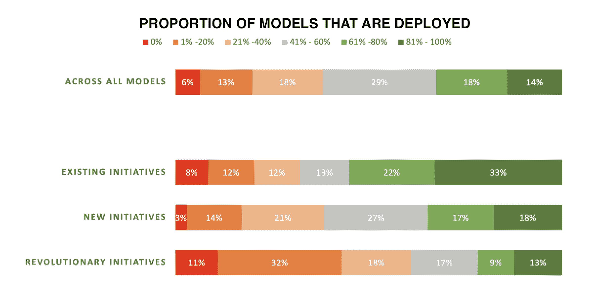

# 调查：机器学习项目仍然经常失败于部署

> 原文：[`www.kdnuggets.com/survey-machine-learning-projects-still-routinely-fail-to-deploy`](https://www.kdnuggets.com/survey-machine-learning-projects-still-routinely-fail-to-deploy)

机器学习项目成功部署的频率有多高？不够频繁。有[大量](https://www.ibm.com/thought-leadership/institute-business-value/en-us/report/ai-capabilities) [行业](https://sloanreview.mit.edu/projects/expanding-ais-impact-with-organizational-learning/) [研究](https://econsultsolutions.com/wp-content/uploads/2020/09/ESITL_Driving-ROI-through-AI_FINAL_September-2020.pdf) [表明](https://hdsr.mitpress.mit.edu/pub/2fu65ujf/release/2) [机器学习项目](https://www.techrepublic.com/article/85-of-big-data-projects-fail-but-your-developers-can-help-yours-succeed/) 通常未能带来回报，但很少有研究从数据科学家的角度评估失败与成功的比例——即那些开发这些项目所需模型的人。

跟进我去年与 KDnuggets 共同进行的数据科学家调查，[今年的行业领先数据科学调查](https://drive.google.com/file/d/1Mz3WmtcvUl-00gaT2XKCxdE5-pqbOOjz/view?usp=sharing)由机器学习咨询公司 Rexer Analytics 进行，部分原因是公司创始人兼总裁 Karl Rexer 允许我参与，推动了关于部署成功的问题的纳入（这是我在 UVA Darden 担任一年期分析教授期间的工作之一）。

* * *

## 我们的前三大课程推荐

 1\. [谷歌网络安全证书](https://www.kdnuggets.com/google-cybersecurity) - 快速进入网络安全职业生涯。

 2\. [谷歌数据分析专业证书](https://www.kdnuggets.com/google-data-analytics) - 提升您的数据分析技能

 3\. [谷歌 IT 支持专业证书](https://www.kdnuggets.com/google-itsupport) - 支持您的组织的 IT 工作

* * *

消息并不乐观。只有 22%的数据科学家表示他们的“革命性”倡议——为了启用新流程或能力而开发的模型——通常能够部署。43%的人表示 80%或更多项目未能部署。

在*所有*类型的机器学习项目中——包括为现有部署刷新模型——只有 32%的人表示他们的模型通常能够部署。

以下是由 Rexer Analytics 提供的调查部分详细结果，分析了三种机器学习计划的部署率：

**重点：**

+   **现有的举措：** 为了更新/刷新已经成功部署的现有模型而开发的模型

+   **新举措：** 为了增强一个尚未部署模型的现有流程而开发的模型

+   **革命性举措：** 为了启用新流程或能力而开发的模型

# 问题：利益相关者缺乏可见性，部署没有充分规划

在我看来，这种部署难题主要源于两个因素：普遍的规划不足和业务利益相关者缺乏具体的可见性。许多数据专业人士和业务领导者尚未认识到，机器学习的预期操作化必须从每个机器学习项目的开始阶段就详细规划并积极推进。

实际上，我刚刚写了一本关于这一点的新书：[ *AI 实践指南：掌握机器学习部署的稀有艺术*](http://www.bizml.com)。在这本书中，我介绍了一种以部署为重点的六步实践，旨在将机器学习项目从构想到部署，这种实践被称为*bizML*。

机器学习项目的关键利益相关者——负责改进的操作效能的负责人，如业务经理——需要清楚了解机器学习将如何改善他们的操作以及这一改善预期能带来多少价值。他们需要这些信息来最终批准模型的部署，并在此之前对项目在部署前阶段的执行情况进行评估。

但机器学习的性能往往没有被测量！当 Rexer 调查问到“你的公司/组织多久测量一次分析项目的性能？”时，只有 48%的数据科学家回答“总是”或“大部分时间”。这相当惊人。应该更接近 99%或 100%。

当性能被测量时，通常是以那些神秘且大多与业务利益相关者无关的技术指标为准。数据科学家知道更好，但通常不遵守——部分原因是机器学习工具一般只提供技术指标。根据调查，数据科学家将业务关键绩效指标如 ROI 和收入列为最重要的指标，但他们列出的技术指标如提升和 AUC 是最常被测量的。

技术性能指标在本质上对业务利益相关者是“基本无用且脱节”的，详见[*哈佛数据科学评论*](https://hdsr.mitpress.mit.edu/pub/bfeyfx22/release/2)。原因如下：这些指标仅能告诉你模型的*相对*性能，比如它与猜测或其他基线的比较。而业务指标则告诉你模型预期能够提供的*绝对*业务价值——或者在部署后评估时，证明其已经提供了这种价值。这些指标对于以部署为重点的机器学习项目至关重要。

# 业务利益相关者所需的半技术性理解

除了访问业务指标，商业利益相关者还需要提升。当 Rexer 调查问道：“你们组织中必须批准模型部署的管理者和决策者是否一般具备做出如此决定的足够知识？”时，仅有 49%的受访者回答“通常”或“总是”。

我相信发生了以下情况。数据科学家的“客户”——商业利益相关者，在授权部署时往往会犹豫不决，因为这意味着对公司核心业务、最大规模的流程进行重大操作变更。他们缺乏上下文框架。例如，他们会想，“我怎么理解这个模型，它远远达不到水晶球般的完美，实际上会帮助多少呢？”因此，项目就此失败。然后，创造性地对“获得的见解”进行某种积极的包装，便可将失败巧妙地掩盖起来。尽管潜在的价值和项目目的丢失了，AI 的炒作仍然保持不变。

关于这一话题——提升利益相关者——我再推荐一下我的新书，[*AI 行动手册*](http://www.bizml.com)。这本书在介绍 bizML 实践的同时，通过提供重要但友好的半技术背景知识来提升商业专业人士的技能，使他们能够全程领导或参与机器学习项目。这使商业和数据专业人士在同一页面上，从而能够深入协作，共同确立*机器学习被要求预测什么、预测的准确度如何、以及如何利用预测改善操作*。这些要素决定了每个项目的成败——做好这些为机器学习的价值驱动部署铺平了道路。

可以说，情况颇为艰难，特别是对于新开始的机器学习项目。随着 AI 炒作的力量无法继续弥补承诺与实现的差距，证明机器学习操作价值的压力将越来越大。所以我建议，赶在前面行动——开始建立更有效的跨企业协作文化和以部署为导向的项目领导力！

要获取[2023 Rexer Analytics 数据科学调查](https://www.rexeranalytics.com/data-science-survey)的详细结果，请点击[这里](https://drive.google.com/file/d/1Mz3WmtcvUl-00gaT2XKCxdE5-pqbOOjz/view?usp=sharing)。这是行业内最大的数据科学和分析专业人员调查，包括约 35 道多选题和开放性问题，涵盖了远不止部署成功率的内容——七个数据挖掘科学和实践的一般领域：（1）领域和目标，（2）算法，（3）模型，（4）工具（使用的软件包），（5）技术，（6）挑战，以及（7）未来。该调查作为一项服务（没有企业赞助）进行，结果通常在[机器学习周会议](http://machinelearningweek.com)上宣布，并通过免费的总结报告分享。

> 这篇文章是作者在担任 UVA 达登商学院分析学两百周年教授一年职位期间的工作成果，最终以出版[《AI 实战手册：掌握机器学习部署的稀有艺术》](http://bizml.com)告终。

****[Eric Siegel](https://www.linkedin.com/in/predictiveanalytics)**博士**是顶尖顾问和前哥伦比亚大学教授，帮助公司部署机器学习。他是长期举办的[机器学习周](http://www.machinelearningweek.com/)会议系列的创始人，知名在线课程《[机器学习领导力与实践——端到端掌握](http://machinelearning.courses/)》的讲师，[*The Machine Learning Times*](http://machinelearningtimes.com/)的执行主编，以及[常客主旨演讲者](http://machinelearningspeaker.com)。他著有畅销书[*预测分析：预测谁会点击、购买、撒谎或死亡*](https://www.machinelearningkeynote.com/predictive-analytics)，该书已被数百所大学用于课程中，以及[*AI 实战手册：掌握机器学习部署的稀有艺术*](https://www.machinelearningkeynote.com/the-ai-playbook)。Eric 的跨学科工作弥合了顽固的技术/业务差距。在哥伦比亚大学时，他因教授研究生的*计算机科学*课程（包括 ML 和 AI）而获得杰出教师奖。后来，他在 UVA 达登商学院担任*商学院*教授。Eric 还发表了[关于分析和社会正义的专栏](http://www.civilrightsdata.com/)。

### 了解更多相关主题

+   [如何成功部署数据科学项目](https://www.kdnuggets.com/2022/01/successfully-deploy-data-science-projects.html)

+   [使用 Heroku 部署机器学习网页应用](https://www.kdnuggets.com/2022/04/deploy-machine-learning-web-app-heroku.html)

+   [低代码：开发人员仍然需要吗？](https://www.kdnuggets.com/2022/04/low-code-developers-still-needed.html)

+   [在生成性人工智能时代，数据科学家还需要吗？](https://www.kdnuggets.com/2023/06/data-scientists-still-needed-age-generative-ai.html)

+   [2024 年数据科学仍然值得吗？](https://www.kdnuggets.com/is-data-science-still-worth-it-in-2024)

+   [为什么大多数人学习编程失败？](https://www.kdnuggets.com/2022/03/people-fail-learn-programming.html)
