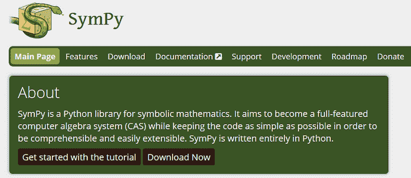
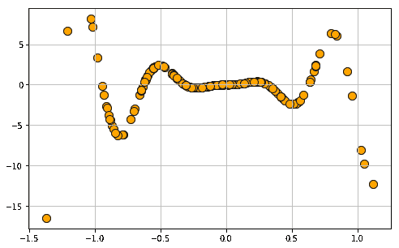
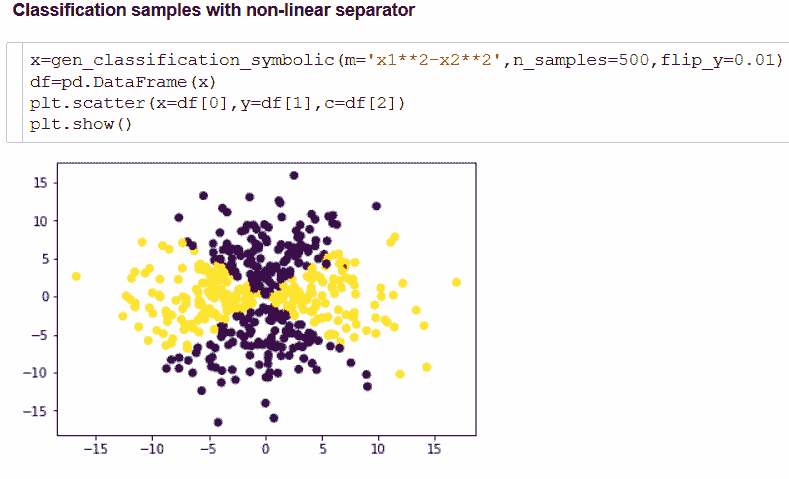
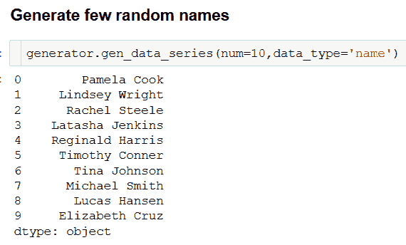
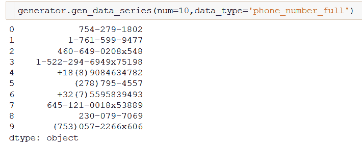
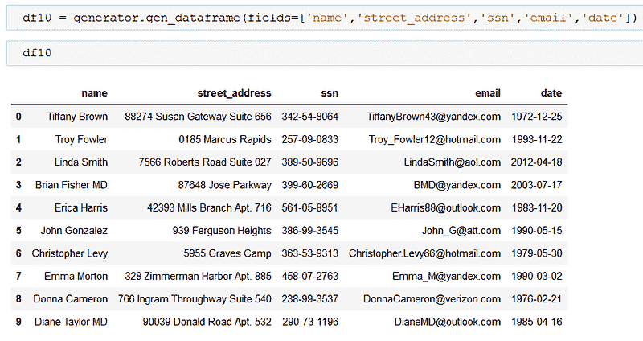
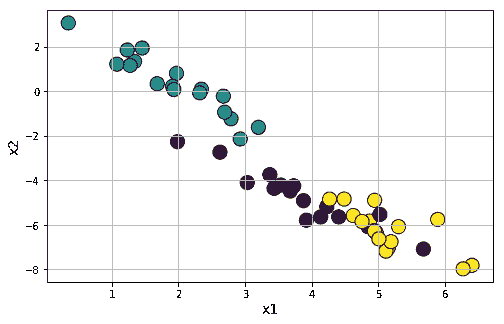
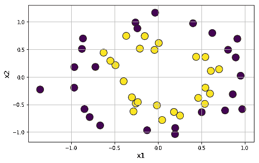

# 合成数据生成：新数据科学家必须掌握的技能

> 原文：[`www.kdnuggets.com/2018/12/synthetic-data-generation-must-have-skill.html/2`](https://www.kdnuggets.com/2018/12/synthetic-data-generation-must-have-skill.html/2)

 评论

### **使用任意符号表达式生成数据**

尽管上述函数很适合入门，但**用户对数据生成的底层机制没有轻松的控制，回归输出也不是输入的确定函数——它们确实是随机的**。虽然这对于许多问题可能足够，但通常需要一种可控的方法来基于明确定义的函数生成这些问题（*涉及线性、非线性、有理或甚至超越项*）。

例如，我们希望评估各种[kernelized](https://www.cs.cmu.edu/~ggordon/SVMs/new-svms-and-kernels.pdf) [SVM 分类器](https://en.wikipedia.org/wiki/Support_vector_machine)在具有逐渐复杂的分隔符（从线性到非线性）的数据集上的效果，或者想要展示[线性模型在由有理函数或超越函数生成的回归数据集上的局限性](https://github.com/tirthajyoti/Machine-Learning-with-Python/blob/master/Function%20Approximation%20by%20Neural%20Network/Function%20approximation%20by%20linear%20model%20and%20deep%20network.ipynb)。使用这些 scikit-learn 函数来完成这些任务将会很困难。

此外，用户可能希望仅输入一个符号表达式作为生成函数（或分类任务的逻辑分隔符）。仅使用 scikit-learn 的工具没有简单的方法来做到这一点，必须为每个新的实验实例编写自己的函数。

为了解决符号表达式输入的问题，可以轻松利用[令人惊叹的 Python 包 SymPy](https://www.sympy.org/en/index.html)，它允许理解、渲染和评估符号数学表达式，达到相当高的复杂度。

在[我之前的一篇文章](https://towardsdatascience.com/random-regression-and-classification-problem-generation-with-symbolic-expression-a4e190e37b8d)中，我详细描述了如何利用 SymPy 库创建类似于 scikit-learn 中的函数，但可以生成具有高度复杂符号表达式的回归和分类数据集。请查看那篇文章，并访问我的[**Github 仓库获取实际代码**](https://github.com/tirthajyoti/PythonMachineLearning/tree/master/Random%20Function%20Generator)。

[**基于符号表达式的随机回归和分类问题生成**](https://towardsdatascience.com/random-regression-and-classification-problem-generation-with-symbolic-expression-a4e190e37b8d)

*我们描述了如何使用 SymPy 设置随机样本生成器来进行多项式（以及非线性）回归和…*towardsdatascience.com](https://towardsdatascience.com/random-regression-and-classification-problem-generation-with-symbolic-expression-a4e190e37b8d)

例如，我们可以将一个平方项（***x*²**）和一个正弦项（***sin*(*x*)**）的符号表达式作为乘积，来创建一个随机化的回归数据集。

**图**：使用符号表达式的随机回归数据集：***x².sin(x)***

或者，可以生成一个非线性椭圆分类边界数据集，用于测试神经网络算法。**注意**，在下图中，用户如何输入**符号表达式**`m='x1**2-x2**2'`并生成该数据集。

**图**：具有非线性分隔符的分类样本。

### **使用“pydbgen”库生成分类数据**

虽然网上有许多高质量的真实数据集可以用来尝试有趣的机器学习技术，但根据我的个人经验，我发现学习 SQL 时情况并非如此。

对于数据科学专业知识，具备基本的 SQL 熟悉度几乎和掌握 Python 或 R 编码同样重要。然而，能够访问包含真实分类数据（如姓名、年龄、信用卡、社会安全号码、地址、生日等）的大型数据库并不如访问 Kaggle 上专为机器学习任务设计或策划的玩具数据集那么普遍。

除了数据科学的初学者，即使是[经验丰富的软件测试人员可能也会发现，拥有一个简单工具](https://www.riaktr.com/synthetic-data-become-major-competitive-advantage/)，通过几行代码就能生成任意大小的数据集，且这些数据集具有随机（伪造的）但有意义的条目，也很有用。

输入**pydbgen**。 [在此处阅读文档](http://pydbgen.readthedocs.io/en/latest/#)。

这是一个[轻量级、纯 Python 库](https://github.com/tirthajyoti/pydbgen)，用于生成随机有用条目（例如姓名、地址、信用卡号码、日期、时间、公司名称、职位名称、车牌号码等），并将它们保存为 Pandas 数据框对象、SQLite 数据库文件中的表格，或 MS Excel 文件中。

[**介绍 pydbgen：一个随机数据框/数据库表生成器**

*一个轻量级的 Python 包，用于生成随机数据库/数据框，以便在数据科学、学习 SQL、机器学习等方面使用…*towardsdatascience.com](https://towardsdatascience.com/introducing-pydbgen-a-random-dataframe-database-table-generator-b5c7bdc84be5)

你可以阅读上面的文章获取更多详细信息。在这里，我将展示几个简单的数据生成示例和截图，

**图**：使用 pydbgen 库生成随机姓名。

**生成一些国际电话号码，**

**图**：使用 pydbgen 库生成随机电话号码。

**生成一个包含随机姓名、地址、社会保险号等条目的完整数据框，**

**图**：使用 pydbgen 库生成带有随机条目的完整数据框。

### **总结与结论**

我们讨论了拥有高质量数据集对进入激动人心的数据科学和机器学习世界的重要性。通常，灵活且丰富的数据集的缺乏限制了对机器学习或统计建模技术内在工作的深入理解，使理解停留在表面。

合成数据集在这方面可以大有帮助，并且有一些现成的函数可以尝试这种方法。然而，有时基于复杂的非线性符号输入生成合成数据是可取的，我们讨论了一个这样的方法。

此外，我们还讨论了一个激动人心的 Python 库，可以生成随机的现实生活数据集，用于数据库技能练习和分析任务。

> 这篇文章的目标是展示年轻的数据科学家不必因缺乏合适的数据集而感到沮丧。相反，他们应该寻找并制定程序化解决方案，创造合成数据以用于学习目的。

在这个过程中，他们可能会学习许多新技能并开启新的机会之门。

如果你有任何问题或想法，请通过 [**tirthajyoti[AT]gmail.com**](mailto:tirthajyoti@gmail.com) 联系作者。此外，你可以查看作者的 [**GitHub 仓库**](https://github.com/tirthajyoti?tab=repositories)，获取其他有趣的 Python、R 或 MATLAB 代码片段和机器学习资源。如果你和我一样，对机器学习/数据科学充满热情，请随时 [在 LinkedIn 上添加我](https://www.linkedin.com/in/tirthajyoti-sarkar-2127aa7/) 或 [在 Twitter 上关注我](https://twitter.com/tirthajyotiS)。

**简历：[Tirthajyoti Sarkar](https://www.linkedin.com/in/tirthajyoti-sarkar-2127aa7/)** 是一位半导体技术专家、机器学习/数据科学狂热者、电子工程博士、博主和作家。

[原文](https://towardsdatascience.com/synthetic-data-generation-a-must-have-skill-for-new-data-scientists-915896c0c1ae?sk=cb47400804a969d9888f8c535a3e1683)。经许可转载。

**相关内容：**

+   IT 工程师需要学习多少数学才能进入数据科学？

+   数据科学的基础数学：‘为什么’和‘如何’

+   15 分钟指南：选择有效的机器学习和数据科学课程

* * *

## 我们的前三大课程推荐

 1\. [Google 网络安全证书](https://www.kdnuggets.com/google-cybersecurity) - 快速进入网络安全职业生涯。

 2\. [谷歌数据分析专业证书](https://www.kdnuggets.com/google-data-analytics) - 提升你的数据分析能力

 3\. [谷歌 IT 支持专业证书](https://www.kdnuggets.com/google-itsupport) - 支持你的组织进行 IT 工作

* * *

### 更多相关话题

+   [检索增强生成：信息检索与…的交汇点](https://www.kdnuggets.com/retrieval-augmented-generation-where-information-retrieval-meets-text-generation)

+   [高保真合成数据适用于数据工程师和数据科学家](https://www.kdnuggets.com/2022/tonic-high-fidelity-synthetic-data-engineers-scientists-alike.html)

+   [团队合作在数据科学中的三大重要理由](https://www.kdnuggets.com/2022/05/3-reasons-teamwork-essential-skill-data-science.html)

+   [如何利用合成数据克服机器学习中的数据短缺问题](https://www.kdnuggets.com/2022/03/synthetic-data-overcome-data-shortages-machine-learning-model-training.html)

+   [合成数据平台：释放生成式人工智能的力量以…](https://www.kdnuggets.com/2023/07/synthetic-data-platforms-unlocking-power-generative-ai-structured-data.html)

+   [数据访问在大多数公司中严重不足，71%的人认为…](https://www.kdnuggets.com/2023/07/mostly-data-access-severely-lacking-synthetic-data-help.html)
on 中的机器学习**](https://scikit-learn.org/stable/)

这里是快速概述，

[**回归问题生成**](https://scikit-learn.org/stable/modules/generated/sklearn.datasets.make_regression.html)：Scikit-learn 的`**dataset.make_regression**`函数可以创建具有任意输入特征数量、输出目标和可控信息耦合度的随机回归问题。它还可以混合高斯噪声。

**图**：使用 scikit-learn 生成的随机回归问题，噪声程度不同。

[**分类问题生成**](https://scikit-learn.org/stable/modules/generated/sklearn.datasets.make_classification.html#sklearn.datasets.make_classification)：类似于上面的回归函数，`**dataset.make_classification**`生成一个具有可控类别分离度和添加噪声的随机多类别分类问题（数据集）。如果需要，你还可以随机翻转任何百分比的输出标记，以创建一个更难的分类数据集。

**图**：使用 scikit-learn 生成随机分类问题，具有不同的类别分离。

[**聚类问题生成**](https://scikit-learn.org/stable/modules/generated/sklearn.datasets.make_blobs.html#sklearn.datasets.make_blobs)：有很多函数可以生成有趣的簇。最直接的一个是 `datasets.make_blobs`，它生成任意数量的簇，并且可以控制距离参数。

**图**：使用 scikit-learn 生成简单的簇数据。

**各向异性簇生成**：通过简单的矩阵乘法变换，你可以生成沿某些轴对齐或各向异性分布的簇。

**图**：使用 scikit-learn 生成各向异性对齐的簇数据。

[**同心环簇数据生成**](https://scikit-learn.org/stable/modules/generated/sklearn.datasets.make_circles.html#sklearn.datasets.make_circles)：为了测试基于亲和力的聚类算法或高斯混合模型，生成特定形状的簇非常有用。我们可以使用 `**datasets.make_circles**` 函数来实现。

当然，我们还可以在数据中加入一些噪声，以测试聚类算法的鲁棒性。

[**月牙形簇数据生成**](https://scikit-learn.org/stable/modules/generated/sklearn.datasets.make_moons.html#sklearn.datasets.make_moons)：我们还可以生成月牙形簇数据来测试算法，使用 `**datasets.make_moons**` 函数可以控制噪声。

### 更多相关主题

+   [检索增强生成：信息检索与文本生成的交汇点](https://www.kdnuggets.com/retrieval-augmented-generation-where-information-retrieval-meets-text-generation)

+   [高保真合成数据：适用于数据工程师和数据科学家](https://www.kdnuggets.com/2022/tonic-high-fidelity-synthetic-data-engineers-scientists-alike.html)

+   [团队合作在数据科学中是必不可少的技能的 3 个原因](https://www.kdnuggets.com/2022/05/3-reasons-teamwork-essential-skill-data-science.html)

+   [如何使用合成数据克服机器学习模型训练中的数据短缺](https://www.kdnuggets.com/2022/03/synthetic-data-overcome-data-shortages-machine-learning-model-training.html)

+   [合成数据平台：释放生成式 AI 对结构化数据的力量](https://www.kdnuggets.com/2023/07/synthetic-data-platforms-unlocking-power-generative-ai-structured-data.html)

+   [数据访问在大多数公司中严重不足，71%的人认为…](https://www.kdnuggets.com/2023/07/mostly-data-access-severely-lacking-synthetic-data-help.html)
