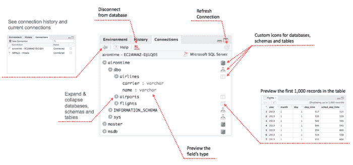
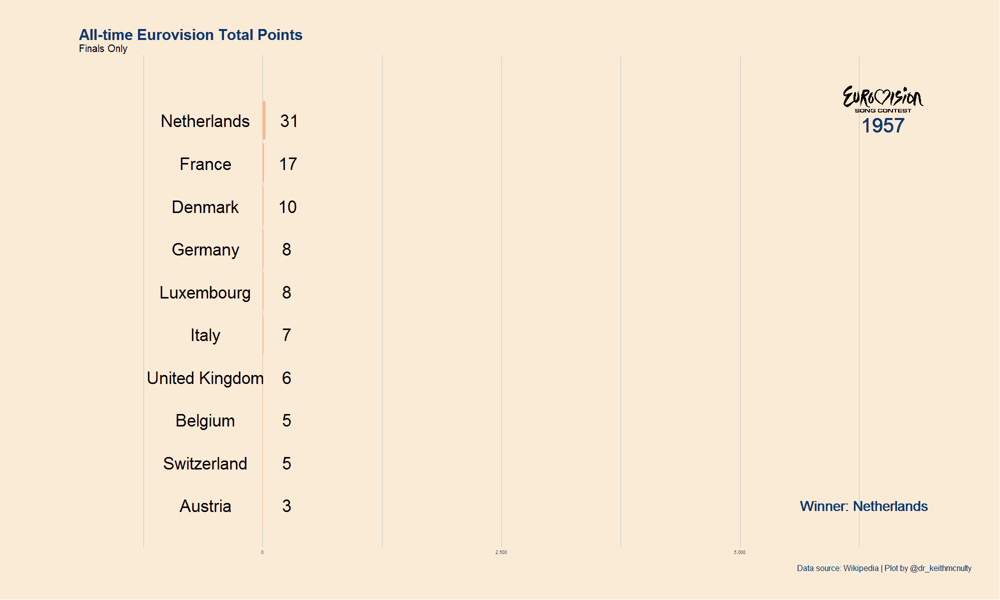
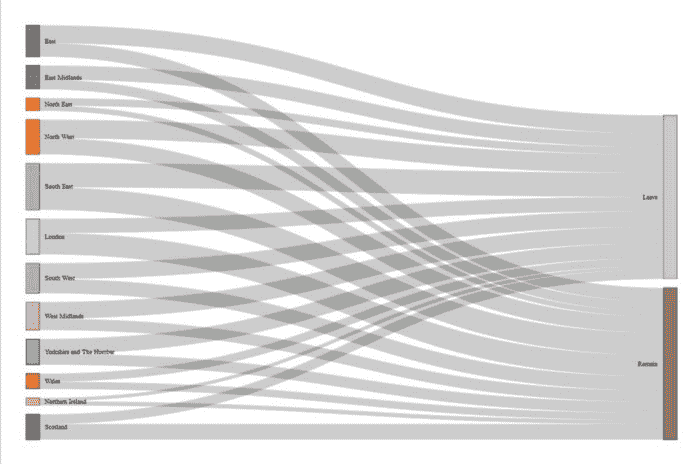
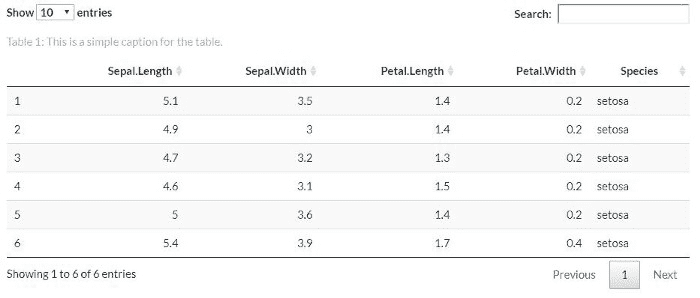
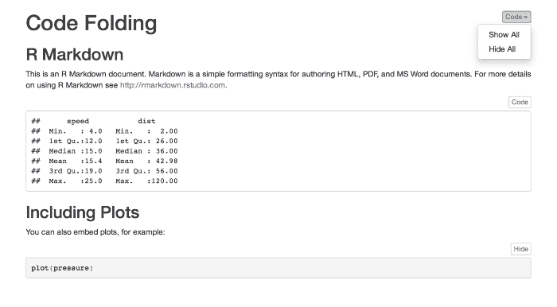
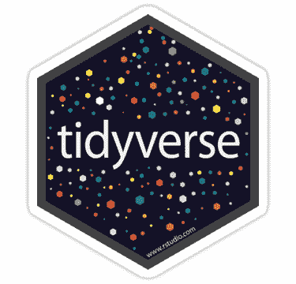

# R 中你可能不知道的十个额外有用的东西

> 原文：[`www.kdnuggets.com/2019/07/ten-more-random-useful-things-r.html`](https://www.kdnuggets.com/2019/07/ten-more-random-useful-things-r.html)

 评论

**由 [Keith McNulty](https://www.linkedin.com/in/keith-mcnulty/)，麦肯锡公司**

我对 [我几个月前的文章](https://towardsdatascience.com/ten-random-useful-things-in-r-that-you-might-not-know-about-54b2044a3868?source=post_page---------------------------) 的积极反应感到惊讶，该文章列出了十个可能你不知道的 R 中的随机有用的东西。

* * *

## 我们的前三个课程推荐

 1\. [Google 网络安全证书](https://www.kdnuggets.com/google-cybersecurity) - 快速进入网络安全职业的捷径。

 2\. [Google 数据分析专业证书](https://www.kdnuggets.com/google-data-analytics) - 提升你的数据分析技能

 3\. [Google IT 支持专业证书](https://www.kdnuggets.com/google-itsupport) - 支持你的组织 IT

* * *

我感觉 R 作为一种语言已经发展到一个程度，以至于我们现在以完全不同的方式使用它。这意味着每个人可能都有许多技巧、包、函数等，但其他人完全不了解，如果知道的话会觉得很有用。正如 [Mike Kearney](https://medium.com/@kearneymw?source=post_page---------------------------) 也指出的，我的十个列表中没有任何与统计相关的内容，这仅仅展示了 R 近年来的发展。

说实话，上次我很难把它限制在十个，因此这里有十个额外的关于 R 的东西，这些东西帮助使我的工作更轻松，你可能会觉得有用。如果这些对你当前的工作有帮助，或者你有其他建议可以告诉其他人的东西，请在这里或在 Twitter 上留言。

### 1\. dbplyr

`dbplyr` 就是它名字的含义。它允许你在数据库中使用 `dplyr`。如果你在处理数据库并且从未听说过 `dbplyr`，那么你可能仍在代码中使用 SQL 字符串，这会迫使你在实际想要思考整洁代码时思考 SQL，当你想要抽象代码以生成函数等时，这可能会很痛苦。

`dbplyr` 允许你使用 `dplyr` 创建 SQL 查询。它通过建立一个可以使用 `dplyr` 函数操作的数据库表，将这些函数转换为 SQL。例如，如果你有一个名为 `con` 的数据库连接，且想要操作一个名为 `CAT_DATA` 的表在 `CAT_SCHEMA` 中，你可以将此表设置为：

```py

cat_table <- dplyr::tbl(
  con,
  dbplyr::in_schema("CAT_SCHEMA", "CAT_TABLE")
)
```

然后你可以对`cat_table`执行常见的数据操作，如`filter`、`mutate`、`group_by`、`summarise`等，这些操作将在后台转化为 SQL 查询。非常有用的是，数据在你使用`dplyr::collect()`函数最终获取之前，并不会实际下载到你的 R 会话中。这意味着你可以让 SQL 完成所有工作，然后在最后获取你处理后的数据，而不是在开始时就拉取整个数据库。

关于`dbplyr`的更多内容，你可以查看我之前的文章[这里](https://towardsdatascience.com/how-to-write-tidy-sql-queries-in-r-d6d6b2a3e17?source=post_page---------------------------)和教程[这里](https://dbplyr.tidyverse.org/articles/dbplyr.html?source=post_page---------------------------)。

### 2\. `rvest`和`xml2`

人们说 Python 在网页抓取方面要好得多。这可能是对的。但对于那些喜欢在 tidyverse 中工作的我们来说，`rvest`和`xml2`包可以通过与`magrittr`配合使用，使得简单的网页抓取变得非常容易，并且允许我们使用管道命令。由于网页上的 HTML 和 XML 代码通常是高度嵌套的，我认为使用`%>%`来构建抓取代码是非常直观的。

通过初步读取感兴趣页面的 HTML 代码，这些包将嵌套的 HTML 和 XML 节点拆解为列表，允许你逐步搜索和挖掘特定的节点或属性。将这些与 Chrome 的检查功能结合使用，可以快速提取你需要的关键信息。

举个快速的例子，我最近写了一个函数，用于从[这个相当华丽的页面](https://www.billboard.com/charts/hot-100?source=post_page---------------------------)抓取任何历史时点的基础 Billboard 音乐排行榜数据，生成一个数据框，代码简单如以下：

```py
get_chart <- function(date = Sys.Date(), positions = c(1:10), type = "hot-100") {     # get url from input and read html
  input <- paste0("https://www.billboard.com/charts/", type, "/", date)     chart_page <- xml2::read_html(input)       # scrape data
  chart <- chart_page %>%
    rvest::html_nodes('body') %>%
    xml2::xml_find_all("//div[contains(@class, 'chart-list-item  ')]")        rank <- chart %>%
    xml2::xml_attr('data-rank')      artist <- chart %>%
    xml2::xml_attr('data-artist')      title <- chart %>%
    xml2::xml_attr('data-title')     # create dataframe, remove nas and return result
  chart_df <- data.frame(rank, artist, title)
  chart_df <- chart_df %>%
    dplyr::filter(!is.na(rank), rank %in% positions)   chart_df
}
```

关于这个例子更多的内容请见[这里](https://towardsdatascience.com/get-any-us-music-chart-listing-from-history-in-your-r-console-6bd168f192cb?source=post_page---------------------------)，关于`rvest`的更多内容请见[这里](https://github.com/tidyverse/rvest?source=post_page---------------------------)，关于`xml2`的更多内容请见[这里](https://blog.rstudio.com/2015/04/21/xml2/?source=post_page---------------------------)。

### 3\. 对长数据进行 k 均值聚类

k 均值聚类是一种越来越流行的统计方法，用于将数据中的观测值进行聚类，通常是将大量的数据点简化为较少的簇或原型。`kml`包现在允许在纵向数据上进行 k 均值聚类，其中“数据点”实际上是数据序列。

当你研究的数据点实际上是随时间变化的读数时，这非常有用。这可能是医院患者体重增减的临床观察，或者员工的补偿轨迹。

`kml` 通过首先使用 `cld` 函数将数据转换为 `ClusterLongData` 类的对象来工作。然后它使用“爬山”算法对数据进行分区，每次测试多个 `k` 值 20 次。最后，`choice()` 函数允许你以图形方式查看每个 `k` 的算法结果，并决定你认为最佳的聚类。

### 4. RStudio 中的连接窗口

在最新版本的 RStudio 中，连接窗口允许你浏览任何远程数据库，无需进入 SQL 开发者等独立环境。这种便利现在提供了一个机会，让开发项目可以完全在 RStudio IDE 中完成。

通过在连接窗口中设置与远程数据库的连接，你可以在嵌套的模式、表格、数据类型中浏览，甚至直接查看一个表格以查看数据的摘录。

最新版本的 RStudio 中的连接窗口

关于连接窗口的更多信息 [在这里](https://blog.rstudio.com/2017/08/16/rstudio-preview-connections/?source=post_page---------------------------)。

### 5. tidyr::complete()

R 数据框的默认行为是，如果特定观测值没有数据，那么该观测值的行不会出现在数据框中。当你需要将这个数据框用作需要所有可能观测值的输入时，这可能会导致问题。

通常，这个问题发生在你将数据传递到某些图形函数中时，这些函数期望在没有观测值时看到零值，并且无法理解缺失的行意味着该行的零值。这也可能在进行未来预测时成为问题，尤其是当起始点有缺失行时。

`complete()` 函数在 `tidyr` 中允许你填补所有没有数据的观测值。它允许你定义想要完成的观测值，然后声明用于填补缺口的值。例如，如果你在统计不同品种的雄性和雌性狗的数量，并且有些组合在样本中没有狗，你可以使用以下方法来处理：

```py
dogdata %>%
  tidyr::complete(SEX, BREED, fill = list(COUNT = 0)) 
```

这将扩展你的数据框，确保包含所有可能的 `SEX` 和 `BREED` 组合，并用零填充 `COUNT` 的缺失值。

### 6. gganimate

动画图形目前非常流行，`gganimate` 包允许使用 `ggplot2`（我认为大多数 R 用户）的用户非常简单地扩展他们的代码以创建动画图形。

`gganimate` 的工作原理是利用存在于一系列“过渡状态”（通常是几年或其他时间序列数据）中的数据。你可以将每个过渡状态中的数据绘制成一个简单的静态 `ggplot2` 图表，然后使用 `ease_aes()` 函数创建在过渡状态之间移动的动画。过渡发生的方式有许多选项，`animate()` 函数允许以各种形式渲染图形，例如动画 gif 或 mpeg。

例如，下面是我制作的一个 gif，展示了 1957 到 2018 年间 Eurovision 歌唱比赛中所有获胜的时间点：

使用 gganimate 展示所有时间 Eurovision 歌唱比赛结果

代码见 [这里](https://github.com/keithmcnulty/eurovision?source=post_page---------------------------) 和我发现非常有用的 `gganimate` 的详细教程见 [这里](https://emilykuehler.github.io/bar-chart-race/?source=post_page---------------------------)。

### 7\. networkD3

D3 是一个极其强大的数据可视化库，用于 JavaScript。越来越多的包开始提供给 R 用户，允许他们使用 D3 构建可视化，例如 `R2D3`，这特别好，因为它让我们可以欣赏到最棒的十六边形贴纸之一（见 [这里](https://rstudio.github.io/r2d3/?source=post_page---------------------------)）。

我最喜欢的 D3 包是 `networkD3`。它已经存在一段时间，并且非常适合以响应式或美观的方式绘制图形或网络数据。特别是，它可以使用 `forceNetwork()` 绘制力导向网络，使用 `sankeyNetwork()` 绘制桑基图，使用 `chordNetwork()` 绘制和弦图。下面是一个我创建的简单桑基网络的例子，展示了 Brexit 公投中的投票流向。

使用 networkD3 展示 Brexit 公投中的投票流向

更多关于这个具体示例的信息 [这里](https://towardsdatascience.com/using-networkd3-in-r-to-create-simple-and-clear-sankey-diagrams-48f8ba8a4ace?source=post_page---------------------------) 和更多关于 networkD3 的信息 [这里](https://christophergandrud.github.io/networkD3/?source=post_page---------------------------)。

### 8\. 使用 DT 在 RMarkdown 或 Shiny 中创建数据表

`DT` 包是 R 与 DataTables JavaScript 库之间的接口。这使得在 Shiny 应用或 R Markdown 文档中非常容易显示表格，这些表格具有许多内置功能和响应性。这避免了你需要编写单独的数据下载函数，为用户提供了灵活的数据显示和排序选项，并且内置了数据搜索功能。

例如，一个简单的命令如下：

```py
DT::datatable(
  head(iris),
  caption = 'Table 1: This is a simple caption for the table.'
)
```

可以产生像这样的效果：



关于 DT 的更多信息请见 [这里](https://rstudio.github.io/DT/?source=post_page---------------------------)，包括如何设置各种选项以自定义布局并添加数据下载、复制和打印按钮。

### 9\. 使用 prettydoc 美化你的 RMarkdown

`prettydoc` 是 Yixuan Qiu 开发的一个包，提供了一组简单的主题，使你的 RMarkdown 文档具有不同的、更美观的外观和感觉。当你只想让文档看起来更有趣但没有时间自己进行样式调整时，这非常有帮助。

使用起来非常简单。只需对文档的 YAML 头部进行简单编辑，就能在整个文档中调用特定的样式主题，提供多种主题可供选择。例如，这将使标题、表格、嵌入的代码和图形的颜色和风格变为可爱的干净蓝色：

```py
---
title: "My doc"
author: "Me"
date: June 3, 2019
output:
  prettydoc::html_pretty:
    theme: architect
    highlight: github
---
```

更多关于 `prettydoc` 的信息请见 [这里](http://yixuan.cos.name/prettydoc/?source=post_page---------------------------)。

### 10\. 可选地使用 code_folding 在 RMarkdown 中隐藏代码

RMarkdown 是记录工作的一种绝佳方式，它允许你在一个地方编写叙述并捕捉代码。但有时代码可能会让人感到压倒性，并且对于那些只对你工作的叙述感兴趣、不想了解你如何进行分析的非编码者来说，不太友好。

之前，我们唯一的选择是将 `echo = TRUE` 或 `echo = FALSE` 设置在 `knitr` 选项中，以决定是否在文档中显示代码。但现在我们可以在 YAML 头部设置一个选项，兼顾两全其美。设置 `code_folding: hide` 将默认隐藏代码块，但在文档中提供小的点击展开框，以便读者根据需要查看所有代码或特定代码块，如下所示：

R Markdown 中的代码折叠下拉框

这就总结了我接下来的十个随机 R 提示。希望这些对你有所帮助，也欢迎在评论中添加你自己的提示供其他用户阅读。

*我最初是纯数学家，然后成为了心理测量学家和数据科学家。我热衷于将所有这些学科的严谨性应用于复杂的人类问题。我还是一个编码迷和日本 RPG 的超级粉丝。在 *[*LinkedIn*](https://www.linkedin.com/in/keith-mcnulty/?source=post_page---------------------------)* 或 *[*Twitter*](https://twitter.com/dr_keithmcnulty?source=post_page---------------------------)* 上找到我。*



**简介：Keith McNulty** 是麦肯锡公司的数据科学家。

[原文](https://towardsdatascience.com/ten-more-random-useful-things-in-r-you-may-not-know-about-56a18da41292)。已获授权转载。

**相关：**

+   你可能不知道的 R 中的十个随机有用的东西

+   如何制作惊艳的 3D 图表以更好地讲述故事

+   ggplot 的演变

### 更多相关主题

+   [7 件你不知道可以用低代码工具做的事情](https://www.kdnuggets.com/2022/09/7-things-didnt-know-could-low-code-tool.html)

+   [回顾十年的人工智能](https://www.kdnuggets.com/2023/06/ten-years-ai-review.html)

+   [在商业中实施推荐系统的十个关键教训](https://www.kdnuggets.com/2022/07/ten-key-lessons-implementing-recommendation-systems-business.html)

+   [关于数据管理你需要知道的 6 件事及其重要性…](https://www.kdnuggets.com/2022/05/6-things-need-know-data-management-matters-computer-vision.html)

+   [你不知道的 SAS 数据科学学院的 3 件事](https://www.kdnuggets.com/2022/07/sas-3-things-didnt-know-sas-academy-data-science.html)

+   [在扩展你的网页数据驱动产品时你应该知道的事情](https://www.kdnuggets.com/2023/08/things-know-scaling-web-datadriven-product.html)
