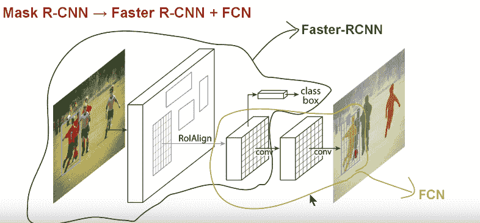
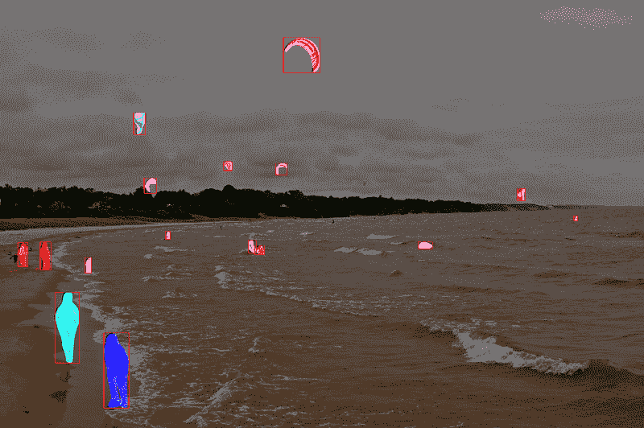

# 使用 Tensorflow Object Detection 进行逐像素分类

> 原文：[`www.kdnuggets.com/2018/03/tensorflow-object-detection-pixel-wise-classification.html`](https://www.kdnuggets.com/2018/03/tensorflow-object-detection-pixel-wise-classification.html)

 评论

**由 [Priyanka Kochhar](https://github.com/priya-dwivedi)，深度学习顾问**

过去我使用 Tensorflow Object Detection API 实现对象检测，输出为图像中不同感兴趣对象的边界框。更多内容请参阅我的 [文章](https://towardsdatascience.com/is-google-tensorflow-object-detection-api-the-easiest-way-to-implement-image-recognition-a8bd1f500ea0)。Tensorflow 最近添加了新功能，现在我们可以扩展 API 来确定感兴趣对象的逐像素位置。请见下面的示例：

* * *

## 我们的前三个课程推荐

 1\. [谷歌网络安全证书](https://www.kdnuggets.com/google-cybersecurity) - 快速进入网络安全职业轨道。

 2\. [谷歌数据分析专业证书](https://www.kdnuggets.com/google-data-analytics) - 提升你的数据分析水平

 3\. [谷歌 IT 支持专业证书](https://www.kdnuggets.com/google-itsupport) - 支持你的组织 IT 工作

* * *

Tensorflow Object Detection Mask RCNN

代码在我的 [Github](https://github.com/priya-dwivedi/Deep-Learning/blob/master/Mask_RCNN/Mask_RCNN_Videos.ipynb) 上。

**实例分割**

实例分割是对象检测的扩展，其中每个边界框都关联一个二进制掩码（即对象与背景）。这提供了有关框内对象范围的更精细的信息。

那么我们何时需要这种额外的细粒度呢？一些想到的示例包括：

i) 自动驾驶汽车——可能需要知道道路上另一辆车的确切位置或人行道上人类的位置

ii) 机器人系统——能够将两个部分连接在一起的机器人，如果知道两个部分的确切位置，将表现得更好

实现实例分割的算法有很多，但 Tensorflow Object Detection API 使用的是 Mask RCNN。

**Mask RCNN**

让我们从对 Mask RCNN 的温和介绍开始。

Mask RCNN 架构

Faster RCNN 是一种非常优秀的对象检测算法。Faster R-CNN 由两个阶段组成。第一个阶段称为区域提议网络（RPN），它提出候选对象边界框。第二个阶段，本质上是 Fast R-CNN，使用 RoIPool 从每个候选框中提取特征，并进行分类和边界框回归。两个阶段使用的特征可以共享，以加快推断速度。

Mask R-CNN 从概念上讲是简单的：Faster R-CNN 为每个候选对象提供两个输出，一个是类别标签，一个是边界框偏移量；在此基础上，我们增加了第三个分支，该分支输出对象掩码 — 这是一个二值掩码，指示对象在边界框中的像素。但额外的掩码输出与类别和框的输出不同，需要提取对象的更精细的空间布局。为此，Mask RCNN 使用了[Fully Convolution Network](https://people.eecs.berkeley.edu/~jonlong/long_shelhamer_fcn.pdf)Mask RCNN 论文（FCN）所描述的网络。

完全卷积网络架构

FCN 是一种用于语义分割的流行算法。该模型使用各种卷积块和最大池化层，首先将图像解压到其原始大小的 1/32。然后，它在这个粒度水平上进行类别预测。最后，它使用上采样和反卷积层将图像调整到其原始尺寸。

简而言之，我们可以说 Mask RCNN 将两个网络 — Faster RCNN 和 FCN 结合成一个超级架构。模型的损失函数是分类、生成边界框和生成掩码的总损失。

Mask RCNN 有一些额外的改进，使其比 FCN 更准确。你可以在他们的[论文](https://arxiv.org/pdf/1703.06870.pdf)中阅读更多细节。

****实现****

*在图像上的测试*

要在图像上测试这个模型，你可以利用在 tensorflow 网站上共享的[代码](https://github.com/tensorflow/models/blob/master/research/object_detection/object_detection_tutorial.ipynb)。我测试了他们最轻量级的模型 — [mask_rcnn_inception_v2_coco](http://download.tensorflow.org/models/object_detection/mask_rcnn_inception_v2_coco_2018_01_28.tar.gz)。只需下载模型并升级到 tensorflow 1.5（这一点很重要！）。请参见下面的示例结果：

Mask RCNN 在风筝图像上的应用

*在视频上的测试*

对我来说，更有趣的实验是运行模型来处理来自 YouTube 的样本视频。我使用 keepvid 从 YouTube 下载了几个视频。我喜欢使用库 moviepy 来处理视频文件。

主要步骤是：

+   使用 VideoFileClip 函数从视频中提取每一帧

+   fl_image 函数是一个很棒的函数，可以接收图像并用修改后的图像替换它。我用它来对从视频中提取的每一张图像进行对象检测

+   最终，所有修改后的剪辑图像都被合并成一个新视频。

你可以在我的 [Github](https://github.com/priya-dwivedi/Deep-Learning/blob/master/Mask_RCNN/Mask_RCNN_Videos.ipynb) 上找到完整的代码。

****下一步****

一些进一步探索此 API 的额外想法：

+   尝试那些更准确但开销较大的模型，看看它们能带来多大的差异。

+   使用 API 在自定义数据集上训练 Mask RCNN。这是我接下来的任务。

如果你喜欢这篇文章，请给我一个❤️:) 希望你能拉取代码并亲自尝试。

**其他写作**：[ https://medium.com/@priya.dwivedi/](https://medium.com/@priya.dwivedi/)

PS: 我有自己的深度学习咨询公司，喜欢构建有趣的深度学习模型。我帮助了多家初创公司部署创新的 AI 解决方案。如果你有一个可以合作的项目，请通过 priya.toronto3@gmail.com 联系我。

**参考文献：**

+   [Mask RCNN 论文](https://arxiv.org/abs/1703.06870)

+   [Google Tensorflow Object Detection Github](https://github.com/tensorflow/models/tree/master/research/object_detection)

+   [COCO 数据集](http://mscoco.org/home/)

+   [了解实例分割和语义分割之间的区别](https://stackoverflow.com/questions/33947823/what-is-semantic-segmentation-compared-to-segmentation-and-scene-labeling)

+   对 Mask RCNN 的非常好的 [解释](https://www.youtube.com/watch?v=UdZnhZrM2vQ&t=111s)

**简介: [Priyanka Kochhar](https://github.com/priya-dwivedi)** 拥有超过 10 年的数据科学经验。她现在拥有自己的深度学习咨询公司，喜欢解决有趣的问题。她帮助了多家初创公司部署创新的 AI 解决方案。如果你有一个可以合作的项目，请通过 priya.toronto3@gmail.com 联系她。

[原文](https://towardsdatascience.com/using-tensorflow-object-detection-to-do-pixel-wise-classification-702bf2605182)。经许可转载。

**相关：**

+   Google Tensorflow Object Detection API 是实现图像识别的最简单方式吗？

+   使用 Tensorflow Object Detection API 构建一个玩具检测器

+   训练和可视化词向量

### 更多相关主题

+   [使用 Tensorflow 训练图像分类模型的指南](https://www.kdnuggets.com/2022/12/guide-train-image-classification-model-tensorflow.html)

+   [KDnuggets™ 新闻 22:n09, 3 月 2 日: 讲述一个精彩的数据故事: A…](https://www.kdnuggets.com/2022/n09.html)

+   [SQL 和对象关系映射 (ORM) 之间有什么区别？](https://www.kdnuggets.com/2022/02/difference-sql-object-relational-mapping-orm.html)

+   [如何使用 Python 执行运动检测](https://www.kdnuggets.com/2022/08/perform-motion-detection-python.html)

+   [使用 Hugging Face Transformers 进行文本情感检测](https://www.kdnuggets.com/using-hugging-face-transformers-for-emotion-detection-in-text)

+   [KDnuggets 新闻，8 月 17 日：如何使用运动检测…](https://www.kdnuggets.com/2022/n33.html)
