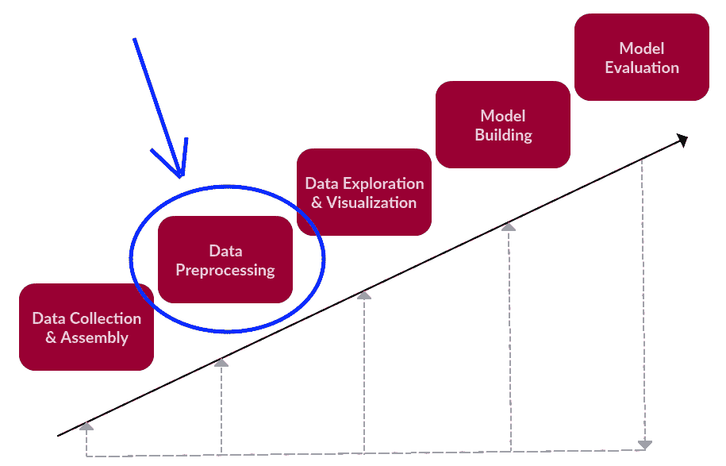

# 文本数据预处理：Python 实战指南

> 原文：[`www.kdnuggets.com/2018/03/text-data-preprocessing-walkthrough-python.html`](https://www.kdnuggets.com/2018/03/text-data-preprocessing-walkthrough-python.html)

评论

在之前的一对帖子中，我们首先讨论了一个 处理文本数据科学任务的框架，接着讨论了 文本数据预处理的一般方法。这篇文章将作为使用一些常见 Python 工具进行文本数据预处理任务的实用指南。



在文本数据科学框架的背景下进行预处理。

* * *

## 我们的前三名课程推荐

 1\. [谷歌网络安全证书](https://www.kdnuggets.com/google-cybersecurity) - 快速进入网络安全职业生涯

 2\. [谷歌数据分析专业证书](https://www.kdnuggets.com/google-data-analytics) - 提升你的数据分析技能

 3\. [谷歌 IT 支持专业证书](https://www.kdnuggets.com/google-itsupport) - 支持组织的 IT 部门

* * *

我们的目标是从我们将描述的文本块（不要与文本块化混淆），一个冗长的未处理单一字符串，开始，最后得到一个（或几个）清理后的标记列表，这些标记将对进一步的文本挖掘和/或自然语言处理任务有用。

首先我们从导入开始。

除了标准的 Python 库，我们还使用以下库：

+   [NLTK](http://www.nltk.org/) - 自然语言工具包是 Python 生态系统中最知名和最常用的 NLP 库之一，适用于从标记化、词干提取到词性标注等各种任务

+   [BeautifulSoup](https://www.crummy.com/software/BeautifulSoup/bs4/doc/) - BeautifulSoup 是一个用于从 HTML 和 XML 文档中提取数据的有用库

+   [Inflect](https://pypi.python.org/pypi/inflect) - 这是一个简单的库，用于完成生成复数、单数名词、序数词和不定冠词等自然语言相关任务，以及（最吸引我们的是）将数字转换为单词

+   [Contractions](https://github.com/kootenpv/contractions) - 另一个简单的库，仅用于扩展缩写词

如果你已安装 NLTK，但需要下载其任何额外的数据，[请查看这里](https://www.nltk.org/data.html)。

我们需要一些示例文本。我们将从非常小且人为的数据开始，以便能够一步步清楚地看到我们所做的结果。

确实是一个玩具数据集，但不要误解；我们在这里进行的数据预处理步骤是完全可迁移的。


文本数据预处理框架。

### 噪声移除

我们可以将**噪声移除**大致定义为经常在分词前进行的文本特定标准化任务。我认为，尽管预处理框架的其他两个主要步骤（分词和标准化）基本上与任务无关，但噪声移除则更具任务特定性。

样本噪声移除任务可能包括：

+   移除文本文件头部和尾部

+   移除 HTML、XML 等标记和元数据

+   从其他格式（如 JSON）中提取有价值的数据

如你所想，噪声移除与数据收集和组装之间的界限一方面是模糊的，而噪声移除与标准化之间的界限另一方面也较为模糊。考虑到与特定文本及其收集和组装的紧密关系，许多去噪任务，如解析 JSON 结构，显然需要在分词之前实现。

在我们的数据预处理管道中，我们将利用 BeautifulSoup 库去除 HTML 标记，并使用正则表达式去除开放和关闭的双括号及其之间的内容（我们根据样本文本假设这是必要的）。

虽然在此阶段进行分词前并不是强制性操作（你会发现这一点是相对灵活的文本数据预处理任务顺序的常态），但在此时将缩写词替换为其扩展形式可能是有益的，因为我们的分词器将把像“didn't”这样的单词拆分为“did”和“n't”。虽然在后续阶段解决这一分词问题并非不可能，但提前处理会使其更简单直接。

这是我们样本文本去噪的结果。

```py
Title Goes Here
Bolded Text
Italicized Text

But this will still be here!

I run. He ran. She is running. Will they stop running?

I talked. She was talking. They talked to them about running. Who ran to the talking runner?

¡Sebastián, Nicolás, Alejandro and Jéronimo are going to the store tomorrow morning!

something... is! wrong() with.,; this :: sentence.

I cannot do this anymore. I did not know them. Why could not you have dinner at the restaurant?

My favorite movie franchises, in order: Indiana Jones; Marvel Cinematic Universe; Star Wars; Back to the Future; Harry Potter.

do not do it.... Just do not. Billy! I know what you are doing. This is a great little house you have got here.

John: "Well, well, well."
James: "There, there. There, there."

There are a lot of reasons not to do this. There are 101 reasons not to do it. 1000000 reasons, actually.
I have to go get 2 tutus from 2 different stores, too.

22    45   1067   445

{{Here is some stuff inside of double curly braces.}}
{Here is more stuff in single curly braces.}
```

### 分词

分词是将较长的文本字符串拆分为更小的片段或词元的步骤。较大的文本块可以分词为句子，句子可以分词为单词等。通常在文本被适当地分词后会进行进一步处理。分词也称为文本分割或词汇分析。有时分割用来指代将大块文本拆分为比单词更大的片段（例如段落或句子），而分词则专指仅拆分为单词的过程。

对于我们的任务，我们将把样本文本分词为单词列表。这是通过 NLTK 的 `word_tokenize()` 函数完成的。

这是我们的单词词元：

```py
['Title', 'Goes', 'Here', 'Bolded', 'Text', 'Italicized', 'Text', 'But', 'this', 'will', 'still',
'be', 'here', '!', 'I', 'run', '.', 'He', 'ran', '.', 'She', 'is', 'running', '.', 'Will', 'they', 
'stop', 'running', '?', 'I', 'talked', '.', 'She', 'was', 'talking', '.', 'They', 'talked', 'to', 'them', 
'about', 'running', '.', 'Who', 'ran', 'to', 'the', 'talking', 'runner', '?', '¡Sebastián', ',', 
'Nicolás', ',', 'Alejandro', 'and', 'Jéronimo', 'are', 'going', 'tot', 'he', 'store', 'tomorrow', 
'morning', '!', 'something', '...', 'is', '!', 'wrong', '(', ')', 'with.', ',', ';', 'this', ':', ':', 
'sentence', '.', 'I', 'can', 'not', 'do', 'this', 'anymore', '.', 'I', 'did', 'not', 'know', 'them', '.', 
'Why', 'could', 'not', 'you', 'have', 'dinner', 'at', 'the', 'restaurant', '?', 'My', 'favorite', 
'movie', 'franchises', ',', 'in', 'order', ':', 'Indiana', 'Jones', ';', 'Star', 'Wars', ';', 'Marvel', 
'Cinematic', 'Universe', ';', 'Back', 'to', 'the', 'Future', ';', 'Harry', 'Potter', '.', 'do', 'not', 
'do', 'it', '...', '.', 'Just', 'do', 'not', '.', 'Billy', '!', 'I', 'know', 'what', 'you', 'are', 
'doing', '.', 'This', 'is', 'a', 'great', 'little', 'house', 'you', 'have', 'got', 'here', '.', 'John', 
':', '``', 'Well', ',', 'well', ',', 'well', '.', "''", 'James', ':', '``', 'There', ',', 'there', '.', 
'There', ',', 'there', '.', "''", 'There', 'are', 'a', 'lot', 'of', 'reasons', 'not', 'to', 'do', 'this', 
'.', 'There', 'are', '101', 'reasons', 'not', 'to', 'do', 'it', '.', '1000000', 'reasons', ',', 
'actually', '.', 'I', 'have', 'to', 'go', 'get', '2', 'tutus', 'from', '2', 'different', 'stores', ',', 
'too', '.', '22', '45', '1067', '445', '{', '{', 'Here', 'is', 'some', 'stuff', 'inside', 'of', 'double', 
'curly', 'braces', '.', '}', '}', '{', 'Here', 'is', 'more', 'stuff', 'in', 'single', 'curly', 'braces', 
'.', '}']
```

### 标准化

标准化通常指一系列相关任务，旨在使所有文本处于同一水平：将所有文本转换为相同的大小写（大写或小写），去除标点符号，将数字转换为其单词等价形式，等等。标准化使所有单词处于平等地位，并允许处理以统一的方式进行。

文本归一化可以包含多个任务，但对于我们的框架，我们将归一化分为三个不同的步骤：(1) 词干化，(2) 词形还原，以及 (3) 其他所有操作。有关这些不同步骤的具体信息，请参阅这篇文章。

请记住，在标记化之后，我们不再处理文本级别的数据，而是转向词级别。我们下面展示的归一化函数反映了这一点。函数名称和注释应提供每个函数的必要信息。

调用归一化函数后：

```py
['title', 'goes', 'bolded', 'text', 'italicized', 'text', 'still', 'run', 'ran', 'running', 'stop', 
'running', 'talked', 'talking', 'talked', 'running', 'ran', 'talking', 'runner', 'sebastian', 'nicolas', 
'alejandro', 'jeronimo', 'going', 'store', 'tomorrow', 'morning', 'something', 'wrong', 'sentence', 
'anymore', 'know', 'could', 'dinner', 'restaurant', 'favorite', 'movie', 'franchises', 'order', 
'indiana', 'jones', 'marvel', 'cinematic', 'universe', 'star', 'wars', 'back', 'future', 'harry', 
'potter', 'billy', 'know', 'great', 'little', 'house', 'got', 'john', 'well', 'well', 'well', 'james', 
'lot', 'reasons', 'one hundred and one', 'reasons', 'one million', 'reasons', 'actually', 'go', 'get', 
'two', 'tutus', 'two', 'different', 'stores', 'twenty-two', 'forty-five', 'one thousand and sixty-seven', 
'four hundred and forty-five', 'stuff', 'inside', 'double', 'curly', 'braces', 'stuff', 'single', 
'curly', 'braces']
```

调用词干化和词形还原函数如下所示：

这会产生两个新的列表：一个是词干化的标记，另一个是与动词相关的词形还原标记。根据你即将进行的 NLP 任务或偏好，这其中一个可能比另一个更合适。有关词形还原与词干化的[讨论](https://nlp.stanford.edu/IR-book/html/htmledition/stemming-and-lemmatization-1.html)，请参见此处。

```py
Stemmed:
 ['titl', 'goe', 'bold', 'text', 'it', 'text', 'stil', 'run', 'ran', 'run', 'stop', 'run', 'talk', 
'talk', 'talk', 'run', 'ran', 'talk', 'run', 'sebast', 'nicola', 'alejandro', 'jeronimo', 'going', 
'stor', 'tomorrow', 'morn', 'someth', 'wrong', 'sent', 'anym', 'know', 'could', 'din', 'resta', 
'favorit', 'movy', 'franch', 'ord', 'indian', 'jon', 'marvel', 'cinem', 'univers', 'star', 'war', 'back', 
'fut', 'harry', 'pot', 'bil', 'know', 'gre', 'littl', 'hous', 'got', 'john', 'wel', 'wel', 'wel', 'jam', 
'lot', 'reason', 'one hundred and on', 'reason', 'one million', 'reason', 'act', 'go', 'get', 'two', 
'tut', 'two', 'diff', 'stor', 'twenty-two', 'forty-five', 'one thousand and sixty-seven', 'four hundred 
and forty-five', 'stuff', 'insid', 'doubl', 'cur', 'brac', 'stuff', 'singl', 'cur', 'brac']

Lemmatized:
 ['title', 'go', 'bolded', 'text', 'italicize', 'text', 'still', 'run', 'run', 'run', 'stop', 'run', 
'talk', 'talk', 'talk', 'run', 'run', 'talk', 'runner', 'sebastian', 'nicolas', 'alejandro', 'jeronimo', 
'go', 'store', 'tomorrow', 'morning', 'something', 'wrong', 'sentence', 'anymore', 'know', 'could', 
'dinner', 'restaurant', 'favorite', 'movie', 'franchise', 'order', 'indiana', 'jones', 'marvel', 
'cinematic', 'universe', 'star', 'war', 'back', 'future', 'harry', 'potter', 'billy', 'know', 'great', 
'little', 'house', 'get', 'john', 'well', 'well', 'well', 'jam', 'lot', 'reason', 'one hundred and one', 
'reason', 'one million', 'reason', 'actually', 'go', 'get', 'two', 'tutus', 'two', 'different', 'store', 
'twenty-two', 'forty-five', 'one thousand and sixty-seven', 'four hundred and forty-five', 'stuff', 
'inside', 'double', 'curly', 'brace', 'stuff', 'single', 'curly', 'brace']

```

这就是使用 Python 对一段文本进行简单数据预处理的过程。我建议你对一些额外的文本执行这些任务以验证结果。我们将使用相同的过程来清理下一任务的文本数据，在此任务中，我们将进行实际的 NLP 任务，而不是花时间准备数据以进行这样的实际任务。

**相关**：

+   文本数据预处理的通用方法

+   处理文本数据科学任务的框架

+   自然语言处理关键术语解释

### 更多相关内容

+   [成为优秀数据科学家所需的 5 项关键技能](https://www.kdnuggets.com/2021/12/5-key-skills-needed-become-great-data-scientist.html)

+   [每个初学者数据科学家都应该掌握的 6 种预测模型](https://www.kdnuggets.com/2021/12/6-predictive-models-every-beginner-data-scientist-master.html)

+   [2021 年最佳 ETL 工具](https://www.kdnuggets.com/2021/12/mozart-best-etl-tools-2021.html)

+   [每个数据科学家都应该知道的三个 R 库（即使你使用 Python）](https://www.kdnuggets.com/2021/12/three-r-libraries-every-data-scientist-know-even-python.html)

+   [使用管道编写干净的 Python 代码](https://www.kdnuggets.com/2021/12/write-clean-python-code-pipes.html)

+   [是什么让 Python 成为初创企业的理想编程语言](https://www.kdnuggets.com/2021/12/makes-python-ideal-programming-language-startups.html)
