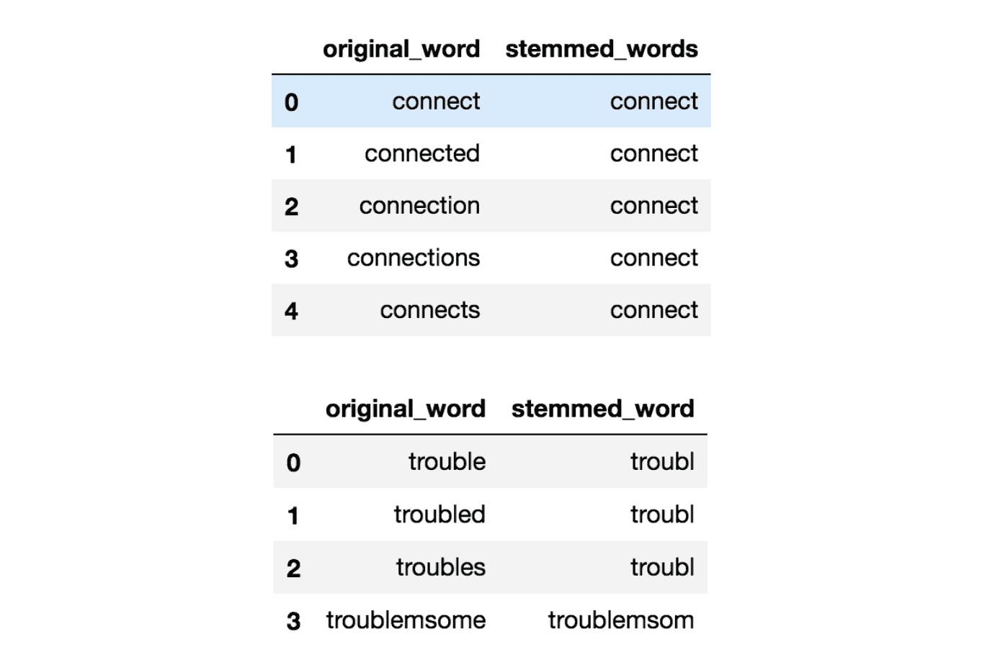
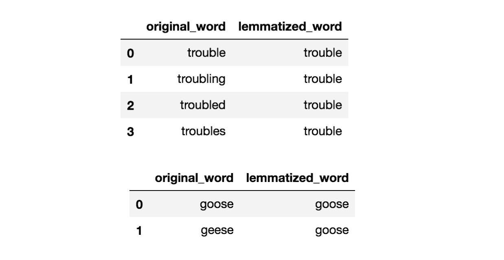
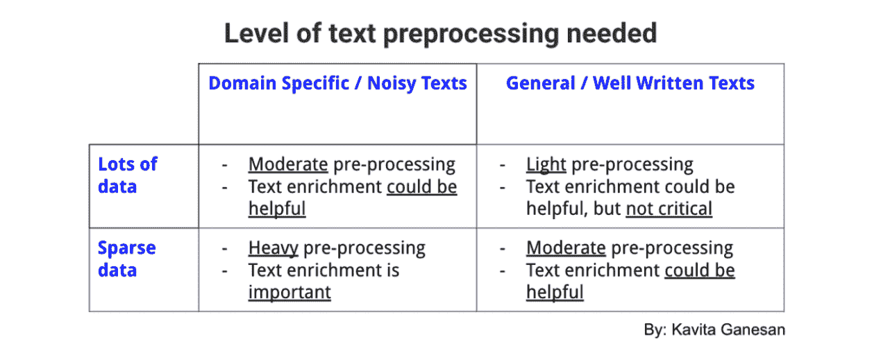

# 关于 NLP 和机器学习的文本预处理，你需要知道的一切

> 原文：[`www.kdnuggets.com/2019/04/text-preprocessing-nlp-machine-learning.html`](https://www.kdnuggets.com/2019/04/text-preprocessing-nlp-machine-learning.html)

评论

**作者 [Kavita Ganesan](http://kavita-ganesan.com/)，数据科学家**。

根据最近的一些对话，我意识到文本预处理是一个严重被忽视的话题。我谈到的几个人提到他们的 NLP 应用出现了不一致的结果，结果发现他们没有预处理文本或使用了不适合项目的文本预处理方法。

* * *

## 我们的三大课程推荐

 1\. [谷歌网络安全证书](https://www.kdnuggets.com/google-cybersecurity) - 快速进入网络安全职业生涯。

 2\. [谷歌数据分析专业证书](https://www.kdnuggets.com/google-data-analytics) - 提升你的数据分析技能

 3\. [谷歌 IT 支持专业证书](https://www.kdnuggets.com/google-itsupport) - 支持你的组织进行 IT 管理

* * *

考虑到这一点，我想澄清一下什么是文本预处理，文本预处理的不同方法，以及如何估计你可能需要多少预处理。对于感兴趣的人，我还提供了一些[文本预处理代码片段](https://github.com/kavgan/nlp-text-mining-working-examples/tree/master/text-pre-processing)供你尝试。现在，让我们开始吧！

### 什么是文本预处理？

对文本进行预处理只是将文本转化为对你的任务***可预测***和***可分析***的形式。这里的任务是方法和领域的组合。例如，从推文（领域）中提取顶级关键词（方法）就是一个*任务*的例子。

> *任务 = 方法 + 领域*

一个任务的理想预处理可能会变成另一个任务的噩梦。因此，请注意：文本预处理不能直接从任务到任务转移。

让我们举一个非常简单的例子，假设你正在尝试发现新闻数据集中常用的词汇。如果你的预处理步骤包括删除[停用词](http://kavita-ganesan.com/what-are-stop-words/)，因为其他任务使用了它，那么你可能会错过一些常见词汇，因为你已经*删除*了它。所以，实际上，它并不是一个一刀切的方法。

### 文本预处理技术类型

有不同的方法来预处理文本。以下是一些你应该了解的方法，我会尝试强调每种方法的重要性。

#### 小写化

小写化所有文本数据，虽然常被忽视，却是最简单和最有效的文本预处理方法之一。它适用于大多数文本挖掘和自然语言处理问题，并且在数据集不大时可以显著提高预期输出的一致性。

最近，我的一位博客读者训练了一个[word embedding model for similarity lookups](http://kavita-ganesan.com/gensim-word2vec-tutorial-starter-code/)。他发现输入大小写的不同变化（例如‘Canada’与‘canada’）会给出不同类型的输出或根本没有输出。这可能是因为数据集中存在混合大小写的‘Canada’，且神经网络的证据不足以有效地学习较少见版本的权重。当数据集相对较小时，这种问题很容易出现，小写化是解决稀疏性问题的好方法。

这里是一个小写化如何解决稀疏性问题的例子，其中相同单词的不同大小写映射到相同的小写形式：

**不同大小写的单词都映射到相同的小写形式**

另一个小写化非常有用的例子是搜索。假设你在寻找包含“usa”的文档。然而，没有结果出现，因为“usa”被索引为**“USA”。** 现在，我们应该责怪谁？设置界面的 UI 设计师还是设置搜索索引的工程师？

虽然小写化应该是标准做法，但我也遇到过需要保留大小写的情况。例如，在预测源代码文件的编程语言时，Java 中的单词 System 与 Python 中的 system 有很大不同。将两者小写化会使它们变得相同，从而导致分类器丧失重要的预测特征。虽然小写化*通常是*有帮助的，但它可能不适用于所有任务。

#### 词干提取

词干提取是将单词（例如 troubled，troubles）的词形变化减少到其词根形式（例如 trouble）的过程。在这种情况下，“根”可能不是一个真正的词根单词，而只是原始单词的规范形式。

词干提取使用一种粗糙的启发式过程，试图通过去掉单词末尾的部分来正确地将单词转换为其词根形式。因此，单词“trouble”、“troubled”和“troubles”可能实际上会被转换为 troubl，而不是 trouble，因为末尾部分只是被切掉了（唉，真粗糙！）。

有不同的词干提取算法。最常见的算法，也被实证证明对英语有效，是[Porters Algorithm](https://tartarus.org/martin/PorterStemmer/)。以下是 Porter Stemmer 进行词干提取的实际例子：

**词干提取对变形词的影响**

词干提取对于处理稀疏性问题以及标准化词汇很有用。我在搜索应用中尤其成功。这个想法是，例如，如果你搜索“深度学习课程”，你还希望能够检索提到“深度学习***班级***”以及“深度***学习***课程”的文档，尽管后者听起来不太对。但你明白我们的意思。你希望匹配一个词的所有变体，以获取最相关的文档。

然而，在我以前的大多数文本分类工作中，词干提取仅在一定程度上提高了分类准确性，相比之下，使用更好的特征工程和文本丰富化方法（例如，使用词嵌入）更为有效。

#### 词形还原

词形还原在表面上与词干提取非常相似，目标是去除词的屈折形式并将其映射到根形式。唯一的区别是，词形还原试图以正确的方式进行。它不仅仅是削减，而是将词实际转换为根词。例如，词“better”将映射到“good”。它可能使用像[WordNet 的映射](https://www.nltk.org/_modules/nltk/stem/wordnet.html)这样的字典，或者一些特殊的[基于规则的方法](https://www.semanticscholar.org/paper/A-Rule-based-Approach-to-Word-Lemmatization-Plisson-Lavrac/5319539616e81b02637b1bf90fb667ca2066cf14)。以下是使用基于 WordNet 的方法进行词形还原的示例：

词形还原的效果与 WordNet

根据我的经验，词形还原在搜索和文本分类方面并未比词干提取提供显著好处。实际上，根据你选择的算法，它可能比使用非常基本的词干提取器要慢得多，而且你可能需要知道词的词性才能得到正确的词形。[这篇论文](https://arxiv.org/pdf/1707.01780.pdf)发现，词形还原对神经网络架构的文本分类准确性没有显著影响。

我个人会谨慎使用词形还原。额外的开销可能不值得。然而，你可以尝试一下，以查看它对性能指标的影响。

#### 停用词移除

停用词是一组在语言中常用的词。例如，英语中的停用词有“a”、“the”、“is”、“are”等。使用停用词的直觉是，通过从文本中移除低信息量的词，我们可以集中关注重要的词。

例如，在搜索系统的上下文中，如果你的搜索查询是*“什么是文本预处理？”*，你希望搜索系统关注那些谈论文本预处理的文档，而不是那些谈论“是什么”的文档。这可以通过阻止所有停用词列表中的词被分析来实现。停用词通常应用于搜索系统、文本分类应用、主题建模、主题提取等。

根据我的经验，虽然停用词删除在搜索和主题提取系统中有效，但在分类系统中并非至关重要。然而，它确实有助于减少考虑的特征数量，从而使模型保持合理大小。

这是一个停用词删除的例子。所有停用词都被替换为一个虚拟字符，**W**：

**停用词删除前后的句子**

[停用词列表](http://kavita-ganesan.com/what-are-stop-words/)可以来自预先建立的集合，或者你可以为你的领域创建一个[自定义列表](http://kavita-ganesan.com/tips-for-constructing-custom-stop-word-lists/)。一些库（例如 sklearn）允许你删除出现在 X%文档中的词汇，这也可以达到停用词删除的效果。

#### 标准化

一个被高度忽视的预处理步骤是文本标准化。文本标准化是将文本转化为标准（规范）形式的过程。例如，单词“gooood”和“gud”可以转换为“good”，即其规范形式。另一个例子是将近乎相同的词汇，如“stopwords”、“stop-words”和“stop words”，映射到“stopwords”。

文本标准化对于噪声文本（如社交媒体评论、短信和博客评论）非常重要，因为这些文本中常出现缩写、拼写错误和超出词汇表的词汇（oov）。[这篇论文](https://sentic.net/microtext-normalization.pdf)显示，通过对推文使用文本标准化策略，他们能够将情感分类准确度提高约 4%。

这是一个文本标准化前后的例子：

**文本标准化的效果**

注意这些变体如何映射到相同的标准形式。

根据我的经验，文本标准化在分析[高度非结构化的临床文本](http://kavita-ganesan.com/general-supervised-approach-segmentation-clinical-texts/)中也有效，其中医生以非标准化的方式记录笔记。我还发现它在[主题提取](https://githubengineering.com/topics/)中很有用，其中近义词和拼写差异很常见（例如，主题建模、主题建模、主题建模、主题建模）。

不幸的是，与词干提取和词形还原不同，文本标准化没有标准化的方式。它通常取决于任务。例如，你标准化临床文本的方式与标准化短信的方式可能会有所不同。

一些常见的文本标准化方法包括词典映射（最简单）、统计机器翻译（SMT）和基于拼写修正的方法。[这篇有趣的文章](https://nlp.stanford.edu/courses/cs224n/2009/fp/27.pdf)比较了基于词典的方法和 SMT 方法在标准化短信中的使用。

#### 噪声去除

噪声移除是指移除可能干扰文本分析的字符、数字和文本片段。噪声移除是最基本的文本预处理步骤之一，也高度依赖于领域。

例如，在推文中，噪声可能是所有特殊字符，除了标签，因为标签标志着可以表征推文的概念。噪声的问题在于它可能会在下游任务中产生不一致的结果。以下是一个示例：

**词干提取与噪声移除**

注意，以上所有原始词汇都有一些周围的噪声。如果你对这些词汇进行词干提取，你会发现词干提取结果并不好看。它们都没有正确的词干。然而，通过在[这个笔记本](https://github.com/kavgan/nlp-text-mining-working-examples/blob/master/text-pre-processing/Text%20Pre-Processing%20Examples.ipynb)中应用一些清理，结果现在看起来好多了：

词干提取**与**噪声移除

噪声移除是文本挖掘和自然语言处理中的首要任务之一。有多种方法可以移除噪声。这包括*标点符号移除*、*特殊字符移除*、*数字移除、HTML 格式移除、特定领域关键词移除*（例如‘RT’表示转发）、源代码移除、头部信息移除*等。这完全取决于你所在的领域以及你的任务中什么算作噪声。[我笔记本中的代码片段](https://github.com/kavgan/nlp-text-mining-working-examples/tree/master/text-pre-processing)展示了如何进行一些基本的噪声移除。

#### 文本丰富化 / 增强

文本丰富化涉及将你原有的文本数据与先前没有的信息进行扩充。文本丰富化为你的原始文本提供更多的语义，从而提高其预测能力以及你对数据进行分析的深度。

在信息检索的例子中，扩展用户查询以提高关键词匹配的准确度是一种增强形式。例如，查询“文本挖掘”可以变成“文本文件挖掘分析”。虽然这对人类来说没有意义，但它有助于获取更相关的文档。

你可以非常有创意地丰富你的文本。你可以使用[**词性标注**](https://en.wikipedia.org/wiki/Part-of-speech_tagging)来获取关于文本中词汇的更详细信息。

例如，在文档分类问题中，单词**book**作为**名词**的出现可能会导致不同的分类，而**book**作为**动词**的出现则是用在阅读的上下文中，另一个则用在预定的上下文中。[这篇文章](http://www.iapr-tc11.org/archive/icdar2011/fileup/PDF/4520a920.pdf)讨论了如何通过名词和动词的组合作为输入特征来改善中文文本分类。

随着大量文本的出现，人们开始使用[词嵌入](https://en.wikipedia.org/wiki/Word_embedding)来丰富词语、短语和句子的意义，用于分类、搜索、摘要和文本生成等。尤其是在深度学习的 NLP 方法中，[词级嵌入层](https://keras.io/layers/embeddings/)非常常见。你可以选择使用[预训练的嵌入](https://blog.keras.io/using-pre-trained-word-embeddings-in-a-keras-model.html)或创建自己的嵌入并在下游任务中使用它。

其他丰富文本数据的方法包括[短语提取](http://kavita-ganesan.com/how-to-incorporate-phrases-into-word2vec-a-text-mining-approach/#.XHCcJ1xKg2w)，即将复合词识别为一个（也叫做分块），[同义词扩展](http://aclweb.org/anthology/R09-1073)和[依存句法分析](http://www.cs.virginia.edu/~kc2wc/teaching/NLP16/slides/15-DP.pdf)。

### 你需要全部做吗？

不完全是，但如果你想获得良好且一致的结果，你确实需要做一些。为了让你了解最低限度的要求，我将其分为***必须做的***、***应该做的***和***任务相关的***。任务相关的部分可以在决定是否需要之前进行定量或定性测试。

记住，少即是多，你要尽可能保持方法的优雅。添加的开销越多，当遇到问题时，你需要剥离的层次就越多。

### 必须做的：

+   噪声移除

+   小写化（在某些情况下可能与任务相关）

### 应该做的：

+   简单标准化 — （例如，标准化几乎相同的词）

### 任务相关的：

1.  高级标准化（例如，处理词汇表外的词）

1.  停用词移除

1.  词干提取/词形还原

1.  文本丰富/增强

因此，对于任何任务，你至少应该尝试将文本转换为小写并去除噪声。噪声的定义取决于你的领域（参见噪声移除部分）。你还可以做一些基本的标准化步骤以提高一致性，然后根据需要系统地添加其他层。

### 一般经验法则

并非所有任务都需要相同程度的预处理。对于一些任务，你可以只做最基本的处理。然而，对于其他任务，数据集可能如此嘈杂，如果不进行足够的预处理，结果将会是“垃圾进垃圾出”。

这里有一个一般经验法则。虽然这并不总是成立，但适用于大多数情况。如果你有大量写得很好的文本可以处理，并且领域相对通用，那么预处理不是特别关键；你可以只做最低限度的处理（例如，使用维基百科的所有文本或路透社新闻文章训练词嵌入模型）。

然而，如果你在一个非常狭窄的领域（例如关于健康食品的推文）工作，并且数据稀疏且嘈杂，你可能会从更多的预处理层中受益，尽管每一层（例如停用词移除、词干提取、标准化）都需要通过定量或定性的方法验证其有效性。这里有一个表格总结了你应对文本数据进行多少预处理。

我希望这里的想法能引导你找到适合你项目的正确预处理步骤。记住，*少即是多*。我的一位朋友曾提到，他通过去除不必要的预处理层，使一个大型电子商务搜索系统更高效、更稳定。

### 资源

+   [使用 NLTK 和正则表达式进行基本文本预处理的 Python 代码](https://github.com/kavgan/nlp-text-mining-working-examples/blob/master/text-pre-processing/Text%20Preprocessing%20Examples.ipynb)

+   [构建自定义停用词列表](http://kavita-ganesan.com/tips-for-constructing-custom-stop-word-lists/)

+   [短语提取的源代码](https://kavgan.github.io/phrase-at-scale/)

### 参考文献

+   如需查看最新的论文列表，请参阅[我的原始文章](http://kavita-ganesan.com/text-preprocessing-tutorial/#Relevant-Papers)

简介：[Kavita Ganesan](http://kavita-ganesan.com/about-me/) 是一位数据科学家，擅长自然语言处理、文本挖掘、搜索和机器学习。在过去十年中，她曾在多个技术组织工作，包括 GitHub（微软）、3M 健康信息系统和 eBay。

[原文](https://medium.freecodecamp.org/all-you-need-to-know-about-text-preprocessing-for-nlp-and-machine-learning-bc1c5765ff67)。经许可转载。

**资源：**

+   [在线和基于 Web 的：分析、数据挖掘、数据科学、机器学习教育](https://www.kdnuggets.com/education/online.html)

+   [用于分析、数据科学、数据挖掘和机器学习的软件](https://www.kdnuggets.com/software/index.html)

**相关：**

+   [使用 PyTorch 框架开始 NLP](https://www.kdnuggets.com/2019/04/nlp-pytorch.html)

+   [通过迁移学习和弱监督以低成本构建 NLP 分类器](https://www.kdnuggets.com/2019/03/building-nlp-classifiers-cheaply-transfer-learning-weak-supervision.html)

+   [超越新闻内容：社会背景在假新闻检测中的作用](https://www.kdnuggets.com/2019/03/beyond-news-contents-role-of-social-context-for-fake-news-detection.html)

### 更多相关内容

+   [在 Pandas 中清洗和预处理文本数据以用于 NLP 任务](https://www.kdnuggets.com/cleaning-and-preprocessing-text-data-in-pandas-for-nlp-tasks)

+   [教科书就是你所需要的：一种革命性的 AI 培训方法](https://www.kdnuggets.com/2023/07/textbooks-all-you-need-revolutionary-approach-ai-training.html)

+   [KDnuggets 新闻，4 月 13 日：数据科学家应关注的 Python 库……](https://www.kdnuggets.com/2022/n15.html)

+   [今天所有市场营销分析和数据科学专业人士需要掌握的 5 项技能](https://www.kdnuggets.com/2023/08/mads-5-skills-marketing-analytics-data-science-pros-need-today.html)

+   [机器学习中的统计学：你需要知道的成为…](https://www.kdnuggets.com/2024/03/sas-statistics-machine-learning-need-know-become-certified-expert)

+   [关于数据管理你需要知道的 6 件事及其重要性…](https://www.kdnuggets.com/2022/05/6-things-need-know-data-management-matters-computer-vision.html)
