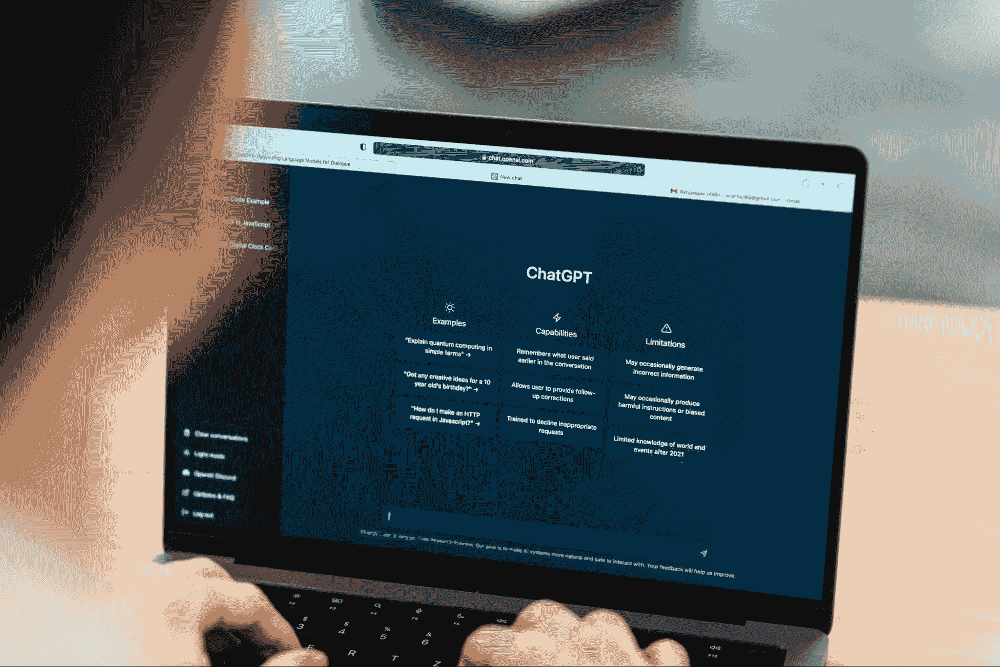
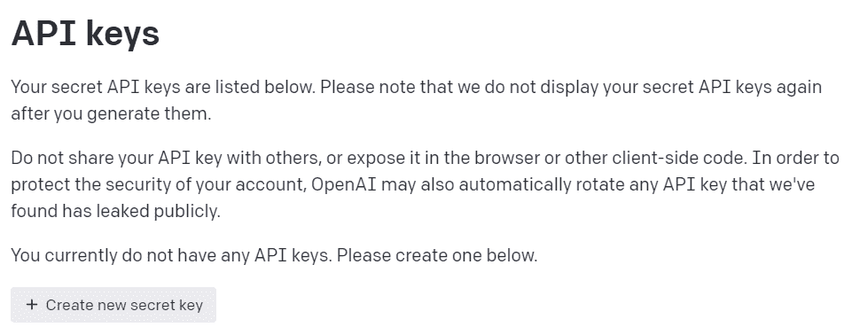
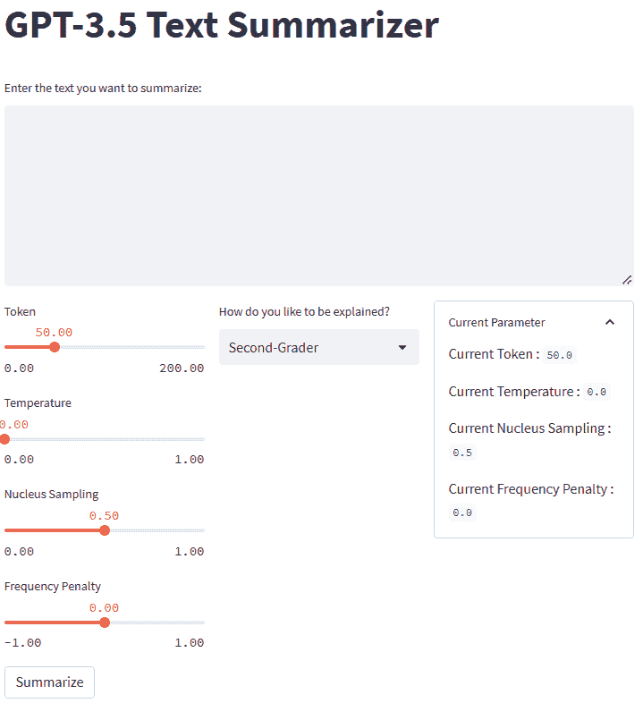
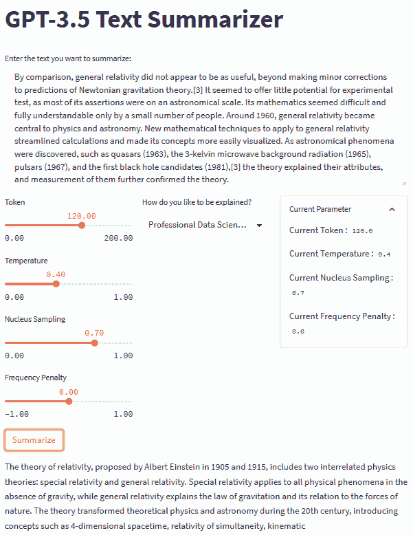

# 文本摘要开发：带有 GPT-3.5 的 Python 教程

> 原文：[`www.kdnuggets.com/2023/04/text-summarization-development-python-tutorial-gpt35.html`](https://www.kdnuggets.com/2023/04/text-summarization-development-python-tutorial-gpt35.html)



图片由 [frimufilms](https://www.freepik.com/free-photo/opened-ai-chat-laptop_38259334.htm#query=chatgpt&position=0&from_view=search&track=sph) 提供，来源于 [Freepik](https://www.freepik.com/)

这是一个 AI 突破日新月异的时代。几年前，我们在公共领域中看到的 AI 生成内容不多，但现在技术对每个人都可及。对于许多希望显著利用这一技术来开发复杂项目的个人创作者或公司来说，这是一项绝佳的选择，可能需要较长时间。

* * *

## 我们的前 3 名课程推荐

 1\. [谷歌网络安全证书](https://www.kdnuggets.com/google-cybersecurity) - 快速入门网络安全职业。

 2\. [谷歌数据分析专业证书](https://www.kdnuggets.com/google-data-analytics) - 提升你的数据分析技能

 3\. [谷歌 IT 支持专业证书](https://www.kdnuggets.com/google-itsupport) - 支持你的组织 IT

* * *

其中一个改变我们工作方式的重大突破是 [OpenAI 发布的 GPT-3.5 模型](https://platform.openai.com/docs/models/gpt-3-5)。GPT-3.5 模型是什么？如果让模型自己回答的话，答案是“**在自然语言处理领域中高度先进的 AI 模型，在生成上下文相关和准确的文本方面有着显著改进**”。

OpenAI 提供了一个用于 GPT-3.5 模型的 API，我们可以用来开发一个简单的应用程序，例如文本摘要器。为此，我们可以使用 Python 将模型 API 无缝集成到我们的应用程序中。这个过程是什么样的呢？让我们深入了解一下。

# 前提条件

在跟随本教程之前，有几个前提条件，包括：

- Python 知识，包括使用外部库和 IDE 的知识

- 理解 APIs 和使用 Python 处理端点

- 拥有访问 OpenAI APIs 的权限

要获取 OpenAI APIs 访问权限，我们必须在 [OpenAI 开发者平台](https://platform.openai.com/overview) 注册，并访问您个人资料中的查看 API 密钥。在网页上，点击“创建新秘密密钥”按钮以获取 API 访问权限（见下图）。请记得保存密钥，因为之后将不会再显示。



作者提供的图片

准备工作就绪后，让我们尝试理解 OpenAI APIs 模型的基础知识。

# 理解 GPT-3.5 OpenAI API

[GPT-3.5 系列模型](https://platform.openai.com/docs/models/gpt-3-5)被指定用于许多语言任务，每个系列中的模型在某些任务中表现出色。在这个教程示例中，我们将使用 `gpt-3.5-turbo`，因为它是本文撰写时推荐的当前模型，具有良好的能力和性价比。

我们在 OpenAI 教程中通常使用 `text-davinci-003`，但本教程中我们将使用当前模型。我们将依赖 [ChatCompletion](https://platform.openai.com/docs/api-reference/chat/create) 端点，而不是 Completion，因为当前推荐的模型是聊天模型。即使名字是聊天模型，它也适用于任何语言任务。

让我们尝试理解 API 的工作原理。首先，我们需要安装当前的 OpenAI 包。

```py
pip install openai
```

完成包的安装后，我们将尝试通过 ChatCompletion 端点连接并使用 API。不过，在继续之前，我们需要设置环境。

在你最喜欢的 IDE（对我来说是 VS Code）中，创建两个文件，分别命名为 `.env` 和 `summarizer_app.py`，类似于下图。


作者提供的图片

`summarizer_app.py` 是我们将构建简单总结应用程序的地方，而 `.env` 文件是我们存储 API 密钥的地方。出于安全原因，建议将 API 密钥分开存储在另一个文件中，而不是硬编码在 Python 文件中。

在 `.env` 文件中放入以下语法并保存文件。将 `your_api_key_here` 替换为你的实际 API 密钥。不要将 API 密钥更改为字符串对象；保持原样。

```py
OPENAI_API_KEY=your_api_key_here
```

为了更好地理解 GPT-3.5 API，我们将使用以下代码生成词汇总结器。

```py
openai.ChatCompletion.create(
    model="gpt-3.5-turbo",
    max_tokens=100,
    temperature=0.7,
    top_p=0.5,
    frequency_penalty=0.5,
    messages=[
        {
          "role": "system",
          "content": "You are a helpful assistant for text summarization.",
        },
        {
          "role": "user",
          "content": f"Summarize this for a {person_type}: {prompt}",
        },
    ],
)
```

上述代码展示了我们如何与 OpenAI API 的 GPT-3.5 模型进行交互。通过使用 ChatCompletion API，我们创建了一个对话，并在传递提示后获得预期的结果。

让我们逐步解析每个部分以更好地理解。在第一行，我们使用 `openai.ChatCompletion.create` 代码从我们将传递给 API 的提示中创建响应。

在下一行，我们有用来改善文本任务的超参数。以下是每个超参数功能的总结：

+   `model`：我们要使用的模型系列。在本教程中，我们使用当前推荐的模型（`gpt-3.5-turbo`）。

+   `max_tokens`：模型生成的单词上限。它有助于限制生成文本的长度。

+   `temperature`：模型输出的随机性，温度越高，结果越多样和创造性。值的范围是从 0 到无限，虽然值大于 2 并不常见。

+   `top_p`：Top P 或 top-k 采样或核采样是一个控制输出分布中采样池的参数。例如，值为 0.1 表示模型仅从分布的前 10% 中进行采样。该值范围在 0 到 1 之间；较高的值意味着结果更具多样性。

+   `frequency_penalty`：输出中重复词的惩罚。值范围在 -2 到 2 之间，其中正值会抑制模型重复词，而负值则鼓励模型使用更多重复的词。0 表示没有惩罚。

+   `messages`：我们将文本提示传递给模型进行处理的参数。我们传递一个字典列表，其中键是角色对象（“system”、“user”或“assistant”），帮助模型理解上下文和结构，而值是上下文。

    +   角色“system”是对模型“assistant”行为的设定准则。

    +   角色“user”表示与模型交互的人的提示。

    +   角色“assistant”是对“user”提示的回应。

解释完上述参数后，我们可以看到上面的 `messages` 参数包含两个字典对象。第一个字典是我们如何将模型设置为文本摘要器。第二个是我们传递文本并获取摘要输出的地方。

在第二个字典中，你还会看到变量 `person_type` 和 `prompt`。`person_type` 是我用来控制摘要风格的变量，在教程中会展示。而 `prompt` 是我们传递待总结文本的地方。

继续教程，将以下代码放入 `summarizer_app.py` 文件中，我们将尝试运行下面的函数。

```py
import openai
import os
from dotenv import load_dotenv

load_dotenv()
openai.api_key = os.getenv("OPENAI_API_KEY")

def generate_summarizer(
    max_tokens,
    temperature,
    top_p,
    frequency_penalty,
    prompt,
    person_type,
):
    res = openai.ChatCompletion.create(
        model="gpt-3.5-turbo",
        max_tokens=100,
        temperature=0.7,
        top_p=0.5,
        frequency_penalty=0.5,
        messages=
       [
         {
          "role": "system",
          "content": "You are a helpful assistant for text summarization.",
         },
         {
          "role": "user",
          "content": f"Summarize this for a {person_type}: {prompt}",
         },
        ],
    )
    return res["choices"][0]["message"]["content"]
```

上面的代码是我们创建一个 Python 函数的地方，该函数接受我们之前讨论过的各种参数，并返回文本摘要输出。

使用你的参数尝试上述功能并查看输出。然后继续本教程，使用 streamlit 包创建一个简单的应用程序。

# 使用 Streamlit 的文本摘要应用程序

[Streamlit](https://docs.streamlit.io/) 是一个开源 Python 包，旨在创建机器学习和数据科学网页应用。它易于使用且直观，因此推荐给许多初学者。

在继续教程之前，让我们先安装 streamlit 包。

```py
pip install streamlit
```

安装完成后，将以下代码放入 `summarizer_app.py` 中。

```py
import streamlit as st

#Set the application title
st.title("GPT-3.5 Text Summarizer")

#Provide the input area for text to be summarized
input_text = st.text_area("Enter the text you want to summarize:", height=200)

#Initiate three columns for section to be side-by-side
col1, col2, col3 = st.columns(3)

#Slider to control the model hyperparameter
with col1:
    token = st.slider("Token", min_value=0.0, max_value=200.0, value=50.0, step=1.0)
    temp = st.slider("Temperature", min_value=0.0, max_value=1.0, value=0.0, step=0.01)
    top_p = st.slider("Nucleus Sampling", min_value=0.0, max_value=1.0, value=0.5, step=0.01)
    f_pen = st.slider("Frequency Penalty", min_value=-1.0, max_value=1.0, value=0.0, step=0.01)

#Selection box to select the summarization style
with col2:
    option = st.selectbox(
        "How do you like to be explained?",
        (
            "Second-Grader",
            "Professional Data Scientist",
            "Housewives",
            "Retired",
            "University Student",
        ),
    )

#Showing the current parameter used for the model 
with col3:
    with st.expander("Current Parameter"):
        st.write("Current Token :", token)
        st.write("Current Temperature :", temp)
        st.write("Current Nucleus Sampling :", top_p)
        st.write("Current Frequency Penalty :", f_pen)

#Creating button for execute the text summarization
if st.button("Summarize"):
    st.write(generate_summarizer(token, temp, top_p, f_pen, input_text, option))
```

尝试在命令提示符中运行以下代码以启动应用程序。

```py
streamlit run summarizer_app.py
```

如果一切正常，你会在默认浏览器中看到以下应用程序。



图片来源：作者

那么，上面的代码发生了什么？让我简要解释一下我们使用的每个函数：

+   `.st.title`：提供网页应用程序的标题文本。

+   `.st.write`：将参数写入应用程序中；可以是任何内容，但主要是字符串文本。

+   `.st.text_area`：提供一个文本输入区域，可以存储在变量中并用于我们的文本摘要提示。

+   `.st.columns`：对象容器，用于提供并排互动。

+   `.st.slider`：提供一个具有设定值的滑块小部件，用户可以进行交互。该值存储在用作模型参数的变量中。

+   `.st.selectbox`：提供一个选择小部件，让用户选择他们想要的摘要样式。在上面的示例中，我们使用了五种不同的样式。

+   `.st.expander`：提供一个容器，用户可以展开并容纳多个对象。

+   `.st.button`：提供一个按钮，用户按下时运行预期的功能。

由于 streamlit 会自动根据从上到下给定的代码设计 UI，我们可以更多地关注互动。

当所有组件准备好后，让我们尝试使用文本示例来测试我们的摘要应用程序。对于我们的示例，我将使用 [相对论 Wikipedia 页面](https://en.wikipedia.org/wiki/Theory_of_relativity) 的文本进行摘要。使用默认参数和二年级风格，我们得到以下结果。

```py
Albert Einstein was a very smart scientist who came up with two important ideas about how the world works. The first one, called special relativity, talks about how things move when there is no gravity. The second one, called general relativity, explains how gravity works and how it affects things in space like stars and planets. These ideas helped us understand many things in science, like how particles interact with each other and even helped us discover black holes! 
```

你可能会获得与上述不同的结果。让我们尝试“家庭主妇”风格，并稍微调整参数（Token 100，Temperature 0.5，Nucleus Sampling 0.5，Frequency Penalty 0.3）。

```py
The theory of relativity is a set of physics theories proposed by Albert Einstein in 1905 and 1915\. It includes special relativity, which applies to physical phenomena without gravity, and general relativity, which explains the law of gravitation and its relation to the forces of nature. The theory transformed theoretical physics and astronomy in the 20th century, introducing concepts like 4-dimensional spacetime and predicting astronomical phenomena like black holes and gravitational waves.
```

如我们所见，相同文本的样式存在差异。通过更改提示和参数，我们的应用程序可以更具功能性。

我们的文本摘要应用程序的整体外观可以从下图中看到。



图片由作者提供

这就是关于使用 GPT-3.5 创建文本摘要应用程序的教程。你可以进一步调整应用程序并部署它。

# 结论

生成式 AI 正在崛起，我们应该利用这个机会创建一个精彩的应用程序。在本教程中，我们将了解 GPT-3.5 OpenAI API 的工作原理，以及如何借助 Python 和 streamlit 包来创建一个文本摘要应用程序。

**[Cornellius Yudha Wijaya](https://www.linkedin.com/in/cornellius-yudha-wijaya/)** 是数据科学助理经理和数据撰稿人。他在全职工作于 Allianz Indonesia 的同时，喜欢通过社交媒体和写作媒体分享 Python 和数据技巧。

### 更多相关话题

+   [检测 ChatGPT、GPT3 和 GPT2 的 5 个免费工具](https://www.kdnuggets.com/2023/02/5-free-tools-detecting-chatgpt-gpt3-gpt2.html)

+   [文本摘要方法概述](https://www.kdnuggets.com/2019/01/approaches-text-summarization-overview.html)

+   [自动化文本摘要入门](https://www.kdnuggets.com/2019/11/getting-started-automated-text-summarization.html)

+   [使用 GPT-3 进行摘要](https://www.kdnuggets.com/2022/04/packt-summarization-gpt3.html)

+   [解锁 GPT-4 摘要生成的密度链提示方法](https://www.kdnuggets.com/unlocking-gpt-4-summarization-with-chain-of-density-prompting)

+   [使用 BERT 的 LLM 提取式摘要生成](https://www.kdnuggets.com/extractive-summarization-with-llm-using-bert)
