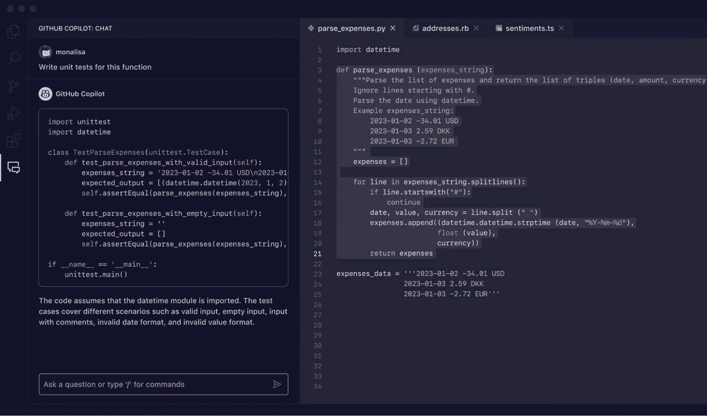
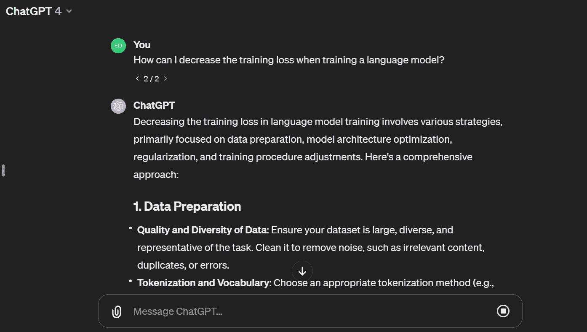
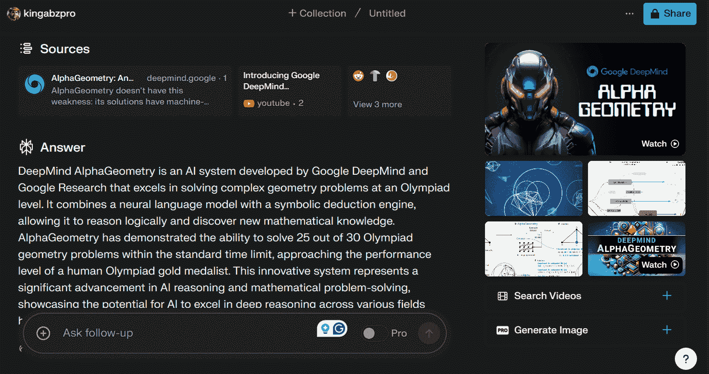
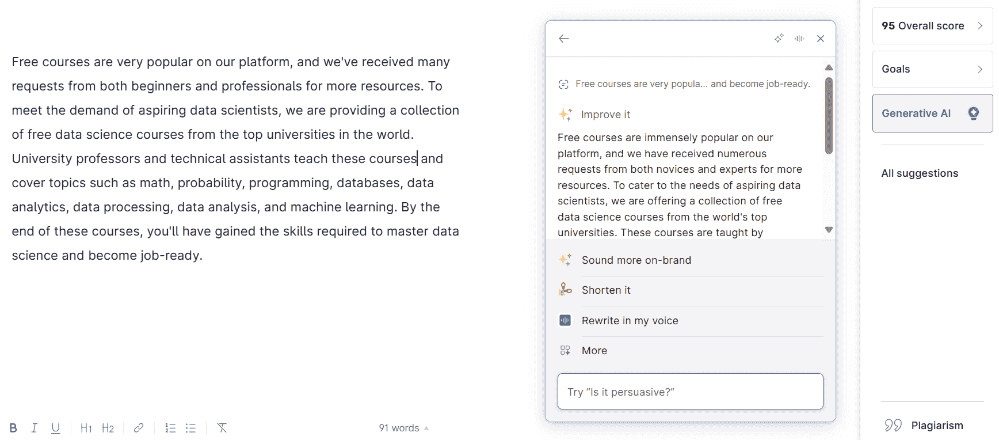
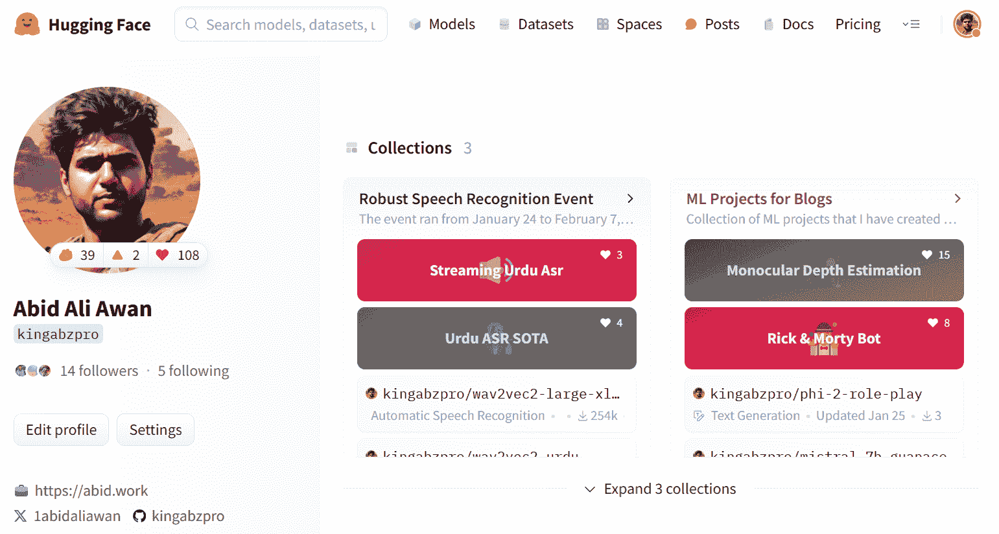

# 数据科学工作流的 7 款最佳 AI 工具

> 原文：[`www.kdnuggets.com/the-7-best-ai-tools-for-data-science-workflow`](https://www.kdnuggets.com/the-7-best-ai-tools-for-data-science-workflow)


图片来源于 DALLE-3

现在显而易见的是，那些迅速采纳 AI 的人将会引领潮流，而那些抵制变化的人将被已经使用 AI 的人取代。人工智能不再只是一个过时的潮流，它正成为各种行业的必备工具，包括数据科学。开发者和研究人员越来越多地使用 AI 驱动的工具来简化他们的工作流程，其中一个最近获得巨大人气的工具就是 ChatGPT。

* * *

## 我们的前三个课程推荐

 1\. [Google Cybersecurity Certificate](https://www.kdnuggets.com/google-cybersecurity) - 快速入门网络安全职业生涯。

 2\. [Google Data Analytics Professional Certificate](https://www.kdnuggets.com/google-data-analytics) - 提升你的数据分析技能

 3\. [Google IT Support Professional Certificate](https://www.kdnuggets.com/google-itsupport) - 支持你所在的组织的 IT

* * *

在这篇博客中，我将讨论 7 款最佳 AI 工具，它们让我的数据科学家生活变得更加轻松。这些工具在我的日常任务中不可或缺，比如编写教程、研究、编码、数据分析和执行机器学习任务。通过分享这些工具，我希望帮助数据科学家和研究人员简化工作流程，并在不断发展的 AI 领域中保持领先。

# 1\. PandasAI: 对话式数据分析

每个数据专业人士都熟悉 pandas，这是一个用于数据处理和分析的 Python 包。但如果我告诉你，除了编写代码，你还可以通过简单地输入提示或问题来分析和生成数据可视化呢？这就是 [PandasAI](https://pandas-ai.com/) 的功能——它就像是你 Python 工作流的 AI 代理，使用各种 AI 模型自动化数据分析。你甚至可以使用本地运行的模型。

在下面的代码中，我们使用 pandas 数据框和 OpenAI 模型创建了一个代理。这个代理可以使用自然语言对你的数据框执行各种任务。我们向它提出了一个简单的问题，然后要求解释它是如何得出结果的。

```py
import os
import pandas as pd
from pandasai.llm import OpenAI
from pandasai import Agent

sales_by_country = pd.DataFrame(
    {
        "country": [
            "United States",
            "United Kingdom",
            "France",
            "Germany",
            "Italy",
            "Spain",
            "Canada",
            "Australia",
            "Japan",
            "China",
        ],
        "sales": [5000, 3200, 2900, 4100, 2300, 2100, 2500, 2600, 4500, 7000],
    }
)

llm = OpenAI(api_token=os.environ["OPENAI_API_KEY"])
pandas_ai_df = Agent(sales_by_country, config={"llm": llm})

response = pandas_ai_df.chat("Which are the top 5 countries by sales?")
explanation = pandas_ai_df.explain()

print("Answer:", response)
print("Explanation:", explanation)
```

结果非常惊人。使用我的实际数据进行实验至少需要半小时。

```py
Answer: The top 5 countries by sales are: China, United States, Japan, Germany, United Kingdom
Explanation: I looked at the data we have and found a way to sort it based on sales. Then, I picked the top 5 countries with the highest sales numbers. Finally, I put those countries into a list and created a sentence to show them as the top 5 countries by sales.
```

# 2\. GitHub Copilot: 你的 AI 代码助手

[GitHub Copilot](https://github.com/features/copilot) 现在对于全职开发人员或每天处理代码的人来说是必不可少的。为什么？它提高了你快速编写干净且高效代码的能力。你甚至可以与文件聊天，更快地调试或生成上下文相关的代码。



GitHub Copilot 包括 AI 聊天机器人、内联聊天框、代码生成、自动补全、CLI 自动补全以及其他 GitHub 相关功能，这些都可以帮助代码搜索和理解。

GitHub Copilot 是一款付费工具，因此如果你不想支付$10/月，那么你可以查看你必须尝试的 5 款 AI 编码助手。

# 3\. ChatGPT：由 GPT-4 驱动的聊天应用

[ChatGPT](https://chat.openai.com/)在 AI 领域已经主导了两年。人们用它来写邮件、生成内容、生成代码以及处理各种名义上的工作任务。



如果你订阅了服务，你将获得最先进的 GPT-4 模型，这在解决复杂问题方面表现出色。

我每天都使用它来生成代码、解释代码、提出一般问题和生成内容。AI 生成的工作并不总是完美的。你可能需要进行一些编辑，以便向更广泛的观众展示。

ChatGPT 是数据科学家的重要工具。使用它并不等于作弊。相反，与其他人相比，它能节省你在研究和寻找解决方案上的时间。

如果你重视隐私，可以考虑在你的笔记本电脑上运行开源 AI 模型。查看如何在笔记本电脑上使用 LLM 的 5 种方法。

# 4\. Colab AI：AI 驱动的云笔记本

如果你为复杂的机器学习任务训练了深度神经网络，那么你一定是在[Google Colab](https://colab.research.google.com/)上进行的，因为该平台提供了免费的 GPU 和 TPU。随着生成式 AI 的兴起，Google Colab 最近推出了一些功能，帮助你生成代码、加快调试速度以及自动补全。


Colab AI 就像是你工作区中的一名集成 AI 编码助手。你可以通过简单的提示和后续问题生成代码。它还提供了内联代码提示功能，尽管免费版的使用有限。

我强烈建议你购买付费版，因为它提供了更好的 GPU 和整体更佳的编码体验。

探索[2024 年 11 款最佳 AI 编码助手](https://www.datacamp.com/blog/best-ai-coding-assistants)，并尝试所有替代 Colab AI 的工具，找到最适合你的选项。

# 5\. Perplexity AI：智能搜索引擎

我一直在使用[Perplexity AI](https://www.perplexity.ai/)作为我的新搜索引擎和研究助手。它通过提供简洁且最新的摘要，并附有相关博客和视频的链接，帮助我学习新技术和概念。我甚至可以提出后续问题并获得修改后的答案。



Perplexity AI 提供各种功能来协助用户。它可以回答从基本事实到复杂查询的广泛问题，使用最新的来源。它的 Copilot 功能允许用户深入探索他们的主题，使他们能够扩展知识并发现新的兴趣领域。此外，用户可以将搜索结果组织成基于项目或主题的“集合”，使得将来更容易找到所需的信息。

查看一下 8 个 AI 驱动的搜索引擎，它们可以增强你的互联网搜索和研究能力，作为 Google 的替代方案。

# 6\. Grammarly：AI 写作助手

我想告诉你，[Grammarly](https://www.grammarly.com/) 是一个出色的工具，特别适合有阅读障碍的人。它帮助我快速而准确地写作。我已经使用 Grammarly 快将近 9 年了，我喜欢它的拼写、语法和整体结构的纠正功能。最近，他们推出了 Grammarly AI，允许我通过生成 AI 模型来改进我的写作。这个工具让我的生活变得更轻松，我现在可以写出更好的电子邮件、直接消息、内容、教程和报告。对我来说，它是一个重要的工具，就像 Canva 一样。



# 7\. Hugging Face：构建 AI 的未来

[Hugging Face](https://huggingface.co/) 不仅仅是一个工具，而是一个完整的生态系统，已经成为我日常工作生活中不可或缺的一部分。我用它来访问数据集、模型、机器学习演示和 AI 模型的 API。此外，我还依赖各种 Hugging Face Python 包来训练、微调、评估和部署机器学习模型。



Hugging Face 是一个开源平台，为社区免费提供服务，允许用户托管数据集、模型和 AI 演示。它甚至允许你部署模型推理并在 GPU 上运行它们。在接下来的几年里，它很可能会成为数据讨论、研究与开发以及运营的主要平台。

发现 [2024 年使用的十大数据科学工具](https://www.datacamp.com/blog/top-data-science-tools)，成为一个超级数据科学家，比任何人都更好地解决数据问题。

# 结论

我一直在使用 [Travis](https://aigents.co/learn?search=mlops)，一个 AI 驱动的辅导工具，来研究 MLOps、LLMOps 和数据工程等高级主题。它提供了关于这些主题的简单解释，你可以像使用任何聊天机器人一样提问。它非常适合那些只想从 Medium 上的顶级出版物中获得搜索结果的人。

在这篇博客中，我们探讨了 7 个强大的 AI 工具，这些工具可以显著提升数据科学家和研究人员的生产力和效率——从 PandasAI 的对话式数据分析到 GitHub Copilot 和 Colab AI 的代码生成和调试辅助，提供了改变游戏规则的能力，简化复杂的代码相关任务并节省宝贵时间。ChatGPT 的多功能性允许内容生成、代码解释和问题解决，而 Perplexity AI 提供了智能搜索引擎和研究助手。Grammarly AI 提供了宝贵的写作帮助，Hugging Face 则作为一个全面的生态系统，提供数据集、模型和 API，以开发和部署机器学习解决方案。

[](https://www.polywork.com/kingabzpro)****[Abid Ali Awan](https://www.polywork.com/kingabzpro)**** ([@1abidaliawan](https://www.linkedin.com/in/1abidaliawan)) 是一位认证的数据科学专业人士，热爱构建机器学习模型。目前，他专注于内容创作和撰写有关机器学习和数据科学技术的技术博客。Abid 拥有技术管理硕士学位和电信工程学士学位。他的愿景是使用图神经网络开发一款 AI 产品，帮助那些在心理健康方面挣扎的学生。

### 更多相关话题

+   [7 个 GPT 助力改善您的数据科学工作流程](https://www.kdnuggets.com/7-gpts-to-help-improve-your-data-science-workflow)

+   [RAPIDS cuDF 加速您的下一个数据科学工作流程](https://www.kdnuggets.com/2023/04/rapids-cudf-speed-next-data-science-workflow.html)

+   [通过 Scikit-learn 管道简化您的机器学习工作流程](https://www.kdnuggets.com/streamline-your-machine-learning-workflow-with-scikit-learn-pipelines)

+   [通过 Scikit-LLM 轻松将 LLM 集成到您的 Scikit-learn 工作流程中](https://www.kdnuggets.com/easily-integrate-llms-into-your-scikit-learn-workflow-with-scikit-llm)

+   [谷歌的 5 个 MLOps 课程提升您的 ML 工作流程](https://www.kdnuggets.com/5-mlops-courses-from-google-to-level-up-your-ml-workflow)

+   [2023 年最佳数据建模工具的 7 个列表](https://www.kdnuggets.com/2023/03/list-7-best-data-modeling-tools-2023.html)
