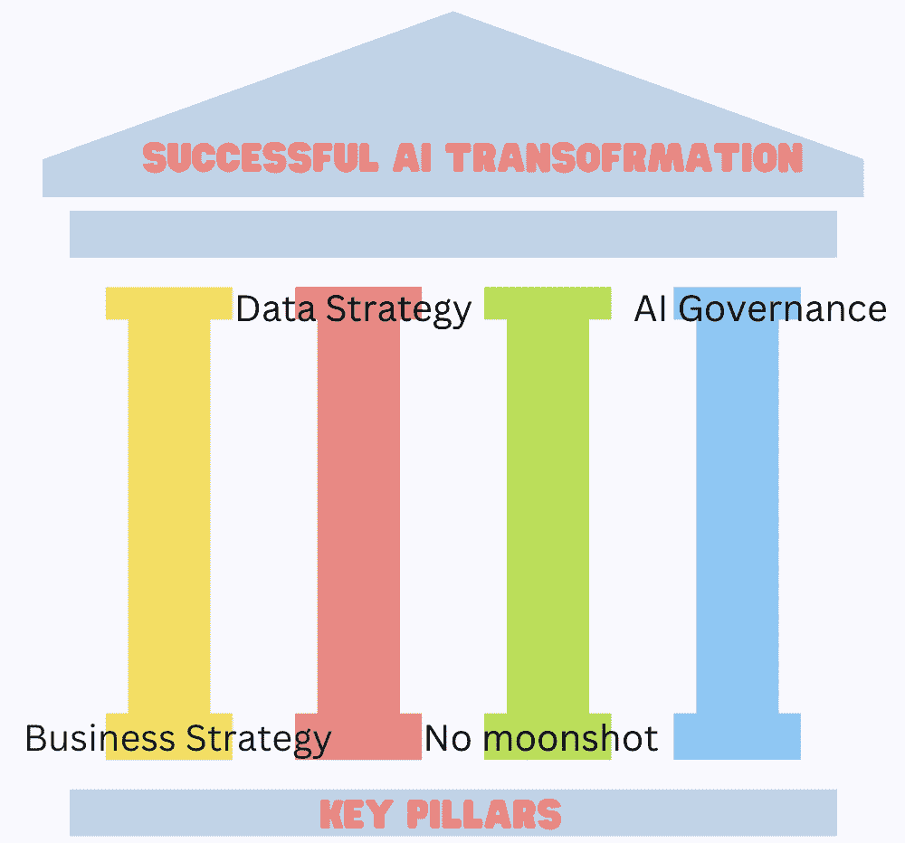

# AI 转型策略在 GenAI 时代

> 原文：[`www.kdnuggets.com/the-ai-transformation-strategy-in-the-genai-era`](https://www.kdnuggets.com/the-ai-transformation-strategy-in-the-genai-era)

AI 战略家擅长为企业构建 AI 路线图和愿景。然而，由于 AI 项目的范围不断变化，将路线图与预期的业务结果对齐变得具有挑战性。

图片来源：作者

因此，至关重要的是不断调整和完善 AI 策略，以确保其与不断变化的业务目标和技术格局保持一致。

但在我们开始制定策略之前，让我们讨论一下 AI 战略家的角色。

# AI 战略家的日常生活

AI 战略家熟悉 AI 工作流程，并将业务需求映射到利用 AI 的技术解决方案。他们理解相关的复杂性以及机会估算，并不一定需要了解算法的复杂细节。

让我们深入探讨这三个机会估算的支柱。首先，需要注意的是，有许多创新的方法来解决业务问题，并非所有方法都需要像 AI 那样复杂和先进的技术。

有些问题可以通过规则轻松解决，而其他问题则可以简单地自动化，解决问题到一定程度。

进行这样的评估是分析基准的关键，这涉及到对现有解决方案解决问题的部分进行清点。如果当前解决方案不可接受，那么战略家会通过解释拟议的 AI 驱动解决方案在有效性上的潜在提升及其带来的风险来进行权衡。

图片来源：作者

首先，战略家确保团队具备 AI 意识，并选择一个先进的解决方案，充分了解时间、精力、成本、复杂性和相关风险。可以公平地说，AI 战略家是 AI 转型成功的关键。

配备强大的商业头脑，AI 战略家通常遵循三个因素来构建成功的路线图：

首先是确保拟议的解决方案在技术上可行。他们识别数据需求，并评估手头的问题是否需要使用 AI。如果数据不可用、未经授权用于模型训练或没有准确的标签呢？这些都属于 AI 战略家的职能范围。

除了可行的解决方案，第二个方面是可行性。即使解决方案可以扩展，人工智能策略师也会从技术与商业的角度评估所提议的模型开发是否在财务上对商业目标具有可行性。如果成本效益分析表明，新人工智能/机器学习模型开发的预期收益无法证明其建设成本的合理性，那么最好放弃这个想法。

任何解决方案只有在提供价值时才是好的，这通常是一项挑战。价值可以表现为新的收入来源、商业差异化、通过自动化提高效率的改进流程等等。人工智能策略师有一种详细的方法来定义人工智能举措背后的价值主张。

# 人工智能转型

在当今迅速发展的技术环境中，诸如数字转型或人工智能转型这样的术语可能显得不相关。

有人可能会问，企业需要不断创新，利用新兴技术并适应市场变化。那么，当创新是持续进行的事情时，我们如何定义转型呢？

让我们简化并理解进行这种多年的业务演变背后的核心原则。

转型往往是组织认识到需要重新审视传统商业方式的转折点。他们明白，现有的经营模式不可持续，导致失去竞争优势，从而影响增长。

图片来源：作者

因此，他们尝试的想法数量快速增加，并迅速流入渠道，使实验在规模上奏效。这就是组织从拥有多年人工智能转型经验的人工智能策略师那里受益的地方。他们配备了包括适应性框架、系统和流程在内的工具包，这些可以被抽象为成功人工智能转型的策略。

# 成功转型策略的关键支柱

几年前，当人工智能策略的概念开始成为董事会讨论的焦点时，它引起了所有人的注意。特别是因为存在太多的策略——商业、人工智能和数据策略。

面对众多策略，如商业策略、数据策略以及现在的人工智能策略，很容易感到困惑。以下是这三种策略如何协调工作的方式。

商业策略和愿景始终位于首位。清晰的商业愿景、关键的增长驱动因素和与商业目标一致的路线图是至关重要的。一旦商业领袖决定了“为什么”和“什么”，接下来就是“怎么做”。

AI 策略师与技术专家关注的是如何通过技术实现商业愿景。需要注意的是，技术只是一个推动者。因此，AI 策略来源于商业策略**，** 这意味着需要大量时间来理解商业——护城河和竞争优势。

然而，AI 不能独立工作，它需要核心数据来建模现象。因此，它与数据策略密切配合。

图片由作者提供

设计成功的 AI 策略的下一个重要方面是确保 AI 团队不做任何大胆承诺**。** 这与 AI 策略师评估提议的可行性有关。AI 项目带来了很多“未知的未知”，因此必须考虑到预见的和不可预见的风险。

模型已经准备好，但如果它不符合负责任和道德的 AI 构建原则，就没有什么用处。想象一下，花费大量资金构建 AI 流水线和工作流，数据到位，预测也运行良好。

但只能意识到数据存在偏见，包含个人识别信息，或者像透明度和可解释性这样的基本而关键的问题。

需要注意的是，预测没有用，直到有人采取行动，而没有人能对预测采取行动，直到他们信任这些预测的来源和方式。

因此，AI 治理，包括关于角色和职责的详尽文档（如果出现问题，需明确所有权）以及数据收集、转换和训练集的过程，是成功实施的关键驱动因素。

# 结论

理解商业、数据和 AI 策略的三位一体，以及 AI 策略的关键支柱，对于引导组织成功进行 AI 转型至关重要。

****[Vidhi Chugh](https://vidhi-chugh.medium.com/)** 是一位 AI 策略师和数字化转型领袖，致力于在产品、科学和工程的交汇处构建可扩展的机器学习系统。她是一位屡获殊荣的创新领袖、作者和国际演讲者。她的使命是普及机器学习并打破术语，让每个人都能参与这场变革。

### 更多相关主题

+   [利用预测性 GenAI 提升能力](https://www.kdnuggets.com/2024/01/pecan-powering-predictive-genai)

+   [AWS 现在需要参加的 8 个顶级 GenAI 课程](https://www.kdnuggets.com/top-8-genai-courses-for-aws-to-take-now)

+   [如何在 GPT-4 时代成为数据科学家](https://www.kdnuggets.com/2023/04/get-hired-data-scientist-gpt4-era.html)

+   [在生成 AI 时代如何脱颖而出并保护你的工作](https://www.kdnuggets.com/how-to-standout-and-safeguard-your-job-in-the-generative-ai-era)

+   [掌握数据战略的 15 本最佳书籍](https://www.kdnuggets.com/2022/06/top-15-books-master-data-strategy.html)

+   [KDnuggets 新闻，6 月 22 日：主要监督学习算法…](https://www.kdnuggets.com/2022/n25.html)
