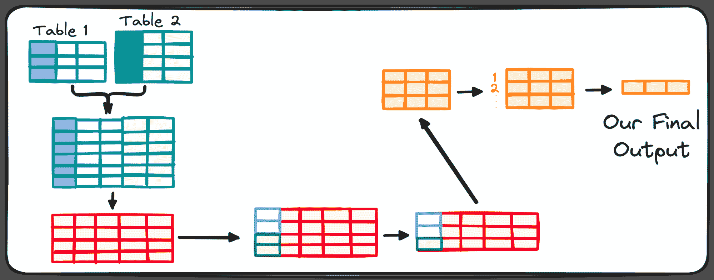
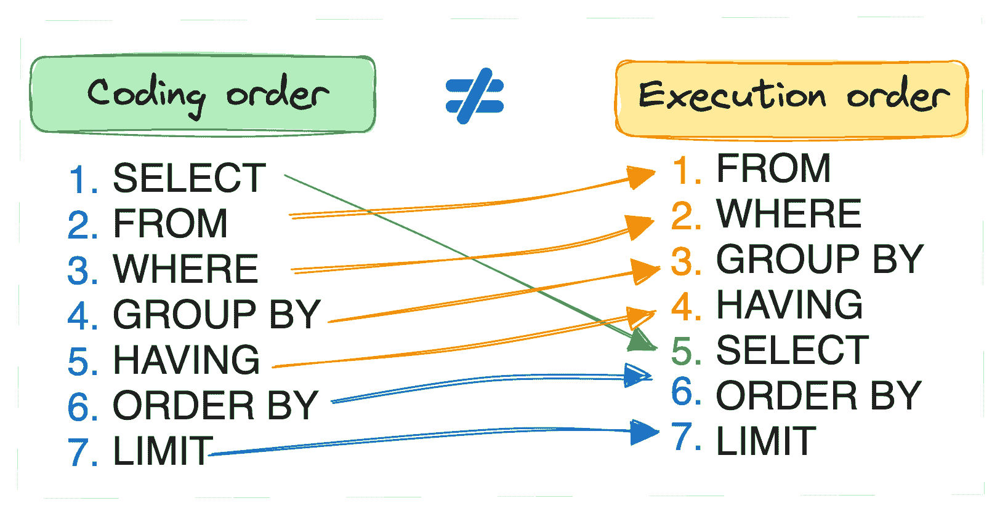
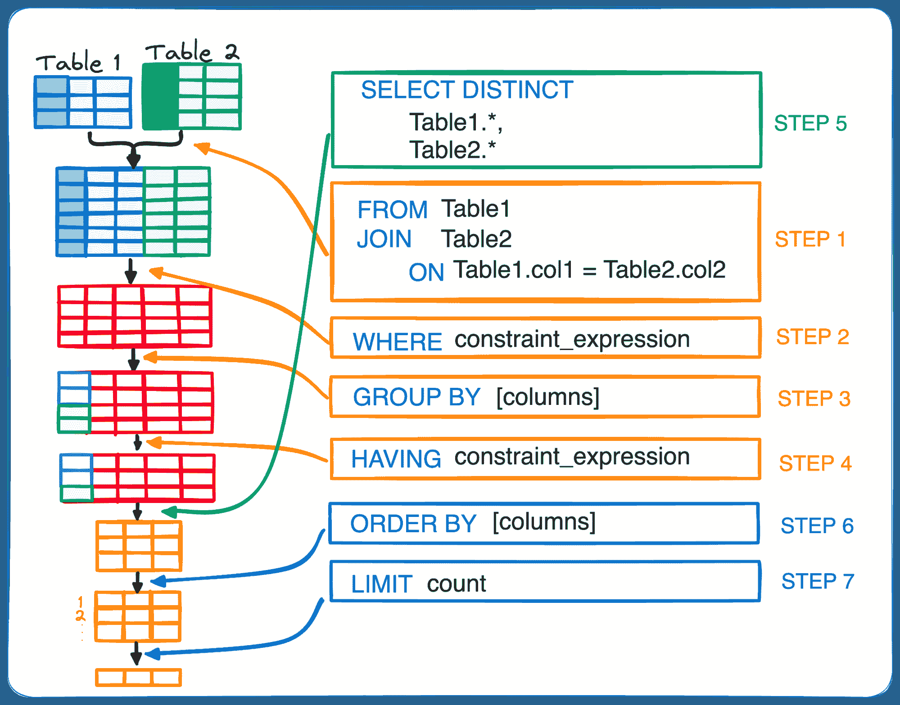
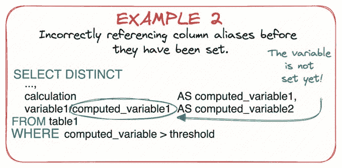

# SQL 执行顺序的基础指南

> 原文：[`www.kdnuggets.com/the-essential-guide-to-sql-execution-order`](https://www.kdnuggets.com/the-essential-guide-to-sql-execution-order)

作者提供的图片

SQL 已成为任何数据专业人员的必备语言。

* * *

## 我们的前三大课程推荐

 1\. [谷歌网络安全证书](https://www.kdnuggets.com/google-cybersecurity) - 快速进入网络安全职业生涯。

 2\. [谷歌数据分析专业证书](https://www.kdnuggets.com/google-data-analytics) - 提升您的数据分析水平

 3\. [谷歌 IT 支持专业证书](https://www.kdnuggets.com/google-itsupport) - 支持组织的 IT 需求

* * *

我们中的大多数人在日常工作中使用 SQL，经过多次编写查询后，我们都会形成自己的风格和习惯，无论好坏。

SQL 通常通过使用来学习，而且在大多数情况下，人们通常不了解其背后的逻辑。

这就是为什么今天我们要深入探讨 SQL 执行顺序的迷人世界，其中事件的顺序有时可能像谜题一样。

因此，让我们通过关注最常见的 SQL 查询结构来进一步完善我们的理解。

# SQL 作为一种声明性语言

首先要了解的是 SQL 是一种声明性编程语言，这意味着我们指定期望的结果，但不指定实现它所需的步骤。

这与过程性语言相反，过程性语言定义了实现期望输出所需执行的每一步。

但这意味着什么呢？

这意味着 SQL 需要以特定的语法编写命令。然而，我们编写这些命令的顺序与 SQL 处理它们的顺序并不一致。

通常，查询的展开结构如下：

作者提供的图片

即使一个人按照之前的结构阅读和编写代码，但在考虑这些代码如何执行时，顺序会完全改变。

作者提供的图片

例如，尽管 SELECT 子句写在第一行，但它的计算直到几乎最后才会进行。

# 执行顺序的可视化表示

为了进一步理解这个执行顺序，让我们逐步探讨 SQL 对每条命令的处理。

作者提供的图片

## 第一步 - FROM 和 JOIN

SQL 查询的旅程始于 FROM 子句，它指向数据的来源。虽然简单查询可能只涉及一个表，但我们所需的数据通常分布在多个表中。

这时，JOIN 命令与 FROM 一起，介入数据的合并工作。

这一配对总是引领开场，通过明确数据的角色来设定查询的基础。

## 第 2 步 - WHERE

在初步选择后，WHERE 子句成为焦点。

它的主要作用是筛选基础表或连接操作后的合并结果，确保只保留满足特定条件的行。

## 第 3 步 - GROUP BY

GROUP BY 子句介入以组织数据，将其按一个或多个列中的值分组。这使我们能够执行聚合或汇总。

把它看作数据的指挥家，将众多变量减少为每个唯一元素或元素组合的单一值。

这个子句是数据聚合的核心命令，为使用如 COUNT()、SUM()、MIN() 和 MAX() 等函数进行汇总表演奠定了基础。

## 第 4 步 - HAVING

HAVING 子句作为筛选器，去除那些未能满足设定标准的分组。

想象它作为一个守门员，确保只有符合我们聚合条件的分组被允许继续。它在 GROUP BY 子句完成后介入，使我们能够对现在的聚合数据应用过滤器。

在这一点上，数据库已经知道计算后的聚合结果，这意味着我们可以在后续的语句中使用这些聚合值。

解决 WHERE 子句为何不能调用聚合变量而 HAVING 子句可以的问题：

这是因为 WHERE 在 GROUP BY 子句之前出现，那时单个数据点尚未被编组。而 HAVING 则在 GROUP BY 已经计算完成后进行。

## 第 5 步 - SELECT

SELECT 子句定义了我们希望在表中保留的列，以及在执行过程中计算出的任何分组或聚合字段。

在这里，我们可以使用 AS 运算符应用列别名。

SELECT 命令通常与 DISTINCT 一起使用，这样可以丢弃所有标记为 DISTINCT 的列中具有重复值的行。

## 第 6 步 - ORDER BY

在基础任务完成后，ORDER BY 子句介入，安排值的排序展示，按升序 (ASC) 或降序 (DESC) 排列。

想象这作为查询的最终阶段。

我们从源表中收集了数据，通过过滤器进行精炼，创建了有意义的分组和汇总，并确定了在最终输出中展示的列。

## 第 7 步 - LIMIT

最后，LIMIT 子句帮助定义我们希望返回的行数。

在处理大型表格时尤其有用，特别是在开发和测试阶段。

# 为什么这很重要？

理解 SQL 的执行顺序一开始可能显得微不足道，特别是当查询结果正确时。

如果引擎运行良好，为什么要过分纠结于机制呢？

然而，对于那些深入复杂查询的研究者来说，了解这种顺序不仅有用——而且至关重要。

没有这种洞察力，故障排除就会变成一片混乱，错误像四处潜伏的陷阱。为了熟练调试和更顺利地编写查询，掌握 SQL 如何处理其子句至关重要。两个常见的错误是：

## 错误 1

SQL 中的一个常见陷阱是尝试使用 WHERE 子句来过滤聚合数据，这是一个会导致错误的误步骤。

图片由作者提供

正如我们在本文中所见，WHERE 子句是在 GROUP BY 子句之前计算的，因此，我们不能在 WHERE 步骤中使用聚合值。

## 错误 2

引用尚未设置的聚合值的列别名。在这种情况下，我们不能使用在同一 SELECT 中定义的别名，因为计算阶段是相同的。

因此，SQL 目前还不知晓这个新别名。

图片由作者提供

# 最终结论

理解 SQL 的执行顺序对数据专业人士编写有效、高效的查询至关重要。

这种洞察力使我们能够预测查询行为，特别是在复杂数据集的情况下。

精通 SQL 不仅涉及语法，还需要掌握其逻辑以进行战略性数据操作。

我们一起经历的旅程，从 FROM 子句到 LIMIT，是处理数据和将信息塑造成特定需求的战略蓝图。

希望下次你编写 SQL 代码时，能记住这一执行顺序！

****[Josep Ferrer](https://www.linkedin.com/in/josep-ferrer-sanchez)**** 是一位来自巴塞罗那的分析工程师。他毕业于物理工程专业，目前从事应用于人类流动性的数据显示科学工作。他还是一名兼职内容创作者，专注于数据科学和技术。Josep 涵盖了 AI 领域的所有内容，关注领域中的持续爆炸性应用。

### 更多相关内容

+   [跟踪和可视化 Python 代码执行的 3 个工具](https://www.kdnuggets.com/2021/12/3-tools-track-visualize-execution-python-code.html)

+   [KDnuggets™ 新闻 22:n01, 1 月 5 日: 3 个工具跟踪和可视化…](https://www.kdnuggets.com/2022/n01.html)

+   [数据科学的 10 个基本 SQL 命令](https://www.kdnuggets.com/2022/10/10-essential-sql-commands-data-science.html)

+   [提升你的数据科学技能：你需要的核心 SQL 认证](https://www.kdnuggets.com/boost-your-data-science-skills-the-essential-sql-certifications-you-need)

+   [基础机器学习算法：初学者指南](https://www.kdnuggets.com/2021/05/essential-machine-learning-algorithms-beginners.html)

+   [数据科学家的探索性数据分析必备指南](https://www.kdnuggets.com/2023/06/data-scientist-essential-guide-exploratory-data-analysis.html)
