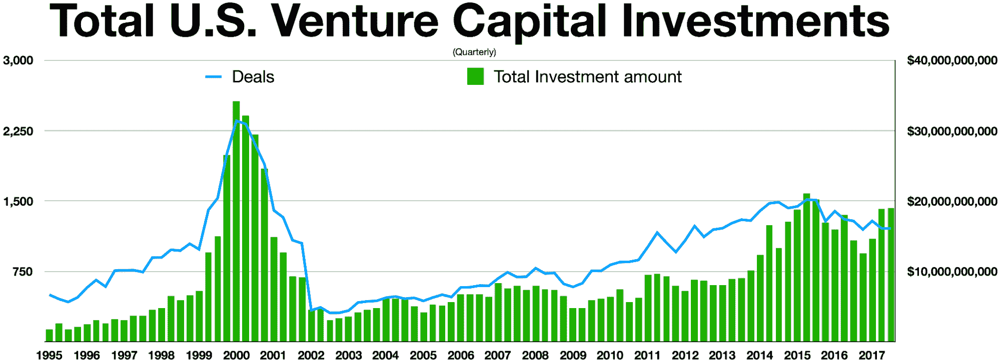

# 生成式 AI 泡沫即将破裂

> 原文：[`www.kdnuggets.com/the-generative-ai-bubble-will-burst-soon`](https://www.kdnuggets.com/the-generative-ai-bubble-will-burst-soon)

作者提供的图像

生成式 AI 革命引起了科技界的想象。ChatGPT 和类似工具似乎预示着一个新的可能性时代，在这个时代里，AI 可以按需生成内容、艺术，甚至编程代码。风险资本大量涌入生成式初创公司，总融资额达数千亿美元。但在兴奋之中，有些人开始质疑——这是一个即将破裂的泡沫吗？

这个模式似乎很熟悉。一项热门的新技术出现，并立即被视为改变世界和变革性的。大量资本涌入，估值飙升，炒作压倒了理性分析。这就是 90 年代末的互联网泡沫，当时没有收入或商业模型的互联网初创公司达到了令人眩晕的市值。结果在 2000 年一切崩溃了。

# 什么是互联网泡沫？

互联网泡沫，也称为 Dot-com 泡沫，是指在 1990 年代末期，对互联网公司进行过度投机和投资的时期。这种经济狂热源于对互联网变革潜力的信念。然而，泡沫最终破裂，导致股价崩溃和许多初创公司的倒闭。

许多互联网公司建立在脆弱的商业模型上。它们缺乏稳定的收入来源或盈利能力，严重依赖投资者资金。重点通常放在抢占市场份额和用户增长上，而不是产生利润。

随着互联网公司努力实现盈利，现实逐渐显现。最初的兴奋和乐观开始消退，因为越来越明显的是，这些公司在长期内并不可持续。投资者开始质疑这些企业的可行性。

互联网泡沫在 2000 年代初期破裂。股价经历了显著下跌，导致大量互联网公司破产。到 2000 年 10 月，曾在 3 月达到峰值的 NASDAQ 指数下跌了 76.81%。像思科、英特尔和甲骨文等大公司失去了超过 80% 的股值 - [互联网泡沫 - 维基百科](https://en.wikipedia.org/wiki/Dot-com_bubble).

来源于 [维基百科](https://en.wikipedia.org/wiki/Dot-com_bubble)

# 生成式 AI 泡沫将如何破裂

生成式 AI 的快速增长和炒作具备了经济泡沫的所有特征。生成式 AI 模型如 DALL-E 2 和 GPT-4 捕获了公众的想象，并吸引了数十亿美元的投资。但这种热情可能证明难以持久。

像所有泡沫一样，生成型 AI 热潮建立在对未来能力的投机预期之上。投资者在押注这些技术将继续快速进步并找到有利可图的实际应用。然而，这些预期可能会超前于现实。

一些因素可能会戳破泡沫。其一是当今生成型 AI 的局限性。虽然这些模型令人印象深刻，但它们仍然生成低质量的输出，无法满足许多任务的可靠性要求。而且，训练越来越大的模型需要指数级增加的数据和计算能力，这引发了关于可扩展性的疑问。

随着炒作与现实的碰撞，生成型初创企业的估值可能被证明是不切实际的。由于未达成里程碑、缺乏利润和新颖性丧失，资金可能会枯竭。一旦增长停滞，股票价格很可能会暴跌。

过去的经验表明，热门新技术往往经历炒作周期，然后才会展现出真正的能力。虽然生成型 AI 具有前景，但投资者应当警惕非理性繁荣。可持续的价值需要将能力与适当的应用场景相匹配，而不是将其视为万灵药。

# 关于生成型 AI 泡沫的担忧

鉴于需要克服的多个问题，AI 泡沫的担忧可能会持续存在。尽管已经有大量公司利用了这一技术，但生成型 AI 的大规模采用仍处于相对初期阶段。随着更多公司采用生成型 AI，这些担忧可能会加剧。如果确实发生了 AI 泡沫，那将是由于以下原因。

## 采用放缓

已经有迹象显示生成型 AI 的采用在放缓。人们开始倾向于欣赏人类的创作工作，而不是仅仅依赖 AI 生成的内容。这种对人类创意的偏好可能会阻碍生成型 AI 的增长和广泛采用。

## 资本要求

许多 AI 领域的初创公司依赖 API 调用和预训练模型，因为训练自己模型的资本要求很高。这种资本不足可能会限制生成型 AI 领域初创公司的增长和创新。

## 经济因素

预测将要发生的全球经济衰退可能会对 AI 行业产生重大影响。投资者可能会变得更加谨慎，开始从市场上撤资，从而导致对 AI 初创公司的资金减少。

## 法律和伦理问题

生成型 AI 引发了关于其生成内容的所有权和控制的法律和知识产权问题。还有对 AI 系统训练数据带来的伦理和偏见问题的担忧。这些问题可能导致对生成型 AI 的监管增加，限制其使用，从而使企业创新变得更加困难。

# 结论

生成型 AI 行业的未来仍然不确定，关于生成型 AI 泡沫可能破裂的担忧也在增加。虽然很难预测何时会发生这种情况，但许多人正急切等待其结果。

生成式 AI 的主要问题之一是所需的高投入和技术的可复制性。这些因素导致了对行业可持续性和长期成功的 uncertainty。

为了减轻生成式 AI 泡沫的风险和潜在崩溃，关键在于将重点从创建华丽的产品演示转移到构建实际的商业用例。这种方法需要时间和精力来开发和实施，但它有助于确保行业的稳定和增长。

****[Abid Ali Awan](https://www.polywork.com/kingabzpro)**** ([@1abidaliawan](https://www.linkedin.com/in/1abidaliawan)) 是一位认证的数据科学专业人士，喜欢构建机器学习模型。目前，他专注于内容创作和撰写有关机器学习和数据科学技术的技术博客。Abid 拥有技术管理硕士学位和电信工程学士学位。他的愿景是利用图神经网络为正在与心理健康问题斗争的学生打造一个 AI 产品。

### 更多相关主题

+   [数据科学是否是一个即将破裂的泡沫？](https://www.kdnuggets.com/is-data-science-a-bubble-waiting-to-burst)

+   [从 Dot com 到 Dot AI：新的科技泡沫？](https://www.kdnuggets.com/dot-com-to-dot-ai-new-tech-bubble)

+   [ChatGPT、GPT-4 和更多生成式 AI 新闻](https://www.kdnuggets.com/2023/02/chatgpt-gpt4-generative-ai-news.html)

+   [在生成式 AI 时代，数据科学家还需要吗？](https://www.kdnuggets.com/2023/06/data-scientists-still-needed-age-generative-ai.html)

+   [合成数据平台：释放生成式 AI 的力量…](https://www.kdnuggets.com/2023/07/synthetic-data-platforms-unlocking-power-generative-ai-structured-data.html)

+   [摆脱 Google：生成式 AI 学习路径](https://www.kdnuggets.com/2023/07/free-google-generative-ai-learning-path.html)
