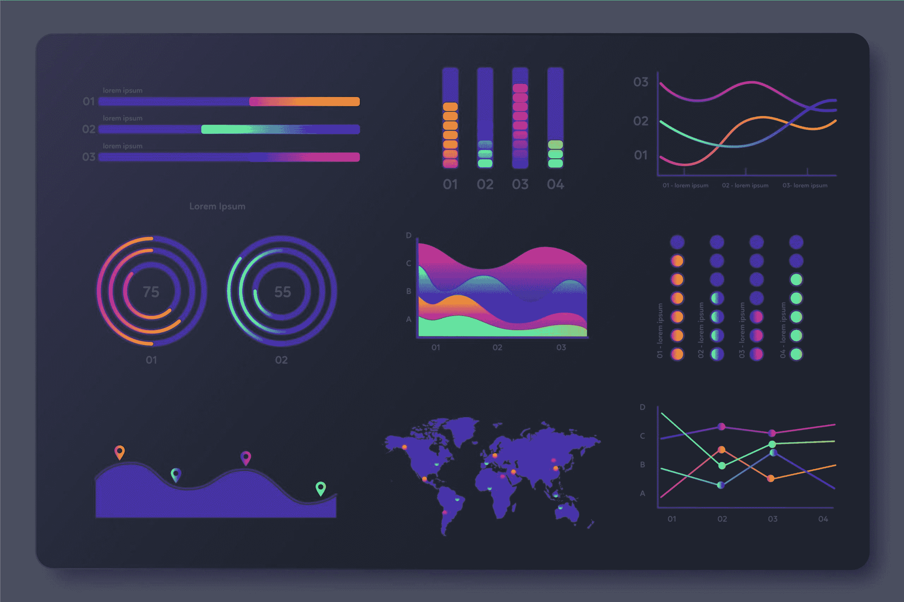

# 数据可视化的心理学：如何展示能说服人的数据

> 原文：[`www.kdnuggets.com/the-psychology-of-data-visualization-how-to-present-data-that-persuades`](https://www.kdnuggets.com/the-psychology-of-data-visualization-how-to-present-data-that-persuades)

图片来源于 [pikisuperstar](https://www.freepik.com/free-vector/gradient-infographic-dashboard-elements-pack_13792868.htm#fromView=search&page=1&position=32&uuid=f26e78e4-84a0-4a9c-9b08-78581ad0c6ef) 在 Freepik

我们都已经深刻意识到数据及其分析给各种企业和组织带来的强大力量。然而，展示方式也很重要——没有简单易懂、引人入胜的方式传达信息，我们的分析能力也无济于事。

* * *

## 我们的前三名课程推荐

 1\. [谷歌网络安全证书](https://www.kdnuggets.com/google-cybersecurity) - 快速进入网络安全职业生涯。

 2\. [谷歌数据分析专业证书](https://www.kdnuggets.com/google-data-analytics) - 提升你的数据分析技能

 3\. [谷歌 IT 支持专业证书](https://www.kdnuggets.com/google-itsupport) - 支持你的组织的 IT

* * *

数据可视化登场了。通过利用所有感官中最直接和最主导的一个，复杂和精细的数据点可以被浓缩成一种每个参与者都可以直观理解的可操作格式。

因此，通过视觉表现有效沟通洞察力和想法的能力变得越来越重要。有效的可视化可以切穿噪音，突出模式和关系，并引导观众的注意力到最关键的洞察力上。

本文讨论了支撑创建有说服力和有效的数据可视化的心理学原理和技术。

# 视觉处理的心理学

数据可视化中的视觉处理心理学是一个深具吸引力的领域，交叉心理学、神经科学和设计原则。它关注于人类如何解读、理解和回应视觉数据展示。它突显了我们视觉系统相比其他数据处理形式的惊人效率。

人脑处理视觉信息的速度极快。实际上，研究表明，它可以在[13 毫秒内](https://news.mit.edu/2014/in-the-blink-of-an-eye-0116)理解形状、颜色和方向。这种速度使得视觉数据比文本信息更为即时和有影响力。

因此，仅仅使用图表往往不能充分体现你的努力。例如，与之前的表现相比，即使是简单的图表，加上百分比变化和数字，也比简单、乏味的陈述更能解释[你的云成本优化努力](https://cast.ai/cloud-cost-optimization/)如何为组织带来回报。

此外，[双重加工理论解释了](https://conceptually.org/concepts/dual-processing-theory)我们有两种思维方式：快速、本能的（系统 1）和慢速、分析的（系统 2）。可视化利用系统 1，让我们能够快速理解复杂信息，而无需进行更深层次、较慢的分析。

我们使用颜色、形状和位置的方式会影响人们记住和根据可视化做出决策的能力。了解视觉元素如何影响感知和记忆有助于创建更有效的视觉效果。

创建有效的数据可视化意味着利用人类天生的视觉处理能力，以一种立即可理解和难以忘怀的方式呈现复杂信息。

# 说服性数据可视化原则

创建具有说服力的数据可视化涉及到讲故事、战略数据选择和有效设计原则的融合。以下是一些关键组件的详细说明，这些组件在制作既能提供信息又能说服观众的可视化时需要考虑：

## 战略讲故事

每个有效的数据可视化都始于一个清晰、具体的目标。这意味着准确知道你希望在观众中引发什么行动或理解。从那里，围绕你的数据构建一个叙事有助于吸引观众，使信息更具相关性和吸引力。

这个叙事应有一个清晰的引言、主体和结论，每部分都建立在上一部分的基础上，引导观众达到预期的理解或行动。

## 适当的数据选择

为你的观众选择正确的数据至关重要。数据应直接与观众的兴趣或需求相关。这种量身定制的方法确保可视化能直接针对观众的关注点或好奇心，*使信息更具说服力*，[让信息更具说服力](https://flourish.studio/blog/choosing-the-right-visualisation/)。

数据选择的一个问题是它可能非常耗时。然而，你不必完全手动完成所有工作——[使用自动化文档生成工具](https://apryse.com/blog/docx-template-document-generation-using-python)可以减少所需时间，使你可以将更多精力投入到分析最具吸引力的数据点上以用于演示。此外，你还可以使用各种可视化工具——不需要为所有内容都制作手工演示。

## 设计原则

这个原则由多个组件组成，包括：

+   **对齐。** 数据展示的正确对齐，无论是垂直还是水平，都能确保信息可以准确比较和理解，而不会通过光学错觉引起混淆或误解。

+   **颜色选择。** 颜色应该[被有意识地用来突出关键数据点](https://www.storytellingwithdata.com/blog/2020/5/6/picking-the-right-colors)并引起观众对可视化中最重要部分的注意。选择对所有人都可及的颜色组合，包括那些有色觉障碍的人也很重要。

+   **标题和标签的清晰度。** 标题和标签在引导观众通过数据可视化中起着重要作用。它们应该清晰、信息丰富且简洁，提供上下文并强调可视化的关键要点。

+   **互动性。** 在适当的情况下，[将互动性融入你的可视化中](https://ourworldindata.org/redesigning-our-interactive-data-visualizations)可以增强用户体验，使数据探索更加有趣和有洞察力。然而，重要的是这个功能应该提升而不是复杂化对数据的理解。

# 说服性数据可视化的最佳实践

为了创建有说服力的数据可视化，遵循最佳实践是至关重要的，这能使你的数据清晰、引人入胜且易于理解。以下是一些建议：

+   **选择合适的可视化工具。** 选择合适的工具至关重要。像 ChartExpo、Power BI 和 Looker Studio 这样的选项因其易用性和在创建清晰图表方面的有效性而受到赞扬，即使是非技术观众也能轻松使用。

+   **策略性使用颜色。** 颜色可以显著地[影响信息的处理方式](https://www.forbes.com/sites/princeghuman/2023/03/28/how-the-neuroscience-of-color-impacts-consumer-behavior/#:~:text=Studies%20have%20shown%20that%20color,to%20enhance%20memory%20and%20learning.)和记忆。使用对比色来突出关键见解，并确保你的颜色选择对[色盲人士友好](https://www.boia.org/blog/what-is-color-blindness-accessibility)。避免在单一图表中使用过多的颜色以保持清晰度。

+   **突出关键见解。** 确保引起对数据中最重要部分的注意。这可以包括使用视觉提示如参考线，或简单地突出条形图中的重要条形。

+   **寻找商业洞察。** 将数据可视化与高层次的商业目标对齐，确保你的可视化不仅具有信息性，而且具有可操作性。利用数据预测趋势并做出明智的决策。

+   **选择正确的图表类型。** 图表的选择对于清晰性和有效性至关重要。条形图、折线图、散点图、饼图等具有特定用途，使它们[更适合某些类型的数据](https://blog.hubspot.com/marketing/types-of-graphs-for-data-visualization)。例如，条形图非常适合比较类别数据，而折线图则适合展示随时间变化的趋势。

+   **确保上下文和理解**。数据可视化不仅要以吸引人的方式展示数字，还要传达一个易于理解的清晰信息。这包括使用有吸引力的标题，确保比例缩放准确，并清晰标注标签和图例。

+   **针对特定目的使用不同的图表类型**。不同的图表满足不同的分析需求，例如气泡图用于在散点图中添加额外维度，瀑布图用于可视化顺序变化。饼图、堆叠图和桑基图等组成图表可以阐明数据的结构及其随时间的变化。

# 数据可视化的好处

主要的优势之一是简化复杂的数据。数据可视化将大量的信息转化为更易于处理和理解的格式，使用户能够快速高效地掌握复杂的概念。这在需要快速决策的环境中尤为重要。

数据可视化还增强了讲故事的能力。它允许企业以引人注目的方式展示他们的故事，使沟通利益相关者、培训团队或吸引客户变得更加容易。这种方法对于呈现想法和策略非常有效，例如提出整合新技术或流程以提高部门效率。

此外，它提高了生产力，通过提供即时见解，帮助快速行动，减少因数据误解而导致的延迟。通过使数据更易于消化，团队可以专注于可操作项和改进，而不是花时间理解复杂的数据集。

风险管理是数据可视化发挥重要作用的另一个领域。它帮助组织更好地理解和应对涉及不确定性和风险的情况，通过可视化简化数据以突出潜在的关注领域。

有时，管理层和高管需要一点推动。我并不是在责怪谁——权威人士通常没有时间去微观管理和全神贯注于操作层面的所有细节和复杂性。举个例子，如果你知道[SAP 咨询将使你的部门受益](https://www.suretysystems.com/consulting/sap/)并且能带来更大的整合和效率，那么将这些信息一次性呈现出来，并用充满图表和图形的引人入胜的叙述比仅仅提及事实而让初步印象渐渐消退更有可能奏效。

# 结论

数据可视化提供了一种强大的方式来穿透噪音，传递真正有共鸣的见解。

然而，真正掌握具有说服力的数据可视化在于达到美学与功能之间的完美平衡。这需要对视觉设计原则、认知过程和人类行为之间的相互作用有深入的理解。

只有在达到这种平衡时，我们才能创造出不仅美丽而且清晰、深刻且有影响力的可视化。

****[Nahla Davies](http://nahlawrites.com/)****是一位软件开发人员和技术作家。在全职从事技术写作之前，她还曾担任过一家《Inc. 5000》体验品牌机构的首席程序员，该公司客户包括三星、时代华纳、Netflix 和索尼。

### 更多相关话题

+   [数据科学、数据可视化及…的前 38 个 Python 库](https://www.kdnuggets.com/2020/11/top-python-libraries-data-science-data-visualization-machine-learning.html)

+   [KDnuggets 新闻 22:n16, 4 月 20 日：学习的最佳 YouTube 频道…](https://www.kdnuggets.com/2022/n16.html)

+   [数据科学中的绘图和数据可视化](https://www.kdnuggets.com/2022/06/plotting-data-visualization-data-science.html)

+   [SQL 用于数据可视化：如何为图表和图形准备数据](https://www.kdnuggets.com/sql-for-data-visualization-how-to-prepare-data-for-charts-and-graphs)

+   [使用 Seaborn 进行 Python 数据可视化](https://www.kdnuggets.com/2022/04/data-visualization-python-seaborn.html)

+   [讲述一个出色的数据故事：可视化决策树](https://www.kdnuggets.com/2021/02/telling-great-data-story-visualization-decision-tree.html)
