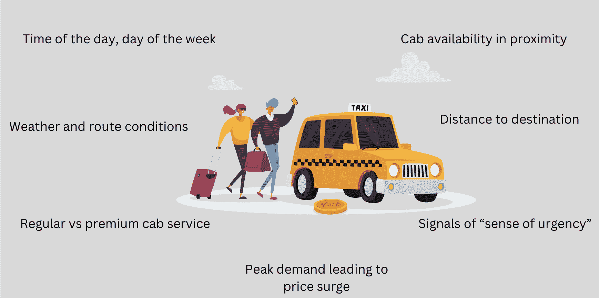

# 终极 AI 战略手册

> 原文：[`www.kdnuggets.com/the-ultimate-ai-strategy-playbook`](https://www.kdnuggets.com/the-ultimate-ai-strategy-playbook)

 图片由作者提供

如果没有人工智能；从某种程度上讲，没有这种技术的狂热席卷了整个行业。

* * *

## 我们的前三个课程推荐

 1\. [谷歌网络安全证书](https://www.kdnuggets.com/google-cybersecurity) - 快速进入网络安全职业生涯。

 2\. [谷歌数据分析专业证书](https://www.kdnuggets.com/google-data-analytics) - 提升你的数据分析技能

 3\. [谷歌 IT 支持专业证书](https://www.kdnuggets.com/google-itsupport) - 支持组织的 IT 需求

* * *

对于一个唯一核心关注点是通过利用技术推动业务增长的商业领袖，最初的思考是客户——我们服务的是谁？我们的受众是谁？他们希望/期望我们提供什么？

而第二个立即想到的是——他们的痛点。他们需要什么而没有人，甚至竞争对手也没有提供？

## 以客户为中心的商业战略

在这一点上，问题系列开始出现，一旦解决，将使业务成功。

+   什么让客户的生活更轻松？

+   什么才是给他们带来无缝体验的因素？

+   他们未被满足的需求是什么？

因此，开始探索达成目标的途径，也就是技术。

值得注意的是，我们还没有讨论人工智能。列出商业战略、杠杆和特权是决定“解决什么”和“为谁解决”最关键且**终极**重要的一步。

之后，出现了“如何解决”的问题。人工智能是否是解决这个商业问题的好方案？

在此时，企业需要一个框架来决定哪些使用案例适合人工智能。我建议使用“PRS”框架。它代表“**模式**在**规模**下**重复**”。

 图片由作者提供

## 模式

让我们以一个例子来内化这个框架：

例如，出租车服务提供商确保以具有成本效益的价格提供出租车司机的可用性，这考虑了各种因素 –

+   驾驶员可用池距离出租车请求者的接近程度

+   到达目的地的距离

+   高峰需求导致价格上涨，因为出租车请求者比出租车司机多

+   据报道，[出租车请求者手机的低电量状态](https://www.linkedin.com/pulse/hidden-charges-phone-tricks-shocking-truth-cab-pricing-ashwin-suresh-g1axc/)可能暗示着价格的上涨。这给出租车服务提供商发出了一个信号，即手机低电量可能会增加出租车请求者因紧迫感而支付更多费用的意愿。

+   出租车的可用性和定价也会因常规与高级出租车服务、一天中的时间或不利的天气条件等因素而有所不同。

图片来源：作者

在确保出租车司机获得足够激励以继续提升客户体验的同时。

所以，我们理解数据模式。

## 大规模的重复性

接下来是重复性——所有这些数据属性在每个出租车请求者和每次行程中都会重复出现，这不可避免地引出了最后一点，规模。

想象一下，如果有一个人工或非人工智能的工作流程来解决这个计算密集型的商业案例，这个问题将变得多么难以实现。

## 数据战略

在建立了商业思维模式之后，我们确定了通过人工智能解决的良好案例中的问题，让我们将所有注意力集中在数据上。毕竟，数据是推动所有人工智能算法成功的核心引擎。

我对此也有一个框架——AAA，代表可用性（Availability）、可访问性（Accessibility）和授权（Authorization）。

考虑以下：

> 我是否拥有数据？
> 
> 对比：
> 
> 我是否拥有详尽的数据？

这两种说法之间存在一个小但关键的区别。

仅仅拥有数据是不够的。还需要所有必要的数据来建模现象，以确保模型能够看到所有人类专家也能看到的属性。因此，数据的可用性是关键。

接下来是数据可访问性。拥有数据是一码事，但能够轻松访问数据则是另一回事。建立数据管道以确保无缝的数据访问是很重要的。

到目前为止，我们已经在整理数据方面取得了很多进展，但如果我们不被允许使用数据进行模型训练或分析目的呢？

这是大多数组织出现失误的地方。确保获得必要的授权，或者更好的是，仅使用您已经获得权限的数据。

有了数据战略的 3A，仍然有一个未解答的问题，即商业、数据和人工智能战略之间的顺序或顺序是什么？

## 这么多策略!!!

从大体上讲，人工智能战略始终是商业战略的一部分，并且与数据战略保持一致。在继续推进数据的 3A 的同时，务必要不断研究人工智能用例。

类似于人工智能项目的迭代性质，人工智能路线图在准备和增强数据基础设施以最大化组织内部人工智能技术潜力的过程中需要不断改进。

持续分析和跟踪关键绩效指标（KPIs），如准确性、效率和投资回报率，以定期评估 AI 项目的状态，从而衡量其效果并识别改进领域。

## 附加提示

大多数 AI 项目和策略都因为缺乏及时的沟通而受到影响。进行里程碑检查并积极征求利益相关者的反馈，包括最终用户和业务领导者，是至关重要的。所有成功的 AI 项目都经历了通过反馈进行的多个迭代周期，这些反馈用于调整和改进现有模型或开发新的使用案例。

此外，模型不仅仅是开发一次后再也不回顾。业务优先级可能随着时间的推移而改变，这必须在 AI 战略和实施中反映出来。

****[Vidhi Chugh](https://vidhi-chugh.medium.com/)** 是一位 AI 策略专家和数字化转型领袖，她在产品、科学和工程交叉领域工作，致力于构建可扩展的机器学习系统。她是一位屡获殊荣的创新领袖、作者以及国际演讲者。她的使命是使机器学习大众化，并打破术语，让每个人都能参与这一转型。**

### 更多相关话题

+   [扩展 MLOps 的操作手册](https://www.kdnuggets.com/2023/06/playbook-scale-mlops.html)

+   [现代企业数字化转型操作手册](https://www.kdnuggets.com/digital-transformation-playbook-for-modern-businesses)

+   [NLP 中不同词嵌入技术的终极指南](https://www.kdnuggets.com/2021/11/guide-word-embedding-techniques-nlp.html)

+   [Bark：终极音频生成模型](https://www.kdnuggets.com/2023/05/bark-ultimate-audio-generation-model.html)

+   [终极开源大型语言模型生态系统](https://www.kdnuggets.com/2023/05/ultimate-opensource-large-language-model-ecosystem.html)

+   [终极指南：Chat GPT 和其他缩写](https://www.kdnuggets.com/2023/06/ultimate-guide-chat-gpt-abbreviations.html)
