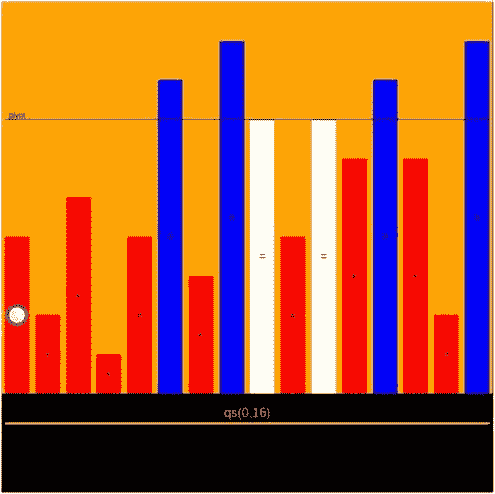

# TheWalnut.io：一种轻松创建算法可视化的方式

> 原文：[`www.kdnuggets.com/2015/07/thewalnutio-algorithm-visualizations.html`](https://www.kdnuggets.com/2015/07/thewalnutio-algorithm-visualizations.html)

**作者：** Daniel Moisset，（Machinalis.com）。

我们发布了 [TheWalnut.io](http://thewalnut.io/) 的初始版本，这是一款允许创建和分享算法可视化的 web 应用程序。我们不仅仅是制作漂亮的算法可视化画廊，而是构建一个人们可以在其中学习、讨论并以视觉方式交流代码的地方。我们在路线图中有许多有趣的功能（和 bug 修复），但我们希望发布，让你能看到我们正在做的事情。

Walnut 允许用户用 Python 或 Javascript 编写程序，并使其与用户设计的虚拟“世界”互动。这些世界定义了共享状态、可能的动作、每个程序可见的状态部分等。可以在一个世界中运行单个或多个程序，然后查看结果。然后，你可以使用简单的声明式 DSL 定义如何表示执行结果（程序所做的操作，以及世界和程序的状态）。你可以对单次运行的不同方面进行多种可视化。

以快速排序为例。有一个 [排序](https://thewalnut.io/simulations/edit_world/72/) 世界，它定义了状态为一组数字，程序可以查看这些数字并对其进行交换，目标是将其排序。然后，你可以添加许多可以在该世界中运行的程序（任何基于交换的排序算法，如 [快速排序](https://thewalnut.io/simulations/edit_agent/117/) 或 Shellsort）。你可以定义 [场景](https://thewalnut.io/simulations/edit_problem/109/) 以及初始数据（以展示平均和最坏情况，或不同的数组大小）。[可视化](https://thewalnut.io/visualizer/visualize/3279/334/) 可以将这些信息映射到显示上：可能只是移动的条形图，或者是像快速排序这样的递归算法的调用栈，或者是交换宽度随时间变化的图表：

如果你访问我们的探索部分，你将能够看到开发团队构建的一些示例作为起点。但我们的愿景是让你创建自己的可视化并分享它们。仅仅通过代码学习算法是很困难的！破解这个难题，让大家看到里面的内容！加入 Walnut 革命吧！

**简介：** Daniel Moisset [@dmoisset](https://twitter.com/dmoisset) 是一位企业家、计算机科学教师和软件开发人员。

**相关**

+   50+ 数据科学和机器学习备忘单

+   开源支持的互动分析：概述

+   21 个必备的数据可视化工具

* * *

## 我们的前三大课程推荐

 1\. [Google 网络安全证书](https://www.kdnuggets.com/google-cybersecurity) - 快速进入网络安全职业生涯

 2\. [Google 数据分析专业证书](https://www.kdnuggets.com/google-data-analytics) - 提升你的数据分析技能

 3\. [Google IT 支持专业证书](https://www.kdnuggets.com/google-itsupport) - 支持你的组织 IT 部门

* * *

### 更多相关话题

+   [使用 Pandas 制作美丽的互动可视化的最简单方法](https://www.kdnuggets.com/2021/12/easiest-way-make-beautiful-interactive-visualizations-pandas.html)

+   [选择正确机器学习算法的简单指南](https://www.kdnuggets.com/2020/05/guide-choose-right-machine-learning-algorithm.html)

+   [了解不同数据可视化的工作原理](https://www.kdnuggets.com/2022/09/datacamp-learn-different-data-visualizations-work.html)

+   [2023 年你应该了解的 10 个惊人的机器学习可视化](https://www.kdnuggets.com/2022/11/10-amazing-machine-learning-visualizations-know-2023.html)

+   [用 Python 图形画廊制作惊人的可视化](https://www.kdnuggets.com/2022/12/make-amazing-visualizations-python-graph-gallery.html)

+   [管理深度学习数据集的新方法](https://www.kdnuggets.com/2022/03/new-way-managing-deep-learning-datasets.html)
