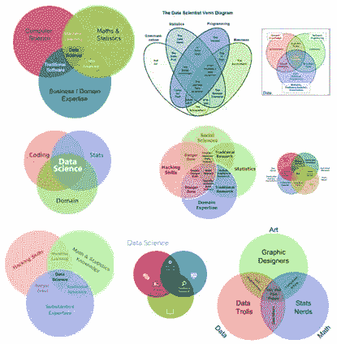
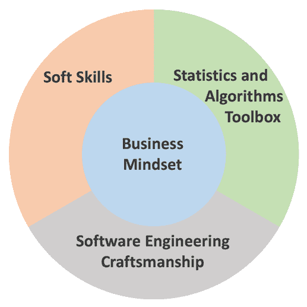

# 第三波数据科学家

> 原文：[`www.kdnuggets.com/2019/05/third-wave-data-scientist.html`](https://www.kdnuggets.com/2019/05/third-wave-data-scientist.html)

 评论

**由 [Dominik Haitz](https://twitter.com/d_haitz) 提供，IONOS**。

### 介绍

[德鲁·康威的数据科学技能集可视化](http://drewconway.com/zia/2013/3/26/the-data-science-venn-diagram) 是一个经常被引用的经典。不同的观点和角色的多样性催生了[numerous variations](http://www.prooffreader.com/2016/09/battle-of-data-science-venn-diagrams.html)：

* * *

## 我们的三大课程推荐

 1\. [谷歌网络安全证书](https://www.kdnuggets.com/google-cybersecurity) - 快速进入网络安全职业道路。

 2\. [谷歌数据分析专业证书](https://www.kdnuggets.com/google-data-analytics) - 提升你的数据分析技能

 3\. [谷歌 IT 支持专业证书](https://www.kdnuggets.com/google-itsupport) - 支持你的组织的 IT

* * *

**各种数据科学维恩图。图片来源于谷歌图片。来源：[`sinews.siam.org/Details-Page/a-timely-focus-on-data-science`](https://sinews.siam.org/Details-Page/a-timely-focus-on-data-science)**

关于数据科学技能集似乎没有共识。此外，随着领域的发展，缺陷变得明显，新挑战不断出现。我们如何描述这种演变？

**第一波数据科学家**发生在数据尚未大规模和数据科学尚未成为实际存在之前（2010 年之前）：统计学家和分析师，他们一直存在，做着很多现代数据科学家在做的事情，但伴随的炒作较少。

**第二波**：大规模数据收集创造了对聪明人才的需求，他们能够将大数据转化为大钱。公司仍在摸索应聘人员的类型，往往转向科学专业毕业生。虽然第二波数据科学家做了很多正确的事，但他们精心制作的模型通常只是概念验证，并未带来实际的改变。

现在，在 2010 年代末，随着对深度学习和人工智能的炒作，进入了**第三波数据科学家**：进行实验和创新，效率地寻找商业价值，并弥合部署差距以创建出色的数据产品。在这里需要哪些技能？

**第三波数据科学家的技能组合。**

### 1\. 商业思维

商业思维是数据科学技能组合的核心，因为它设定目标并运用其他技能来实现这些目标。Patrick McKenzie 在这篇[博客文章](https://www.kalzumeus.com/2011/10/28/dont-call-yourself-a-programmer/)中指出：

> ***工程师被聘用是为了创造商业价值，而不是编程***：企业总是因为非理性和政治原因做事，但主要还是集中在增加收入或降低成本上。

同样，**数据科学家被聘用是为了创造商业价值**，而不仅仅是构建模型。问问自己：**我的工作成果将如何影响公司决策？**我需要做什么来最大化这一效果？凭借这种企业家精神，第三波数据科学家不仅提供**可操作的见解**，还寻求实现**真正的变化**。

**关注组织中的资金流向**——拥有最大成本或收入的部门可能会提供最大的财务杠杆。然而，商业价值是一个模糊的概念：它超越了当前财政年度的成本和收入。**实验**和**创建创新的数据文化**将提高公司的长期竞争力。

**优先处理**你的工作和**知道何时停止**是**效率**的关键。想想递减收益：花费数周时间来调整模型以提高 0.2%的精度是否值得？通常，***足够好***才是真正的完美**。

**领域专长**，这是 Conway 技能组合的三分之一，绝对不能被忽视——然而，你几乎在所有地方都必须**在工作中学习**。这包括对你所在行业以及公司流程、命名方案和特殊情况的了解。这些知识不仅为你的工作设定了框架条件，而且通常对于理解和解释你的数据是不可或缺的。

#### 保持简单，傻瓜

https://twitter.com/matvelloso/status/1001899539484192768

**寻找容易实现的目标和快速胜利**。对现有数据仓库进行一个简单的 SQL 查询可能会发现产品经理或高层管理人员未知的宝贵见解。**不要陷入“流行词驱动的数据科学”**的陷阱，专注于最先进的深度学习，而一个简单的回归模型就足够了——而且构建、实施和维护的工作量要少得多。**了解复杂的事物，但不要使事情过于复杂。**

### 2. 软件工程工艺

对（第二波）数据科学家只需“黑客技能”而不是适当的软件工程的观点已被[多次](https://docs.google.com/presentation/d/1n2RlMdmv1p25Xy5thJUhkKGvjtV-dkAIsUXP-AL4ffI/edit#slide=id.g39421ce1fe_0_3)[批评](http://nadbordrozd.github.io/blog/2017/12/05/what-they-dont-tell-you-about-data-science-1/)。缺乏可读性、模块化或版本控制阻碍了协作、可重复性和生产化。

相反，**向专业的软件工程师学习工艺**。测试你的代码并使用版本控制。遵循既定的编码风格（例如 PEP8）并学习如何使用 IDE（例如 PyCharm）。尝试对编程进行配对。模块化和文档化你的代码，使用有意义的变量名称并进行重构，重构，重构。

弥合敏捷原型数据产品的部署差距：学习使用日志记录和监控工具。知道如何构建 REST API（例如使用 Flask）以将结果提供给他人。学习如何将工作打包到 Docker 容器中，或将其部署到像 Heroku 这样的平台上。**不要让你的模型在笔记本电脑上腐烂，而是将其包装成适合你公司 IT 环境的数据驱动服务。**

### 3\. 统计学和算法工具箱

数据科学家必须彻底理解**统计学基础概念**和特别是**机器学习**（STEM 大学教育可能是获得这种基础的最佳途径）。关于重要内容有很多资源，所以我不会在这里进一步探讨。你常常需要向客户解释算法或概念，如统计不确定性，或者因为混淆相关性和因果关系而标记出问题。

### 4\. 软技能

由于人际交往技能对生产力的重要性与技术技能相当，第三波数据科学家在这些领域上会有意识地努力提高。

#### 与他人合作良好

**咨询你的同事**——大多数人乐于帮助或提供建议。**平等对待他人**：你可能有一个很好的学位和对复杂算法的理解，但其他人拥有你没有的经验（这听起来像基本的社交建议，但谁没遇到过傲慢的 IT 专业人士呢？）。

#### 理解你的客户

**问对后续问题**。如果客户或你的老板希望你计算一些关键数据或创建一些图表，问“为什么？目的是什么？你想达成什么？根据结果你会采取什么行动？”以**更好地理解问题的核心**。然后一起找出如何达到目标——是否有比提出的更**好的方法来实现目标**？

#### 处理公司政治

**建立网络**，不是因为你期望他人在你的职业生涯中帮助你，而是因为你是一个容易接近的人。**与有类似工作主题的人建立联系**。如果公司内没有这样的平台，自己创建。**识别关键利益相关者**，并找出**如何帮助他们**解决问题。及早邀请他人，并使他们成为**变革过程的一部分**。记住：**公司不是一个理性的实体**，而是由经常不理性的个体组成。

#### 传达你的结果

提升你的**可视化和演示技巧**。从**客户的角度**进行沟通：我如何才能准确回答他们的问题？学会**在不同层次上沟通**并总结你的工作细节。人们很容易被华丽的多维图表所吸引，但通常**简单的柱状图**更能**有效传达信息**。**展示你的成果**：当人们看到你正在做的工作并且发现你做得很好，他们会**信任**你。

#### 自我评估

**沟通你的目标**和问题，并**积极寻求建议**。在数据科学社区内外寻找**榜样**，并向他们学习。

[原文](https://towardsdatascience.com/the-third-wave-data-scientist-1421df7433c9)。经许可转载。

**个人简介**：[多米尼克·海茨](https://twitter.com/d_haitz)是数据科学家[@ionos_de](https://twitter.com/ionos_de)，同时也是博客作者，[`towardsdatascience.com/@d_haitz`](http://towardsdatascience.com/@d_haitz)。

**资源：**

+   [在线和基于网页的：分析、数据挖掘、数据科学、机器学习教育](https://www.kdnuggets.com/education/online.html)

+   [分析、数据科学、数据挖掘和机器学习的软件](https://www.kdnuggets.com/software/index.html)

**相关：**

+   [数据科学中最受欢迎的技能](https://www.kdnuggets.com/2019/04/most-desired-skill-data-science.html)

+   [2019 年典型的数据科学家是谁？](https://www.kdnuggets.com/2019/03/typical-data-scientist-2019.html)

+   [数据科学家与数据工程师的区别](https://www.kdnuggets.com/2019/03/odsc-difference-data-scientists-data-engineers.html)

### 更多相关内容

+   [成为伟大的数据科学家所需的 5 项关键技能](https://www.kdnuggets.com/2021/12/5-key-skills-needed-become-great-data-scientist.html)

+   [每个初学者数据科学家应该掌握的 6 种预测模型](https://www.kdnuggets.com/2021/12/6-predictive-models-every-beginner-data-scientist-master.html)

+   [2021 年最佳 ETL 工具](https://www.kdnuggets.com/2021/12/mozart-best-etl-tools-2021.html)

+   [成功数据科学家的 5 个特征](https://www.kdnuggets.com/2021/12/5-characteristics-successful-data-scientist.html)

+   [每个数据科学家都应该知道的三个 R 库（即使你使用 Python）](https://www.kdnuggets.com/2021/12/three-r-libraries-every-data-scientist-know-even-python.html)

+   [停止学习数据科学以寻找目的，寻找目的去……](https://www.kdnuggets.com/2021/12/stop-learning-data-science-find-purpose.html)
