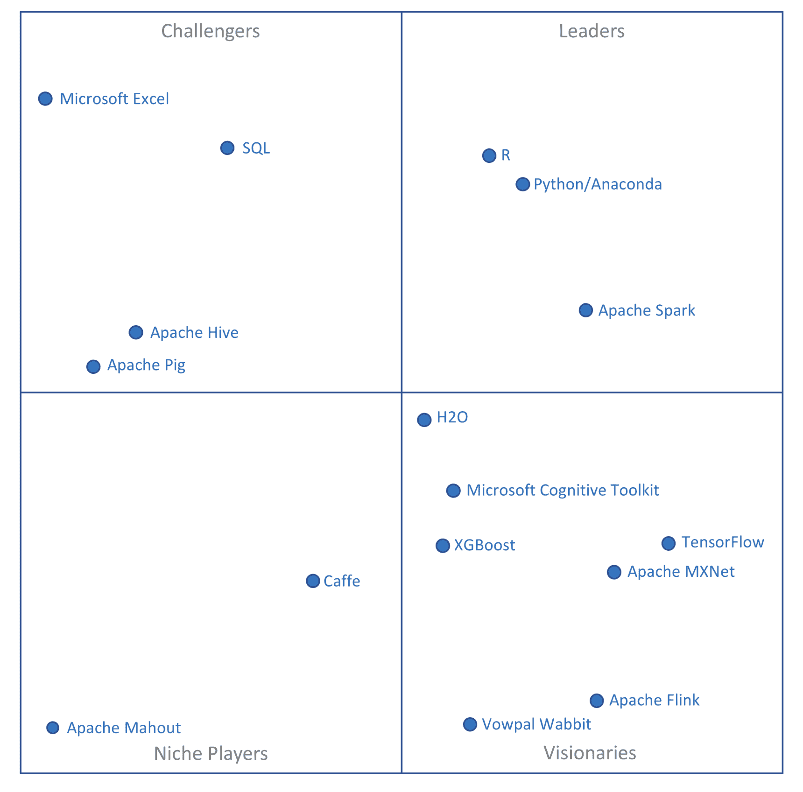

# Gartner 数据科学平台 – 更深层的分析

> 原文：[`www.kdnuggets.com/2017/03/thomaswdinsmore-gartner-data-science-platforms.html`](https://www.kdnuggets.com/2017/03/thomaswdinsmore-gartner-data-science-platforms.html)

评论

**由 [Thomas Dinsmore](https://thomaswdinsmore.com/about/) 提供，分析与机器学习顾问**。

Gartner 最近发布了 2017 年数据科学平台的魔力象限。如果你是客户，可以直接从 [Gartner](https://www.gartner.com/doc/3606026?ref=unauthreader&srcId=1-4730952011) 获取一份，或者你可以从 [这里](https://www.gartner.com/doc/reprints?id=1-3TK9NW2&ct=170215&st=sb) 免费获得一份，由 SAS 提供。

下图展示了 2016 年和 2017 年的 MQ，并用红色标记了变化。

[这里](https://thomaswdinsmore.com/2016/02/22/gartners-2016-mq-for-advanced-analytics-platforms/)是我去年写的关于 2016 年 MQ 的评论。

这里是 Gregory Piatetsky 的分析。

这里有关于 2017 年版本的 9 个观察点：

#### (1) 五个供应商被淘汰。

Gartner 对五个较弱的玩家下手了。

— **Accenture** 去年进入了分析榜单，根据 Gartner 的说法，因为它收购了总部位于米兰的 i4C Analytics，这是一家小型米兰公司。Accenture [重新品牌化](https://web.archive.org/web/20141220095702/http://www.accenture.com/us-en/Pages/service-analytics-applications-platform.aspx) 了该软件为 Accenture Analytics Applications Platform。然而，Accenture 似乎将软件与捆绑咨询服务一起免费提供，因为它[报告](http://services.corporate-ir.net/SEC.Enhanced/SecCapsule.aspx?c=129731&fid=10461015)称没有来自软件许可的收入。

— **Lavastorm** 是一个 ETL 和数据混合工具，不[声明](http://www.lavastorm.com/comparison-table/)提供原生预测分析，因此它在去年的 MQ 中的存在一直是个谜。

— **Megaputer** 是一家文本挖掘供应商，尽管其边缘化程度很高，甚至在 [Crunchbase](https://www.crunchbase.com/#/home/index) 上没有记录，但它连续两年进入了 MQ。去年，Gartner 指出“Megaputer 在可行性和知名度方面得分较低，并且在高级分析市场中，除了文本分析外对公司的认知不足。”这就引出了一个问题：它们为什么会被最初包括在内？

— **Prognoz** 连续两年出现在 MQ 中，和 Megaputer 一样，引发了业内人士的 WTF 反应。Prognoz 主要是一个 BI 工具，包含一些时间序列和分析功能，但缺乏 Gartner 认为最低要求的预测分析能力。它似乎也在莫斯科以西缺乏客户。

— **Predixion Software** 被 [Greenwave Systems](http://www.socaltech.com/greenwave_systems_acquires_predixion_software/s-0067214.html) 收购，这似乎是一场清仓甩卖。因此，我们将不再看到 Predixion 的身影。

#### (2) 五家新供应商加入了。

三个真正的数据科学平台作为先驱者进入了今年的 MQ。

— **Dataiku** 今年早些时候将总部迁至纽约，因此竞争对手不再能将其轻描淡写为“那家法国公司”。该公司市场 Data Science Studio，这是一种拖放接口，运行在开源平台之上，并具有大量数据库连接器。

— **Domino Data Lab** 是一个具有协作和可重复性功能的数据科学平台。最初作为基于云的托管服务进行市场推广，Domino 现在提供其平台的本地实施。

— **H2O.ai** 开发并支持 H2O，一个可扩展的机器学习包。H2O.ai 采用纯开放源代码模型，这使其在今年的 MQ 供应商中独具特色。

**Mathworks** 的加入令人欣喜。根据 [IDC](https://www.sas.com/content/dam/SAS/en_us/doc/analystreport/idc-business-analytics-software-market-shares-108014.pdf)，它在高级和预测分析领域是排名第三的供应商，占据了 10% 的市场份额，并且多年来保持该位置。因此，它从之前的 MQ 中被排除是一个谜。究竟怎么会漏掉一家类别收入达 2.5 亿的供应商呢？只是问问。

**Teradata** 首次作为小众供应商亮相，从而证明了一个谚语：进入 Gartner MQ 最糟糕的事情就是作为小众供应商进入。

#### (3) 六家供应商的评级发生了显著变化。

六个回归的供应商在 Gartner 的评估中在一个或两个维度上明显下降。

— **Alpine** 继续在图表底部徘徊。Alpine 与 Greenplum 和 EMC 的紧密联系曾是其一个优点，如今却成了缺陷。

> 由于规模较小，Alpine 正在努力获得显著的市场曝光，这也是其执行能力评分下降的原因。调查的供应商中，Alpine 提交的参考客户最少，其中 20% 表达了对用户社区规模小的担忧，他们认为这影响了网络交流和知识分享。

最近，我要求一位 Alpine 高管披露公司的当前客户数量；他拒绝了。自从 Alpine [吹嘘](http://venturebeat.com/2015/03/03/alpine-data-labs-is-growing-faster-now-that-it-focuses-on-the-user/) 2015 年有 60 个客户以来，我怀疑这一比较并不乐观。

— **Alteryx** 和 **KNIME** 在“愿景完整性”上的评分显著较低，原因是可视化工具有限以及一些可扩展性问题。这些产品属性每年没有变化；这意味着 Gartner 在今年的 MQ 中对此给予了更多重视。

**FICO** 在关键能力、开源工具支持、算法选择和创新方面表现不佳。这让人不禁怀疑为什么还会有人购买这款软件，或者为什么 FICO 仍然在 MQ 中。

**Quest (Statistica)** 下降的原因在于其难以学习和使用，存在性能和稳定性问题，缺乏关键特性，没有弹性云功能，并且在 Spark 集成方面滞后。除此之外，它仍然是一个优秀的产品。

**RapidMiner** 在“交付能力”上的评分有所提升，但其在“愿景完整性”上的评分无明显原因地下降了。

#### (4) Hadoop 和 Spark 的集成是基本要求。

在市场概述部分，Gartner 写道：

> 在这个魔力象限中的所有供应商——实际上，包括整个市场——都已转向将数据纳入开源 Hadoop 生态系统，现在被视为一流。这样，它与主要用于传统数据仓库的专有存储在地位上相等。

当然，虽然所有供应商都可以使用 Hadoop 作为*数据源*，但并非所有供应商都能利用 Hadoop 作为*计算平台*。此外，供应商在与 Hadoop 的集成程度上差异很大。

> Spark 正在成为这个魔力象限中的供应商以及这个市场中其他参与者的事实上的数据科学基础。

Nick Heudecker，[请联系你的办公室](https://thomaswdinsmore.com/2017/02/14/spark-is-the-future-of-analytics/)。

2016 年 MQ 中的七个供应商没有明显的 Spark 故事。其中五个已经退出 MQ。请允许我绕场胜利一圈。

#### (5) Gartner 的标准奇怪地“灵活”。

三个例子：

示例 1：你可以在[Enterprise Miner](https://communities.sas.com/t5/SAS-Communities-Library/Tip-How-to-execute-a-Python-script-in-SAS-Enterprise-Miner/ta-p/223761)中运行现有的 Python 脚本，也可以在[Alteryx](https://community.alteryx.com/t5/Data-Preparation-Blending/Run-a-python-script-in-Alteryx/td-p/10973)中运行现有的 Python 脚本。然而，两个应用程序都没有提供创作工具。这通常不是问题，因为希望运行 Python 脚本的人通常已经有了首选的 IDE。然而，Gartner 特别指出 Alteryx，而非 SAS，存在“缺乏 Python 集成”的问题。

示例 2：Microsoft Azure Machine Learning 仅在 Microsoft Azure 云中运行。IBM Data Science Experience (DSx) 仅在 IBM Cloud 中运行。Gartner 批评 Azure Machine Learning 缺乏本地部署能力，同时称赞 DSx 为“最具吸引力的平台之一”。

示例 3：Statistica 无法将模型训练推送到 Spark 中；SAS Enterprise Miner 也不能。Gartner 特别指出 Statistica 在 Spark 能力上“落后”。

#### (6) 数据科学家不使用 Gartner 的顶级“数据科学”平台。

如果你想基于数据科学家实际[使用](http://www.oreilly.com/data/free/2016-data-science-salary-survey.csp)的工具创建一个魔力象限，你可能会产生类似的结果：

仅有 **5%** 的 O’Reilly 调查的数据科学家使用任何 SAS 软件，而 **0%** 使用任何 IBM 分析软件。在稍微广泛的 KDnuggets 调查 中，**6%** 使用 SAS Enterprise Miner，**8%** 说他们使用 IBM SPSS Modeler。

高德纳对“公民数据科学家”的痴迷使其批评 Domino 和 H2O，因为它们“难以使用”：

> Domino 的代码基础方法要求用户具备显著的技术知识。
> 
> 没有编程技能的潜在用户可能会发现学习 H2O 产品栈很困难。

想象一下！如果你想使用数据科学平台，你需要知道如何进行数据科学。

#### (7) 高德纳对开源软件一无所知。

数据科学家使用开源软件。高德纳似乎明白这一点：

> 开源语言 — Python、R 和 Scala — 主导了这个市场。几乎所有的数据科学平台供应商都支持 Python 和 R，许多这个魔力象限中的供应商也支持 Scala。

但是：

> 高德纳的研究方法阻止了对纯开源平台（如 Python 和 R）的评估，因为它们背后没有提供可商业授权产品的供应商。

这在两个层面上都是错误的。

首先，这不是真的。Continuum Analytics 分发并支持 Anaconda，这是数据科学中最广泛使用的 Python 发行版。微软和甲骨文分发并支持 R，并且有丰富的社区和供应商支持资源。多个供应商支持 Apache Spark。

其次，虽然可以争论商业支持是数据科学平台的重要属性，但不能声称这是唯一重要的属性。许多数据科学家在没有供应商支持的情况下也能很好地运作。而且一些高德纳评为“领导者”的供应商提供的支持质量较低，因此在评级中似乎不具太大分量。

#### (8) 对 SAS 和 IBM 的评估具有误导性。

高德纳表示，它评估了 SAS 的 SAS Enterprise Miner 和 SAS 可视分析套件。高德纳未提及的是，仅靠这些产品的功能评估，SAS 不可能获得高分。SAS 的评分依赖于许多其他 SAS 软件产品，包括：

+   SAS/ACCESS

+   SAS 快速预测建模器

+   SAS 工厂管理器

+   SAS 高性能分析

+   SAS 模型管理器

+   SAS 评分加速器

可视分析套件运行在 SAS 自有的 LASR 服务器内存数据存储上；要将数据转入该格式，客户还需要 SAS 数据加载器或 SAS ETL 服务器。

客户必须单独从 SAS 处许可所有这些产品；这样做将使成本增加三倍以上，并显著增加架构的复杂性。实际上，只有少数 SAS 客户这样做；大约 15%的 SAS 客户许可了 SAS Enterprise Miner，而这些客户中的一小部分则许可了 Gartner 评估中反映的所有软件。

绝大多数 SAS 客户使用其遗留软件，该软件的代码基于 1990 年代中期。因此，Gartner 对 SAS 的评估假设了一个几乎无人使用的软件配置。

IBM 的情况也是如此。Gartner 基于 SPSS Modeler 的优势以及在较小程度上基于 SPSS Statistics，给予 IBM 领导者的评价。然而，Gartner 的评估再次依赖于其他 IBM 产品。例如，Gartner 称赞 IBM 的模型管理能力：

> 调查显示，IBM 客户对 SPSS 的模型管理给予了高度评价，称赞其模型种类的广泛、工作流程的准确性和透明性、模型部署、性能下降的监控以及自动调优功能。SPSS 提供了出色的分析治理功能：版本控制、元数据和审计能力。

这很好。只是这些功能在 SPSS Modeler 中不可用。要获得这些功能，客户必须许可[IBM SPSS Collaboration and Deployment Services](https://www.ibm.com/support/knowledgecenter/SS69YH_8.0.0/cads_portal_ddita/model_management/pex/mmd_peb_overview.html)这一附加产品。类似地，Gartner 赞扬了 IBM 与 Hadoop 的集成。这是一个有价值的功能，但需要另一个产品，[IBM SPSS Analytics Server](https://www.gartner.com/doc/reprints?hsCtaTracking=8f38fcc9-d157-4611-918c-ee0da0089ec8%257C0cf839a7-33e8-4731-a312-e445aa0bb7aa&ct=170207&st=sb&utm_campaign=Gartner&utm_medium=email&id=1-3SYBOLI&_hsenc=p2ANqtz-8Y8SxrEn1ZGmCW0oqwWdqCVoU-vWcAZM6GBlbTLh1gNYwwnRDB9D6MK4SElXfeREqAtUZuPbptxXqNQjm3N4rbXQ1p8AYBHh05mOS_BpKyLsjkZK8&_hsmi=42679348&utm_content=42679348&utm_source=hs_automation)。

简而言之，由于未披露客户必须许可哪些产品才能实现所述功能，Gartner 对大多数客户实际许可的软件产生了虚假的印象。

就像仅仅根据总统套房的检查来评价一家酒店，或通过试驾一辆凯迪拉克来评估一辆雪佛兰。

#### (9) Gartner 对 IBM 有很高的评价。

这个瑰宝隐藏在报告的深处：

> 客户经常被（IBM 的）营销信息与实际可购产品之间的不匹配所困扰。

换句话说，IBM 是一个巨大的炒作机器。Gartner 对 IBM 的新数据科学体验（DSx）深信不疑：

> DSx 可能成为未来最具吸引力的平台之一——现代、开放、灵活，适合从专家数据科学家到业务人员的各种用户。

请记住，DSx 是 IBM Cloud 上的 Spark 和 R 的托管服务。它包括 Jupyter 和 RStudio IDE。这就是全部——一个简单的托管服务，功能不如 Altiscale、Databricks、Domino、Microsoft Azure 或 Qubole 提供的托管服务。

而且，由于它在 IBM Cloud 上运行，你的组织数据有大约 5% 的机会已经存在于其中。

但 Gartner 认为它会解决全球饥饿问题。

IBM 在这一领域的大多数客户使用的是传统产品，关于这些产品，Gartner 说了以下内容：

> 对许多新用户而言，IBM SPSS Modeler 和 Statistics 似乎过时且价格过高。

IBM 可能价格昂贵，但你会得到一流的技术支持，对吧？

> 参考客户对 IBM 的支持和官僚主义表示不满；他们报告称，尽管维护费用很高，但在寻找合适的联络人和技术帮助时遇到了困难。

好吧，软件过时且价格过高，支持也很糟糕。但你仍然可以从 IBM 客户执行官那里获得“白手套”服务，对吧？

> 客户对购买 IBM 产品表示担忧，因为公司 reportedly 经常试图将其咨询组织 IBM Global Business Services 纳入数据科学项目中。

除此之外，IBM 是一个领导者。

[原文](https://thomaswdinsmore.com/2017/02/28/gartner-looks-at-data-science-platforms/)。经许可转载

**简介：[Thomas W. Dinsmore](https://thomaswdinsmore.com/about/)** 是一位顾问，为企业和投资者提供机器学习市场洞察。他曾担任波士顿咨询集团的分析专家；Revolution Analytics（微软）的产品管理总监；IBM 大数据（Netezza）、SAS 和 PriceWaterhouseCoopers 的解决方案架构师。

**相关：**

+   Gartner 2017 数据科学平台魔力象限：赢家和输家

+   Gartner 2016 高级分析平台魔力象限：赢家和输家

+   Gartner 2015 高级分析平台魔力象限：谁赢了，谁输了。

* * *

## 我们的前三大课程推荐

 1\. [谷歌网络安全证书](https://www.kdnuggets.com/google-cybersecurity) - 快速进入网络安全职业道路。

 2\. [谷歌数据分析专业证书](https://www.kdnuggets.com/google-data-analytics) - 提升你的数据分析技能

 3\. [谷歌 IT 支持专业证书](https://www.kdnuggets.com/google-itsupport) - 支持你的组织 IT

* * *

### 更多相关信息

+   [KDnuggets™ 新闻 22:n03, 1 月 19 日：深入了解 13 个数据…](https://www.kdnuggets.com/2022/n03.html)

+   [深入了解 13 个数据科学家角色及其职责](https://www.kdnuggets.com/2022/01/deep-look-13-data-scientist-roles-responsibilities.html)

+   [利用 DataOps.live 解锁 DataOps 成功 - 被 Gartner 推荐…](https://www.kdnuggets.com/2023/07/dataopslive-unlock-dataops-success-featured-gartner-market-guide.html)

+   [利用 DataOps.live 解锁 DataOps 成功：被 Gartner 市场指南推荐！](https://www.kdnuggets.com/2023/07/dataopslive-unlock-dataops-success-featured-gartner-market-guide-2.html)

+   [2023 年 Gartner AI 炫目周期](https://www.kdnuggets.com/gartner-hype-cycle-for-ai-in-2023)

+   [7 个免费的平台来建立强大的数据科学作品集](https://www.kdnuggets.com/2022/10/7-free-platforms-building-strong-data-science-portfolio.html)
