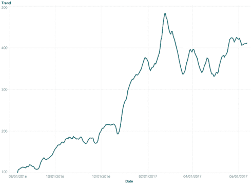
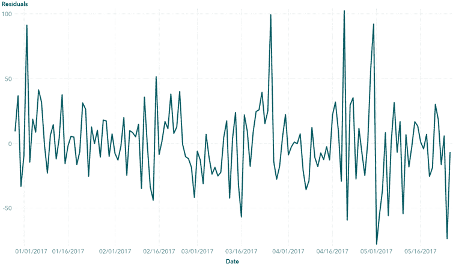
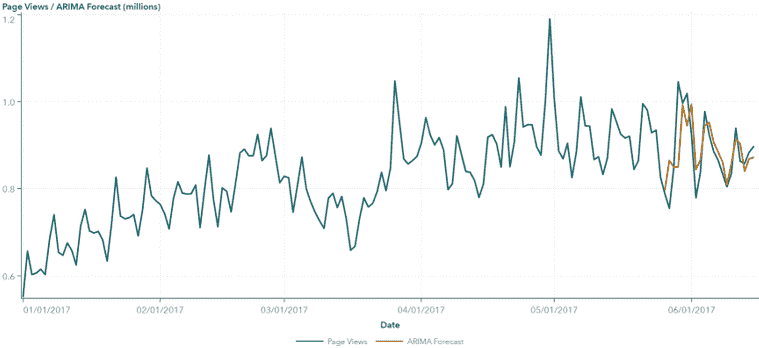

# 《时间序列入门》——三步走过程

> 原文：[`www.kdnuggets.com/2018/03/time-series-dummies-3-step-process.html`](https://www.kdnuggets.com/2018/03/time-series-dummies-3-step-process.html)

评论

**由 Chris St. Jeor 和 Sean Ankenbruck，Zencos**

在享受了一顿令人满意的中餐外卖后，你心不在焉地打开了免费的幸运饼干。瞥了一眼里面的幸运签，你读到：“你有一个梦想将会实现。”你嗤之以鼻，把小纸条扔掉，把饼干放进嘴里。作为一个聪明、理智的人，你知道这个幸运签毫无意义——没有人能预测未来。然而，这种想法可能是不完整的。实际上，有一种方法可以非常准确地预测未来：时间序列建模。

* * *

## 我们的前三个课程推荐

 1\. [Google 网络安全证书](https://www.kdnuggets.com/google-cybersecurity) - 快速进入网络安全职业

 2\. [Google 数据分析专业证书](https://www.kdnuggets.com/google-data-analytics) - 提升您的数据分析技能

 3\. [Google IT 支持专业证书](https://www.kdnuggets.com/google-itsupport) - 支持您的组织的 IT

* * *

时间序列建模可能无法告诉你何时会遇到你一生的挚爱，或者你应该穿蓝色领带还是红色领带上班，但它非常擅长利用历史数据识别现有模式，并利用这些模式预测未来将会发生什么。与大多数高级分析解决方案不同，时间序列建模是一种低成本的解决方案，可以提供强大的洞察力。

本文将介绍构建高质量时间序列模型的三个基本步骤：使数据平稳、选择正确的模型和评估模型的准确性。本文中的示例使用了一个大型汽车营销公司的历史页面浏览数据。

### 第一步：使数据平稳

时间序列涉及使用按等间隔时间（分钟、小时、天、周等）索引的数据。由于时间序列数据的离散特性，许多时间序列数据集在数据中包含季节性和/或趋势元素。时间序列建模的第一步是考虑现有的季节性（在固定时间段内的重复模式）和/或趋势（数据中的上升或下降移动）。考虑这些嵌入的模式就是我们所说的使数据平稳。可以在下面的图 1 和图 2 中看到趋势和季节性数据的示例。

*图 1：上升趋势数据的示例*

*图 2：季节性数据的示例*

### 什么是平稳性？

如前所述，时间序列建模的第一步是去除数据中存在的趋势或季节性效应以使其平稳。我们一直在谈论*平稳性*，但它到底是什么意思呢？

一个平稳序列是指其均值不再是时间的函数。对于趋势数据，随着时间的推移，序列的均值要么增加，要么减少（可以考虑一下房价随时间的稳步上涨）。对于季节性数据，序列的均值根据季节波动（可以考虑一下每 24 小时温度的升降变化）。

### 我们如何实现平稳性？

有两种方法可以实现平稳性，即对数据进行差分或线性回归。进行差分时，你计算连续观测值之间的差异。使用线性回归时，你需要在模型中包含季节性组件的二元指示变量。在决定应用哪种方法之前，让我们先探讨一下数据。我们使用 SAS Visual Analytics 绘制了历史每日页面浏览量。

*图 3: 原始页面浏览量的时间序列图*

初步模式似乎每七天重复一次，指示出一个每周的季节。页面浏览量随时间的持续增加表明存在轻微的上升趋势。根据数据的一般情况，我们应用了平稳性统计测试，即增强型迪基-富勒（ADF）测试。ADF 测试是平稳性的单位根测试。我们在这里不详细讨论，但单位根指示序列是否为非平稳，因此我们使用此测试来确定处理趋势或季节的适当方法（差分或回归）。根据上述数据的 ADF 测试，我们通过对星期几的虚拟变量进行回归去除了七天的季节性，通过差分去除了趋势。结果的平稳数据可以在下图中看到。

*图 4: 移除季节和趋势后的平稳数据*

### 第 2 步: 建立你的时间序列模型

现在数据已平稳，时间序列建模的第二步是建立基准预测。我们还应注意，大多数基准预测不需要第一步将数据转化为平稳。这仅仅是像 ARIMA 建模这样的更高级模型所需的步骤，我们将稍后讨论。

### 建立基准预测

有几种类型的时间序列模型。为了构建一个能够准确预测未来页面浏览量（或你感兴趣的预测对象）的模型，有必要决定适合你数据的模型类型。

最简单的选择是假设 y 的未来值（您感兴趣预测的变量）等于 y 的最新值。这被认为是最基本的或“天真模型”，其中最近的观察值是明天最可能的结果。

第二种类型的模型是平均模型。在此模型中，数据集中所有观察值被赋予相同的权重。未来 y 的预测是通过观察数据的平均值来计算的。如果数据是平稳的，生成的预测可能非常准确，但如果数据有趋势或季节性成分，则预测效果会很差。使用平均模型对页面浏览数据的预测值见下表。

*图 5: 平均（均值）模型预测*

如果数据具有季节性或趋势性元素，则更好的基准模型选择是实施指数平滑模型（ESM）。ESM 在上述的天真模型和平均模型之间达到了一个平衡点，其中最新的观察值被赋予最大的权重，而所有先前观察值的权重则呈指数下降。ESM 还允许将季节性和/或趋势成分纳入模型。下表提供了一个初始权重为 0.7，按 0.3 的速率呈指数递减的示例。

| **观察** | **权重 (α = 0.7)** |
| --- | --- |
| Yt（当前观察值） | 0.7 |
| Yt-1 | 0.21 |
| Yt-2 | 0.063 |
| Yt-3 | 0.0189 |
| Yt-4 | 0.00567 |

*表 1: Y 过去观察值的指数递减效应示例*

有多种类型的 ESM 可用于时间序列预测。理想的模型选择将取决于您拥有的数据类型。下表提供了根据数据中的趋势和季节组合来选择 ESM 类型的快速指南。

| **指数平滑模型类型** | **趋势** | **季节** |
| --- | --- | --- |
| 简单 ESM |  |  |
| 线性 ESM | X |  |
| 季节性 ESM |  | X |
| 冬季 ESM | X | X |

*表 2: 模型选择表*

由于数据中的强烈七天周期性和上升趋势，我们选择了加性冬季 ESM 作为新的基准模型。生成的预测在延续轻微上升趋势和捕捉七天周期方面做得相当不错。然而，数据中仍有更多的模式可以被移除。

*图 6: 加性冬季 ESM 预测*

### ARIMA 建模

在识别出最能解释数据中的趋势和季节性的模型之后，你*最终*拥有足够的信息来生成一个不错的预测，如上图 2 所示。然而，这些模型仍然有限，因为它们没有考虑变量在前一时期与自身的相关性。我们称这种相关性为自相关，这在时间序列数据中很常见。如果数据具有自相关，就像我们的数据一样，那么可能还需要进行额外的建模，以进一步改进基线预测。

为了捕捉时间序列模型中的自相关效应，必须实现自回归积分滑动平均（ARIMA）模型。ARIMA 模型包括用于考虑季节性和趋势的参数（如使用虚拟变量表示星期几和差分），同时也允许包含自回归和/或滑动平均项，以处理数据中嵌入的自相关。通过使用适当的 ARIMA 模型，我们可以进一步提高页面浏览量预测的准确性，如下图 3 所示。

*图 7：季节性 ARIMA 模型预测*

### 步骤 3：评估模型准确性

虽然你可以看到每个模型准确性的改善，但仅凭视觉识别哪个模型准确性最好并不总是可靠。计算 MAPE（平均绝对百分比误差）是一种快速且简单的方式来比较提议模型的整体预测准确性——MAPE 越低，预测准确性越好。比较之前讨论的每个模型的 MAPE，很容易看出季节性 ARIMA 模型提供了最佳的预测准确性。请注意，还有其他几种比较统计量可用于模型比较。

| **模型误差验证** |
| --- |
| **模型** | **MAPE** |
| 天真 | 9.0 |
| 平均 | 10.2 |
| Winters ESM | 6.9 |
| 季节性 ARIMA | 4.4 |

*表 3：模型误差率比较*

### 总结

总之，构建强大的时间序列预测模型的秘诀是尽可能去除噪声（趋势、季节性和自相关），以便数据中仅剩下的运动是纯随机的。对于我们的数据，我们发现带有星期几回归变量的季节性 ARIMA 模型提供了最准确的预测。与前述的天真、平均和 ESM 模型相比，ARIMA 模型的预测更为准确。

虽然没有任何时间序列模型能帮助你改善爱情生活，但你可以使用许多类型的时间序列模型来预测从页面浏览量到能源销售的各种数据。准确预测你关注的变量的关键是首先了解你的数据，其次应用最符合数据需求的模型。

**克里斯·圣乔**，Zencos 数据科学团队的顾问，帮助企业从数据中发现可操作的见解。在担任爱达荷州劳动部经济学家期间，克里斯为技术利益相关者制作了劳动预测和经济影响分析。克里斯拥有经济学学士学位和 NC State University 高级分析研究所的分析硕士学位。克里斯对机器学习和预测建模的热情仅次于他对家庭的热爱。无论是徒步旅行还是探索新博物馆，他总是和妻子及两个孩子一起不断前行。

**肖恩·安肯布鲁克**凭借在政府、投资银行、批发能源交易和网页应用开发方面的经验，为 Zencos 团队带来了多样的背景。他对编程充满热情，享受运用自己的技能解决复杂问题的机会。在从事分析项目之外，肖恩还花时间为 Zencos 博客做贡献，他利用数据讲述有趣的故事。肖恩来自北卡罗来纳州，获得了 NC State University 的商业学士学位和分析硕士学位。

**相关：**

+   时间序列分析：入门

+   广义加性模型的时间序列分析

+   时间序列数据的自动特征工程

### 更多相关话题

+   [成为优秀数据科学家所需的 5 项关键技能](https://www.kdnuggets.com/2021/12/5-key-skills-needed-become-great-data-scientist.html)

+   [每个初学者数据科学家应掌握的 6 种预测模型](https://www.kdnuggets.com/2021/12/6-predictive-models-every-beginner-data-scientist-master.html)

+   [2021 年最佳 ETL 工具](https://www.kdnuggets.com/2021/12/mozart-best-etl-tools-2021.html)

+   [停止学习数据科学以寻找目标，并找到目标去…](https://www.kdnuggets.com/2021/12/stop-learning-data-science-find-purpose.html)

+   [一个 90 亿美元的人工智能失败，深入分析](https://www.kdnuggets.com/2021/12/9b-ai-failure-examined.html)

+   [建立一个强大的数据团队](https://www.kdnuggets.com/2021/12/build-solid-data-team.html)
