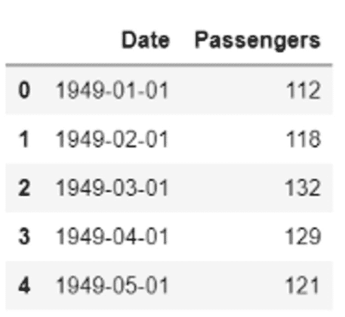
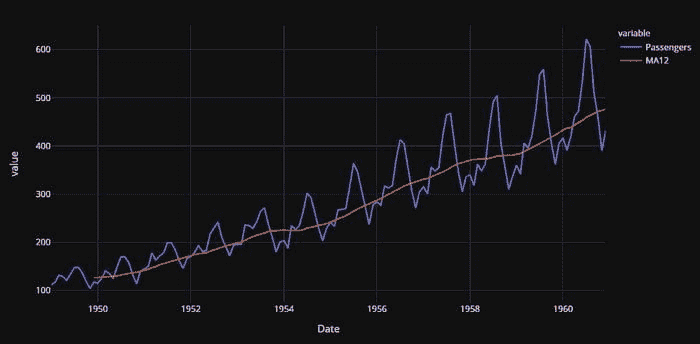
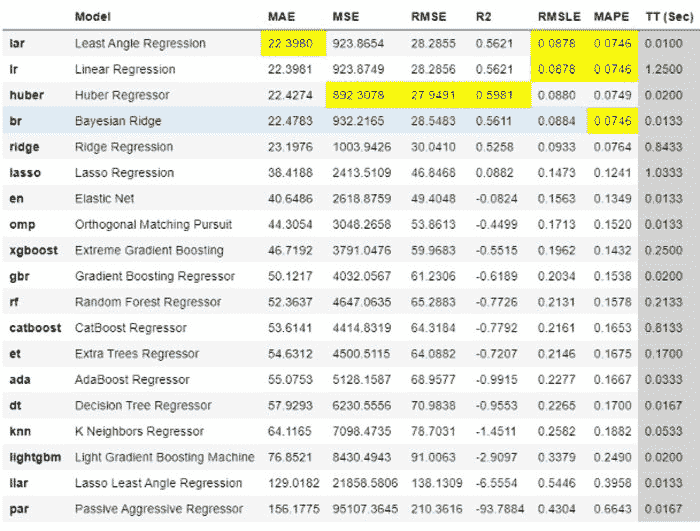
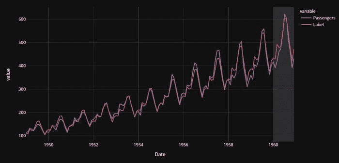
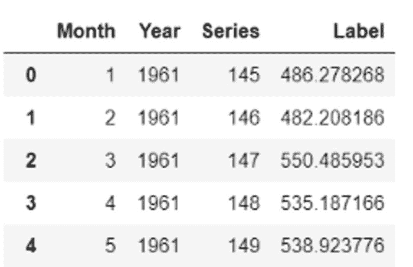
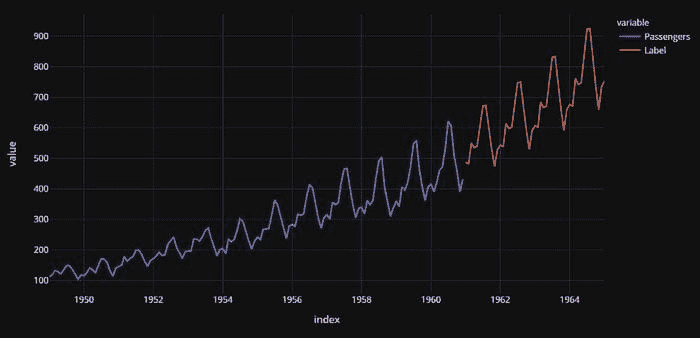

# 使用 PyCaret 回归模块进行时间序列预测

> 原文：[`www.kdnuggets.com/2021/04/time-series-forecasting-pycaret-regression-module.html`](https://www.kdnuggets.com/2021/04/time-series-forecasting-pycaret-regression-module.html)

评论

**由 [Moez Ali](https://www.linkedin.com/in/profile-moez/)，PyCaret 的创始人和作者**


由[Lukas Blazek](https://unsplash.com/@goumbik?utm_source=medium&utm_medium=referral)在[Unsplash](https://unsplash.com/?utm_source=medium&utm_medium=referral)提供的照片

### PyCaret

PyCaret 是一个开源、低代码的机器学习库和端到端模型管理工具，内置于 Python 中，用于自动化机器学习工作流。由于其易用性、简单性和快速高效地构建和部署端到端机器学习原型的能力，它非常受欢迎。

PyCaret 是一个替代的低代码库，可以用少量代码替换成百上千行代码。这使得实验周期变得指数级地快速和高效。

PyCaret 是 **简单且** **易于使用** 的。PyCaret 中执行的所有操作都按顺序存储在一个 **Pipeline** 中，该 **Pipeline** 完全自动化以进行 **部署**。无论是填补缺失值、独热编码、转换类别数据、特征工程还是超参数调整，PyCaret 都会自动完成所有这些操作。要了解更多关于 PyCaret 的信息，请观看这个 1 分钟的视频。

PyCaret — 一个开源、低代码的 Python 机器学习库

本教程假设你有一些 PyCaret 的先前知识和经验。如果你以前没有使用过，也没问题——你可以通过这些教程快速入门：

+   [PyCaret 2.2 版来了——新功能](https://towardsdatascience.com/pycaret-2-2-is-here-whats-new-ad7612ca63b)

+   [宣布 PyCaret 2.0](https://towardsdatascience.com/announcing-pycaret-2-0-39c11014540e)

+   [五件你不知道的 PyCaret 事](https://towardsdatascience.com/5-things-you-dont-know-about-pycaret-528db0436eec)

### 安装 PyCaret

安装 PyCaret 非常简单，只需几分钟。我们强烈建议使用虚拟环境以避免与其他库的潜在冲突。

PyCaret 的默认安装是一个精简版，只安装[此处列出的](https://github.com/pycaret/pycaret/blob/master/requirements.txt)硬依赖项。

```py
**# install slim version (default)** pip install pycaret**# install the full version**
pip install pycaret[full]
```

当你安装 pycaret 的完整版本时，所有的可选依赖项也会被安装，详见[此处](https://github.com/pycaret/pycaret/blob/master/requirements-optional.txt)。

### ???? PyCaret 回归模块

PyCaret **回归模块** 是一个监督学习模块，用于估计 **因变量**（通常称为‘结果变量’或‘目标’）与一个或多个 **自变量**（通常称为‘特征’或‘预测变量’）之间的关系。

回归的目标是预测连续值，如销售额、数量、温度、客户数量等。PyCaret 的所有模块都提供许多 [预处理](https://www.pycaret.org/preprocessing) 特性，通过 [setup](https://www.pycaret.org/setup) 函数准备数据用于建模。它拥有超过 25 种现成的算法和 [若干图表](https://www.pycaret.org/plot-model) 来分析训练模型的性能。

### ???? PyCaret 回归模块中的时间序列

时间序列预测可以大致分为以下几类：

+   **经典 / 统计模型** — 移动平均、指数平滑、ARIMA、SARIMA、TBATS

+   **机器学习** — 线性回归、XGBoost、随机森林或任何带有降维方法的 ML 模型

+   **深度学习** — RNN, LSTM

本教程专注于第二类，即 *机器学习*。

PyCaret 的回归模块默认设置不适合时间序列数据，因为它涉及一些不适用于有序数据（*如时间序列数据的数据*）的数据准备步骤。

例如，数据集的训练集和测试集的划分是通过随机洗牌完成的。这对时间序列数据来说不合适，因为你不希望最近的日期被包含在训练集中，而历史日期则是测试集的一部分。

时间序列数据也需要一种不同的交叉验证方式，因为它需要尊重日期的顺序。PyCaret 回归模块默认使用 k-fold 随机交叉验证来评估模型。默认的交叉验证设置不适用于时间序列数据。

本教程的下一部分将演示如何轻松更改 PyCaret 回归模块中的默认设置，以便使其适用于时间序列数据。

### ???? 数据集

为了本教程的目的，我使用了美国航空乘客数据集。你可以从 [Kaggle](https://www.kaggle.com/chirag19/air-passengers) 下载数据集。

```py
**# read csv file** import pandas as pd
data = pd.read_csv('AirPassengers.csv')
data['Date'] = pd.to_datetime(data['Date'])
data.head()
```



示例行

```py
**# create 12 month moving average** data['MA12'] = data['Passengers'].rolling(12).mean()**# plot the data and MA** import plotly.express as px
fig = px.line(data, x="Date", y=["Passengers", "MA12"], template = 'plotly_dark')
fig.show()
```



美国航空乘客数据集的时间序列图（移动平均 = 12）

由于算法不能直接处理日期，我们可以从日期中提取一些简单的特征，比如月份和年份，并删除原始日期列。

```py
**# extract month and year from dates**
month = [i.month for i in data['Date']]
year = [i.year for i in data['Date']]**# create a sequence of numbers** data['Series'] = np.arange(1,len(data)+1)**# drop unnecessary columns and re-arrange** data.drop(['Date', 'MA12'], axis=1, inplace=True)
data = data[['Series', 'Year', 'Month', 'Passengers']] **# check the head of the dataset**
data.head()
```


提取特征后的示例行

```py
**# split data into train-test set** train = data[data['Year'] < 1960]
test = data[data['Year'] >= 1960]**# check shape** train.shape, test.shape
>>> ((132, 4), (12, 4))
```

我在初始化 `setup` 之前手动划分了数据集。另一种方法是将整个数据集传递给 PyCaret，让它处理划分，在这种情况下，你需要在 `setup` 函数中传递 `data_split_shuffle = False` 以避免在划分前打乱数据集。

### ???? **初始化设置**

现在是初始化 `setup` 函数的时候了，我们将显式传递训练数据、测试数据和使用 `fold_strategy` 参数的交叉验证策略。

```py
**# import the regression module**
from pycaret.regression import ***# initialize setup**
s = setup(data = train, test_data = test, target = 'Passengers', fold_strategy = 'timeseries', numeric_features = ['Year', 'Series'], fold = 3, transform_target = True, session_id = 123)
```

### ???? **训练和评估所有模型**

```py
best = compare_models(sort = 'MAE')
```



来自 compare_models 的结果

基于交叉验证 MAE 的最佳模型是**最小角回归**（MAE: 22.3）。让我们检查测试集上的得分。

```py
prediction_holdout = predict_model(best);
```


来自 predict_model(best) 函数的结果

测试集上的 MAE 比交叉验证的 MAE 高 12%。虽然效果不佳，但我们将继续使用它。让我们绘制实际与预测的线条，以可视化拟合情况。

```py
**# generate predictions on the original dataset**
predictions = predict_model(best, data=data)**# add a date column in the dataset**
predictions['Date'] = pd.date_range(start='1949-01-01', end = '1960-12-01', freq = 'MS')**# line plot**
fig = px.line(predictions, x='Date', y=["Passengers", "Label"], template = 'plotly_dark')**# add a vertical rectange for test-set separation**
fig.add_vrect(x0="1960-01-01", x1="1960-12-01", fillcolor="grey", opacity=0.25, line_width=0)fig.show()
```



实际与预测的美国航空乘客数（1949–1960）

在最后的灰色背景区域是测试期（即 1960 年）。现在让我们完成模型，即在整个数据集上训练最佳模型，即*最小角回归*（这次包括测试集）。

```py
final_best = finalize_model(best)
```

### ???? 创建一个未来评分数据集

现在我们已经在整个数据集（1949 到 1960 年）上训练了模型，让我们预测未来五年，直到 1964 年。为了使用我们的最终模型生成未来的预测，我们首先需要创建一个包含未来日期的月份、年份、系列列的数据集。

```py
future_dates = pd.date_range(start = '1961-01-01', end = '1965-01-01', freq = 'MS')future_df = pd.DataFrame()future_df['Month'] = [i.month for i in future_dates]
future_df['Year'] = [i.year for i in future_dates]    
future_df['Series'] = np.arange(145,(145+len(future_dates)))future_df.head()
```


从 future_df 中抽取的样本行

现在，让我们使用`future_df`进行评分和生成预测。

```py
predictions_future = predict_model(final_best, data=future_df)
predictions_future.head()
```



从 predictions_future 中抽取的样本行

让我们绘制它。

```py
concat_df = pd.concat([data,predictions_future], axis=0)
concat_df_i = pd.date_range(start='1949-01-01', end = '1965-01-01', freq = 'MS')
concat_df.set_index(concat_df_i, inplace=True)fig = px.line(concat_df, x=concat_df.index, y=["Passengers", "Label"], template = 'plotly_dark')
fig.show()
```



实际（1949–1960 年）与预测（1961–1964 年）的美国航空乘客数

这不是很简单吗？

使用这个轻量级工作流自动化库，你可以实现无限的可能。如果你觉得有用，请不要忘记在我们的 GitHub 仓库上给我们⭐️。

想了解更多关于 PyCaret 的内容，请关注我们的[LinkedIn](https://www.linkedin.com/company/pycaret/)和[Youtube](https://www.youtube.com/channel/UCxA1YTYJ9BEeo50lxyI_B3g)。

加入我们的 Slack 频道。邀请链接[这里](https://join.slack.com/t/pycaret/shared_invite/zt-p7aaexnl-EqdTfZ9U~mF0CwNcltffHg)。

### 你可能也对以下内容感兴趣：

[使用 PyCaret 2.0 在 Power BI 中构建自己的 AutoML](https://towardsdatascience.com/build-your-own-automl-in-power-bi-using-pycaret-8291b64181d)

[使用 Docker 在 Azure 上部署机器学习管道](https://towardsdatascience.com/deploy-machine-learning-pipeline-on-cloud-using-docker-container-bec64458dc01)

[在 Google Kubernetes Engine 上部署机器学习管道](https://towardsdatascience.com/deploy-machine-learning-model-on-google-kubernetes-engine-94daac85108b)

[在 AWS Fargate 上部署机器学习管道](https://towardsdatascience.com/deploy-machine-learning-pipeline-on-aws-fargate-eb6e1c50507)

[构建并部署你的第一个机器学习网页应用](https://towardsdatascience.com/build-and-deploy-your-first-machine-learning-web-app-e020db344a99)

[使用 AWS Fargate 无服务器部署 PyCaret 和 Streamlit 应用](https://towardsdatascience.com/deploy-pycaret-and-streamlit-app-using-aws-fargate-serverless-infrastructure-8b7d7c0584c2)

[使用 PyCaret 和 Streamlit 构建和部署机器学习网络应用](https://towardsdatascience.com/build-and-deploy-machine-learning-web-app-using-pycaret-and-streamlit-28883a569104)

[在 GKE 上部署使用 Streamlit 和 PyCaret 构建的机器学习应用](https://towardsdatascience.com/deploy-machine-learning-app-built-using-streamlit-and-pycaret-on-google-kubernetes-engine-fd7e393d99cb)

### 重要链接

[文档](https://pycaret.readthedocs.io/en/latest/installation.html)

[博客](https://medium.com/@moez_62905)

[GitHub](https://www.github.com/pycaret/pycaret)

[StackOverflow](https://stackoverflow.com/questions/tagged/pycaret)

[安装 PyCaret](https://pycaret.readthedocs.io/en/latest/installation.html) [Notebook 教程](https://pycaret.readthedocs.io/en/latest/tutorials.html) [为 PyCaret 做贡献](https://pycaret.readthedocs.io/en/latest/contribute.html)

### 想了解某个特定模块吗？

点击下面的链接查看文档和工作示例。

[分类](https://pycaret.readthedocs.io/en/latest/api/classification.html) [回归](https://pycaret.readthedocs.io/en/latest/api/regression.html)

[聚类](https://pycaret.readthedocs.io/en/latest/api/clustering.html)

[异常检测](https://pycaret.readthedocs.io/en/latest/api/anomaly.html)

[自然语言处理](https://pycaret.readthedocs.io/en/latest/api/nlp.html) [关联规则挖掘](https://pycaret.readthedocs.io/en/latest/api/arules.html)

**简介： [Moez Ali](https://www.linkedin.com/in/profile-moez/)** 是一名数据科学家，同时是 PyCaret 的创始人和作者。

[原文](https://towardsdatascience.com/time-series-forecasting-with-pycaret-regression-module-237b703a0c63)。经许可转载。

**相关内容：**

+   将机器学习管道部署到云端使用 Docker 容器

+   使用 PyCaret 进行自动化异常检测

+   GitHub 是你所需的最佳 AutoML 工具

* * *

## 我们的前三大课程推荐

 1\. [Google 网络安全证书](https://www.kdnuggets.com/google-cybersecurity) - 快速进入网络安全职业领域。

 2\. [Google 数据分析专业证书](https://www.kdnuggets.com/google-data-analytics) - 提升你的数据分析技能

 3\. [Google IT 支持专业证书](https://www.kdnuggets.com/google-itsupport) - 支持你的组织的 IT 工作

* * *

### 了解更多相关话题

+   [使用 Ploomber、Arima、Python 和 Slurm 进行时间序列预测](https://www.kdnuggets.com/2022/03/time-series-forecasting-ploomber-arima-python-slurm.html)

+   [使用 statsmodels 和 Prophet 进行时间序列预测](https://www.kdnuggets.com/2023/03/time-series-forecasting-statsmodels-prophet.html)

+   [利用 XGBoost 进行时间序列预测](https://www.kdnuggets.com/2023/08/leveraging-xgboost-timeseries-forecasting.html)

+   [告别 Print(): 使用 Logging 模块进行有效调试](https://www.kdnuggets.com/say-goodbye-to-print-use-logging-module-for-effective-debugging)

+   [如何使用 Scikit-learn 的 Imputer 模块处理缺失数据](https://www.kdnuggets.com/how-to-handle-missing-data-with-scikit-learns-imputer-module)

+   [PyCaret 二分类介绍](https://www.kdnuggets.com/2021/12/introduction-binary-classification-pycaret.html)
