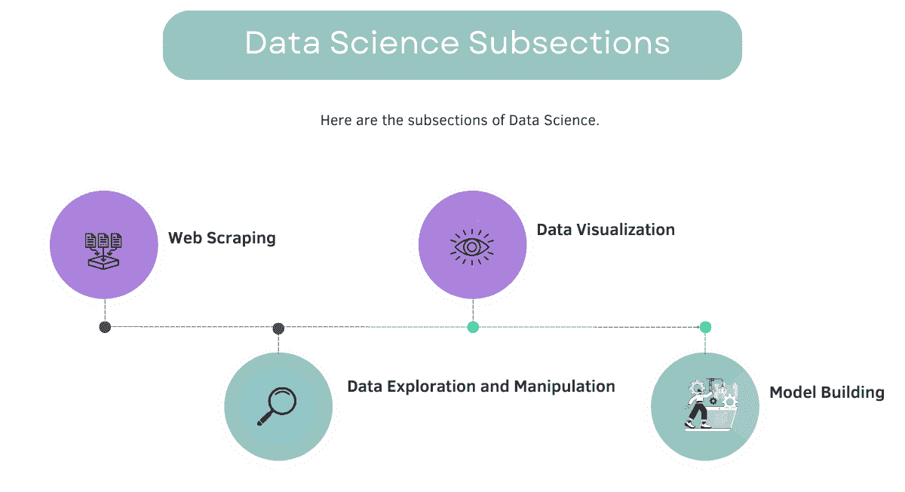
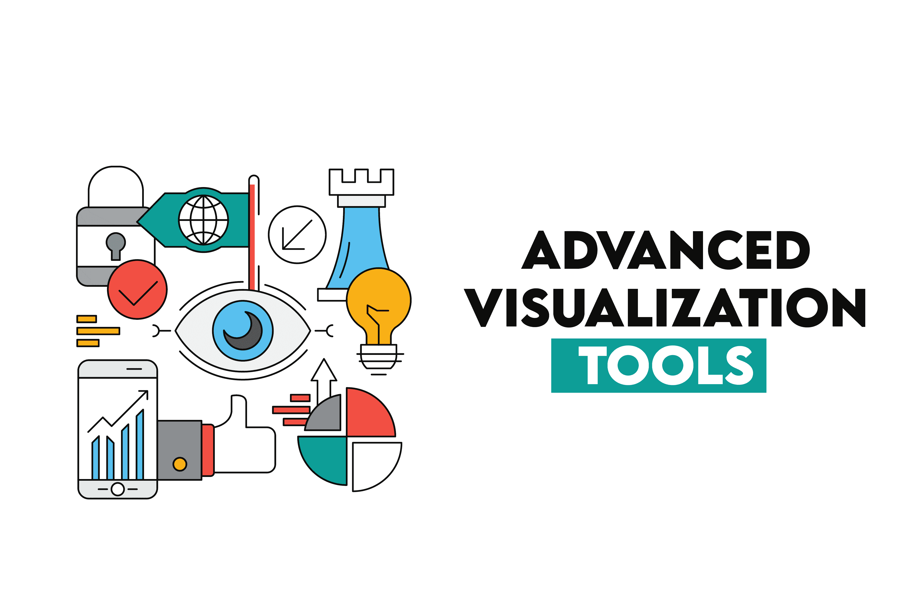

# 每个数据科学家都应知晓的工具：实用指南

> 原文：[`www.kdnuggets.com/tools-every-data-scientist-should-know-a-practical-guide`](https://www.kdnuggets.com/tools-every-data-scientist-should-know-a-practical-guide)

图片由作者提供

* * *

## 我们的三大课程推荐

 1\. [谷歌网络安全证书](https://www.kdnuggets.com/google-cybersecurity) - 快速进入网络安全职业生涯。

 2\. [谷歌数据分析专业证书](https://www.kdnuggets.com/google-data-analytics) - 提升你的数据分析技能

 3\. [谷歌 IT 支持专业证书](https://www.kdnuggets.com/google-itsupport) - 支持你的组织的 IT 需求

* * *

数据科学家最依赖哪些工具？这个问题很重要，尤其是在学习数据科学之前，因为数据科学是一个不断发展的领域，过时的文章可能会提供过时的信息。在这篇文章中，我们将深入探讨最近必须了解的工具，这些工具可以提升你的数据科学水平，但我们从假设你对数据科学一无所知开始。

## **什么是数据科学？**

数据科学是一个多学科领域，它结合了来自各种学科的知识，通过数据驱动的分析帮助企业做出明智的决策。

## **Python**

与 R 一起，Python 是数据研究中最常用的语言之一。它灵活且可读，拥有许多库来支持，特别是在数据科学中，使其适合各种任务，从网络爬虫到模型构建。

以下是每个类别在 Python 中的关键库

+   网络爬虫：

    +   [BeautifulSoup](https://beautiful-soup-4.readthedocs.io/en/latest/): Python 中最简单的网络爬虫库。

    +   [Scrapy](https://docs.scrapy.org/en/latest/): 高级网络爬虫库。

+   数据探索与操作：

    +   [Pandas:](https://pandas.pydata.org/) Python 数据操作和分析工具包。

    +   [NumPy](https://numpy.org/doc/): 支持大型多维数组和矩阵。

+   数据可视化：

    +   [Matplotlib:](https://matplotlib.org/) 核心 Python 绘图库

    +   [Seaborn:](https://seaborn.pydata.org/) 基于 Matplotlib 的可视化库。它提供了一个高级接口，用于创建吸引人的统计图形。

    +   [Plotly:](https://plotly.com/python/) 互动图形库

+   模型建模：

    +   [Scikit-learn:](https://scikit-learn.org/) Python 中最关键的机器学习库

    +   [TensorFlow:](https://www.tensorflow.org/) 适用于应用和扩展深度学习。

    +   [PyTorch:](https://pytorch.org/) 用于图像处理和 NLP 应用的机器学习库。

## **R**

R 是一个强大的文本分析工具，旨在解决统计和数据分析问题。其全面的统计能力和广泛的软件包生态系统使其在学术界和研究中非常受欢迎。

这里是 Python 各类别的关键库

+   网络抓取

    +   [rvest:](https://cran.r-project.org/web/packages/rvest/rvest.pdf) 通过模拟网页的确切结构简化网页抓取。

    +   [RCurl:](https://cran.r-project.org/web/packages/RCurl/RCurl.pdf) R 绑定到 curl 库，允许执行 curl 本身可以做的任何操作。

+   数据探索与操作

    +   [dplyr:](https://dplyr.tidyverse.org/) 数据操作的语法，提供数据操作动词，帮助简化数据操作。

    +   [tidyr:](https://cran.r-project.org/web/packages/tidyr/tidyr.pdf) 通过手动展开和收集数据使数据更易于访问。

    +   [Data.table:](https://cran.r-project.org/web/packages/data.table/vignettes/datatable-intro.html) data.frame 的扩展，具有更快的数据操作能力。

+   数据可视化

    +   [ggplot2:](https://ggplot2.tidyverse.org/) 图形语法的应用。

    +   [lattice:](https://cran.r-project.org/web/packages/lattice/index.html) 更好的默认值 + 创建多面板图的简便方法。

    +   [plotly:](https://plotly.com/r/) 它将使用 ggplot2 创建的图表转换为交互式、用户驱动的网页图表。

+   模型构建

    +   [Caret:](https://topepo.github.io/caret/) 用于创建分类和回归模型的工具。

    +   [nnet:](https://www.rdocumentation.org/packages/nnet/versions/7.3-19/topics/nnet) 提供构建神经网络的函数。

    +   [randomForest:](https://cran.r-project.org/web/packages/randomForest/randomForest.pdf) 基于随机森林算法的分类和回归库。

## **Excel**

Excel 易于用于分析和可视化数据。它易于学习和使用，其处理大型数据集的能力使其在快速数据操作和分析中非常有用。

在这一部分，我们将把 Excel 的关键功能划分到子部分中进行分类，而不是使用库。

数据探索与操作

+   FILTER: 根据你定义的标准过滤数据范围。

+   SORT: 对范围或数组中的元素进行排序。

+   VLOOKUP/HLOOKUP: 按行或列在表格或范围中查找内容。

+   TEXT TO COLUMNS: 将单元格内容拆分为多个单元格。

数据可视化

+   图表（柱状图、折线图、饼图等）：标准的图表类型用于表示数据。

+   PivotTables: 它压缩大型数据集并创建交互式摘要。

+   Conditional Formatting: 显示哪些单元格符合特定规则。

模型构建

+   AVERAGE, MEDIAN, MODE: 计算集中趋势。

+   STDEV.P/STDEV.S: 处理数据集以计算数据集的离散度。

+   LINEST: 基于线性回归分析，返回最符合数据集的直线统计数据。

+   回归分析（数据分析工具包）：该工具包使用回归分析来查找变量之间的相关性。

## **SQL**

SQL 是与关系数据库交互的语言，并用于存储和处理数据。

数据科学家主要使用 SQL 作为与数据库交互的标准方式，帮助他们查询、更新和管理所有数据库中的数据。SQL 还用于访问数据以进行检索和分析。

这里是最受欢迎的 SQL 系统。

+   [PostgreSQL](https://www.postgresql.org/)：一个开源的对象-关系数据库系统。

+   [MySQL](https://www.mysql.com/)：一种高性能、受欢迎的开源数据库，以其速度和可靠性而闻名。

+   [MsSQL（微软 SQL 服务器）](https://www.microsoft.com/en-us/sql-server/)：微软开发的关系数据库管理系统，与微软产品完全集成，具备企业级功能。

+   [Oracle](https://www.oracle.com/)：这是一个在企业环境中广泛使用的多模型数据库管理系统。它结合了最佳的关系模型和基于树的存储表示。

## **高级可视化工具**

使用合适的高级可视化工具，可以将复杂的数据转化为生动的、可用的见解。这些工具允许数据科学家和业务分析师创建互动式和可分享的仪表板，改进、理解并在适当的时间使数据可用。

这里是构建仪表板的重要工具。

+   +   [Power BI](https://powerbi.microsoft.com/en-us/desktop/)：微软提供的商业分析服务，提供互动式可视化和商业智能功能，界面简单易用，适合最终用户创建报告和仪表板。

    +   [Tableau](https://www.tableau.com/)：一个强大的数据可视化工具，允许用户创建互动式和可分享的仪表板，提供数据的深刻见解。它可以处理大量数据，并能够与不同的数据源良好配合。

    +   [Google 数据工作室](https://analytics.google.com/analytics/academy/course/10)：这是一个免费的基于网络的应用程序，允许你使用来自几乎任何来源的数据创建动态和美观的仪表板和报告，还提供其他免费的、完全可定制且易于分享的报告，这些报告会自动使用你其他 Google 服务中的数据进行更新。

## **云系统**

云系统对数据科学至关重要，因为它们可以扩展，增加灵活性，并管理大数据集。它们提供计算服务、工具和资源，以规模化存储、处理和分析数据，并实现成本优化和性能效益。

在这里查看受欢迎的配方。

+   [AWS（亚马逊网络服务）](https://aws.amazon.com/)：提供一个高度复杂且不断发展的云计算平台，包括存储、计算、机器学习、大数据分析等多种服务。

+   [Google Cloud](https://cloud.google.com/?hl=en): 提供各种云计算服务，运行在 Google 内部用于 Google 搜索和 YouTube 等产品的相同基础设施上，包括云数据分析、数据管理和机器学习。

+   [Microsoft Azure:](https://azure.microsoft.com/en-us/) 微软提供云计算服务，包括虚拟机、数据库、人工智能和机器学习工具以及 DevOps 解决方案。

+   [PythonAnywhere:](https://www.pythonanywhere.com/) 这是一个基于云的开发和托管环境，允许你通过网页浏览器运行、开发和托管 Python 应用程序，无需 IT 人员设置服务器。非常适合数据科学和网页应用开发人员，快速部署代码。

## **附赠: LLM 的**

大型语言模型（LLMs）是 AI 中的前沿解决方案之一。它们可以像人类一样学习和生成文本，在自然语言处理、客户服务自动化、内容生成等广泛应用中非常有利。

这里是一些最著名的工具。

+   [ChatGPT:](https://chat.openai.com/) 这是一个由 OpenAI 创建的灵活对话代理，用于生成类似人类的上下文文本，非常有益。

+   [Gemini:](https://gemini.google.com/) Google 创建的 LLM 将允许你直接在 Gmail 等 Google 应用中使用。

+   [Claude-3:](https://claude.ai/) 一个现代的 LLM，专门用于更好地理解和生成文本。它用于协助完成各种高级 NLP 任务和对话 AI。

+   [Microsoft Co-pilot](https://copilot.microsoft.com/): 这是一个集成到微软应用中的 AI 驱动服务，Co-pilot 通过提供上下文敏感的建议和自动化重复的工作流程，帮助用户提高生产力和效率。

如果你仍然有关于最有价值的数据科学工具的问题，可以查看这篇[数据科学家最有用的 10 种数据分析工具](https://www.stratascratch.com/blog/the-10-most-useful-data-analysis-tools-for-data-scientists/?utm_source=blog&utm_medium=click&utm_campaign=kdn+tools+every+ds+should+know)。

## **最终想法**

在这篇文章中，我们探讨了数据科学家所需的基本工具，从 Python 到大型语言模型。掌握这些工具可以显著提升你的数据科学能力。保持更新并不断扩展你的工具包，以保持竞争力和有效性。

[Nate Rosidi](https://twitter.com/StrataScratch) 是一名数据科学家和产品策略专家。他还担任分析学的兼职教授，并且是 StrataScratch 的创始人，这是一个帮助数据科学家通过顶级公司的真实面试问题准备面试的平台。Nate 撰写关于职业市场的最新趋势，提供面试建议，分享数据科学项目，并覆盖所有 SQL 相关内容。

### 相关主题更多内容

+   [每个 AI 工程师都应该了解的工具：实用指南](https://www.kdnuggets.com/tools-every-ai-engineer-should-know-a-practical-guide)

+   [KDnuggets 新闻，5 月 25 日：每个数据科学家都应该了解的 6 个 Python 机器学习工具…](https://www.kdnuggets.com/2022/n21.html)

+   [每个数据科学家都应该了解的 6 个 Python 机器学习工具](https://www.kdnuggets.com/2022/05/6-python-machine-learning-tools-every-data-scientist-know.html)

+   [KDnuggets™ 新闻 22:n01，1 月 5 日：跟踪和可视化的 3 个工具…](https://www.kdnuggets.com/2022/n01.html)

+   [每个数据科学家都应该了解的 12 条 Docker 命令](https://www.kdnuggets.com/2023/01/12-docker-commands-every-data-scientist-know.html)

+   [每个数据科学家都应该了解的 10 个必备 Pandas 函数](https://www.kdnuggets.com/10-essential-pandas-functions-every-data-scientist-should-know)
