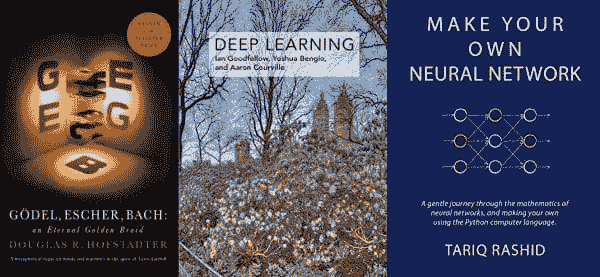

# 2016 年版《人工智能与机器学习十大亚马逊书籍》

> 原文：[`www.kdnuggets.com/2016/11/top-10-amazon-books-ai-machine-learning.html`](https://www.kdnuggets.com/2016/11/top-10-amazon-books-ai-machine-learning.html)

最近对数据科学、数据挖掘及相关学科的兴趣激增，也带来了大量关于这些话题的书籍。决定哪些书籍可能对你的职业有用的最佳方法之一就是查看其他人正在阅读哪些书籍。本文详细介绍了截至 2016 年 11 月 24 日亚马逊[人工智能与机器学习书籍](https://www.amazon.com/Best-Sellers-Books-AI-Machine-Learning/zgbs/books/3887/)类别中最受欢迎的 10 本书，跳过了重复的书名以及明显分类错误且对我们的读者无用的书名。

*注意：KDnuggets 从亚马逊没有获得任何版税——此列表仅用于帮助我们的读者评估有趣的书籍。*

* * *

## 我们的前三大课程推荐

 1\. [谷歌网络安全证书](https://www.kdnuggets.com/google-cybersecurity) - 快速进入网络安全职业生涯。

 2\. [谷歌数据分析专业证书](https://www.kdnuggets.com/google-data-analytics) - 提升你的数据分析水平

 3\. [谷歌 IT 支持专业证书](https://www.kdnuggets.com/google-itsupport) - 支持你的组织的 IT 需求

* * *

**1\. [深度学习（自适应计算与机器学习系列）](https://www.amazon.com/Deep-Learning-Adaptive-Computation-Machine/dp/0262035618/ref=zg_bs_3887_1?_encoding=UTF8&psc=1&refRID=9HK33PPS16VDZN3B1N8G)**

**伊恩·古德费洛、约书亚·本吉奥、亚伦·库尔维尔**

4.8 星（[4 条评论](https://www.amazon.com/Deep-Learning-Adaptive-Computation-Machine/dp/0262035618/ref=zg_bs_3887_1?_encoding=UTF8&psc=1&refRID=9HK33PPS16VDZN3B1N8G#customerReviews)）

精装本，$67.55

这很好地总结了：

> “由三位领域专家撰写，《深度学习》是唯一一本全面讲述该主题的书籍。”
> 
> - **埃隆·马斯克**，OpenAI 联席主席；特斯拉和 SpaceX 的联合创始人兼首席执行官

**2\. [亚马逊 Echo：学习亚马逊 Echo 的终极指南](https://www.amazon.com/Amazon-Echo-Ultimate-services-internet/dp/1536822043/ref=zg_bs_3887_2?_encoding=UTF8&psc=1&refRID=9HK33PPS16VDZN3B1N8G)**

**安德鲁·巴特勒**

4.2 星（[74 条评论](https://www.amazon.com/Amazon-Echo-Ultimate-services-internet/dp/1536822043/ref=zg_bs_3887_2?_encoding=UTF8&psc=1&refRID=9HK33PPS16VDZN3B1N8G#customerReviews)）

平装本，$9.95（Kindle 版，$2.88）

> 了解如何构建自定义和智能家居技能，让你的 Echo 更具个人化！Alexa 技能包流畅、安全、快速且可靠，帮助你让 Echo 不断学习。该指南还适合中级技术用户，提供快速、有效的方式了解 Echo 设备及其功能和可定制性。

**3\. [哥德尔、艾舍尔、巴赫：一条永恒的金色链条](https://www.amazon.com/G%C3%B6del-Escher-Bach-Eternal-Golden/dp/0465026567/ref=zg_bs_3887_5?_encoding=UTF8&psc=1&refRID=9HK33PPS16VDZN3B1N8G)**

**道格拉斯·R·霍夫施塔特**

4.5 颗星（[472 条评论](https://www.amazon.com/G%C3%B6del-Escher-Bach-Eternal-Golden/dp/0465026567/ref=zg_bs_3887_5?_encoding=UTF8&psc=1&refRID=9HK33PPS16VDZN3B1N8G#customerReviews)）

平装书，$13.98

> 如果生命可以从细胞的化学基础中成长，如果意识可以从神经元的发射系统中出现，那么计算机也将达到人类智能。《哥德尔、艾舍尔、巴赫》是对认知科学核心的迷人思想的绝佳探索：意义、简化、递归等等。

**4\. [自制神经网络](https://www.amazon.com/Make-Your-Own-Neural-Network-ebook/dp/B01EER4Z4G/ref=zg_bs_3887_6?_encoding=UTF8&psc=1&refRID=9HK33PPS16VDZN3B1N8G)**

**塔里克·拉希德**

4.2 颗星（[65 条评论](https://www.amazon.com/Make-Your-Own-Neural-Network-ebook/dp/B01EER4Z4G/ref=zg_bs_3887_6?_encoding=UTF8&psc=1&refRID=9HK33PPS16VDZN3B1N8G#customerReviews)）

Kindle 版，$3.86

> 神经网络是深度学习和人工智能的关键元素，它今天能够完成一些真正令人印象深刻的任务。然而，真正理解神经网络如何工作的却少之又少。
> 
> 本指南将带你进行有趣而从容的学习旅程，从非常简单的想法开始，逐步建立对神经网络工作原理的理解。你不需要任何中学以外的数学知识，还包含了对微积分的易懂介绍。

**5\. [Python 机器学习](https://www.amazon.com/Python-Machine-Learning-Sebastian-Raschka/dp/1783555130/ref=zg_bs_3887_7?_encoding=UTF8&psc=1&refRID=9HK33PPS16VDZN3B1N8G)**

**塞巴斯蒂安·拉施卡**

4.3 颗星（[80 条评论](https://www.amazon.com/Python-Machine-Learning-Sebastian-Raschka/dp/1783555130/ref=zg_bs_3887_7?_encoding=UTF8&psc=1&refRID=9HK33PPS16VDZN3B1N8G#customerReviews)）

平装书，$40.49

> +   利用 Python 最强大的开源库进行深度学习、数据处理和数据可视化
> +   
> +   学习有效的策略和最佳实践，以改进和优化机器学习系统和算法
> +   
> +   使用强大的统计模型对数据提出并回答难题，这些模型适用于各种数据集

**6\. [超级智能：路径、危险与策略](https://www.amazon.com/Superintelligence-Dangers-Strategies-Nick-Bostrom/dp/0198739834/ref=zg_bs_3887_9?_encoding=UTF8&psc=1&refRID=9HK33PPS16VDZN3B1N8G)**

**Nick Bostrom**

3.9 星（[284 条评论](https://www.amazon.com/Superintelligence-Dangers-Strategies-Nick-Bostrom/dp/0198739834/ref=zg_bs_3887_9?_encoding=UTF8&psc=1&refRID=9HK33PPS16VDZN3B1N8G#customerReviews)）

平装版，$13.72（Kindle 版，$8.13）

> 阅读本书，了解有关神谕、精灵、单例模式；了解关于拳击方法、触发器和思想犯罪；了解人类的宇宙赠予和技术差异发展；间接规范性、工具收敛、全脑仿真和技术耦合；马尔萨斯经济学和反乌托邦进化；人工智能、生物认知增强和集体智能。
> 
> 这本极具雄心和原创性的书在一片难度极高的知识领域中小心翼翼地探寻。然而，写作如此清晰，仿佛一切都变得简单起来。

**7\. [马尔可夫模型：精通数据科学和无监督机器学习（Python 版）](https://www.amazon.com/Markov-Models-Science-Unsupervised-Learning-ebook/dp/B01M1J1Y8C/ref=zg_bs_3887_12?_encoding=UTF8&psc=1&refRID=9HK33PPS16VDZN3B1N8G)**

**LazyProgrammer**

4.0 星（[1 条评论](https://www.amazon.com/Markov-Models-Science-Unsupervised-Learning-ebook/dp/B01M1J1Y8C/ref=zg_bs_3887_12?_encoding=UTF8&psc=1&refRID=9HK33PPS16VDZN3B1N8G#customerReviews)）

Kindle 版，$4.91

> 我们将探讨一个疾病与健康的模型，计算如果生病，你会生病多久。我们将讨论马尔可夫模型如何用于分析人们如何与您的网站互动，并修复像高跳出率这样可能影响 SEO 的问题区域。我们将构建可以用于识别作者甚至生成文本的语言模型——想象一下机器为你写作。

**8\. [机器学习：新人工智能：MIT 出版社必读知识系列](https://www.amazon.com/Machine-Learning-Press-Essential-Knowledge/dp/B01M1I55GE/ref=zg_bs_3887_13?_encoding=UTF8&psc=1&refRID=KZVJG40XGKS24RM0VHFX)**

**Ethem Alpaydi**

3.5 星（[2 条评论](https://www.amazon.com/Machine-Learning-Press-Essential-Knowledge/dp/B01M1I55GE/ref=zg_bs_3887_13?_encoding=UTF8&psc=1&refRID=KZVJG40XGKS24RM0VHFX#customerReviews)）

音频版，$14.95（平装版，$10.63）

> 阿尔帕伊丁讲述了数字技术如何从计算主机发展到移动设备，为今天的机器学习热潮提供了背景。他描述了机器学习的基本概念及一些应用；机器学习算法在模式识别中的应用；受到人脑启发的人工神经网络；学习实例之间关联的算法，如客户细分和学习推荐；以及强化学习，即自主代理学习以最大化奖励和最小化惩罚。阿尔帕伊丁还考虑了机器学习的一些未来方向以及“数据科学”这一新领域，并讨论了数据隐私和安全的伦理和法律影响。

**9\. [统计学习导论：R 语言应用](https://www.amazon.com/Introduction-Statistical-Learning-Applications-Statistics/dp/1461471370/ref=zg_bs_3887_18?_encoding=UTF8&psc=1&refRID=9HK33PPS16VDZN3B1N8G)**

**加雷斯·詹姆斯、丹妮拉·维滕、特雷弗·哈斯蒂、罗伯特·蒂布希拉尼**

5 星中的 4.8 星 ([127 条评论](https://www.amazon.com/Introduction-Statistical-Learning-Applications-Statistics/dp/1461471370/ref=zg_bs_3887_18?_encoding=UTF8&psc=1&refRID=9HK33PPS16VDZN3B1N8G#customerReviews))

精装本，$72.62

> 统计学习导论提供了统计学习领域的可访问概述，这是理解过去二十年在生物学、金融、市场营销、天体物理学等领域出现的大规模复杂数据集的必备工具。本书介绍了一些最重要的建模和预测技术以及相关应用。主题包括线性回归、分类、重抽样方法、收缩方法、基于树的方法、支持向量机、聚类等。

**10\. [预测数据分析的机器学习基础：算法、实例及案例研究](https://www.amazon.com/Fundamentals-Machine-Learning-Predictive-Analytics/dp/0262029448/ref=zg_bs_3887_20?_encoding=UTF8&psc=1&refRID=9HK33PPS16VDZN3B1N8G)**

**约翰·D·凯勒赫、布赖恩·麦克内米、艾菲·达西**

5 星中的 4.7 星 ([15 条评论](https://www.amazon.com/Fundamentals-Machine-Learning-Predictive-Analytics/dp/0262029448/ref=zg_bs_3887_20?_encoding=UTF8&psc=1&refRID=9HK33PPS16VDZN3B1N8G#customerReviews))

精装本，$74.00

> 本入门教材详细而专注地介绍了用于预测数据分析的最重要机器学习方法，涵盖了理论概念和实际应用。技术和数学材料通过解释性实例加以补充，案例研究展示了这些模型在更广泛业务背景下的应用。
> 
> 在讨论从数据到洞察再到决策的轨迹后，本书描述了四种机器学习方法：基于信息的学习、基于相似性的学习、基于概率的学习和基于错误的学习。

**相关**：

+   进入机器学习职业前必读的 5 本电子书

+   2016 年数据挖掘领域亚马逊畅销书前 10 名

+   亚马逊人工智能与机器学习领域前 20 本书

### 更多相关内容

+   [从人工智能到机器学习的演变及更多…](https://www.kdnuggets.com/2022/08/evolution-artificial-intelligence-machine-learning-data-science.html)

+   [来自顶级大学的 5 门免费人工智能课程](https://www.kdnuggets.com/5-free-artificial-intelligence-courses-from-top-universities)

+   [免费人工智能与深度学习速成课程](https://www.kdnuggets.com/2022/07/free-artificial-intelligence-deep-learning-crash-course.html)

+   [基于人工智能的系统中的不确定性量化](https://www.kdnuggets.com/2022/04/uncertainty-quantification-artificial-intelligencebased-systems.html)

+   [人工智能如何变革数据集成](https://www.kdnuggets.com/2022/04/artificial-intelligence-transform-data-integration.html)

+   [2022 年最受需求的人工智能技能](https://www.kdnuggets.com/2022/08/indemand-artificial-intelligence-skills-learn-2022.html)
