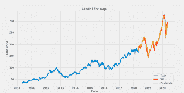
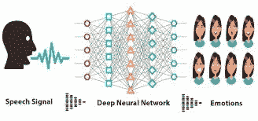
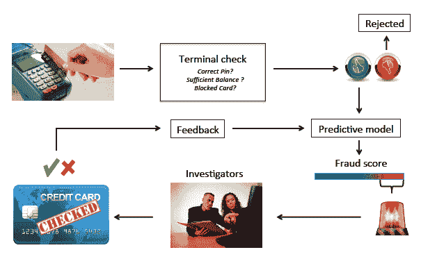

# 2024 年成为数据科学家的前 10 个 Kaggle 机器学习项目

> 原文：[`www.kdnuggets.com/top-10-kaggle-machine-learning-projects-to-become-data-scientist-in-2024`](https://www.kdnuggets.com/top-10-kaggle-machine-learning-projects-to-become-data-scientist-in-2024)

 图片来源：编辑

在不断发展的技术领域，数据科学家和分析师的角色已成为每个组织寻找数据驱动的决策见解的关键。Kaggle 作为一个将数据科学家和机器学习工程师爱好者聚集在一起的平台，成为提高数据科学和机器学习技能的核心平台。随着我们迈入 2024 年，对熟练的数据科学家的需求持续显著上升，使得在这一动态领域加速你的职业发展成为一个绝佳时机。

* * *

## 我们的前三大课程推荐

 1\. [Google 网络安全证书](https://www.kdnuggets.com/google-cybersecurity) - 快速进入网络安全职业道路。

 2\. [Google 数据分析专业证书](https://www.kdnuggets.com/google-data-analytics) - 提升你的数据分析技能

 3\. [Google IT 支持专业证书](https://www.kdnuggets.com/google-itsupport) - 支持你组织的 IT

* * *

因此，在本文中，你将了解从简单到高级的 2024 年十大 Kaggle 机器学习项目，这些项目可以帮助你获得解决数据科学问题的实际经验。通过实施这些项目，你将获得涵盖数据科学各个方面的全面学习体验，从数据预处理和探索性数据分析到机器学习模型部署。

一起探索数据科学的激动人心的世界，将你的技能提升到 2024 年的新高度。

# 简单级别项目

## 项目 1：数字分类系统

**想法：** 在这个项目中，你需要创建一个模型来使用 MNIST 数据集分类手写数字。这个项目是图像分类的基础介绍，通常被认为是深度学习新手的起点。

**数据集：** MNIST 数据集包含手写数字（0-9）的灰度图像。

图片来自 [ResearchGate](https://www.google.com/imgres?imgurl=https%3A%2F%2Fwww.researchgate.net%2Fpublication%2F264273647%2Ffigure%2Ffig1%2FAS%3A295970354024489%401447576239974%2F9-Sample-digits-of-MNIST-handwritten-digit-database.png&tbnid=VrgB5pz5kzBZlM&vet=12ahUKEwiAqe7NlsiCAxWwbGwGHVFQAz8QMygEegQIARBT..i&imgrefurl=https%3A%2F%2Fwww.researchgate.net%2Ffigure%2F9-Sample-digits-of-MNIST-handwritten-digit-database_fig1_264273647&docid=tMdDTMN_8GjFnM&w=396&h=248&q=%3A%20Digit%20Classification%20System%20with%20MNIST%20Datase&client=safari&ved=2ahUKEwiAqe7NlsiCAxWwbGwGHVFQAz8QMygEegQIARBT)

**技术：** 使用如 TensorFlow 或 PyTorch 的框架进行卷积神经网络（CNN）应用。

**实施流程：** 首先，你必须对图像数据进行预处理，设计 CNN 架构，训练模型，并使用准确率和混淆矩阵等指标评估其性能。

**Kaggle 项目链接：** [`www.kaggle.com/code/imdevskp/digits-mnist-classification-using-cnn#`](https://www.kaggle.com/code/imdevskp/digits-mnist-classification-using-cnn#)

## 项目 2：客户分段

**想法：** 在这个项目中，你需要创建一个机器学习模型，根据客户过去的购买行为对客户进行分段，以便当相同的客户再次出现时，系统可以推荐过去的商品来增加销售。通过利用客户分段，组织可以针对所有客户进行有针对性的营销和个性化服务。

**数据集：** 由于这是一个无监督学习问题，因此不需要标签，你可以使用包含客户交易数据的数据集、在线零售数据集或任何与电子商务相关的数据集，如来自 Amazon、Flipkart 等。

**技术：** 使用来自无监督机器学习算法类别的不同聚类算法，如 K-means 或层次聚类（可以是分裂型或聚合型），来根据客户行为进行分段。

**实施流程：** 首先，你需要处理交易数据，包括数据可视化，然后应用不同的聚类算法，基于模型形成的其他聚类可视化客户分段，分析每个分段的特征以获取营销洞察，然后使用不同的指标进行评估，如轮廓系数等。

**Kaggle 项目链接：**

[`www.kaggle.com/code/fabiendaniel/customer-segmentation`](https://www.kaggle.com/code/fabiendaniel/customer-segmentation)

# 中级项目

## 项目 3：假新闻检测

**想法：** 在这个项目中，你需要开发一个机器学习模型，帮助识别从不同社交媒体应用中收集的真实和虚假新闻文章之间的区别，使用自然语言处理技术。这个项目涉及文本预处理、特征提取和分类。

**数据集：** 使用包含标记新闻文章的数据集，例如 Kaggle 上的“假新闻数据集”。

图片来源于 [Kaggle](https://www.google.com/imgres?imgurl=x-raw-image%3A%2F%2F%2F7fc5658dcd3e3b76ba3316d8764ef94821f497ab425a058f002b1747c58c209e&tbnid=djs-zY1lxX8B7M&vet=12ahUKEwjIsYbdiMiCAxW-SGwGHbzYDiEQMygFegQIARA2..i&imgrefurl=https%3A%2F%2Fwww.kaggle.com%2Fcode%2Ftherealsampat%2Ffake-news-detection&docid=9oRzWkwD2VURiM&w=720&h=405&q=%22Fake%20News%20Dataset%22%20kaggle&client=safari&ved=2ahUKEwjIsYbdiMiCAxW-SGwGHbzYDiEQMygFegQIARA2)

**技术：** 自然语言处理库如 NLTK 或 spaCy 以及机器学习算法如朴素贝叶斯或深度学习模型。

**实现流程：** 你将对文本数据进行分词和清理，提取相关特征，训练分类模型，并使用精度、召回率和 F1 分数等指标评估其性能。

**Kaggle 项目链接：** [`www.kaggle.com/code/maxcohen31/nlp-fake-news-detection-for-beginners`](https://www.kaggle.com/code/maxcohen31/nlp-fake-news-detection-for-beginners)

## 项目 4：电影推荐系统

**想法：** 在这个项目中，你必须建立一个推荐系统，该系统根据用户过去的观看记录自动向他们推荐电影或网络剧。Netflix 和 Amazon Prime 等推荐系统在流媒体中广泛使用，以提升用户体验。

**数据集：** 常用数据集包括 MovieLens 或 IMDb，它们包含用户评分和电影信息。

**技术：** 协同过滤算法、矩阵分解和推荐系统框架如 Surprise 或 LightFM。

**实现** **流程：** 你将探索用户与物品的互动，建立推荐算法，使用均方绝对误差等指标评估其性能，并对模型进行微调以获得更好的预测结果。

**Kaggle 项目链接：**

[`www.kaggle.com/code/rounakbanik/movie-recommender-systems`](https://www.kaggle.com/code/rounakbanik/movie-recommender-systems)

## 项目 5：股票价格预测

**想法：** 股票行为有些随机，但通过使用机器学习，你可以通过捕捉数据中的方差来预测近似的股票价格。该项目涉及时间序列分析和预测，以建模多个行业（如银行、汽车等）的不同股票价格的动态。

图片来自[Devpost](https://www.google.com/imgres?imgurl=https%3A%2F%2Fd112y698adiu2z.cloudfront.net%2Fphotos%2Fproduction%2Fsoftware_photos%2F001%2F085%2F421%2Fdatas%2Foriginal.png&tbnid=PqzAsHR1gVcKPM&vet=12ahUKEwjt1sOPiciCAxXXfWwGHWazDygQMygAegQIARBN..i&imgrefurl=https%3A%2F%2Fdevpost.com%2Fsoftware%2Fstock-portfolio-allocation&docid=Ht2ZUrL1Uf9lhM&w=1440&h=736&q=%20Stock%20Price%20Predic&client=safari&ved=2ahUKEwjt1sOPiciCAxXXfWwGHWazDygQMygAegQIARBN)

**数据集：** 你需要股票的历史价格，包括开盘价、最高价、最低价、收盘价、成交量等，以不同时间框架的形式，包括每日价格或逐分钟价格及交易量。

**技术：** 你可以使用不同的技术来分析时间序列模型，如自相关函数和预测模型，包括自回归综合滑动平均（ARIMA）、长短期记忆（LSTM）网络等。

**实施流程：** 首先，你需要处理时间序列数据，包括其分解，如周期性、季节性、随机性等，然后选择合适的预测模型进行训练，最后使用均方误差、平均绝对误差或均方根误差等指标评估模型的性能。

**Kaggle 项目链接：** [`www.kaggle.com/code/faressayah/stock-market-analysis-prediction-using-lstm`](https://www.kaggle.com/code/faressayah/stock-market-analysis-prediction-using-lstm)

# 高级项目

## 项目 6：语音情感识别

**想法：** 在这个项目中，你需要开发一个能够识别口语中不同情感类型的模型，例如愤怒、快乐、疯狂等，这涉及到处理从不同人那里采集的音频数据，并应用机器学习技术进行情感分类。

图片来自[Kaggle](https://www.google.com/imgres?imgurl=https%3A%2F%2Fcamo.githubusercontent.com%2Fd7ecf631b87e28e81820007e46b77650b51e2f756ab90849312b4fb3510371d5%2F68747470733a2f2f692e696d6775722e636f6d2f663154717669542e6a706567&tbnid=iexo9DZRCDnecM&vet=12ahUKEwjpi8_ErMqCAxVwS2wGHYluCLkQMygDegQIARBP..i&imgrefurl=https%3A%2F%2Fwww.kaggle.com%2Fcode%2Franyajumah%2Faudio-analytics-speech-emotion-recognition&docid=pl4z2jnwc2PeFM&w=810&h=380&q=speech%20emotion%20recognition%20dataset&client=safari&ved=2ahUKEwjpi8_ErMqCAxVwS2wGHYluCLkQMygDegQIARBP)

**数据集：** 使用带标签的音频片段数据集，例如包含情感语音记录的“RAVDESS”数据集。

**技术：** 用于特征提取的信号处理技术和用于音频分析的深度学习模型。

**实施** **流程：** 你需要从音频数据中提取特征，设计用于情感识别的神经网络，训练模型，并使用准确率和混淆矩阵等指标评估其性能。

**Kaggle 项目链接:** [`www.kaggle.com/code/shivamburnwal/speech-emotion-recognition`](https://www.kaggle.com/code/shivamburnwal/speech-emotion-recognition)

## 项目 7: 信用卡欺诈检测

**想法**:** 在这个项目中，你需要开发一个机器学习模型来检测欺诈性信用卡交易，这对金融机构来说至关重要，以增强安全性，保护用户免受欺诈活动，并使各种交易环境变得非常便捷。

图片来源于 [ResearchGate](https://www.researchgate.net/figure/The-Credit-Card-Fraud-Detection-Process_fig1_325658124)

**数据集**:** 由于这是一个监督学习问题，你需要收集包含标记的欺诈和非欺诈交易的信用卡交易数据集。

**技术**:** 异常检测算法、分类模型如随机森林或支持向量机，以及用于实现的机器学习框架。

**实施流程**:** 首先，你需要对交易数据进行预处理，训练一个欺诈检测模型，调整参数以优化性能，并使用分类评估指标如精确度、召回率和 ROC-AUC 来评估模型。

**Kaggle 项目链接:**

[`www.kaggle.com/datasets/mlg-ulb/creditcardfraud`](https://www.kaggle.com/datasets/mlg-ulb/creditcardfraud)

## 项目 8: 狗品种分类

**想法**:** 在这个项目中，你必须实现一个深度学习模型，该模型能够根据用户在测试环境中提供的输入图像识别并分类狗的品种。通过探索这个经典的图像分类任务，你将学习深度学习中的一种著名架构，即卷积神经网络（CNN），以及它们在实际问题中的应用。

**数据集**:** 由于这是一个监督学习问题，数据集将包含各种狗品种的标记图像。实现这个任务的一个热门选择是"斯坦福狗数据集"，它在 Kaggle 上免费提供。

图片来源于 [Medium](https://medium.com/nanonets/how-to-easily-build-a-dog-breed-image-classification-model-2fd214419cde)

**技术**:** 根据你的专业知识，可以使用 Python 库和框架如 TensorFlow 或 PyTorch 来实现这个图像分类任务。

**实施** **流程**:** 首先，你需要对图像进行预处理，设计一个包含不同层的卷积神经网络（CNN）架构，训练模型，并使用评估指标如准确率和混淆矩阵来评估模型的性能。

**Kaggle 项目链接:**

[`www.kaggle.com/code/eward96/dog-breed-image-classification`](https://www.kaggle.com/code/eward96/dog-breed-image-classification)

# 创新项目

## 项目 9: 花卉图像分类及部署

**想法：** 在这个项目中，你将学习使用 Gradio 部署机器学习模型的实际操作。这种用户友好的库可以几乎不需要代码即可实现模型部署。这个项目强调通过一个简单的界面使机器学习模型在实时生产环境中可用。

**数据集：** 基于问题描述，从图像分类到自然语言处理任务，你可以选择相应的数据集，并根据不同因素（如预测延迟和准确率等）选择算法，然后进行部署。

**技术：** 使用 Gradio 进行部署，同时使用模型开发所需的库（例如，TensorFlow，PyTorch）。

**实现流程：** 首先，训练一个模型，然后保存权重，这些是帮助进行预测的可学习参数，最后将这些权重与 Gradio 集成，以创建一个简单的用户界面，并部署该模型以进行交互式预测。

**Kaggle 项目链接：** [`www.kaggle.com/code/devsubhash/keras-flower-image-classification-with-gradio`](https://www.kaggle.com/code/devsubhash/keras-flower-image-classification-with-gradio)

## 项目 10: Google 地标识别

**想法：** 在这个项目中，你必须构建一个系统，以从输入图像中识别地标，就像在今天的世界中，你可以使用 Google Lens 来完成相同的任务。这种系统对包括图像检索、增强现实和地理定位服务等不同应用都非常有益。这个项目的主要目标是实现良好的准确率，以便从多样化的图像集中识别地标。

**数据集：** 数据集包含全球各地的地标图像，以便在大数据集上进行训练，使其在实际环境中进行测试时表现更佳。

**技术：** 你可以从卷积神经网络架构开始，或使用一些预训练模型，如 Resnet、InceptionNet 或 EfficientNet，以提高训练模型的准确性。

**实现流程：** 首先，你需要预处理数据，包括从图像中提取特征（以像素形式），然后进行数据增强，例如调整大小和图像归一化。之后，你需要将数据分为训练集和测试集，并根据数据集对模型进行微调。最后，在多样化的图像上测试该模型，并使用评估指标评估其性能。

**Kaggle 项目链接**：

[`www.kaggle.com/competitions/landmark-recognition-2021`](https://www.kaggle.com/competitions/landmark-recognition-2021)

# 总结

总之，探索前 10 个 Kaggle 机器学习项目非常棒。从揭开犬种的神秘面纱和使用 Gradio 部署机器学习模型，到打击假新闻和预测股市价格，每个项目都在数据科学这个多样化的领域中提供了独特的特点。这些项目帮助获得了在解决现实世界挑战中的宝贵见解。

记住，成为 2024 年的数据科学家不仅仅是掌握算法或框架——更是要解决复杂问题、理解多样化的数据集，并不断适应技术的演变。继续探索，保持好奇，让这些项目中的见解指引你在数据科学领域做出有影响力的贡献。祝你在动态而不断扩展的数据科学领域的持续探索之旅一切顺利！

****[Aryan Garg](https://www.linkedin.com/in/aryan-garg-1bbb791a3/)** 是一名电气工程专业的本科生，目前在大四。他对网页开发和机器学习领域感兴趣，并且已经在这方面做了很多探索，渴望在这些方向上继续努力。

### 更多相关话题

+   [2024 年找到工作的 5 个数据分析师项目](https://www.kdnuggets.com/5-data-analyst-projects-to-land-a-job-in-2024)

+   [在 Kaggle 竞赛中获胜的 4 个技巧以及你为什么应该开始](https://www.kdnuggets.com/2022/05/packt-top-4-tricks-competing-kaggle-start.html)

+   [7 个免费 Kaggle 微课程，适合数据科学初学者](https://www.kdnuggets.com/7-free-kaggle-micro-courses-for-data-science-beginners)

+   [最全面的 Kaggle 解决方案和创意列表](https://www.kdnuggets.com/2022/11/comprehensive-list-kaggle-solutions-ideas.html)

+   [Kaggle 竞赛对现实世界问题有用吗？](https://www.kdnuggets.com/are-kaggle-competitions-useful-for-real-world-problems)

+   [深入了解 Kaggle 的 AI 报告 2023 – 了解最新热点](https://www.kdnuggets.com/dive-into-the-future-with-kaggle-ai-report-2023-see-what-hot)
