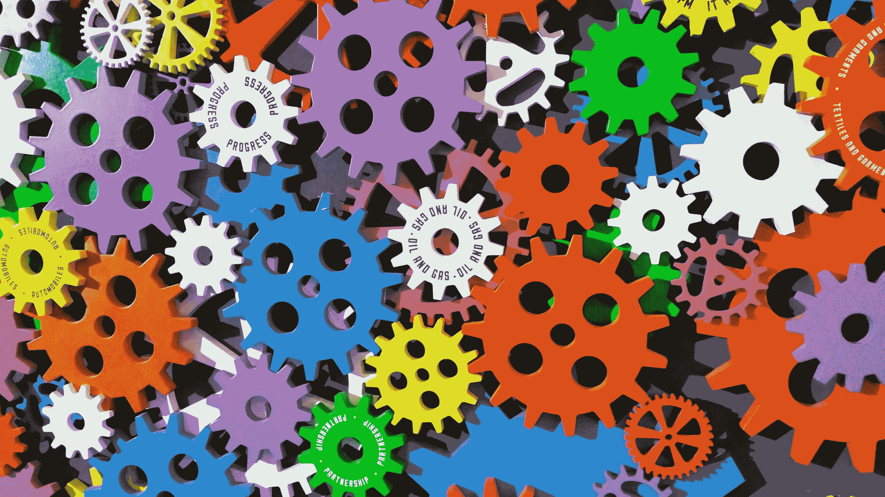
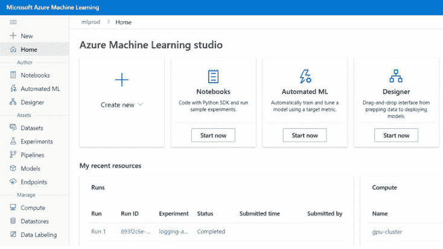
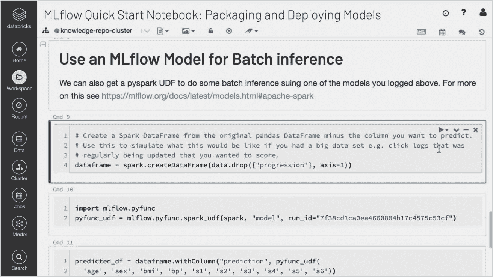
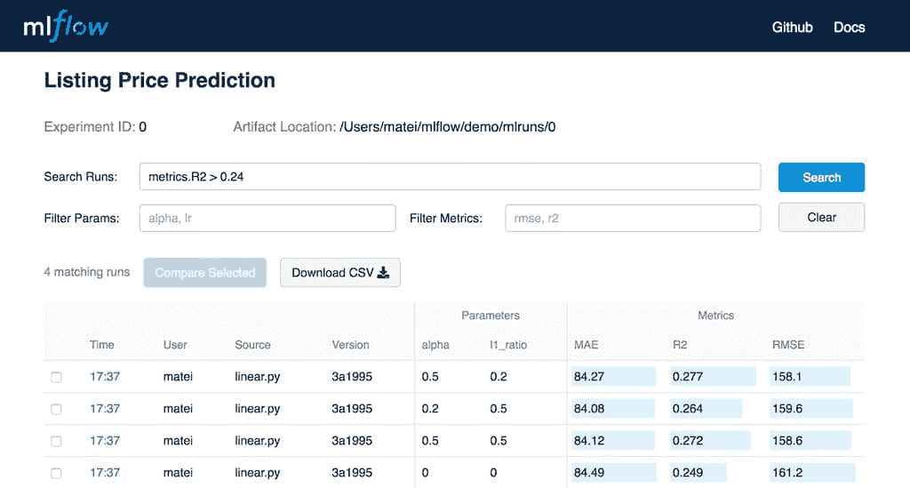
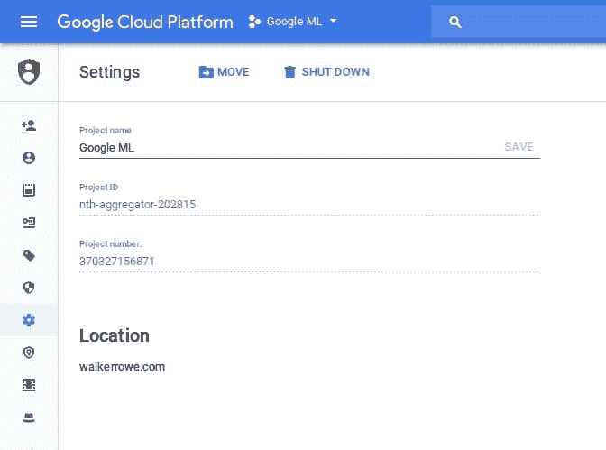
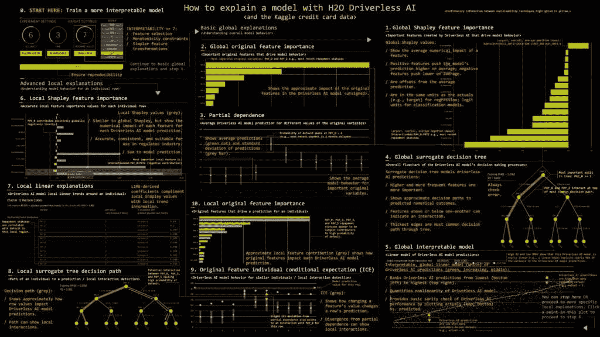
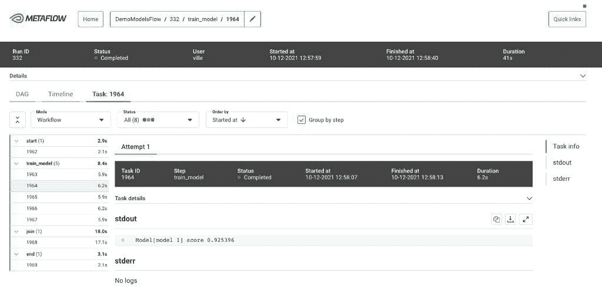

# 优化与管理机器学习生命周期的十大 MLOps 工具

> 原文：[`www.kdnuggets.com/2022/10/top-10-mlops-tools-optimize-manage-machine-learning-lifecycle.html`](https://www.kdnuggets.com/2022/10/top-10-mlops-tools-optimize-manage-machine-learning-lifecycle.html)

图片来源：[Digital Buggu](https://www.pexels.com/photo/colorful-toothed-wheels-171198/)

企业继续改造其运营，以提高生产力并提供难忘的消费者体验。这种数字化转型加快了互动、交易和决策的时间框架。此外，它生成了大量的数据，带来了对运营、客户和竞争的新见解。机器学习帮助公司利用这些数据获得竞争优势。ML（机器学习）模型可以在大量数据中检测模式，使其能够在比人类更大的规模上做出更快、更准确的决策。这使得人类和应用程序能够快速而智能地采取行动。

* * *

## 我们的前三个课程推荐

 1\. [谷歌网络安全证书](https://www.kdnuggets.com/google-cybersecurity) - 快速进入网络安全职业生涯。

 2\. [谷歌数据分析专业证书](https://www.kdnuggets.com/google-data-analytics) - 提升您的数据分析技能

 3\. [谷歌 IT 支持专业证书](https://www.kdnuggets.com/google-itsupport) - 支持您组织的 IT

* * *

随着越来越多的企业尝试使用数据，他们意识到开发一个机器学习（ML）模型只是 ML 生命周期中的众多步骤之一。

# 什么是机器学习生命周期？

机器学习生命周期包括为特定应用开发、部署和维护机器学习模型。典型的生命周期包括：

## 确定商业目标

过程的第一步是确定实施机器学习模型的商业目标。例如，贷款公司可以将预测一定数量贷款申请的信用风险作为商业目标。

## 数据收集与标注

机器学习生命周期的下一个阶段是数据收集与准备，受定义的商业目标指导。这通常是开发过程中的最长阶段。

开发人员将根据机器学习模型的类型选择用于训练和测试的数据集。以信用风险为例。如果贷款人想从扫描的文档中获取信息，他们可以使用图像识别模型；对于数据分析，将是从贷款申请人那里收集的数值或文本数据片段。

数据收集后的关键阶段是注释“整理”。现代人工智能（**AI**）模型需要高度具体的数据分析和指令。注释有助于开发人员提高一致性和准确性，同时减少偏差，以避免在部署后发生故障。

## 模型开发与训练

构建过程是机器学习生命周期中最代码密集的环节。这个阶段主要由开发团队的程序员管理，他们将有效地设计和组装算法。

然而，开发人员必须在训练过程中不断检查情况。尽快检测训练数据中的潜在偏差是至关重要的。假设图像模型无法识别文档，导致其错误分类。在这种情况下，参数应指导模型关注图像中的模式而非像素。

## 测试与验证模型

模型在测试阶段应完全功能正常并按计划运行。训练过程中使用单独的验证数据集进行评估。目标是查看模型如何应对它从未见过的数据。

## 模型部署

训练完成后，终于到了部署机器学习模型的时候。此时，开发团队已经尽力确保模型的最佳功能。该模型可以处理未经整理的低延迟用户数据，并被信任准确评估。

回到信用风险场景中，模型应能可靠地预测贷款违约者。开发人员应对模型能够满足贷款公司期望并正常运行感到满意。

## 模型监控

部署后会跟踪模型的性能，以确保其随时间保持稳定。例如，如果用于贷款违约预测的机器学习模型未经过定期优化，它可能无法检测到新的违约类型。监控模型以发现和修复错误是至关重要的。监控中发现的任何关键结果都可以用来改善模型的性能。

# MLOps 的崛起

如上所述，大规模管理整个生命周期是具有挑战性的。这些挑战与应用开发团队在创建和管理应用程序时面临的挑战相同。DevOps 是在应用程序开发周期中管理操作的行业标准。处理机器学习中的这些挑战，企业必须采取类似 DevOps 的方法来管理 ML 生命周期。这种技术被称为 MLOps。

# 什么是 MLOps？

MLOps 是机器学习 + 操作的缩写。它是一门新兴学科，要求结合数据科学、机器学习、DevOps 和软件开发中的最佳实践。它有助于减少数据科学家与 IT 操作团队之间的摩擦，以改善模型的开发、部署和管理。根据 [Congnilytica](https://twitter.com/cognilytica/status/1245697376028786688)，MLOps 解决方案的市场预计到 2025 年将增长近 40 亿美元。

数据科学家将大部分时间花在为训练准备和清理数据上。此外，训练好的模型需要测试其准确性和稳定性。

这就是 MLOps 工具发挥作用的地方。合适的工具可以帮助您从数据准备到市场准备产品的整个过程管理一切。为了节省您的时间，我整理了一份最佳企业和开源云平台及 [管理机器学习生命周期的框架](https://www.anblicks.com/services/ai-ml/) 的列表。

# 机器学习生命周期管理的前 10 大 MLOps 工具/平台

## 1\. Amazon SageMaker

+   Amazon SageMaker 提供机器学习操作 (MLOps) 解决方案，帮助用户自动化和标准化整个机器学习生命周期中的流程。

+   该平台使数据科学家和机器学习工程师能够通过训练、测试、故障排除、部署和治理机器学习模型来提高生产力。

+   它有助于将机器学习工作流与 CI/CD 管道集成，以减少生产时间。

+   通过优化的基础设施，训练时间可以从小时缩短到分钟。专用工具可以将团队生产力提高多达十倍。

+   它还支持领先的机器学习框架、工具包和编程语言，如 Jupyter、Tensorflow、PyTorch、mxnet、Python、R 等。

+   它具有用于策略管理和执行、基础设施安全、数据保护、授权、认证和监控的安全功能。

来源：亚马逊

## 2\. Azure 机器学习

+   Azure 机器学习服务是一个基于云的数据科学和机器学习平台。

+   借助内置的治理、安全性和合规性，用户可以在任何地方运行机器学习工作负载。

+   快速创建用于分类、回归、时间序列预测、自然语言处理和计算机视觉任务的准确模型。

+   利用 Azure Synapse Analytics，用户可以通过 PySpark 执行交互式数据准备。

+   企业可以利用 Microsoft Power BI 及 Azure Synapse Analytics、Azure Cognitive Search、Azure Data Factory、Azure Data Lake、Azure Arc、Azure Security Centre 和 Azure Databricks 等服务来提升生产力。

来源：微软

**3\. Databricks MLflow**

+   托管的 MLflow 建立在 MLflow 之上，MLflow 是由 Databricks 开发的开源平台。

+   它帮助用户以企业级的可靠性、安全性和规模管理完整的机器学习生命周期。

+   MLFLOW 跟踪使用 Python、REST、R API 和 Java API 自动记录每次运行的参数、代码版本、指标和工件。

+   用户可以记录阶段转换，并在 CI/CD 管道中请求、审查和批准更改，以改善控制和治理。

+   通过访问控制和搜索查询，用户可以在工作区内创建、保护、组织、搜索和可视化实验。

+   通过 Apache Spark UDF 快速在 Databricks 上部署到本地机器或其他生产环境，例如 Microsoft Azure ML 和 Amazon SageMaker，并构建 Docker 镜像进行部署。

来源：Databricks

## 4\. TensorFlow Extended (TFX)

+   TensorFlow Extended 是 Google 开发的生产规模机器学习平台。它提供了用于将机器学习集成到工作流中的共享库和框架。

+   TensorFlow Extended 允许用户在各种平台上编排机器学习工作流程，包括 Apache、Beam 和 KubeFlow。

+   TensorFlow 是提升 TFX 工作流程的高端设计，TensorFlow 帮助用户分析和验证机器学习数据。

+   TensorFlow 模型分析提供了处理大量分布式数据的指标，并帮助用户评估 TensorFlow 模型。

+   TensorFlow Metadata 提供了可以在数据分析过程中手动或自动生成的元数据，这在使用 TF 训练机器学习模型时非常有用。

来源：TensorFlow

## 5\. MLFlow

+   MLFlow 是一个开源项目，旨在为机器学习提供一种通用语言。

+   这是一个用于管理完整机器学习生命周期的框架

+   它为数据科学团队提供了端到端的解决方案

+   用户可以使用在 Amazon Web Services (AWS) 上运行的 Hadoop、Spark 或 Spark SQL 集群轻松管理生产环境或本地的模型。

+   MLflow 提供了一组轻量级 API，可以与任何现有的机器学习应用程序或库（TensorFlow、PyTorch、XGBoost 等）结合使用。

来源：MLFlow

## 6\. Google Cloud ML Engine

+   Google Cloud ML Engine 是一个托管服务，使构建、训练和部署机器学习模型变得容易。

+   它提供了一个统一的接口用于训练、服务和监控 ML 模型。

+   Bigquery 和云存储帮助用户准备和存储数据集。然后，他们可以使用内置功能为数据打标签。

+   Cloud ML Engine 可以执行超参数调整，这会影响预测的准确性。

+   使用带有易用界面的 Auto ML 功能，用户可以无需编写任何代码即可完成任务。此外，用户可以使用 Google Colab 免费运行笔记本。

来源：Google

## 7\. 数据版本控制（DVC）

+   DVC 是一个用 Python 编写的开源数据科学和机器学习工具。

+   它旨在使机器学习模型可共享和可重现。它处理大文件、数据集、机器学习模型、指标和代码。

+   DVC 控制机器学习模型、数据集和中间文件，并将它们与代码连接。文件内容存储在 Amazon S3、Microsoft Azure Blob Storage、Google Cloud Storage、Aliyun OSS、SSH/SFTP、HDFS 等上。

+   DVC 概述了在生产环境中协作、共享发现以及收集和运行完成模型的规则和流程。

+   DVC 可以将 ML 步骤连接成 DAG（有向无环图），并运行整个管道端到端。

来源：DVC

## 8\. H2O Driverless AI

+   H2O Driverless AI 是一个基于云的机器学习平台，允许你通过简单的点击来构建、训练和部署机器学习模型。

+   它支持 R、Python 和 Scala 编程语言。

+   Driverless AI 可以访问各种数据源，包括 Hadoop HDFS、Amazon S3 等。

+   Driverless AI 会根据最相关的数据统计自动选择数据图，开发可视化，并提供基于最重要数据统计的统计显著数据图。

+   Driverless AI 可以用于从数字照片中提取信息。它允许使用单独的照片和与其他数据类型结合的图像作为预测特征。

来源：H2O Driverless AI

## 9\. Kubeflow

+   Kubeflow 是一个云原生的机器学习操作平台 - 管道、训练和部署。

+   它是 Cloud Native Computing Foundation (CNCF) 的一部分，包括 Kubernetes 和 Prometheus。

+   用户可以利用此工具构建自己的 MLOps 堆栈，使用 Google Cloud 或 Amazon Web Services (AWS) 等云提供商。

+   Kubeflow Pipelines 是一个全面的解决方案，用于部署和管理端到端的 ML 工作流。

+   它还扩展了对 PyTorch、Apache MXNet、MPI、XGBoost、Chainer 等的支持。它还与 Istio、Ambassador（用于入口）和 Nuclio（用于管理数据科学管道）集成。

来源：Kubeflow

## 10\. Metaflow

+   Metaflow 是 Netflix 创建的一个基于 Python 的库，帮助数据科学家和工程师管理现实世界项目，提高生产力。

+   它提供了一个统一的 API 堆栈，这对于从原型到生产环境的数据科学项目的执行是必需的。

+   用户可以高效地训练、部署和管理 ML 模型；Metaflow 集成了基于 Python 的机器学习、Amazon SageMaker、深度学习和大数据库。

+   Metaflow 包含一个图形用户界面，帮助用户将工作环境设计为有向无环图（D-A-G）。

+   它可以自动版本化和跟踪所有实验和数据。

来源：Metaflow

# 市场新动态

## Snowpark by Snowflake

+   Snowpark for Python 提供了一种简单的方法，让数据科学家可以对 Snowflake 数据仓库执行 DataFrame 风格的编程。

+   它可以建立完整的机器学习管道以定期运行。

+   Snowpark 在机器学习生命周期的最后两个阶段（模型部署和监控）中扮演了重要角色。

+   Snowpark 提供了一个易于使用的 API 用于在数据管道中查询和处理数据。

+   自引入以来，Snowpark 已经发展成最好的数据应用之一，使开发人员能够轻松构建复杂的数据管道。

+   凭借 Snowflake 对未来的愿景和可扩展的支持，该应用将成为解决未来几年复杂数据和机器学习问题的最佳选择。

# 结论

每个企业都在向成为全面机器学习企业的方向发展。合适的工具可以帮助组织管理从数据准备到市场准备产品的所有环节。这些工具还可以帮助自动化重复的构建和部署任务，减少错误，以便你可以专注于更重要的任务，如研究。企业在选择 MLOps 工具时必须考虑团队规模、价格、安全性和支持，并更好地理解其可用性。

[**Saikiran Bellamkonda**](https://www.linkedin.com/in/saikiran-bellamkonda/) 是一名数字营销高手和技术营销作家。他运用自己深厚的知识和经验撰写关于 ML 和 AI 技术的文章。一个积极的学习者，寻求扩展自己的技术知识和写作技能，同时指导他人。

### 相关主题

+   [机器学习生命周期](https://www.kdnuggets.com/2022/06/making-sense-crispmlq-machine-learning-lifecycle-process.html)

+   [如何优化 SQL 查询以加快数据检索](https://www.kdnuggets.com/2023/06/optimize-sql-queries-faster-data-retrieval.html)

+   [如何优化 Dockerfile 指令以加快构建时间](https://www.kdnuggets.com/how-to-optimize-dockerfile-instructions-for-faster-build-times)

+   [5 个最佳端到端开源 MLOps 工具](https://www.kdnuggets.com/5-best-end-to-end-open-source-mlops-tools)

+   [有没有办法弥合 MLOps 工具差距？](https://www.kdnuggets.com/2022/08/way-bridge-mlops-tools-gap.html)

+   [通过获取网络安全硕士学位，做好应对威胁的准备…](https://www.kdnuggets.com/2022/07/baypath-prepared-manage-threat-ms-cybersecurity.html)
