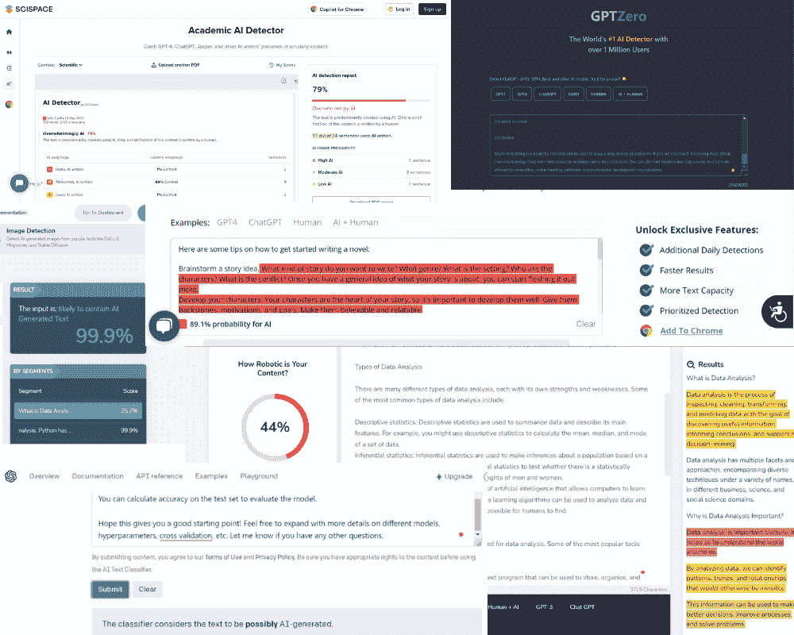
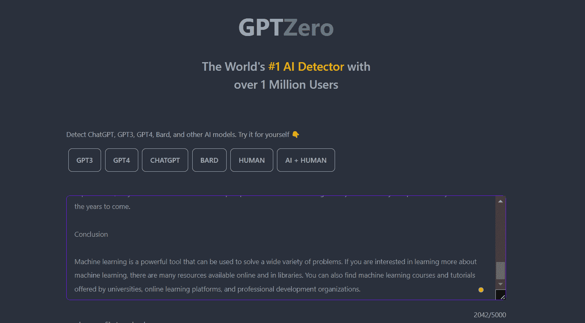
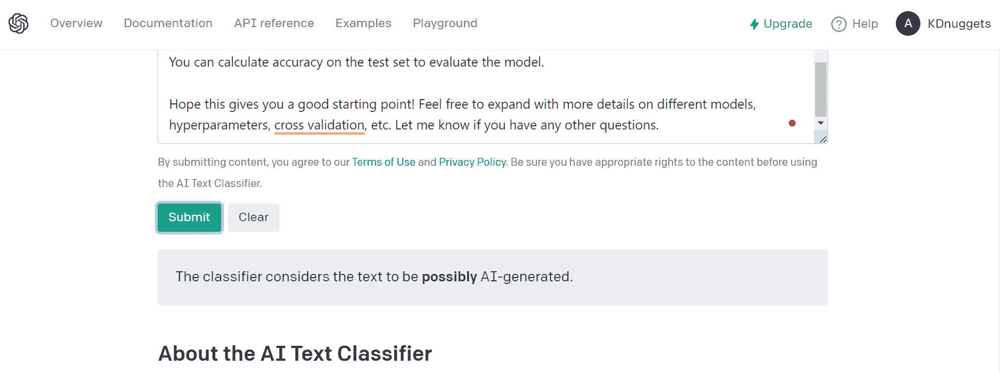
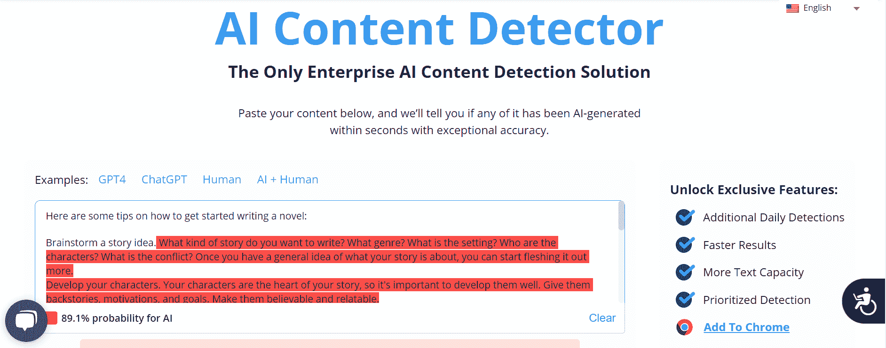
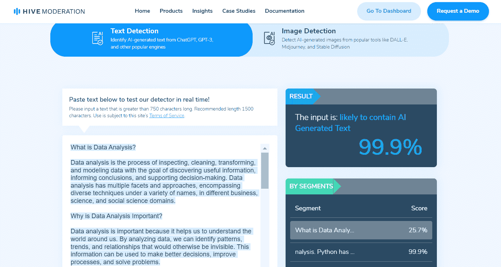
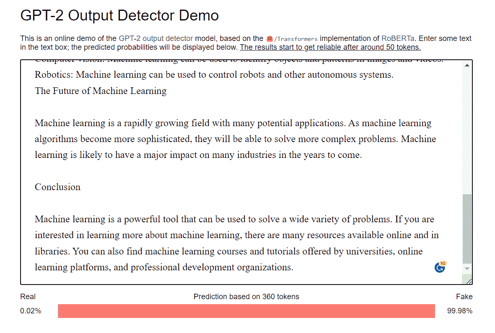
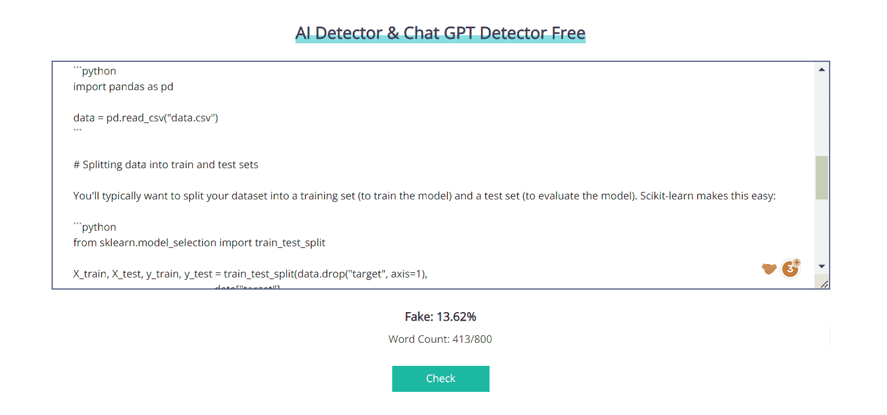
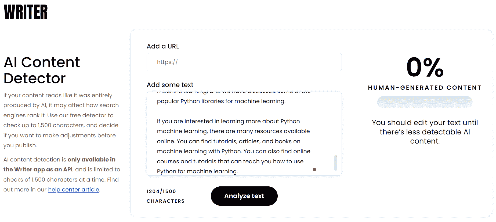

# 检测 ChatGPT、GPT-4、Bard 和 Claude 的十大工具

> 原文：[`www.kdnuggets.com/2023/05/top-10-tools-detecting-chatgpt-gpt4-bard-llms.html`](https://www.kdnuggets.com/2023/05/top-10-tools-detecting-chatgpt-gpt4-bard-llms.html)

图片作者：作者

我们生活在一个人工智能（AI）繁荣的时代，每周都有新的可以像人类一样写作的大型语言模型（LLMs）发布。这些模型可以生成高度创意的内容，不幸的是，一些学生和专业人士正在滥用这些工具进行抄袭。

* * *

## 我们的前三个课程推荐

 1\. [谷歌网络安全证书](https://www.kdnuggets.com/google-cybersecurity) - 快速进入网络安全职业的捷径。

 2\. [谷歌数据分析专业证书](https://www.kdnuggets.com/google-data-analytics) - 提升你的数据分析技能

 3\. [谷歌 IT 支持专业证书](https://www.kdnuggets.com/google-itsupport) - 支持你的组织的 IT

* * *

因此，AI 检测工具已经成为每个教室、工作场所和研究机构的必备工具。本博客中提到的所有工具都是免费的，其中一些甚至带有 Chrome 扩展，以便你可以随时检测内容。

# 1\. GPTZero

[GPTZero](https://gptzero.me/) 已显著提升。它现在具有很高的准确性，易于使用，并且配有 Chrome 扩展。你可以使用它检测各种 AI 生成的文本，包括来自最新模型如 Bard (PalM 2)、ChatGPT、GPT-4 和其他开源模型的文本。它也很快，并且突出显示生成的文本以便于识别。

图片来源：GPTZero

# 2\. OpenAI AI 文本分类器

OpenAI 的 [AI 文本分类器](https://platform.openai.com/ai-text-classifier) 非常准确，但它不提供有关内容的额外信息。我每天都在使用它来维持质量保证，对结果感到满意。它适用于 New Bard、ChatGPT、GPT-4 和其他基于 LLaMA 的模型。

图片来源：OpenAI

# 3\. CopyLeaks

我在 Reddit 的 r/freelanceWriters 子版块中由一位用户介绍了 [CopyLeaks](https://copyleaks.com/ai-content-detector)。这是一个快速、准确的抄袭检查工具，配有一个简单的 Chrome 扩展。你甚至可以悬停在高亮的文本上以检查 AI 的流行度。它可以检测 Bard、ChatGPT、GPT-4 和其他大型语言模型（LLMs）。

图片来源：CopyLeaks

# 4. SciSpace

SciSpace 的[学术 AI 检测器](https://typeset.io/ai-detector)与我提到的其他工具略有不同。它非常准确，但专门设计用于检测 PDF 中的学术内容。目前没有复制粘贴的选项，但技术团队正在努力添加该功能。你可以上传任何类型的学术工作作为 PDF，SciSpace 将生成结果。

我用 Bard、ChatGPT 和 HuggingChat 生成的内容测试了 SciSpace，它准确地检测出了所有内容。

来自 SciSpace 的图片

# 5. Hive Moderation

Hive Moderation 的[AI 生成内容检测](https://hivemoderation.com/ai-generated-content-detection)有时会将人工生成的内容误识别为 AI 生成。为了确保结果可靠，建议在将其作为主要资源使用时备有备用工具。AI 生成内容检测提供带有概率百分比和分段的结果。此外，它还提供了检测来自 DALL-E、Midjourney 和 Stable Diffusion 等平台的 AI 生成图像的能力。

来自 Hive Moderation 的图片

# 6. Content at Scale

[Content at Scale 的 AI 内容检测器](https://contentatscale.ai/ai-content-detector/)使用简单，并且能提供关于可预测性、概率和模式的相当准确的报告。它兼容所有最新的大型语言模型（LLMs），并根据 AI 生成工作的变量概率突出显示内容。

来自 Content at Scale 的图片

# 7. Hello Simple AI

Hello Simple AI 的[ChatGPT 检测器](https://hello-simpleai-chatgpt-detector-ling.hf.space/)是一个免费的开源工具，可以用于检测由 ChatGPT 生成的文本。它托管在 Hugging Face Spaces 上，提供快速且相当准确的结果。该检测器的准确性不如 OpenAI 分类器，但提供了两个指标（GLTR 和 PPL 概率），可以帮助你判断内容是否由 AI 生成。

来自 Hugging Face 的图片

# 8. OpenAI HF Detector

[OpenAI 检测器](https://openai-openai-detector.hf.space/)是一个免费的开源工具，可用于检测由 OpenAI 的 GPT 语言模型生成的文本。它托管在 Hugging Face Spaces 上，并提供快速的结果。然而，该检测器可能非常不准确，尤其是在检测 OpenAI 模型的新版本和其他开源大型语言模型时。

来自 Hugging Face 的图片

# 9. Corrector.app

Corrector.app 的 [AI 检测器](https://corrector.app/ai-content-detector/) 是一个相当准确的工具，可以用来检测由 ChatGPT、Bard 和其他旧版本的大型语言模型（LLMs）生成的文本。然而，它无法检测更新版本的 LLM。这是因为 AI 检测器通过分析文本的语法和语义来工作，而更新的 LLM 更擅长生成无法与人类编写的文本区分开的文本。

图片来自 Corrector.app

# 10\. Writer.com

Writer.com 的 [AI 内容检测器](https://writer.com/ai-content-detector/) 完成了我们的列表，它被认为是最不准确的选项，字符限制为 1500。它作为备用解决方案，当其他工具不可用或无效时可以使用。

图片来自 Writer.com

**[Abid Ali Awan](https://www.polywork.com/kingabzpro)** ([@1abidaliawan](https://twitter.com/1abidaliawan)) 是一位认证的数据科学专家，热衷于构建机器学习模型。目前，他专注于内容创作和撰写有关机器学习和数据科学技术的技术博客。Abid 拥有技术管理硕士学位和电信工程学士学位。他的愿景是使用图神经网络构建一个 AI 产品，帮助那些在心理健康方面挣扎的学生。

### 更多相关话题

+   [检测 ChatGPT、GPT3 和 GPT2 的 5 个免费工具](https://www.kdnuggets.com/2023/02/5-free-tools-detecting-chatgpt-gpt3-gpt2.html)

+   [8 款开源替代 ChatGPT 和 Bard 的工具](https://www.kdnuggets.com/2023/04/8-opensource-alternative-chatgpt-bard.html)

+   [ChatGPT 与 Google Bard：技术差异对比](https://www.kdnuggets.com/2023/03/chatgpt-google-bard-comparison-technical-differences.html)

+   [ChatGPT 与 BARD](https://www.kdnuggets.com/chatgpt-vs-bard)

+   [ChatGPT 被取代：Claude 如何成为新的 AI 领袖](https://www.kdnuggets.com/2023/07/chatgpt-dethroned-claude-became-new-ai-leader.html)

+   [超级 Bard：能够做得更好的一切 AI](https://www.kdnuggets.com/2023/05/super-bard-ai-better.html)
