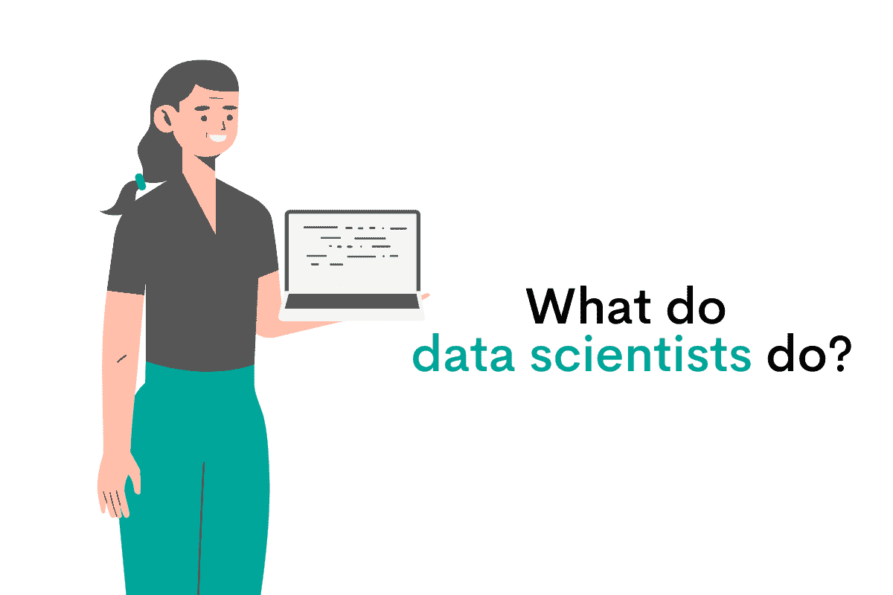
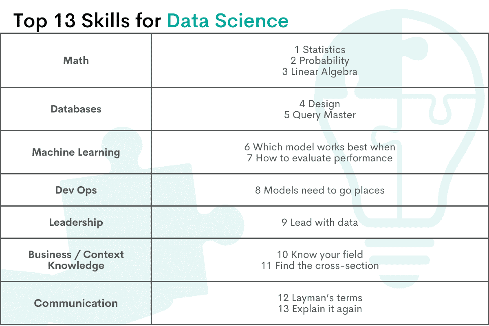

# 每位数据科学家应具备的 13 项顶级技能

> 原文：[`www.kdnuggets.com/2022/03/top-13-skills-every-data-scientist.html`](https://www.kdnuggets.com/2022/03/top-13-skills-every-data-scientist.html)

无论你是已经挤身数据科学领域还是希望进入这个领域，数据科学都是无需正式数据科学教育就能进入的最佳行业之一。如果你能够在没有获得正式学位的情况下培养出工作所需的技能和知识，大多数科技公司乐意让你在技术面试中证明自己，然后录用你。

* * *

## 我们的前 3 名课程推荐

 1\. [谷歌网络安全证书](https://www.kdnuggets.com/google-cybersecurity) - 快速进入网络安全职业轨道。

 2\. [谷歌数据分析专业证书](https://www.kdnuggets.com/google-data-analytics) - 提升你的数据分析技能

 3\. [谷歌 IT 支持专业证书](https://www.kdnuggets.com/google-itsupport) - 支持你的组织的 IT 需求

* * *

然而，没有相关领域的正式学位，很难知道你需要了解什么。这些技术面试会涉及哪些数据科学技能？获得这些知识或能力的最佳途径是什么？

让我带你深入了解你应该具备的 13 项数据科学技能，以[成为成功的数据科学家](https://www.stratascratch.com/blog/how-to-become-a-data-scientist-from-scratch/?utm_source=blog&utm_medium=click&utm_campaign=kdnuggets)。按照这个大纲，你将拥有一个易于消化的步骤路径来教育自己，并[为申请数据科学家职位做好准备](https://www.stratascratch.com/blog/5-tips-to-prepare-for-a-data-science-interview/?utm_source=blog&utm_medium=click&utm_campaign=kdnuggets)。

# 什么是数据科学？

每天，大约产生 2.5 quintillion 字节的数据，到 2025 年将达到 175 zettabytes 的数据。这些信息的洪流包含强大的见解，可以帮助推动全球变化，从减少碳排放到最大化公司的利润。数据科学旨在尝试理解这些数字并提供可操作的见解，以帮助组织。数据科学家可能会分析 A/B 实验的结果，以优化用户体验，或者确定哪些广告活动或组合能更有效地增加产品销量。

# 数据科学家做什么？

数据科学家参与从获取数据到为非技术同事生成易于理解的报告的整个过程。数据科学家全程参与数据科学生命周期。数据科学家构建数据管道，结合各种数据源以收集必要的信息。然后，他们清理数据以准备分析。统计分析用于从数据中提取汇总信息。

有时数据科学家还会构建机器学习模型，而在这样做时，他们还必须评估、部署和维护这些机器学习模型，以扩展其影响力和相关性。数据科学家还负责将这些从数据中获得的知识转达给非技术人员，通常以可视化和行动项的形式呈现。这些呈现可以是可视化图、报告、仪表盘或演示文稿。

要深入理解这一点，我们编写了一份*终极指南*，帮助你了解数据科学的全过程 → *“*[*数据科学家做什么？*](https://www.stratascratch.com/blog/what-does-a-data-scientist-do/?utm_source=blog&utm_medium=click&utm_campaign=kdnuggets)*”*。

# 数据科学的前 13 项技能

## 数学

数学是所有数据科学形式的基础构件。无论你是在寻找数据集的中位数、开发机器学习模型，还是识别 A/B 实验处理是否对指标有显著影响，你都需要精通统计学、概率论和线性代数。

### 1\. 统计学

统计学是分析 A/B 实验所需的数据科学家必备技能之一。你需要回答这样的问题，比如，样本量需要多大才能证明结果是显著的？均值、方差和标准差，以及诸如总体和样本等概念，都是从数据中提取显著意义的关键部分。你应该熟悉描述性统计和推断统计。

### 2\. 概率

概率在分析受偶然因素影响的数据时是一个重要的数据科学家技能。概率论允许对偶然事件进行分析。变量的概率分布在预测分析中起着关键作用。

### 3\. 线性代数

线性代数是机器学习和许多高阶矩阵工作的数学基础。为了有效使用任何机器学习算法，你需要理解其背后的数学，特别是线性代数，以了解所做的假设和存在的不足。

## 数据库

数据库是存储数据科学家所需“空气”的美丽、优雅的构造。在大数据的世界里，数据库对存储、更新和操作大型数据集至关重要。作为数据科学家，你应该在理论和实践层面上对数据库感到非常舒适。

### 4. 设计

数据只有在组织良好且干净时才有效。虽然数据或解决方案架构师可能是实际设计数据库的人，但你应该了解数据库为何以特定方式组织及设计策略。了解如何在特定结构中正确存储数据以构建你的模型。

### 5. 查询大师

SQL、KQL、范围脚本等——你应该熟练掌握任何/所有流行的查询语言。合作团队将需要你快速估算应该朝哪个方向前进。在紧急情况下提取一些干净、准确的汇总数据可以极大提高依赖你的人员的生产力，并且是推动组织内数据驱动决策的一个极好且便利的方法。

## 机器学习

尽管并非所有数据科学职位都要求你在设计、开发和评估机器学习模型方面感到舒适，但这确实是行业发展的方向。如果你尚未熟练掌握机器学习模型，我建议你花时间掌握这些技能，因为它们对确保你未来的工作安全和保持技能相关性大有帮助。

### 6. 哪种模型在何时效果最佳

了解哪种机器学习模型在特定情况下效果最佳，取决于你处理的数据是否有标签、无标签、是二进制数据集还是多分组数据集。如果数据是文字、数字、图像等，这也会影响你如何调整和选择模型以最大化性能。

### 7. 如何评估性能

为了确定你的模型表现如何，你必须能够正确评估它。了解[测试数据和训练数据](https://developers.google.com/machine-learning/crash-course/training-and-test-sets/splitting-data)之间的差异、将源数据分为这两种类型的策略，以及在开发和性能评估周期中何时使用每一组数据。

## Dev Ops

如果你在数据科学工作中不涉及开发机器学习模型，那么你不必担心部署它们。然而，商业影响的最大潜力在于创建实时预测模型。掌握这些技能是值得的，因为它将显著增加你工作的影响力。

### 8. 模型需要部署

对于开发机器学习模型的数据科学家，你需要分享你的模型。如果你可以预测用户回应广告的可能性，那么如果预测可以实时生成并通过 API 调用访问，这些知识会更有用。你不仅可以向公司项目经理提供下一个开发领域的想法，还可以为每个最终用户量身定制产品，以最大化参与度、购买量、留存率等。提供实时预测使你能够将数据科学融入产品中。

## 领导力

### 9\. 以数据为主导

当你将发现传达给公司其他部门时，他们可能会试图将你的话与他们自己的截止日期、优先事项等结合起来。确保你花时间了解他们的情况，以及你的见解如何帮助他们最大化业务影响。数据驱动的决策更可能带来结果，而你的工作是帮助周围的人理解这一点。

## 业务/背景知识

### 10\. 了解你的领域

你需要了解你所处理数据的背景。如果你查看的是 CT 扫描的图像或超市收据，从这些数据集中提取的数字和不同属性可能意味着非常不同的东西。你应该致力于成为你数据来源的专家，因为这种背景知识将帮助你为分析找到正确的方向。这种知识也将帮助你识别和挑战你的假设，或者至少对其进行考虑。

### 11\. 寻找交集

你需要弄清楚你的技术知识如何与所工作业务领域相结合。一旦你能够识别这种交集，你可以着手寻找新的数据来源，并提出有洞察力的方法来增强你的数据。

## 沟通

### 12\. 通俗易懂

你的数字和脚本必须输出指导整个团队、部门甚至公司的行动的词汇。了解业务和了解技术同样重要，以便与非技术人员成功沟通。你作为数据科学家的工作是提取组织数据的价值，以改善产品、公司的流程以及员工的生活。找到传达发现的方式，使周围的人理解其重要性以及应采取的行动。

### 13\. 再解释一遍

知道何时强调和重申重要的事情。重复是帮助人们理解复杂概念的重要工具。将所有这些复杂的、精细的结果和模型简化为公司可控的最重要项目。你可能已经花费了大量精力来规范数据集并控制各种因素，但关键在于这些数字和方程式对那些试图改善最终用户产品或服务的人意味着什么。

## 关于数据科学家重要技能的最终思考

技术数据科学技能是数据科学家工作的基础。虽然数学分析和编码通常被认为是数据科学家最重要的任务，但能够沟通这些发现的意义以及应采取什么措施以推动正确方向同样重要。数据科学家的**终极**责任是使数据对公司有价值，而唯一的方式是提取可以转化为可衡量的行动项目的洞察，这些行动项目可以通过指标跟踪。做数据驱动决策的倡导者，并向你的组织证明通过数据科学推动产品、内部流程和几乎所有领域的改进的价值。

我们还推荐查看我们的 [数据科学家技能终极指南](https://www.stratascratch.com/blog/what-skills-do-you-need-as-a-data-scientist/?utm_source=blog&utm_medium=click&utm_campaign=kdnuggets)，了解什么能让你保持工作并在数据科学领域取得进步。

**[内特·罗西迪](https://www.stratascratch.com)** 是一位数据科学家，专注于产品策略。他还是一名兼职教授，教授分析课程，并且是 [StrataScratch](https://www.stratascratch.com/)、一个帮助数据科学家准备面试的问题平台的创始人。通过 [Twitter: StrataScratch](https://twitter.com/StrataScratch) 或 [LinkedIn](https://www.linkedin.com/in/nathanrosidi/) 与他联系。

### 了解更多相关主题

+   [KDnuggets 新闻 3 月 30 日：最受欢迎的编程入门…](https://www.kdnuggets.com/2022/n13.html)

+   [每个数据分析师都应该拥有的前 5 个书签](https://www.kdnuggets.com/2022/09/top-5-bookmarks-every-data-analyst.html)

+   [3 种宝贵技能使我的数据科学家收入翻倍](https://www.kdnuggets.com/2022/10/3-valuable-skills-doubled-income-data-scientist.html)

+   [每个机器学习工程师应掌握的 5 种机器学习技能…](https://www.kdnuggets.com/2023/03/5-machine-learning-skills-every-machine-learning-engineer-know-2023.html)

+   [未来数据游戏的准备：2023 年每个数据科学家需要的顶级技能](https://www.kdnuggets.com/futureproof-your-data-game-top-skills-every-data-scientist-needs-in-2023)

+   [每个数据科学家需要的软技能](https://www.kdnuggets.com/soft-skills-every-data-scientist-needs)
