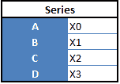
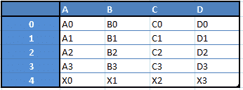
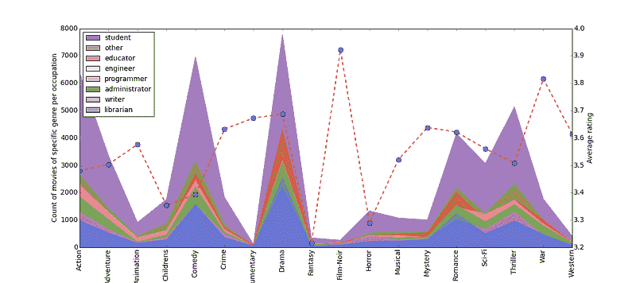
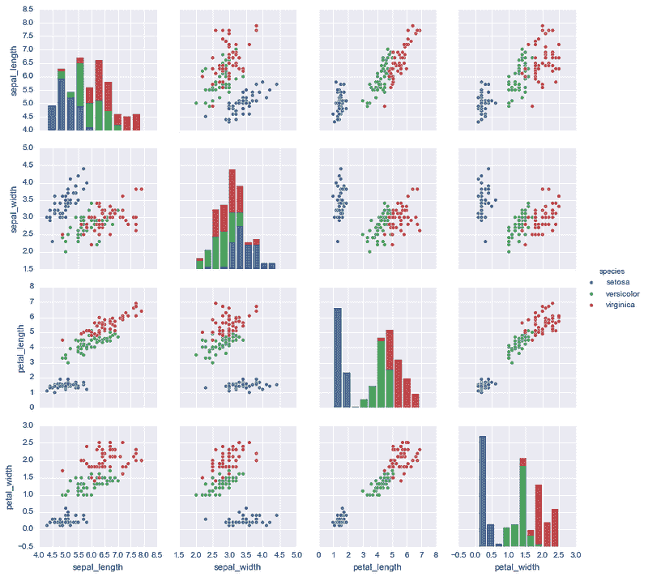
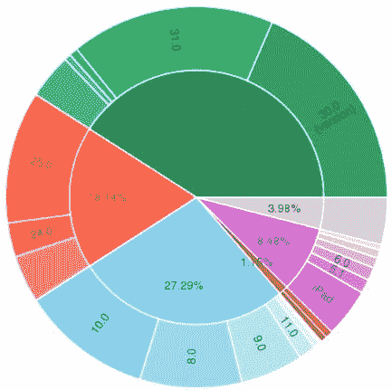

# 2017 年数据科学的 15 个顶级 Python 库

> 原文：[`www.kdnuggets.com/2017/06/top-15-python-libraries-data-science.html`](https://www.kdnuggets.com/2017/06/top-15-python-libraries-data-science.html)

**由 Igor Bobriakov，ActiveWizards。**

由于 Python 在数据科学行业近年来获得了广泛关注，我想基于近期的经验概述一些对数据科学家和工程师最有用的库。

* * *

## 我们的前三名课程推荐

 1\. [谷歌网络安全证书](https://www.kdnuggets.com/google-cybersecurity) - 快速开启网络安全职业之路。

 2\. [谷歌数据分析专业证书](https://www.kdnuggets.com/google-data-analytics) - 提升你的数据分析水平

 3\. [谷歌 IT 支持专业证书](https://www.kdnuggets.com/google-itsupport) - 支持组织的 IT

* * *

由于所有这些库都是开源的，我们添加了来自 Github 的提交次数、贡献者数量和其他指标，这些可以作为库受欢迎程度的代理指标。

### 核心库。

### 1\. NumPy（提交次数：15980，贡献者：522）

当开始处理 Python 中的科学任务时，人们不可避免地会求助于 Python 的 SciPy Stack，这是一组专门为科学计算设计的软件（不要与 SciPy 库混淆，后者是该堆栈的一部分，还有围绕该堆栈的社区）。我们希望从这里开始。然而，堆栈非常庞大，其中包含十多个库，我们希望重点关注核心包（尤其是最重要的那些）。

最基础的包是 NumPy（即 Numerical Python）。它提供了大量用于 Python 中 n 维数组和矩阵操作的有用功能。该库提供了对 NumPy 数组类型的数学操作的矢量化，这改善了性能，并相应地加速了执行。

### 2\. SciPy（提交次数：17213，贡献者：489）

SciPy 是一个用于工程和科学的软件库。你需要理解 SciPy Stack 和 SciPy Library 之间的区别。SciPy 包含线性代数、优化、积分和统计的模块。SciPy 库的主要功能是建立在 NumPy 之上的，因此其数组大幅使用 NumPy。它通过特定的子模块提供高效的数值例程，如数值积分、优化等。SciPy 所有子模块中的函数都经过良好文档记录——这是其另一大优点。

### 3\. Pandas（提交次数：15089，贡献者：762）

Pandas 是一个 Python 包，旨在使处理“标签化”和“关系型”数据变得简单直观。Pandas 是数据整理的完美工具，旨在快速且轻松地进行数据操作、聚合和可视化。

该库中有两个主要的数据结构：

**“Series”**——一维

**“数据框架”**，二维

例如，当你想从这两种类型的结构中接收新的 DataFrame 时，你可以通过将一行追加到 DataFrame 中来获得这样的 DF，方法是传递一个 Series：

这里仅列出一些你可以使用 Pandas 做的事情：

+   轻松删除和添加 DataFrame 中的列

+   将数据结构转换为 DataFrame 对象

+   处理缺失数据，表示为 NaNs

+   强大的分组功能

### Google Trends 历史

trends.google.com

### GitHub 拉取请求历史

datascience.com/trends

### 可视化。

### 4. Matplotlib（提交次数：21754，贡献者：588）

另一个 SciPy Stack 核心包和另一个专门用于生成简单而强大的可视化的 Python 库是 Matplotlib。它是一个顶尖的软件，使 Python（在 NumPy、SciPy 和 Pandas 的帮助下）成为与 MatLab 或 Mathematica 等科学工具的有力竞争者。

然而，该库比较底层，这意味着你需要编写更多代码才能达到高级可视化水平，通常比使用更高级的工具需要更多的努力，但总体努力是值得的。

通过一点努力，你可以制作几乎所有的可视化：

+   线图；

+   散点图；

+   条形图和直方图；

+   饼图；

+   茎叶图；

+   等高线图；

+   箭头图；

+   频谱图。

Matplotlib 还提供了创建标签、网格、图例和许多其他格式化实体的功能。基本上，一切都是可定制的。

该库受不同平台支持，并使用不同的 GUI 工具包来展示结果可视化。各种 IDE（如 IPython）支持 Matplotlib 的功能。

还有一些附加库可以使可视化变得更加容易。

### 5. Seaborn（提交次数：1699，贡献者：71）

Seaborn 主要集中于统计模型的可视化；这种可视化包括热图，这些图总结数据但仍然描绘整体分布。Seaborn 基于 Matplotlib，并且高度依赖于它。

### 6. Bokeh（提交次数：15724，贡献者：223）

另一个出色的可视化库是 Bokeh，旨在提供交互式可视化。与之前的库不同，它不依赖于 Matplotlib。正如我们之前提到的，Bokeh 的主要关注点是交互性，并通过现代浏览器以 Data-Driven Documents (d3.js) 风格进行展示。

### 更多相关主题

+   [使用管道编写干净的 Python 代码](https://www.kdnuggets.com/2021/12/write-clean-python-code-pipes.html)

+   [每个数据科学家都应了解的三个 R 库（即使你使用 Python）](https://www.kdnuggets.com/2021/12/three-r-libraries-every-data-scientist-know-even-python.html)

+   [建立一个稳固的数据团队](https://www.kdnuggets.com/2021/12/build-solid-data-team.html)

+   [成为优秀数据科学家所需的 5 项关键技能](https://www.kdnuggets.com/2021/12/5-key-skills-needed-become-great-data-scientist.html)

+   [每个初学者数据科学家都应掌握的 6 种预测模型](https://www.kdnuggets.com/2021/12/6-predictive-models-every-beginner-data-scientist-master.html)

+   [2021 年最佳 ETL 工具](https://www.kdnuggets.com/2021/12/mozart-best-etl-tools-2021.html)
