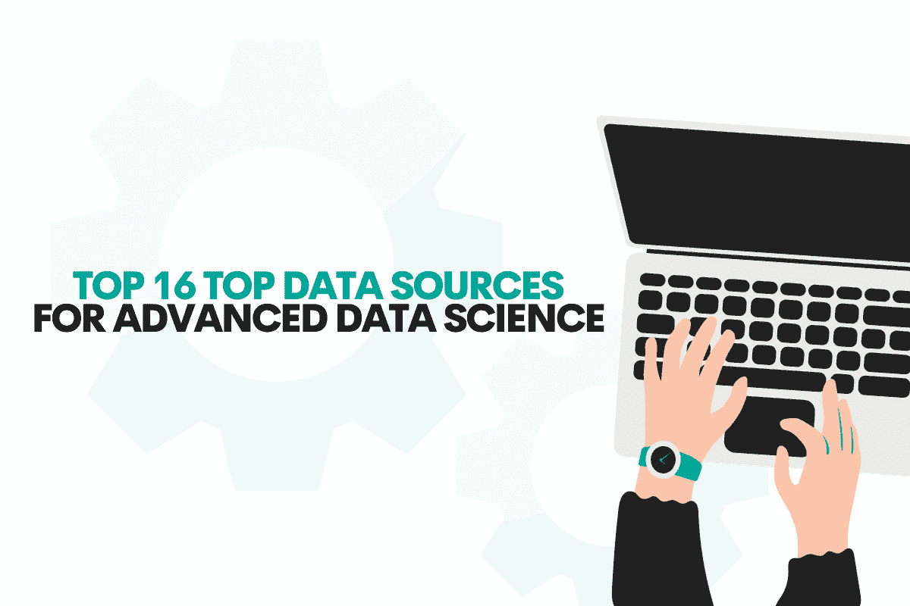
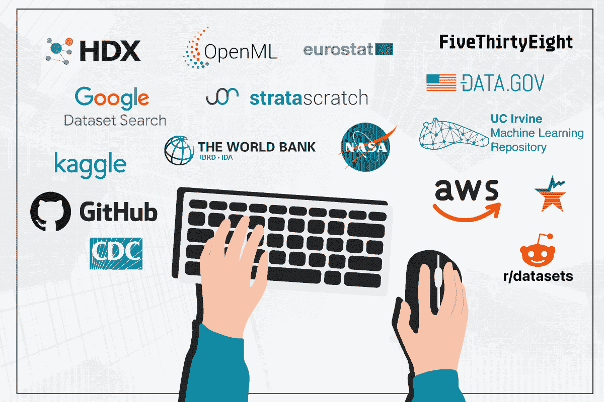

# 高级数据科学项目的 16 个顶级技术数据源

> 原文：[`www.kdnuggets.com/top-16-technical-data-sources-for-advanced-data-science-projects`](https://www.kdnuggets.com/top-16-technical-data-sources-for-advanced-data-science-projects)

图片由作者提供

你已经在这些页面上读到（我也写了一些这样的文章）数据科学项目对于发展完整的数据科学技术技能包至关重要。这是事实，它们确实如此。但同样重要的是为你的数据科学项目拥有高质量的数据集。收集优质数据只是[数据科学项目的一个阶段](https://www.stratascratch.com/blog/from-data-collection-to-model-deployment-6-stages-of-data-science-project/?utm_source=blog&utm_medium=click&utm_campaign=kdn+16+websites+for+ds+projects)，但却是决定项目成败的关键阶段。

* * *

## 我们的前三个课程推荐

 1\. [Google 网络安全证书](https://www.kdnuggets.com/google-cybersecurity) - 快速进入网络安全职业。

 2\. [Google 数据分析专业证书](https://www.kdnuggets.com/google-data-analytics) - 提升你的数据分析技能

 3\. [Google IT 支持专业证书](https://www.kdnuggets.com/google-itsupport) - 支持你的组织 IT 工作

* * *

问题是，在哪里找到这些该死的数据？幸运的是，许多网站提供了丰富的数据，适用于各种目的。

图片由作者提供

# 1\. Kaggle

你听说过[Kaggle](https://www.kaggle.com)，它可能是数据科学社区中最知名的平台。它托管了各种格式（CSV、JSON、SQLite、BigQuery）和来自多个行业及主题的数据集，如健康、汽车、艺术与娱乐、生物学、社会科学、投资、社交网络、体育等。你也可以根据数据集的技术焦点进行搜索，例如计算机科学、分类、计算机视觉、NLP 或数据可视化。

目前，提供 274,855 个数据集，你不会缺少数据。

Kaggle 的用户友好界面和活跃的社区论坛使其成为初学者和专业人士的绝佳资源。

# 2\. UCI 机器学习库

如果你是机器学习爱好者，[UCI 机器学习库](https://archive.ics.uci.edu)应该是你的首选网站。顾名思义，这个库是由加州大学欧文分校（UCI）创建的。他们收集了大量针对机器学习的数据集。这些数据集覆盖了各种主题，因此对那些希望练习和提升机器学习技能的人特别有用。

目前有 653 个数据集；你可以通过数据类型、主题领域、任务、特征数量和实例、以及特征类型来浏览它们。

# 3\. StrataScratch

[StrataScratch](https://platform.stratascratch.com/data-projects?utm_source=blog&utm_medium=click&utm_campaign=kdn+16+websites+for+ds+projects) 提供了 49 个来自实际公司的数据集和项目。这对于那些准备数据科学面试的人特别有益，因为它帮助用户提升技术技能并从数据中提取商业洞察。这允许数据科学项目以实用且与行业相关的方式进行。

这些项目涵盖了各种主题，如数据探索、数据工程、商业分析、回归、分类、自然语言处理（NLP）和聚类。

# 4\. Google 数据集搜索

[Google 数据集搜索](https://datasetsearch.research.google.com) 是一个旨在在网络上查找数据集的工具。即使你之前没有听说过它，你也已经知道如何使用它。为什么？因为它看起来和工作方式都像是普通的 Google 搜索，只不过它专注于查找数据集。如果你在寻找来自各种来源的数据、学术论文和政府数据库，它非常有用。

# 5\. 亚马逊网络服务（AWS）公共数据集

亚马逊的 [AWS 公共数据集](https://registry.opendata.aws) 计划是另一个你可以找到大量开放数据的网站。目前有 494 个数据集可用，它是数据科学家非常宝贵的资源。你在那里找到的数据集可以与 AWS 云服务集成。如果你的项目需要更多计算资源，这可能会有所帮助。

可用的数据范围包括基因组学、气象学和天文学等。

# 6\. Data.gov

[Data.gov](https://data.gov) 是一个由美国政府赞助的数据仓库，包含来自各种美国组织的数据。它包括来自 132 个美国组织的 283,935 个数据集。数据种类繁多，包括农业、公共卫生、金融、教育、人口统计、经济学和环境数据。

数据集几乎有 50 种不同格式，其中最受欢迎的包括 HTML、XML、ZIP、CSV、PDF、ArcGIS GeoServices REST API、KML、GeoJSON、JSON 和 TEXT。

# 7\. FiveThirtyEight

[FiveThirtyEight](https://data.fivethirtyeight.com)由 ABC 新闻提供，是他们文章和图表的数据与代码库。它是数据记者和对统计故事讲述感兴趣的人的完美资源。如果你对涉及时事、政治、体育等项目感兴趣，这里是你的数据来源。

它提供了从 2014 年至今的超过 160 个数据集。

# 8\. 世界银行开放数据

[世界银行开放数据](https://data.worldbank.org)提供了围绕全球发展数据的广泛数据集。这些数据包括来自世界各国的经济、环境和社会问题的指标。如果你对全球发展和社会经济话题感兴趣，你可能会在这里找到很多有趣的数据。

# 9\. GitHub

[GitHub](https://github.com)不仅是一个分享代码的平台。它也可以用来寻找数据项目的数据。许多组织和个人用户在 GitHub 仓库中托管他们的数据集。这些数据覆盖了广泛的话题，通常附有详尽的文档和分析代码。

# 10\. OpenML

[OpenML](https://www.openml.org)是一个在线机器学习平台。这也意味着你可以访问大量数据。更具体地说，几乎有 5,400 个数据集。它旨在分享、组织和讨论数据以及机器学习实验的结果。OpenML 可以与流行的机器学习环境集成，这对你的数据科学学习是一个加分项。

# 11\. Reddit 数据集

[Datasets subreddit](https://www.reddit.com/r/datasets/)是一个由社区驱动的数据来源。人们在 reddit 上分享各种信息。好吧，他们也分享和请求数据集用于数据项目。有时候在那里找到数据比较困难。但这不是因为数据的缺乏。恰恰相反！这个地方充满了数据，这可能使得数据搜索有时显得相当混乱。数据范围从高度特定和不寻常的到更传统的数据集。由于这基本上是一个论坛，你也可以参与讨论并请求对数据集的帮助。

# 12\. Eurostat

欧洲联盟的统计办公室叫做[Eurostat](https://ec.europa.eu/eurostat)，这是一个全面的数据来源。如果你对关于欧盟成员国的高质量统计数据感兴趣，这应该是你的主要数据来源。关于欧盟国家的数据包括经济、人口、健康和贸易等主题。

# 13\. 人道主义数据交换平台（HDX）

[HDX](https://data.humdata.org)是一个开放平台，你可以在这里找到人道主义数据。该平台由联合国人道主义事务协调办公室管理。这个平台提供围绕全球每个国家的人道主义危机和紧急情况的数据。如果你对关注全球问题、灾害响应和人类福利的项目感兴趣，你可能会发现这很有用。

这里有 20,344 个活跃的数据集和 2,570 个归档的数据集，具有各种特征和格式。

# 14\. 疾病控制与预防中心 (CDC)

在[CDC](https://www.cdc.gov/datastatistics/index.html)上，你可以找到与健康相关的数据。这些数据集专注于各种健康状况、风险因素和公共卫生。如果这些是你感兴趣的话题，你会在这里找到很多有用的数据。

# 15\. 劳工统计局 (BLS)

[BLS](https://www.bls.gov/data/)网站上有大量关于美国经济状况、劳动市场、价格变化、生活质量等的数据。如果你对这些话题感兴趣，你会找到很多优质的数据集。

# 16\. 国家航空航天局 (NASA)

我提到的最后一个数据来源是[NASA](https://data.nasa.gov)。那里有大量关于航空航天、应用科学、应用程序、地球科学、管理/操作、原始数据、软件和空间科学的数据。

它有超过 10,000 个数据集，所以不要在其数据宇宙中迷失方向！

# 结论

我相信这 16 个网站会给你提供足够的数据，直到时间的尽头，这正是我的最终目标！然而，数据的数量并不是一切。

我选择这些网站是因为它们会为你提供非常多样化的数据集，适合各种数据科学项目。数据集的具体内容因行业而异。因此，使用不同的数据集也能让你获得领域知识。

无论你是在深入研究机器学习、数据分析、数据新闻、统计分析还是数据可视化，你都可以依靠这些资源。

现在，你可以开始自己的数据科学项目了！如果需要更多的创意，这里有一些[数据科学项目](https://www.stratascratch.com/blog/19-data-science-project-ideas-for-beginners/?utm_source=blog&utm_medium=click&utm_campaign=kdn+16+websites+for+ds+projects)可以作为初学者进行。

****[Nate Rosidi](https://twitter.com/StrataScratch)**** 是一名数据科学家，专注于产品策略。他还是一名兼职教授，教授分析课程，并且是 StrataScratch 的创始人，该平台帮助数据科学家准备顶级公司的真实面试问题。Nate 写关于职业市场的最新趋势，提供面试建议，分享数据科学项目，并覆盖所有 SQL 内容。

### 更多相关主题

+   [使用 Tableau 创建高效的组合数据源](https://www.kdnuggets.com/2022/05/create-efficient-combined-data-sources-tableau.html)

+   [学习数据隐私，实施技术隐私解决方案……](https://www.kdnuggets.com/2022/04/manning-data-privacy-learn-implement-technical-privacy-solutions-tools-scale.html)

+   [如何写引人入胜的技术博客](https://www.kdnuggets.com/2022/04/write-engaging-technical-blogs.html)

+   [每个 AI 从业者都应了解的隐藏技术债务](https://www.kdnuggets.com/2022/07/hidden-technical-debts-every-ai-practitioner-aware.html)

+   [ChatGPT 与 Google Bard 的技术差异比较](https://www.kdnuggets.com/2023/03/chatgpt-google-bard-comparison-technical-differences.html)

+   [你必须知道的前 10 个高级数据科学 SQL 面试问题…](https://www.kdnuggets.com/2023/01/top-10-advanced-data-science-sql-interview-questions-must-know-answer.html)
