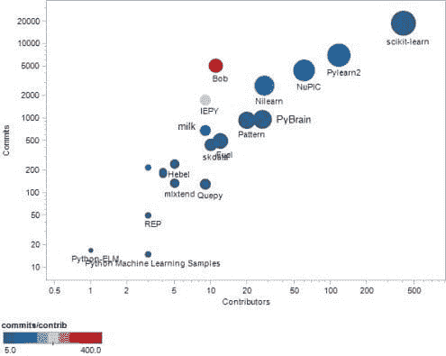

# 前 20 大 Python 机器学习开源项目

> 原文：[`www.kdnuggets.com/2015/06/top-20-python-machine-learning-open-source-projects.html`](https://www.kdnuggets.com/2015/06/top-20-python-machine-learning-open-source-projects.html)

评论 我们分析了 GitHub 上排名前 20 的 Python [机器学习项目](https://www.kdnuggets.com/2020/03/20-machine-learning-datasets-project-ideas.html)，发现 scikit-Learn、PyLearn2 和 NuPic 是贡献最活跃的项目。探索这些受欢迎的项目吧！ 图 1：GitHub 上的 Python 机器学习项目，颜色对应于提交/贡献者。Bob、Iepy、Nilearn 和 NuPIC 的数值最高。

1.  **scikit-learn**，18845 次提交，404 位贡献者，[www.github.com/scikit-learn/scikit-learn](https://github.com/scikit-learn/scikit-learn) scikit-learn 是一个建立在 SciPy 之上的 Python 机器学习模块。它包含各种分类、回归和聚类算法，包括支持向量机、逻辑回归、朴素贝叶斯、随机森林、梯度提升、k-means 和 DBSCAN，并且设计为与 Python 数值和科学库 NumPy 和 SciPy 互操作。

1.  **Pylearn2**，7027 次提交，117 位贡献者，[www.github.com/lisa-lab/pylearn2](https://github.com/lisa-lab/pylearn2) Pylearn2 是一个旨在简化机器学习研究的库。它是一个基于 Theano 的库。

1.  **NuPIC**，4392 次提交，60 位贡献者，[www.github.com/numenta/nupic](https://github.com/numenta/nupic) Numenta 智能计算平台（NuPIC）是一个实现 HTM 学习算法的机器智能平台。HTM 是对新皮层的详细计算理论。HTM 的核心是基于时间的连续学习算法，用于存储和回忆空间和时间模式。NuPIC 适用于多种问题，特别是异常检测和流数据源预测。

1.  **Nilearn**，2742 次提交，28 位贡献者，[www.github.com/nilearn/nilearn](https://github.com/nilearn/nilearn) Nilearn 是一个用于神经影像数据快速和简单统计学习的 Python 模块。它利用 scikit-learn Python 工具箱进行多变量统计分析，应用包括预测建模、分类、解码或连通性分析。

1.  PyBrain，969 次提交，27 位贡献者，[www.github.com/pybrain/pybrain](https://github.com/pybrain/pybrain) PyBrain 是 Python 基于强化学习、人工智能和神经网络库的缩写。其目标是提供灵活、易于使用且强大的机器学习任务算法和多种预定义环境，以测试和比较你的算法。

1.  **Pattern**，943 次提交，20 名贡献者，[www.github.com/clips/pattern](https://github.com/clips/pattern) Pattern 是一个用于 Python 的网络挖掘模块。它拥有数据挖掘、自然语言处理、网络分析和机器学习的工具。它支持向量空间模型、聚类、使用 KNN、SVM、感知机的分类。

1.  **Fuel**，497 次提交，12 名贡献者，[www.github.com/mila-udem/fuel](https://github.com/mila-udem/fuel) Fuel 为你的机器学习模型提供所需的数据。它具有对常见数据集的接口，如 MNIST、CIFAR-10（图像数据集）、Google 的 One Billion Words（文本数据）。它允许你以各种方式迭代数据，例如使用洗牌/顺序示例的小批量。

1.  **Bob**，5080 次提交，11 名贡献者，[www.github.com/idiap/bob](https://github.com/idiap/bob) Bob 是一个免费的信号处理和机器学习工具箱。该工具箱由 Python 和 C++ 混合编写，旨在高效且减少开发时间。它由相当多的包组成，这些包实现了图像、音频和视频处理、机器学习和模式识别的工具。

1.  **skdata**，441 次提交，10 名贡献者，[www.github.com/jaberg/skdata](https://github.com/jaberg/skdata) Skdata 是一个用于机器学习和统计的数据集库。该模块提供了对玩具问题以及流行的计算机视觉和自然语言处理数据集的标准化 Python 访问。

1.  **MILK**，687 次提交，9 名贡献者，[www.github.com/luispedro/milk](https://github.com/luispedro/milk) Milk 是一个 Python 机器学习工具包。它专注于有监督的分类，提供了多种分类器：SVMs、k-NN、随机森林、决策树。它还执行特征选择。这些分类器可以以多种方式组合，形成不同的分类系统。对于无监督学习，`milk` 支持 k-means 聚类和亲和传播。

1.  IEPY，1758 次提交，9 名贡献者，[www.github.com/machinalis/iepy](https://github.com/machinalis/iepy) IEPY 是一个开源的信息提取工具，专注于关系提取。它针对需要在大型数据集上进行信息提取的用户，尤其是那些希望实验新 IE 算法的科学家。

1.  Quepy，131 次提交，9 名贡献者，[www.github.com/machinalis/quepy](https://github.com/machinalis/quepy) Quepy 是一个 Python 框架，用于将自然语言问题转换为数据库查询语言中的查询。它可以轻松地自定义不同类型的自然语言问题和数据库查询。因此，通过少量编码，你可以构建自己的系统，以自然语言访问你的数据库。目前，Quepy 支持 Sparql 和 MQL 查询语言，并计划扩展到其他数据库查询语言。

1.  Hebel, 244 次提交, 5 名贡献者, [www.github.com/hannes-brt/hebel](https://github.com/hannes-brt/hebel) Hebel 是一个用于深度学习的库，使用 CUDA 通过 PyCUDA 在 Python 中加速神经网络。它实现了最重要的神经网络模型类型，并提供了各种激活函数和训练方法，如动量、Nesterov 动量、丢弃和提前停止。

1.  **mlxtend**, 135 次提交, 5 名贡献者, [www.github.com/rasbt/mlxtend](https://github.com/rasbt/mlxtend) 这是一个包含用于日常数据科学任务的有用工具和扩展的库。

1.  nolearn, 192 次提交, 4 名贡献者, [www.github.com/dnouri/nolearn](https://github.com/dnouri/nolearn) 该包包含多个有助于机器学习任务的实用模块。大多数模块与 scikit-learn 一起使用，其他模块则更通用。

1.  **Ramp**, 179 次提交, 4 名贡献者, [www.github.com/kvh/ramp](https://github.com/kvh/ramp) Ramp 是一个用于快速原型设计机器学习解决方案的 Python 库。它是一个基于 pandas 的轻量级机器学习框架，可与现有的 Python 机器学习和统计工具（如 scikit-learn、rpy2 等）插件兼容。Ramp 提供了一种简单、声明式的语法，用于快速高效地探索特征、算法和转换。

1.  Feature Forge, 219 次提交, 3 名贡献者, [www.github.com/machinalis/featureforge](https://github.com/machinalis/featureforge) 一套用于创建和测试机器学习特征的工具，具有与 scikit-learn 兼容的 API。这个库提供了一套工具，在许多机器学习应用中（分类、聚类、回归等）都可能有用，特别是如果你使用 scikit-learn（尽管如果你使用不同的算法，它也可以工作）。

1.  **REP**, 50 次提交, 3 名贡献者, [www.github.com/yandex/rep](https://github.com/yandex/rep) REP 是一个以一致和可重复的方式进行数据驱动研究的环境。它有一个统一的分类器包装器，适用于各种实现，如 TMVA、Sklearn、XGBoost、uBoost。它可以在集群上并行训练分类器。支持交互式图表。

1.  **Python 机器学习样本**, 15 次提交, 3 名贡献者, [www.github.com/awslabs/machine-learning-samples](https://github.com/awslabs/machine-learning-samples) 一个使用 Amazon 机器学习构建的示例应用程序集合。

1.  **Python-ELM**, 17 次提交, 1 名贡献者, [www.github.com/dclambert/Python-ELM](https://github.com/dclambert/Python-ELM) 这是基于 scikit-learn 的 Extreme Learning Machine 在 Python 中的实现。

本文使用了一些内容来自 [**www.pansop.com/1039/**](http://pansop.com/1039/) **相关：**

+   **有趣的开源机器学习、数据挖掘、数据科学项目**

+   **开源机器学习工具**

+   **真正的数据科学家请站出来！**

### 更多相关主题

+   [闭源与开源图像标注的比较](https://www.kdnuggets.com/closed-source-vs-open-source-image-annotation)

+   [协作的力量：开源项目如何推动人工智能发展](https://www.kdnuggets.com/2023/08/power-collaboration-opensource-projects-advancing-ai.html)

+   [宣布 PyCaret 3.0：开源、低代码 Python 机器学习](https://www.kdnuggets.com/2023/03/announcing-pycaret-30-opensource-lowcode-machine-learning-python.html)

+   [顶级开源大型语言模型](https://www.kdnuggets.com/2022/09/john-snow-top-open-source-large-language-models.html)

+   [2023 年十大开源数据科学工具的比较概述](https://www.kdnuggets.com/a-comparative-overview-of-the-top-10-open-source-data-science-tools-in-2023)

+   [使用开源工具生成合成时间序列数据](https://www.kdnuggets.com/2022/06/generate-synthetic-timeseries-data-opensource-tools.html)
