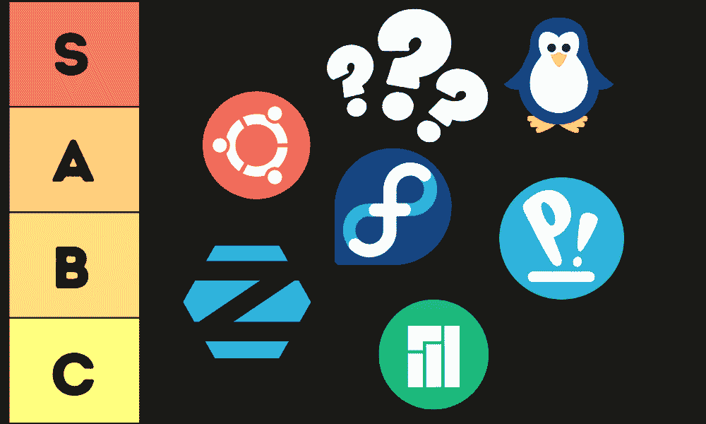
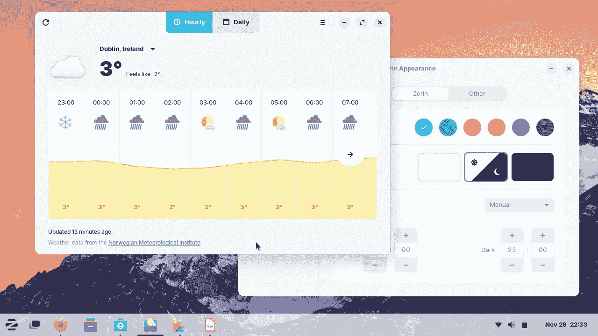
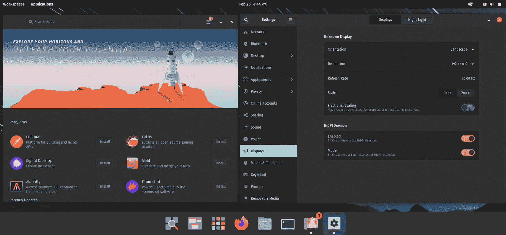
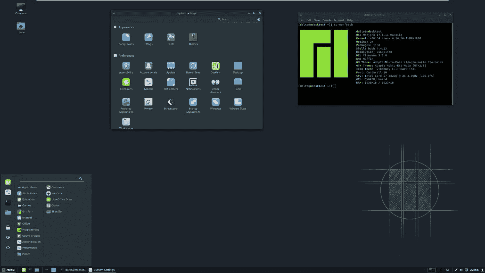

# 数据科学的前五大 Linux 发行版

> 原文：[`www.kdnuggets.com/top-5-linux-distro-for-data-science`](https://www.kdnuggets.com/top-5-linux-distro-for-data-science)

作者提供的图片

许多在财富 500 强公司工作的开发者和 IT 专业人士使用 Linux 发行版或 MacOS。为什么选择 Linux？因为大多数服务器运行在 Linux 上，并提供 Windows 11 缺乏的各种工具。此外，如果您关注安全性和隐私，那么转向 Linux 是正确的决定。在过去一个月里，我使用 VM VirtualBox 尝试了一些这些发行版，我正在认真考虑将 Linux 作为我的主要系统。

* * *

## 我们的前三名课程推荐

 1\. [Google 网络安全证书](https://www.kdnuggets.com/google-cybersecurity) - 快速进入网络安全职业生涯。

 2\. [Google 数据分析专业证书](https://www.kdnuggets.com/google-data-analytics) - 提升您的数据分析能力

 3\. [Google IT 支持专业证书](https://www.kdnuggets.com/google-itsupport) - 支持您的组织 IT 方面的需求

* * *

在这篇博客中，我们将了解一种我非常喜欢的 Linux 发行版，它支持所有您数据科学实验和机器学习模型训练所需的工具。这些发行版也非常用户友好，您可以在几分钟内完成安装。

# 1\. Ubuntu Desktop

我们都知道 [Ubuntu](https://ubuntu.com/download)，我认为如果你是开发者或机器学习工程师，你很可能通过 WSL 在 Windows 11 上使用 Ubuntu。由于其用户友好的界面、广泛的文档和庞大的社区支持，Ubuntu 是最受欢迎的 Linux 发行版。

Ubuntu 是 Linux 新手的绝佳选择，其软件仓库中充满了数据科学工具和库，使得设置开发环境变得容易。此外，它是一个稳定的操作系统，提供比 Windows 更长的长期支持。

# 2\. Fedora Workstation

[Fedora Workstation](https://fedoraproject.org/workstation/) 是一个非常成熟且受欢迎的开发者和程序员操作系统。Fedora 的独特之处在于它致力于提供最新的软件和功能，这对于数据科学家寻找最新的软件工具和库的发展至关重要。

它完全免费且没有广告，重视您的数据隐私。此外，它对开源价值的强烈重视确保用户可以访问庞大的免费开源软件（FOSS）工具生态系统。

# 3\. Zorin OS

[Zorin OS](https://zorin.com/os/) 正迅速成为我最喜欢的操作系统，因为它的安装简便和预装软件。对于那些从 Windows 或 macOS 过渡过来的人，它特别友好，提供了一个简单而优雅的界面，同时不牺牲性能或功能。

Zorin OS 基于 Ubuntu，因此可以利用其丰富的软件库和支持。对于数据科学家来说，Zorin OS 提供了一个舒适且熟悉的环境，同时仍然展现出 Linux 以其著称的多样性和性能。

# 4\. Pop!_OS

[Pop!_OS](https://pop.system76.com/) 是一个流行的 Linux 发行版，预装了 Nvidia GPU 驱动程序。这意味着你无需额外安装任何东西即可开始在 GPU 上训练深度学习模型。它在易用性和预装应用程序方面与 Zorin OS 非常相似。

Pop!_OS 基于 Ubuntu，但通过一个精简且增强的用户界面增加了自己的特色，重点关注生产力和易用性。我能够在几分钟内安装并开始使用 VSCode 进行我的项目。它非常容易导航，并且提供了大量的自定义选项。

# 5\. Manjaro

[Manjaro](https://manjaro.org/download/) 是一个基于 Arch Linux 的用户友好型 Linux 发行版。与针对更有经验用户的 Arch 不同，Manjaro 提供了 Arch Linux 的所有优点，包括访问 AUR（Arch 用户库），但以更易于安装的包形式呈现。

Manjaro 以其滚动更新模式而闻名，这意味着它会定期收到更新和最新的软件包。它还具有高度的可定制性，允许用户根据自身需求调整操作系统。此外，它提供了广泛的数据科学工具和库，这些工具和库对于开发和部署数据科学解决方案至关重要。

# 结论

选择适合数据科学的 Linux 发行版取决于个人喜好、特定项目需求以及你对 Linux 环境的舒适程度。

Linux 与 Windows 和 macOS 存在显著差异。因此，建议尝试几种稳定的 Linux 发行版，选择最适合你的那一个。一些专业人士偏好 Arch，而一些则偏好 Ubuntu。最终，这取决于你的个人喜好。

Fedora Workstation、Ubuntu Desktop、Zorin OS、Pop!_OS 和 Manjaro 是数据科学专业人士的热门选择，每种操作系统都有其独特的优点。尝试其中一种或多种发行版将帮助你找到最适合你数据科学之旅的系统。

****[Abid Ali Awan](https://www.polywork.com/kingabzpro)**** ([@1abidaliawan](https://www.linkedin.com/in/1abidaliawan)) 是一位认证的数据科学专业人士，热衷于构建机器学习模型。当前，他专注于内容创作和撰写有关机器学习和数据科学技术的技术博客。Abid 拥有技术管理硕士学位和电信工程学士学位。他的愿景是利用图神经网络构建一个 AI 产品，帮助那些挣扎于心理健康问题的学生。

### 更多相关话题

+   [KDnuggets 新闻，11 月 30 日：什么是切比雪夫定理及其应用](https://www.kdnuggets.com/2022/n46.html)

+   [KDnuggets 新闻，6 月 29 日：数据科学的 20 个基本 Linux 命令](https://www.kdnuggets.com/2022/n26.html)

+   [数据科学的 Linux 备忘单](https://www.kdnuggets.com/2022/11/linux-data-science-cheatsheet.html)

+   [20 个数据科学初学者的基本 Linux 命令](https://www.kdnuggets.com/2022/06/20-basic-linux-commands-data-science-beginners.html)

+   [KDnuggets 新闻，12 月 7 日：揭示数据科学的十大误区 • 4…](https://www.kdnuggets.com/2022/n47.html)

+   [KDnuggets 新闻，6 月 8 日：21 个数据科学的备忘单](https://www.kdnuggets.com/2022/n23.html)
