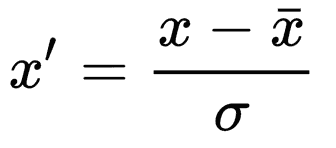

# 专家推荐的前 5 种机器学习最佳实践

> 原文：[`www.kdnuggets.com/2022/09/top-5-machine-learning-practices-recommended-experts.html`](https://www.kdnuggets.com/2022/09/top-5-machine-learning-practices-recommended-experts.html)

# 介绍

* * *

## 我们的前三大课程推荐

 1\. [Google 网络安全证书](https://www.kdnuggets.com/google-cybersecurity) - 快速进入网络安全职业生涯。

 2\. [Google 数据分析专业证书](https://www.kdnuggets.com/google-data-analytics) - 提升您的数据分析技能

 3\. [Google IT 支持专业证书](https://www.kdnuggets.com/google-itsupport) - 支持您的组织进行 IT 维护

* * *

机器学习一直是媒体热炒的话题，越来越多的组织采用这种技术来处理日常任务。机器学习从业者可能能够提出解决方案，但提升模型性能有时可能非常具有挑战性。这需要实践和经验。即使尝试了所有策略，我们仍然经常无法提高模型的准确性。因此，本文旨在通过列出机器学习专家推荐的最佳实践，帮助初学者改进他们的模型结构。

# 最佳实践

## 1\. 专注于数据

在机器学习的世界中，数据的重要性不容忽视。数据的质量和数量都能显著提升模型性能。这通常比制作机器学习模型本身更耗时和复杂。这个步骤通常被称为数据准备。它可以进一步细分为以下步骤：

+   **明确问题** **-** 为了避免使项目过于复杂，尽量深入了解您要解决的根本问题。将问题分类为分类、回归、聚类或推荐等。这种简单的细分可以帮助您收集最适合您情境的相关数据集。

+   **数据收集** **-** 数据收集可能是一个繁琐的任务。顾名思义，它是收集历史数据以寻找重复模式。数据可以分为结构化（例如 Excel 或 .csv 文件）和非结构化数据（例如照片、视频等）。一些著名的数据集来源包括：

    +   [数据集搜索 (Google)](https://datasetsearch.research.google.com/)

    +   [OpenML](https://www.openml.org/)

    +   [Kaggle](https://www.kaggle.com/datasets)

    +   [VisualData Discovery](https://visualdata.io/discovery)

    +   [Amazon 数据集](https://registry.opendata.aws/)

+   **数据探索** **-** 这一步骤涉及利用统计和可视化技术识别数据集中的问题和模式。你需要执行各种任务，如发现异常值、识别数据分布及特征之间的关系、查找不一致和缺失值等。**Microsoft Excel** 是用于此步骤的一个流行手动工具。

+   **数据清洗和验证** **-** 这涉及到剔除无关信息并通过各种插补工具解决缺失值**。**识别并删除冗余数据。许多开源选项如[OpenRefine](https://openrefine.org/)和[ Pandera](https://pypi.org/project/pandera/)等可用于清洗和验证数据。

## 2\. 特征工程

这是另一种提高模型性能和加快数据转换的基本技术。特征工程涉及从已有特征中注入新特征到模型中。它可以帮助我们识别强健的特征并去除相关或冗余的特征。然而，它需要领域专业知识，如果我们的初始基线已经包含多样的特征，可能不可行。让我们通过一个例子来理解这一点。假设你有一个数据集，包含房屋的长度、宽度和价格，如下所示：

与其使用上述数据集，我们可以引入另一个名为“面积”的特征，并仅测量该变量对房价的影响。这个过程属于**特征创建**的范畴。

类似地，**特征转换**和**特征提取**根据我们的项目领域可能会证明有价值。特征转换涉及对特征应用转换函数以获得更好的可视化，而在特征提取中，我们通过仅提取相关特征来压缩数据量。

尽管**特征缩放**也是特征工程的一部分，我单独讨论了它，以强调其重要性。特征缩放是用于标准化自变量和特征范围的方法。**为什么这个步骤如此重要？**大多数算法如线性回归、逻辑回归和神经网络使用梯度下降作为优化技术。梯度下降严重依赖于特征的范围来确定向最小值的步长，但我们的大多数数据在范围上变化剧烈。这迫使我们在将数据输入模型之前进行标准化或规范化。对此，最重要的两种技术是：

+   **归一化** **-** 归一化是一种将数据限制在通常范围[0,1]之间的技术，但你也可以定义范围[a,b]，其中 a 和 b 是实数。

+   **标准化** **-** 标准化将数据转换为均值为 0，方差为 1。我们首先计算特征的标准差和均值，然后使用以下公式计算新值：

对于哪一种更好的讨论已经很多，一些研究表明，对于高斯分布，标准化更有帮助，因为它不受异常值的影响，反之亦然。但这取决于你所处理的问题类型。因此，强烈建议同时测试两者并比较性能，以找出最适合你的方法。

## 3\. 玩转正则化

你可能遇到过这种情况：你的机器学习模型在训练数据上表现得非常好，但在测试数据上表现不佳。这发生在你的模型**过拟合**了训练数据。尽管有很多方法可以应对过拟合，比如丢弃层、减少网络容量、提前停止等，但正则化的表现超过所有方法。**什么是正则化？** 正则化是一种通过缩小系数来防止过拟合的技术。这会导致一个简化的模型，在进行预测时表现得更加高效。正则化有两种类型：

+   **L1 正则化** **-** 也被称为套索回归。它通过向系数绝对值的大小添加惩罚，迫使一些系数估计值恰好为零。它形成一个稀疏模型，对特征选择有用。

+   **L2 正则化** **-** 也被称为岭回归。它通过添加系数绝对值的平方来惩罚模型。因此，它迫使系数的值接近零但不完全为零。它提高了模型的可解释性。

尽管 L2 正则化比 L1 给出更准确的预测，但这以计算能力为代价。在存在异常值的情况下，L2 可能不是最佳选择，因为由于平方的存在，成本会呈指数增长。因此，与 L2 相比，L1 更具鲁棒性。

## 4\. 识别错误

重要的是我们要跟踪模型所犯的错误，以便进行优化。这个任务可以通过各种可视化图来完成，具体取决于待解决问题的类型。以下是一些讨论的内容：

+   **分类 -** 分类模型是监督学习的一个子集，根据生成的输出将输入分类为一个或多个类别。可以通过各种工具来可视化分类模型，例如：

+   **分类报告 -** 这是一个评估指标，显示了精确度、F1 分数、召回率和支持度。它提供了对模型性能的整体理解。

+   **混淆矩阵 -** 它将真实值与预测值进行比较。与分类报告相比，它提供了对单个数据点分类的更深入的见解，而不仅仅是顶层分数。

+   **回归 -** 回归模型通过提供期望的函数来预测自变量和因变量之间的关系。它在连续空间中进行预测，以下是用于回归的评估指标：

+   **残差图 -** 它显示水平轴上的自变量和垂直轴上的残差。如果数据点在水平轴上随机分布，则线性模型更适合，反之亦然。

+   **预测误差图 -** 它显示实际目标与预测值的对比，以提供关于方差的想法。45 度线是预测与模型完全匹配的地方。

## 5. 超参数调优

超参数是一组不能由算法本身学习的参数，并在学习过程开始之前设置，例如学习率（alpha）、小批量大小、层数、隐藏单元数等。**超参数调优** 指的是选择最优超参数的过程，以最小化损失函数。在简单的网络中，我们对模型的不同版本和超参数组合进行实验，但对于更复杂的网络，这可能不是合适的选择。在这种情况下，我们根据先前的知识进行最优选择。以下是一些广泛使用的超参数调优方法，以便在超参数空间范围内进行适当的选择：

+   **网格搜索 -** 这是传统的和最常用的超参数调优方法。它涉及从包含所有可能超参数组合的网格中选择最佳集合。然而，它需要更多的计算能力和时间来执行操作。

+   **随机搜索** **-** 它不是尝试每一种组合，而是从网格中随机选择一组值来找到最优值。与网格搜索相比，它节省了不必要的计算能力和时间。由于没有使用智能，因此运气也起到作用，结果的方差较高。

+   **贝叶斯搜索** **-** 它在应用机器学习中被使用，且优于随机搜索。它利用**贝叶斯定理**并考虑前一轮的结果，以改进下一轮的结果。它需要一个能够最小化损失的目标函数。它通过创建目标函数的代理概率模型来工作，然后寻找代理模型的最佳超参数，接着将其应用到原始模型中，并更新代理模型，估计目标函数。这一过程会被重复，直到找到原始模型的最佳解。它确实需要较少的迭代，但每次迭代需要较长时间。

在上述方法中，迭代次数、运行时间和性能最大化之间存在权衡。因此，您案例中的理想方法取决于您的优先事项。

# 结论

机器学习和深度学习需要良好的计算资源和专业知识。构建机器学习模型是一个迭代过程，涉及实现各种技巧以提高整体模型性能。我列出了 ML 专家推荐的一些最佳实践，以便访问您当前模型的不足之处。然而，正如我总是说的，一切都需要足够的实践和耐心，所以请继续从错误中学习。

**[Kanwal Mehreen](https://www.linkedin.com/in/kanwal-mehreen1/)** 是一名有志的软件开发人员，她相信持续的努力和承诺。她是一名雄心勃勃的程序员，对数据科学和机器学习领域有浓厚的兴趣。

### 更多相关主题

+   [2022 年技术专家简单薪资指南](https://www.kdnuggets.com/2022/07/simple-salary-guide-tech-experts-2022.html)

+   [为何最新的 LLMs 使用 MoE（专家混合）架构](https://www.kdnuggets.com/why-the-newest-llms-use-a-moe-mixture-of-experts-architecture)

+   [MLOps：最佳实践及如何应用](https://www.kdnuggets.com/2022/04/mlops-best-practices-apply.html)

+   [创建领域特定 AI 模型的最佳实践](https://www.kdnuggets.com/2022/07/best-practices-creating-domainspecific-ai-models.html)

+   [将 ChatGPT 集成到数据科学工作流中：技巧和最佳实践](https://www.kdnuggets.com/2023/05/integrating-chatgpt-data-science-workflows-tips-best-practices.html)

+   [数据仓库和 ETL 最佳实践](https://www.kdnuggets.com/2023/02/data-warehousing-etl-best-practices.html)
