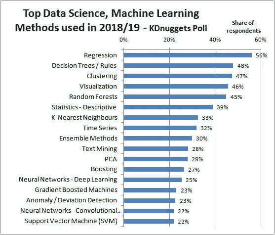
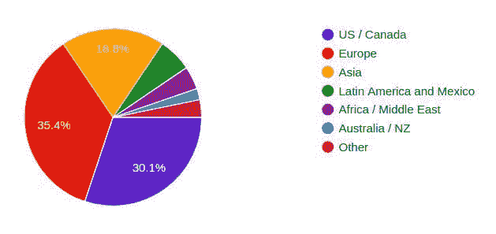

# 2018 年、2019 年最常用的数据科学和机器学习方法

> 原文：[`www.kdnuggets.com/2019/04/top-data-science-machine-learning-methods-2018-2019.html`](https://www.kdnuggets.com/2019/04/top-data-science-machine-learning-methods-2018-2019.html)

 评论

在最新的 KDnuggets 调查中，读者被问到：

**你在 2018/2019 年实际应用中使用了哪些数据科学 / 机器学习方法和算法？**

* * *

## 我们的前三大课程推荐

 1\. [谷歌网络安全证书](https://www.kdnuggets.com/google-cybersecurity) - 快速进入网络安全职业生涯

 2\. [谷歌数据分析专业证书](https://www.kdnuggets.com/google-data-analytics) - 提升你的数据分析技能

 3\. [谷歌 IT 支持专业证书](https://www.kdnuggets.com/google-itsupport) - 支持你的组织的 IT 需求

* * *

基于 833 名投票者的结果显示，前 17 种方法与 2017 年的调查相同，尽管顺序稍有不同：

**图 1: 数据科学和机器学习方法的使用情况，2018/2019**

今年受访者使用的前 17 种方法（第 16 位为并列）为：

1.  回归

1.  决策树 / 规则

1.  聚类

1.  可视化

1.  随机森林

1.  统计 - 描述性

1.  K-近邻

1.  时间序列

1.  集成方法

1.  文本挖掘

1.  PCA

1.  提升方法

1.  神经网络 - 深度学习

1.  梯度提升机

1.  异常 / 偏差检测

1.  神经网络 - 卷积神经网络（CNNs）

1.  支持向量机（SVM）

这反映了 2017 年调查的结果，显示前 10 种方法与 2016 年的调查结果相同（尽管顺序有所不同）。

平均受访者使用了 7.4 种方法/算法，这与 2017 年和 2016 年的结果一致。

下面是今年调查中前几种方法和算法与 2017 年份额的比较。

**图 2: 数据科学和机器学习方法的使用情况，2018/9 对比 2017**

今年最显著的增加是在各种神经网络技术的使用上，包括 GANs、RNNs、CNNs、强化学习和原生深度神经网络。遗传算法和进化算法也有所增加，还有“其他方法”。

与 2017 年相比，按 (*share2019 / share2017 - 1*) 计算，具有最大相对增长的方法和算法有：

+   **生成对抗网络（GAN）**，增长 101.8%，从 2017 年的 2.3% 增长到 2018/9 年的 4.7%

+   **神经网络 - 循环神经网络（RNN）**，上升 56.5%，从 10.5% 上升到 16.5%

+   **强化学习**，增长 56.1%，从 4.2%提升至 6.6%

+   **神经网络 - 卷积**，增长 38.8%，从 15.8%提升至 22%

+   **其他方法**，增长 27.1%，从 6.1%提升至 7.8%

+   **遗传/进化算法与方法**，增长 25.7%，从 4.8%提升至 6.0%

+   **神经网络 - 深度学习**，增长 23.5%，从 20.6%提升至 25%

今年的最大下降包括：

+   **奇异值分解（SVD）**，下降 25.4%，从 2017 年的 8.1%降至 2018/9 年的 6.0%

+   **支持向量机（SVM）**，下降 23.3%，从 28.7%降至 22%

+   **因子分析**，下降 21.2%，从 11.7%降至 9.3%

+   **关联规则**，下降 20.6%，从 15.4%降至 12.3%

+   **主成分分析（PCA）**，下降 19.3%，从 34.7%降至 28%

+   **生存分析**，下降 19.1%，从 8.5%降至 6.9%

### 隶属

按隶属参与情况：

+   行业/自雇，64.9%（541 份回应），平均使用 7.8 种工具

+   学生，15.8%（132 份回应），平均使用 6.1 种工具

+   学术界，9.2%（77 份回应），平均使用 7.9 种工具

+   政府/非营利组织，7.3%（61 份回应），平均使用 5.8 种工具

注意，只有 22 名受访者（<3%）选择了“其他”，平均使用 7.5 种工具。

### 区域参与

最终，区域参与情况如下：

欧洲，35.4%

美国/加拿大，30.1%

亚洲，18.8%

拉丁美洲，6.1%

澳大利亚/新西兰，2%

非洲/中东，4.2%

其他，3.2%

**图 3: 区域参与，2018/2019**

感谢所有参与调查的人员，使得这一趋势汇编和分析成为可能。

这是过去调查的结果：

+   分析、数据科学、机器学习应用的趋势与分析（2017）

+   2016 年分析、数据挖掘、数据科学的应用

+   2015 年分析、数据挖掘、数据科学的应用

+   2014 年分析、数据挖掘、数据科学的应用

+   2012 年您将分析/数据挖掘应用于哪里？

+   应用分析/数据挖掘的行业/领域，2011 年。

+   分析/数据挖掘的行业/领域，2010 年。

+   数据挖掘应用，2009 年。

+   数据挖掘应用，2008 年。

+   按行业的数据挖掘应用，2007 年。

+   您应用数据挖掘的行业/领域，2006 年。

### 更多相关主题

+   [成为伟大数据科学家所需的 5 项关键技能](https://www.kdnuggets.com/2021/12/5-key-skills-needed-become-great-data-scientist.html)

+   [每个初学者数据科学家应掌握的 6 种预测模型](https://www.kdnuggets.com/2021/12/6-predictive-models-every-beginner-data-scientist-master.html)

+   [2021 年最佳 ETL 工具](https://www.kdnuggets.com/2021/12/mozart-best-etl-tools-2021.html)

+   [停止学习数据科学以寻找目标，寻找目标以…](https://www.kdnuggets.com/2021/12/stop-learning-data-science-find-purpose.html)

+   [数据科学学习统计的顶级资源](https://www.kdnuggets.com/2021/12/springboard-top-resources-learn-data-science-statistics.html)

+   [构建一个稳固的数据团队](https://www.kdnuggets.com/2021/12/build-solid-data-team.html)
