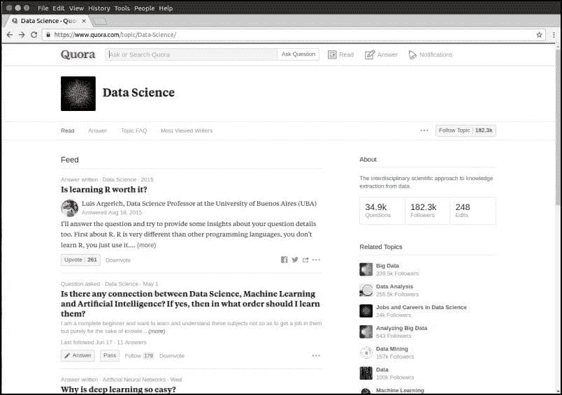

# 更新版：顶级 Quora 数据科学作者及其最佳建议

> 原文：[`www.kdnuggets.com/2017/07/top-quora-data-science-writers-best-advice-updated.html`](https://www.kdnuggets.com/2017/07/top-quora-data-science-writers-best-advice-updated.html)

本文基于 [数据科学中最受欢迎的作者](https://www.quora.com/topic/Data-Science/writers)，这是过去 30 天中回答浏览量最多的 10 位作者的数据，数据检索日期为 2017 年 6 月 29 日。

为了避免混淆，请注意这篇文章是由我“撰写”的，但文中包含的所有信息——从问题到答案——与我无关。我只是将这些有价值的回答编辑在一起。

* * *

## 我们的前 3 个课程推荐

 1\. [谷歌网络安全证书](https://www.kdnuggets.com/google-cybersecurity) - 快速进入网络安全职业的捷径。

 2\. [谷歌数据分析专业证书](https://www.kdnuggets.com/google-data-analytics) - 提升你的数据分析技能

 3\. [谷歌 IT 支持专业证书](https://www.kdnuggets.com/google-itsupport) - 支持你的组织的 IT 工作

* * *

Quora 上的数据科学主题页面。

**1\. [Håkon Hapnes Strand](https://www.quora.com/profile/H%C3%A5kon-Hapnes-Strand)**，数据科学家 - 255,104 次浏览， [173 个回答](https://www.quora.com/profile/H%C3%A5kon-Hapnes-Strand/answers/Data-Science)

摘自对: [什么是“全栈”数据科学家？](https://www.quora.com/What-is-a-full-stack-data-scientist)

> 我还没有听到过这个表达的使用，但这是我对其含义的看法：
> 
> 数据科学家构建预测模型。这是他们工作的核心。此外，他们还需要了解一些其他内容：
> 
> +   数据工程
> +   
> +   软件工程
> +   
> +   业务分析
> +   
> 一个全栈数据科学家能够无缝地执行数据工程师、软件工程师、业务分析师和数据科学家的角色。如果你需要有人开发一个应用程序，全栈数据科学家可以接手。如果你需要有人建立数据仓库，或者分析企业的战略管理过程，全栈数据科学家也可以做到。

**2\. [Mike West](https://www.quora.com/profile/Mike-West-99)**，SQL Server 和机器学习爱好者 - 127,776 次浏览，[45 个回答](https://www.quora.com/profile/Mike-West-99/answers/Data-Science)

摘自对: [Python 在 Scala (+Spark) 崛起的情况下是否仍然在数据科学中相关？](https://www.quora.com/Is-Python-still-relevant-in-data-science-given-the-rise-of-Scala-+Spark)

> Scala 和 Spark 不是 Python 的对手，它们是朋友。
> 
> 我已经说过一段时间了。Python 是并将继续是未来十年机器学习的黄金标准。
> 
> 唯一的 Python 竞争对手是 R，坦率地说，在现实世界中，每个人都在使用 Python。你会在大学层面看到很多 R，但在应用领域则不会。
> 
> Python 确实有太多的领先优势。
> 
> 大数据主要是将任何数据（几乎总是非结构化数据）转化为可以建模的格式。Scala 和 Spark 只是你可以用来处理非常大数据集的工具。
> 
> TensorFlow 不是用 Scala 编写的。
> 
> 不要被一两篇文章迷惑，即使它们是 Andrew Ng 写的。做你自己的研究。

**3\. [Corrin Lakeland](https://www.quora.com/profile/Corrin-Lakeland-1)** - 117,841 次浏览，[87 个回答](https://www.quora.com/profile/Corrin-Lakeland-1/answers/Data-Science)

摘自回答：[未来 5 到 10 年，数据科学家将从事什么工作？](https://www.quora.com/What-will-data-scientists-be-working-on-in-5-to-10-years-from-now)

> 这引出了未来的展望。在接下来的五年中，我预计会看到很多目前声称参与其中的公司实际上会尝试在严肃项目中使用它。我预计其中相当一部分项目会失败，整个行业将会更加成熟，对什么有效和无效有更多的理解。
> 
> 看看现在有多少图形用户界面工具支持机器学习。比如自动聚类数据的 Excel 插件。再过五年，我预计大多数人只会想到这些工具时才会想到数据科学。
> 
> 十年后，我认为时尚将会真正改变。数据科学将成为其他学科中普遍且被期望的技能，专门的数据科学家可能会被看作有些奇怪。你还会看到一种情况，即系统捕获的数据很常见且正常地适用于数据科学，而不是现在大多数数据的结构方式需要大量的处理。

**4\. [William Chen](https://www.quora.com/profile/William-Chen-6)**，Quora 数据科学家 - 117,834 次浏览，[195 个回答](https://www.quora.com/profile/William-Chen-6/answers/Data-Science)

摘自回答：[你为什么选择从事数据科学而不是量化金融？](https://www.quora.com/Why-did-you-choose-to-work-in-data-science-over-quantitative-finance)

> 我即将列出的所有理由的总结是**我选择数据科学是因为我对它更有热情**。以下是促使我对数据科学产生热情的 5 个更具体的原因。
> 
> +   **对新兴和不断增长的职业路径的兴奋** - 这个决定是在 2013 年和 2014 年做出的，那时数据科学比现在更加新颖和不确定。进入一个仍在发展和创新中的领域对我很有吸引力，并且至今仍然如此。我尽量不让自己的决策基于炒作——因此这个点更多的是关于数据科学领域的成长以及它会为我提供一个位置，而不是它的热门程度。
> +   
> +   **对数据科学的熟悉程度** - 这是列表中最弱的理由，但当我需要选择全职工作时，我已经有了两次数据科学相关的实习经历：一次在 Etsy（公司），一次在 Quora（公司）。在这两个实习中我都有很好的经历，所以选择全职从事数据科学对我来说是一个快乐的已知数量。
> +   
> +   **对从事消费者互联网产品的兴趣** - 我对消费者互联网产品有长期的兴趣，自从我获得拨号上网的机会以来，我一直对这个领域的增长感到兴奋。数据科学工作对我来说是一个独特的机会，让我能够成为我一直着迷的消费者互联网世界的一部分。
> +   
> +   **对从事新兴产品的兴趣** - 消费者互联网产品一直让我感兴趣，因为它们存在于不确定的领域中，可能会变得非常重要（或只是失败）。对从事一个可能变得非常重要的产品的兴趣，以及知道自己在其中扮演了一个小角色的诱惑是很大的。
> +   
> +   **对知识共享的承诺** - 我一直致力于分享想法和观点，无论是通过担任哈佛统计学 110 课程的教学助理，还是在 Quora 上尽可能多地写作。科技领域通常有见面会、博客文章、Quora 回答、研讨会和邀请讲座的文化。而在神秘的量化金融领域，情况则有所不同。

**5\. [Clayton Bingham](https://www.quora.com/profile/Clayton-Bingham)**，南加州大学神经工程中心研究员 - 108,512 次浏览，[8 个回答](https://www.quora.com/profile/Clayton-Bingham/answers/Data-Science)

摘录自：[在 Python 中，如何使用 BeautifulSoup 将网站数据保存为 CSV？](https://www.quora.com/In-Python-how-can-I-save-data-from-a-website-to-CSV-using-BeautifulSoup)

> 懒惰的办法是这样做：
> 
> 一旦你将数据放入数据框中，你可以进行任何解析/格式化操作。或者，如果你只需要这一次，你也可以用 Excel 或其他工具来完成。
> 
> 希望这对你有帮助！

**6\. [Lili Jiang](https://www.quora.com/profile/Lili-Jiang)**，Quora 数据科学经理 - 88,461 次浏览，[8 个回答](https://www.quora.com/profile/Lili-Jiang/answers/Data-Science)

摘录自：[作为数据科学家，你对年轻时的自己有什么建议？](https://www.quora.com/As-a-data-scientist-what-tips-would-you-have-for-a-younger-version-of-yourself)

> **首先，数据科学是否如你所想？**
> 
> 我遇到的 9 位有志数据科学家中，有 10 人将机器学习等同于数据科学。“数据科学”是一个涵盖面广的术语。机器学习只是其中的一部分，但在许多主要科技公司中，**产品分析也是数据科学团队的一个重要组成部分**。产品分析是一颗隐藏的宝石。它很有趣，但讨论却不多。包括：
> 
> +   A/B 测试设计
> +   
> +   设计指标：以视频平台为例。什么是优化的最佳指标，能够最能代表用户满意度？应该是观看的视频数量？观看视频的时间？还是一周内返回观看另一部视频的用户百分比？
> +   
> +   调查指标变化的原因：为什么这批用户的活动突然激增？
> +   
> +   理解产品机制：按钮 X 和功能 Y 如何提升产品？我们应该将页面 A 重定向到 B 或 C，还是直接从 A 跳到 C？
> +   
> +   识别趋势并提供战略建议：用数据论证公司应投资于 ______ 领域，以保持竞争力。

**7\. [Zeeshan Zia](https://www.quora.com/profile/Zeeshan-Zia-1)**，计算机视觉和机器学习博士 - 70,564 次观看，[24 个回答](https://www.quora.com/profile/Zeeshan-Zia-1/answers/Data-Science)

摘自回答：[2017 年 AI 是否被过度炒作？](https://www.quora.com/Is-AI-over-hyped-in-2017)

> 视具体社区而定，既有“是”，也有“不是”。
> 
> 如果你谈论的是学术研究社区，它并不过度炒作。过去几年里，AI 取得了重大突破，这种庆祝当然是有道理的。
> 
> 在我自己从事的目标识别领域，我们从~35%的准确率（Pascal VOC 上的平均精度）提高到超过 65%，仅用了 3 到 4 年时间。此前，我们每年进步 1%到 2%，尽管目标识别是计算机视觉中最热门的领域，每年在顶级会议上发表的论文最多。深度学习在强化学习方面也取得了重大突破，这为通用 Atari 游戏的成功奠定了基础，并在预期十几年后战胜了围棋世界冠军！它终于使语音识别达到了可用的准确度水平。

**8\. [Jason T Widjaja](https://www.quora.com/profile/Jason-T-Widjaja)**，商业和分析极客。喜欢他的兄弟。- 60,837 次观看，[167 个回答](https://www.quora.com/profile/Jason-T-Widjaja/answers/Data-Science)

摘自回答：[关于分析/数据科学炒作的风险是什么？](https://www.quora.com/What-is-the-risk-of-the-hype-around-analytics-data-science-dying-off-leaving-lots-of-unemployed-analysts)

> 从根本上说，我认为数据科学不会很快消失。只要：
> 
> +   人们总是希望做出更好的决策，
> +   
> +   人们永远关心未来会发生什么，
> +   
> +   做得好的个人和公司总是会受益。
> +   
> +   可用的数据点持续增加，
> +   
> +   我们拥有的工具和技术不断改进（你明白的）..
> +   
> ...分析和数据科学并不是无处不在的。
> 
> 免责声明：极度偏见的样本量为一个。

**9\. [Roman Trusov](https://www.quora.com/profile/Roman-Trusov)**，硕士学位信息技术与数据科学，斯科尔科沃科技学院（2018 年） - 57,815 次观看，[139 个回答](https://www.quora.com/profile/Roman-Trusov/answers/Data-Science)

摘自回答：[数据科学家应该如何处理版本控制，包括管道代码和模型？](https://www.quora.com/profile/Roman-Trusov)

> 为了从版本控制系统中获得最佳效果，最好将它们分开。
> 
> 像对待其他代码一样将代码保存在版本控制系统中是唯一合理的方式，因为如果你作为数据科学家进行了一些繁重的 ETL，或者你的代码做出的决策可能带来或损失大量金钱，那么它一定会经过代码审查。没有其他方式。
> 
> 对于一些数据科学家更为典型的事情，我认为将 Jupyter notebooks 存储在版本控制中并不是一个好的做法。你无法在这些笔记本上看到清晰的差异，它们不是“生产代码”，总的来说，当你完成某件事时，你希望推送至少一个“最终版”Python 脚本。Jupyter notebooks 非常适合实验和演示，但在这些情况下之外，总有更好的选择。

**10\. [Shweta Doshi](https://www.quora.com/profile/Shweta-Doshi-12)**，GreyAtom 联合创始人，数据科学沉浸式学习学校 - 50,866 次观看，[123 个回答](https://www.quora.com/profile/Shweta-Doshi-12/answers/Data-Science)

摘自回答：[开始从事数据科学家工作需要哪些基本知识和技能？](https://www.quora.com/What-is-the-essential-knowledge-and-skills-are-required-to-start-working-as-data-scientist)

> 你需要熟悉的基本知识分为 3 类，即编程、数学和科学。
> 
> 作为数据科学家，你将被期望将一个业务问题转化为数据问题，创建预测模型来回答问题，并讲述发现的故事。专注于实现数据的统计方法的统计学家以及专注于管理数据科学团队的数据经理，往往会担任数据科学家角色。
> 
> 数据科学家是编程与数据科学实施、数据科学理论与数据业务影响之间的桥梁。

**相关**：

+   前 10 名 Quora 机器学习作家及其最佳建议（更新版）

+   前 10 名 Quora 数据科学作家及其最佳建议

+   Quora 上关于“如何学习机器学习”的最佳建议

### 更多相关主题

+   [KDnuggets™ 新闻 22:n03, 1 月 19 日：深入探讨 13 个数据…](https://www.kdnuggets.com/2022/n03.html)

+   [KDnuggets™ 新闻 22:n04, 1 月 26 日：高薪副业…](https://www.kdnuggets.com/2022/n04.html)

+   [顶级编程语言及其用途](https://www.kdnuggets.com/2021/05/top-programming-languages.html)

+   [如何获得机器学习工作：来自 Meta、Google Brain 和 SAP 工程师的建议](https://www.kdnuggets.com/2022/08/corise-land-ml-job-advice-engineers-meta-google-brain-sap.html)

+   [为什么数据科学家对 Google Bard 的建议感到失望](https://www.kdnuggets.com/2023/02/data-scientists-expect-flawed-advice-google-bard.html)

+   [深入了解 13 种数据科学家角色及其职责](https://www.kdnuggets.com/2022/01/deep-look-13-data-scientist-roles-responsibilities.html)
