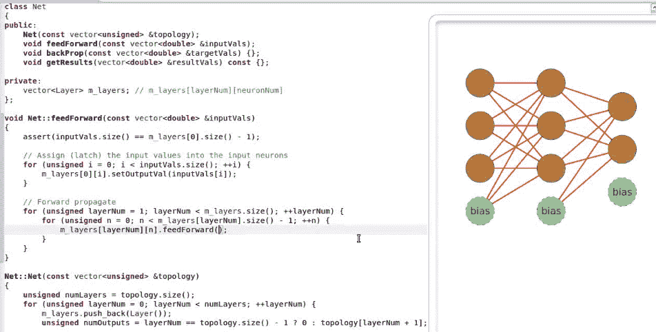

# 九月份 /r/MachineLearning 热帖：从头实现一个 C++神经网络

> 原文：[`www.kdnuggets.com/2015/10/top-reddit-machine-learning-september.html`](https://www.kdnuggets.com/2015/10/top-reddit-machine-learning-september.html)

**作者 [Matthew Mayo](https://twitter.com/mattmayo13)。**

在 [/r/MachineLearning](https://www.reddit.com/r/MachineLearning/) 上的九月份，我们找到了一段关于 C++的神经网络教程视频，了解到基于深度学习的汉字手写识别已经超越了人类水平，拿到了一份机器学习算法速查表，将函数式编程与深度学习联系起来，并发现了一个神经网络论文库。

**1\. [绝对初学者的 C++神经网络](https://www.reddit.com/r/MachineLearning/comments/3mdvxv/neural_net_in_c_for_absolute_beginners_super_easy/) +154**

这篇文章是一个[戴夫·米勒](http://www.millermattson.com/dave/)讲解简单反向传播神经网络的视频，并演示如何在 C++中编写一个。该[视频](https://vimeo.com/19569529)时长约为一小时，根据我个人跟随教程的经验，我可以告诉你，视频运行期间实现手工制作的、功能齐全的神经网络是可以实现的。简短的评论区还包含一些有用的讨论，包括对[这本在线深度学习书籍](http://neuralnetworksanddeeplearning.com/)的参考。你可以在[这里](http://inkdrop.net/dave/docs/neural-net-tutorial.cpp)找到米勒自己编写的神经网络代码。

**2\. [富士通实现了 96.7%的手写汉字识别率](https://www.reddit.com/r/MachineLearning/comments/3lof7b/fujitsu_achieves_967_recognition_rate_for/) +151**

根据文章，手写汉字的实际人类等效识别率为 96.1%，而富士通以 96.7%的准确率超过了这一水平。遵循近期大量机器学习研究的精神，研究人员选择了深度神经网络作为工具。然而，这并不是[你父亲的手写数字识别任务](https://www.kaggle.com/c/digit-recognizer)，因为需要识别 3800 个汉字。研究人员还创新性地提出了一种自动变形手写样本的方法，以增加训练样本的数量。

**3\. [速查表 - 常见机器学习算法的 Python 与 R 代码](https://www.reddit.com/r/MachineLearning/comments/3lk9fx/cheatsheet_python_r_codes_for_common_machine/) +150**

这篇文章通过 [Analytics Vidhya](http://www.analyticsvidhya.com/) 汇集了机器学习算法实现（通过库）的集合，分别在 Python 和 R 中实现。相应的代码覆盖了 10 种流行算法的整个建模过程（数据加载、训练、测试），包括决策树、支持向量机和线性回归。[备忘单](http://www.analyticsvidhya.com/blog/2015/09/full-cheatsheet-machine-learning-algorithms/) 对于对某种语言（或两种语言）不熟悉的新人以及希望温故或寻求快速复制粘贴解决方案的经验丰富的实施者都同样有用。

**4\. [神经网络、类型和函数式编程](https://www.reddit.com/r/MachineLearning/comments/3jicxr/neural_networks_types_and_functional_programming/) +142**

上个月，Christopher Olah [帮助我们理解了 LSTM 网络](http://colah.github.io/posts/2015-08-Understanding-LSTMs/)，而本月他选择的主题是深度学习：它的起源，它在不远的未来预期和改变后的形式，以及它与函数式编程的联系。Olah 在此提出了一个推测性的理论，即“深度学习研究了优化与函数式编程之间的关系”，将表示等同于类型，并将各种不同的神经网络与其感知的函数式等效物进行比较。尽管 Olah 自己表示“这是一篇相当奇怪的文章，我觉得发布它有点奇怪”，但这篇文章阅读起来非常有趣，帮助我们以全新的视角来看待两个熟悉但不相关的概念。这里是[直接链接到论文](http://colah.github.io/posts/2015-09-NN-Types-FP/)。

**5\. [神经网络论文精选列表](https://www.reddit.com/r/MachineLearning/comments/3kdxsn/curated_list_of_neural_network_papers/) +139**

在这里！神经网络和深度学习无处不在，软件工程师和神经网络爱好者 [Robert S. Dionne](https://twitter.com/robertsdionne) 为大家做了个好事，整理并分享了一个 [相关论文列表](https://github.com/robertsdionne/neural-network-papers)，与我们当前的集体关注密切相关。该列表整齐地按 30 个类别进行展示，如限制玻尔兹曼机、卷积神经网络和并行训练。随着大量深度学习论文的涌现，能够整理和 解释 这些论文的人真是太好了。

**简历：[Matthew Mayo](https://twitter.com/mattmayo13)** 是一名计算机科学研究生，目前正在进行关于并行化机器学习算法的论文研究。他还是数据挖掘的学生，数据爱好者，以及一名有志的机器学习科学家。

**相关内容：**

+   Top /r/MachineLearning 帖子，八月：深度学习以许多著名画家的风格进行绘画

+   Top /r/MachineLearning 帖子，7 月：机器学习视觉介绍、谷歌新专利争议、深度学习和著名艺术

+   Top 5 arXiv 深度学习论文，解析

* * *

## 我们的前三大课程推荐

 1\. [Google 网络安全证书](https://www.kdnuggets.com/google-cybersecurity) - 快速进入网络安全职业道路。

 2\. [Google 数据分析专业证书](https://www.kdnuggets.com/google-data-analytics) - 提升你的数据分析技能

 3\. [Google IT 支持专业证书](https://www.kdnuggets.com/google-itsupport) - 支持你的组织的 IT

* * *

### 更多相关主题

+   [通过构建 15 个神经网络项目学习深度学习（2022）](https://www.kdnuggets.com/2022/01/15-neural-network-projects-build-2022.html)

+   [使用 AIMET 优化神经网络](https://www.kdnuggets.com/2022/04/qualcomm-neural-network-optimization-aimet.html)

+   [神经网络预测中排列的重要性](https://www.kdnuggets.com/2022/12/importance-permutation-neural-network-predictions.html)

+   [使用 TensorFlow 和 Keras 构建和训练你的第一个神经网络](https://www.kdnuggets.com/2023/05/building-training-first-neural-network-tensorflow-keras.html)

+   [使用 PyTorch 构建卷积神经网络](https://www.kdnuggets.com/building-a-convolutional-neural-network-with-pytorch)

+   [一个简单易实施的端到端项目与 HuggingFace](https://www.kdnuggets.com/a-simple-to-implement-end-to-end-project-with-huggingface)
