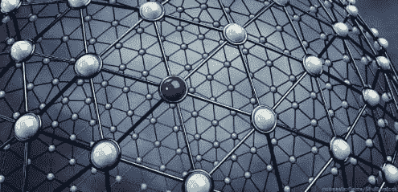

# 拓扑数据分析 – 开源实现

> 原文：[`www.kdnuggets.com/2015/11/topological-data-analysis-open-source-implementations.html`](https://www.kdnuggets.com/2015/11/topological-data-analysis-open-source-implementations.html)

**作者：[Matthew Mayo](https://twitter.com/mattmayo13)。**

[拓扑数据分析](https://en.wikipedia.org/wiki/Topological_data_analysis)（TDA）是一个应用数学领域，目前在分析界引起了各种关注。它使用现代数学概念，如[函子](https://en.wikipedia.org/wiki/Functor)，并具有诸如在坐标自由性和对噪声的鲁棒性方面的成功等可取属性。TDA 能够对其实际用途做出一些有力的主张；然而，它是最数学严谨的统计分析领域之一。这篇文章很好地介绍了 TDA 给机器学习领域的读者。

在我们转向现有的开源 TDA 工具之前，让我们先看看 TDA 在工业界的当前驱动力。[Ayasdi](http://www.ayasdi.com/)成立于 2008 年，由[Gunnar Carlsson](http://math.stanford.edu/~gunnar/)、[Gurjeet Singh](https://twitter.com/singhgurjeet)和[Harlan Sexton](https://www.linkedin.com/pub/harlan-sexton/7/325/633)创办，是 TDA 领域的主要商业参与者，并在斯坦福大学经过十多年的研究后成立。尽管 Ayasdi 今天可以说是 TDA 的主要参与者，但它并非唯一；还有许多活跃的开源项目存在。

想了解更多关于 TDA 的信息吗？[这是一个视频](https://www.youtube.com/watch?v=XfWibrh6stw)，由 Ayasdi 联合创始人兼长期 TDA 研究员 Gunnar Carlsson 简明扼要地解释了 TDA。[这个 Github 仓库](https://gist.github.com/turnersr/8668521)包含了一个精心挑选的 TDA 学习资源列表，包括温和的非数学介绍和更严格的数学处理。俄亥俄州立大学提供了课程[计算拓扑与数据分析](http://web.cse.ohio-state.edu/~tamaldey/course/CTDA/CTDA.html)，并且课程的大部分笔记和资源可在其网站上获得。

今年早些时候，[KDnuggets](https://www.kdnuggets.com)对 Ayasdi 工程师 Anthony Bak 进行了系列采访，以证明 TDA 意识的日益增强（第一部分，第二部分，第三部分），以及最近的深度学习与拓扑数据分析可以为你的数据做的 6 件疯狂的事。上述链接之一也是最近的精选文章。鉴于这一趋势，未来**可能会**有更多关于拓扑数据分析的 KDnuggets 文章。

**开源 TDA 工具**

我们将注意力转向开源 TDA 项目。虽然它目前还不在主流中，并且仍处于早期采用阶段，但值得注意的是，TDA 远非专有技术。Ayasdi 可能是该领域最显著的参与者，但也存在一些开源实现的核心 TDA 组件。Ayasdi 及其工程师甚至为一些这些项目做出了贡献。

以下是几个开源 TDA 项目的列表，包含来自项目来源的简要描述。

**[Python Mapper](http://danifold.net/mapper/introduction.html)**

> Mapper 算法是一种由 Gurjeet Singh、Facundo Mémoli 和 Gunnar Carlsson 发明的拓扑数据分析方法。请参见参考文献[R1]了解更多出版信息。虽然 Mapper 算法本身并不构成一个完整的数据分析工具，但它是处理链的关键部分，包括（最少）过滤函数、Mapper 算法本身和结果的可视化。
> 
> Python Mapper 是由 Daniel Müllner 和 Aravindakshan Babu 编写的此工具链的实现。它是开源软件，并在 GNU GPLv3 许可下发布。

**[由@mlwave 开发的数字识别概念验证 Mapper（Python）](https://www.kaggle.com/triskelion/digit-recognizer/mapping-digits-with-a-t-sne-lens/notebook)**

> 描述：1) 在训练集上使用 MinMaxScaler。2) 对训练集中的前 5000 张图像进行 t-SNE 降维到 2 个组件。3) 在前两个维度上创建重叠区间，并对重叠区域内的点进行聚类。4) 这些聚类然后成为图中的节点。5) 当不同的聚类有一个或多个非唯一成员时，我们绘制一条边。6) 根据每个聚类中点的数量调整节点大小。7) 根据距离第一个维度的最小值为节点着色。8) 在工具提示中显示每个聚类成员的图像。

**[Dionysus（C++，带 Python 绑定）](http://mrzv.org/software/dionysus/)**

> Dionysus 是一个用于计算持久同调的 C++库。它提供了以下算法的实现：
> 
> ▪  持久同调计算
> 
> ▪  葡萄园
> 
> ▪  持久同调计算
> 
> ▪  锯齿形持久同调

**[TDA: 拓扑数据分析的统计工具 (R)](https://cran.r-project.org/web/packages/TDA/)**

> 提供持久同源性统计分析和密度聚类的工具。为此，本包提供了 R 接口，用于高效的 C++ 库算法，包括 GUDHI、Dionysus 和 PHAT（见 [vignette](https://cran.r-project.org/web/packages/TDA/vignettes/article.pdf)）。

**[TDAmapper: 使用 Mapper 的拓扑数据分析 (R)](https://github.com/paultpearson/TDAmapper/)**

> 一个用于使用离散莫尔斯理论分析数据集的 R 包，使用了 G. Singh、F. Memoli 和 G. Carlsson（2007）描述的 Mapper 算法。

**[JavaPlex](https://github.com/appliedtopology/javaplex)**

> JavaPlex 库实现了持久同源性及相关技术，这些技术来自计算和应用拓扑学，库的设计旨在易于使用、易于从 Matlab 和基于 Java 的系统访问，以及便于进一步研究项目和方法的扩展。JavaPlex 主要由斯坦福大学的计算拓扑学工作组开发，基于该小组之前的类似包。

**[CTL (C++)](https://github.com/appliedtopology/ctl)**

> 这个 C++11 库提供了一组通用工具用于：
> 
> ▪  生成点集（敬请期待）
> 
> ▪  构建邻域图
> 
> ▪  构建细胞复合体
> 
> ▪  在有限域上计算 [持久] 同源性
> 
> ▪  同源性的并行算法

**[Kohonen (Python)](https://github.com/lmjohns3/kohonen)**

> 这个模块包含一些基础的 Kohonen 风格向量量化器的实现：自组织映射（SOM）、神经气体和增长神经气体。Kohonen 风格的向量量化器使用某种明确指定的拓扑来促进原型“神经元”之间的良好分离。

**简介： [Matthew Mayo](https://twitter.com/mattmayo13)** 是一名计算机科学研究生，目前正在进行关于并行化机器学习算法的论文工作。他还是数据挖掘的学生、数据爱好者以及有志成为机器学习科学家的研究者。

**相关：**

+   拓扑分析与机器学习：朋友还是敌人？

+   访谈：Anthony Bak 和 Ayasdi 论利用拓扑摘要的新见解

+   深度学习和拓扑数据分析能对你的数据做的 6 件疯狂的事

* * *

## 我们的前三个课程推荐

 1\. [Google 网络安全证书](https://www.kdnuggets.com/google-cybersecurity) - 快速进入网络安全职业轨道。

 2\. [Google 数据分析专业证书](https://www.kdnuggets.com/google-data-analytics) - 提升你的数据分析技能

 3\. [Google IT 支持专业证书](https://www.kdnuggets.com/google-itsupport) - 支持您的组织的 IT

* * *

### 更多相关话题

+   [闭源与开源图像标注](https://www.kdnuggets.com/closed-source-vs-open-source-image-annotation)

+   [介绍 MetaGPT 的数据解释器：SOTA 开源 LLM 基于的数据解决方案](https://www.kdnuggets.com/metagpt-data-interpreter-open-source-llm-based-data-solutions)

+   [使用开源工具生成合成时间序列数据](https://www.kdnuggets.com/2022/06/generate-synthetic-timeseries-data-opensource-tools.html)

+   [2023 年十大开源数据科学工具比较概览](https://www.kdnuggets.com/a-comparative-overview-of-the-top-10-open-source-data-science-tools-in-2023)

+   [加速数据科学进展的开源工具角色](https://www.kdnuggets.com/2023/05/role-open-source-tools-accelerating-data-science-progress.html)

+   [介绍 Objectiv：开源产品分析基础设施](https://www.kdnuggets.com/2022/06/objectiv-introducing-objectiv-opensource-product-analytics-infrastructure.html)
