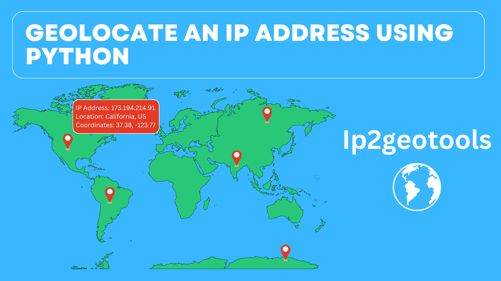

# 如何使用 Python 跟踪 IP 地址的位置

> 原文：[`www.kdnuggets.com/2023/01/track-location-ip-address-python.html`](https://www.kdnuggets.com/2023/01/track-location-ip-address-python.html)



图片由作者提供

我们将使用一个名为 **ip2geotools** 的 Python 库，该库可以确定 IP 地址的实际位置。这可以确定 IP 地址所在的国家、地区、城市、纬度和经度。

* * *

## 我们的前三个课程推荐

 1\. [Google 网络安全证书](https://www.kdnuggets.com/google-cybersecurity) - 快速进入网络安全职业道路

 2\. [Google 数据分析专业证书](https://www.kdnuggets.com/google-data-analytics) - 提升你的数据分析技能

 3\. [Google IT 支持专业证书](https://www.kdnuggets.com/google-itsupport) - 支持你的组织的 IT

* * *

它支持 IPv4 和 IPv6 地址，并且可以处理单个 IP 地址和 IP 地址列表。但需要注意的是，这个库并不是 100% 准确，结果的准确性取决于所用的数据源和数据的质量。然而，它被广泛使用，社区活跃，所以库会定期更新。

# 从 IP 地址获取位置

在本节中，我们将讨论提取 IP 地址或 URL 位置的 Python 代码。

## 1\. 导入必要的库

```py
$ pip install ip2geotools
```

```py
import socket
import requests
from ip2geotools.databases.noncommercial import DbIpCity
from geopy.distance import distance
```

以下函数用于打印 IP 地址的详细信息，如城市、国家、坐标等。

```py
def printDetails(ip):
    res = DbIpCity.get(ip, api_key="free")
    print(f"IP Address: {res.ip_address}")
    print(f"Location: {res.city}, {res.region}, {res.country}")
    print(f"Coordinates: (Lat: {res.latitude}, Lng: {res.longitude})")
```

## 2\. 从 IP 地址获取位置

```py
ip_add = input("Enter IP: ")  # 198.35.26.96
printDetails(ip_add)
```

**输出：**

```py
IP Address: 198.35.26.96
Location: San Jose, California, US
Coordinates: (Lat: 37.3361663, Lng: -121.890591)
```

## 3\. 从 URL 获取位置

```py
url = input("Enter URL: ")  # www.youtube.com
ip_add = socket.gethostbyname(url)
printDetails(ip_add)
```

**输出：**

```py
Enter the URL: www.youtube.com
IP Address: 173.194.214.91
Location: Mountain View, California, US
Coordinates: (Lat: 37.3893889, Lng: -122.0832101)
```

# 一些常见的用例

在这里我们讨论一些用例，比如阻止某些特定国家的 IP 地址或计算两个 IP 地址之间的距离等。

## 1\. 根据位置阻止某些 IP 地址

以下代码查找 IP 地址的位置，然后检查该位置的国家是否在被阻止的国家列表中。

```py
def is_country_blocked(ip_address):
    blocked_countries = ["China", "Canada", "India"]
    location = DbIpCity.get(ip_address)
    if location.country in blocked_countries:
        return True
    else:
        return False

ip_add = input("Enter IP: ")  # 198.35.26.96
if is_country_blocked(ip_add) is True:
    print(f"IP Address: {ip_add} is blocked")
else:
    print(f"IP Address: {ip_add} is allowed")
```

**输出：**

```py
Enter the IP Address: 198.35.26.96
IP Address: 198.35.26.96 is allowed
```

你也可以修改该代码，以允许来自特定国家的 IP 地址。

## 2\. 计算两个 IP 地址之间的距离

以下代码将计算两个 IP 地址位置之间的距离（以公里为单位）。

```py
def calculate_distance(ip1, ip2):
    res1 = DbIpCity.get(ip1)
    res2 = DbIpCity.get(ip2)
    lat1, lon1 = res1.latitude, res1.longitude
    lat2, lon2 = res2.latitude, res2.longitude
    return distance((lat1, lon1), (lat2, lon2)).km

# Input two IP addresses
ip_add_1 = input("1st IP: ")  # 198.35.26.96
ip_add_2 = input("2nd IP: ")  # 220.158.144.59
dist = calculate_distance(ip_add_1, ip_add_2)
print(f"Distance between them is {str(dist)}km")
```

**输出：**

```py
Enter 1st IP Address: 198.35.26.96
Enter 2nd IP Address: 220.158.144.59
Distance between them is 12790.62320788363km
```

## 3\. 计算你当前的位置和服务器之间的距离

以下代码将计算你当前的位置和给定 IP 地址位置之间的距离（以公里为单位）。

```py
def get_distance_from_location(ip, lat, lon):
    res = DbIpCity.get(ip)
    ip_lat, ip_lon = res.latitude, res.longitude
    return distance((ip_lat, ip_lon), (lat, lon)).km

server_ip = input("Server's IP: ")
lat = float(input("Your Latitude: "))
lng = float(input("Your Longitude: "))

dist = get_distance_from_location(server_ip, lat, lng)
print(f"Distance between the server and your location is {str(dist)}km")
```

**输出：**

```py
Enter your server's IP Address: 208.80.152.201
Enter your current location (Latitude): 26.4710
Enter your current location (Longitude): 73.1134
Distance between the server and your location is 12183.275099919923km
```

# 结论

跟踪 IP 地址的位置有几个好处，比如企业可以根据用户的位置提供定向广告。这可以带来更有效的营销活动、更高的转化率，并且能个性化用户体验。

此外，这在欺诈检测中也很有帮助，例如阻止来自特定国家的 IP 地址，以及验证 IP 地址以确保其格式正确。

总之，我希望您喜欢这篇文章并觉得它有帮助。您可以找到完整代码的[协作文件](https://colab.research.google.com/drive/1CgukDZkUkwBmce7vqnXARGQ8q9stMACk?usp=sharing)。如果您有任何建议或反馈，请通过 LinkedIn 与我联系。

祝您有美好的一天????。

**[Aryan Garg](https://www.linkedin.com/in/aryan-garg-1bbb791a3/)** 是一名 B.Tech 电气工程学生，目前正处于本科最后一年。他对 Web 开发和机器学习领域充满兴趣。他已经追求了这一兴趣，并渴望在这些方向上继续工作。

### 更多相关主题

+   [数据治理能否应对 AI 疲劳？](https://www.kdnuggets.com/can-data-governance-address-ai-fatigue)

+   [为什么单独使用 LLM 无法满足贵公司的预测需求](https://www.kdnuggets.com/2024/01/pecan-llms-used-alone-cant-address-companys-predictive-needs)

+   [追踪和可视化您 Python 代码执行的 3 种工具](https://www.kdnuggets.com/2021/12/3-tools-track-visualize-execution-python-code.html)

+   [KDnuggets™ 新闻 22:n01，1 月 5 日：追踪和可视化的 3 种工具…](https://www.kdnuggets.com/2022/n01.html)

+   [通过热门数据技能快速推进您的下一步](https://www.kdnuggets.com/2023/01/datacamp-fast-track-next-move-indemand-data-skills.html)

+   [如何使用 Python 确定最佳数据分布](https://www.kdnuggets.com/2021/09/determine-best-fitting-data-distribution-python.html)
