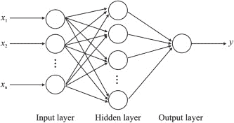
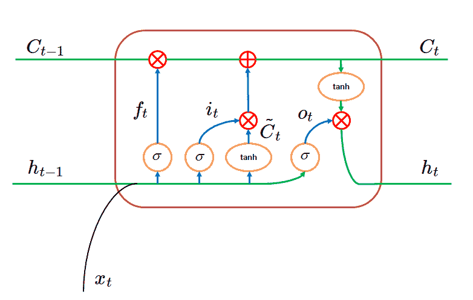

# 训练一个神经网络以模仿洛夫克拉夫特的写作风格

> 原文：[`www.kdnuggets.com/2019/07/training-neural-network-write-like-lovecraft.html`](https://www.kdnuggets.com/2019/07/training-neural-network-write-like-lovecraft.html)

 评论


LSTM 神经网络近年来被广泛应用于文本和音乐生成以及时间序列预测。

今天，我将教你如何训练一个 LSTM 神经网络进行文本生成，以便它可以以 H. P. 洛夫克拉夫特的风格写作。

为了训练这个 LSTM，我们将使用 TensorFlow 的 Keras API for Python。

我从这个很棒的 [LSTM 神经网络教程](http://colah.github.io/posts/2015-08-Understanding-LSTMs/) 学习到了这个主题。我的代码紧随这个 [文本生成教程](https://chunml.github.io/ChunML.github.io/project/Creating-Text-Generator-Using-Recurrent-Neural-Network/)。

我将像往常一样展示我的 Python 示例和结果，但首先，让我们先做一些解释。

### 什么是 LSTM 神经网络？

最普通的、最基本的神经网络，称为多层感知器，就是完全连接层的组合。

在这些模型中，输入是特征的向量，每一层是一个“神经元”集合。

每个神经元对前一层的输出进行仿射（线性）变换，然后对结果应用某种非线性函数。

一层的神经元的输出，即一个新的向量，被传递到下一层，依此类推。



[来源](https://www.researchgate.net/figure/A-hypothetical-example-of-Multilayer-Perceptron-Network_fig4_303875065)

LSTM（长短期记忆）神经网络只是另一种 [人工神经网络](http://www.datastuff.tech/machine-learning/autoencoder-deep-learning-tensorflow-eager-api-keras/)，属于递归神经网络的范畴。

LSTM 神经网络与普通神经网络不同之处在于，它们在某些层中使用 LSTM 单元作为神经元。

就像 [卷积层](http://www.datastuff.tech/machine-learning/convolutional-neural-networks-an-introduction-tensorflow-eager/) 帮助神经网络学习图像特征一样，LSTM 单元帮助网络学习时间序列数据，这是其他机器学习模型传统上难以处理的。

LSTM 单元是如何工作的？我现在将解释，不过我强烈建议你也看看那些教程。

### LSTM 单元是如何工作的？

一个 LSTM 层将包含许多 LSTM 单元。

我们神经网络中的每个 LSTM 单元只会查看输入的单列，以及前一列的 LSTM 单元输出。

通常，我们将整个矩阵作为输入喂给 LSTM 神经网络，每列对应于“前面”某个内容的下一个列。

这样，每个 LSTM 单元将有**两个不同的输入向量**：前一个 LSTM 单元的输出（为其提供有关前一个输入列的一些信息）和它自己的输入列。

### LSTM 单元的实际运作：一个直观的例子。

例如，如果我们训练一个 LSTM 神经网络来预测股票市场值，我们可以给它输入一个包含过去三天股票收盘价的向量。

在这种情况下，第一个 LSTM 单元将使用第一天的数据作为输入，并将一些提取的特征传递给下一个单元。

那个第二个单元会查看第二天的价格，并且还会查看前一个单元从昨天学到的内容，然后生成下一个单元的新输入。

在对每个单元做完这些操作后，最后一个单元实际上会有很多时间信息。它将接收来自前一个单元的昨日收盘价的学习结果，以及来自前两个单元的信息（通过其他单元提取的信息）。

你可以尝试不同的时间窗口，也可以改变有多少单元（神经元）查看每天的数据，但这是大致的思路。

### LSTM 单元如何工作：数学原理。

实际上，每个单元从前一个单元提取的内容的数学原理要复杂一些。

**忘记门**

“忘记门”是一个 sigmoid 层，它调节前一个单元的输出对当前单元的影响程度。

它以前一个单元的“隐藏状态”（另一个输出向量）和来自前一层的实际输入作为输入。

由于它是一个 sigmoid 函数，它将返回一个“概率”向量：值在 0 和 1 之间。

它们将**前一个单元的输出进行乘法运算**，以调节它们所持有的影响力，从而创建该单元的状态。

例如，在极端情况下，sigmoid 可能返回一个零向量，整个状态将被乘以 0，从而被丢弃。

如果该层看到输入分布的变化非常大，例如，可能会发生这种情况。

**输入门**

与忘记门不同，输入门的输出会被添加到前一个单元的输出中（在它们被忘记门的输出乘法运算后）。

输入门是两个不同层输出的点积，尽管它们都使用与忘记门相同的输入（前一个单元的隐藏状态和前一层的输出）：

+   一个**sigmoid 单元**，调节新信息对该单元输出的影响程度。

+   一个**tanh 单元**，实际提取新信息。请注意，tanh 的取值范围在-1 和 1 之间。

**这两个单元的乘积**（可能再次是 0，也可能完全等于 tanh 的输出，或介于两者之间）被添加到该神经元的单元状态中。

**LSTM 单元的输出**

单元的状态是下一个 LSTM 单元将接收的输入，连同该单元的隐藏状态一起。

隐藏状态将是**另一个 tanh 单元**，应用于该神经元的状态，再乘以另一个**sigmoid 单元**，该单元接受前一层和单元的输出（就像忘记门一样）。

这是我刚刚链接的教程中借用的每个 LSTM 单元的可视化图像。



来源： [文本生成 LSTM](https://chunml.github.io/ChunML.github.io/project/Creating-Text-Generator-Using-Recurrent-Neural-Network/)

现在我们已经覆盖了理论部分，让我们转到一些实际应用吧！

像往常一样，所有代码都可以在[GitHub 上找到](https://github.com/StrikingLoo/LoveCraftLSTM)，如果你想尝试一下，或者你可以继续跟随并查看要点。

### 使用 TensorFlow Keras 训练 LSTM 神经网络

对于这个任务，我使用了这个[包含 60 篇洛夫克拉夫特故事的数据集](https://github.com/vilmibm/lovecraftcorpus)。

由于他大部分作品是在 20 年代写的，他在 1937 年去世，因此现在大部分作品已进入公有领域，所以获取这些作品并不困难。

我认为训练一个神经网络来模仿他的写作风格将是一个有趣的挑战。

这是因为，一方面，他有一种非常独特的风格（充满华丽的修辞：使用奇怪的词汇和复杂的语言），但另一方面，他使用了非常复杂的词汇，网络可能难以理解。

例如，这里是数据集中的第一个故事中的一句随机句子：

> 夜晚，黑暗城市的细微躁动、蛀虫隔板中老鼠的阴险奔走，以及百年老屋中隐蔽木材的吱吱声，足以让他感受到刺耳的混乱。

如果我能让神经网络写出“pandemonium”，那么我会很惊讶。

### 预处理我们的数据

为了训练 LSTM 神经网络生成文本，我们必须首先预处理文本数据，以便网络可以处理。

在这种情况下，由于神经网络接受向量作为输入，我们需要一种将文本转换为向量的方法。

对于这些示例，我决定训练我的 LSTM 神经网络来预测字符串中的下一个 M 个字符，以之前的 N 个字符作为输入。

为了能够输入 N 个字符，我对每个字符进行了独热编码，使得网络的输入是一个 CxN 的矩阵，其中 C 是数据集中不同字符的总数。

首先，我们读取文本文件并将它们的内容连接起来。

我们将字符限制为字母数字和一些标点符号。

然后，我们可以将字符串进行独热编码，转化为矩阵，其中每个*j*列的元素都是 0，除了对应于语料库中的*j*字符的那个元素。

为了实现这一点，我们首先定义一个字典，将每个字符分配一个索引。

注意，如果我们希望对数据进行采样，我们可以将变量*slices*调整得更小。

我还为*SEQ_LENGTH*选择了 50 的值，使网络接收 50 个字符并尝试预测接下来的 50 个字符。

### 训练我们的 LSTM 神经网络

为了训练神经网络，我们必须首先定义它。

这段 Python 代码创建了一个具有两个 LSTM 层的 LSTM 神经网络，每层有 100 个单元。

记住，每个单元对输入序列中的每个字符都有一个单元，因此有 50 个。

这里*VOCAB_SIZE*只是我们将使用的字符数量，而*TimeDistributed*是一种将给定层应用于每个不同单元格的方式，保持时间顺序。

对于这个模型，我实际上尝试了许多不同的学习率来测试收敛速度与过拟合。

这是训练的代码：

你看到的是在损失最小化方面表现最好的结果。

然而，在最后一个周期（500 个周期后）中，binary_cross_entropy 为 0.0244，模型的输出如下。

```py
Tolman hast toemtnsteaetl nh otmn   tf titer  aut tot tust tot  ahen h l the srrers ohre trrl tf thes snneenpecg tettng s  olt oait ted beally tad ened ths tan en ng y afstrte  and trr t sare t teohetilman hnd tdwasd hxpeinte  thicpered the reed af the satl r  tnnd  Tev hilman hnteut iout y techesd d ty ter thet te wnow tn tis strdend af ttece and tn  aise  ecn
```

这个输出有很多**好处**，也有**很多坏处**。

间距设置的方式，单词大多在 2 到 5 个字符之间，偶尔有较长的例外，这与语料库中的实际单词长度分布非常相似。

我还注意到**字母**‘T’，‘E’和‘I’**非常常见**，而‘y’或‘x’则**较少见**。

当我查看**字母相对频率**在样本输出与语料库中的比较时，它们相当相似。问题在于**排序**完全**错乱**。

还有一点需要指出的是，**大写字母仅在空格后出现**，这通常是英语中的情况。

为了生成这些输出，我只是让模型预测语料库中不同 50 个字符子集的下一个 50 个字符。如果训练数据如此糟糕，我觉得测试或随机数据也不会值得检查。

这些无意义的内容实际上让我想起了 H. P. Lovecraft 最著名的故事之一，“克苏鲁的呼唤”，其中人们开始对这个宇宙的、古怪的存在产生幻觉，他们会说：

> Ph’nglui mglw’nafh *Cthulhu R’lyeh* wgah’nagl fhtagn.

可惜模型也没有过拟合，它明显**欠拟合**。

所以我试图让任务更小，模型更大：125 个单元，预测仅 30 个字符。

### 更大的模型，更小的问题。有什么结果吗？

在这个更小的模型下，再经过 500 个训练周期后，一些模式开始出现。

尽管损失函数（210）没有小太多，字符的频率仍然与语料库相似。

尽管如此，字符的排序改善了很多：这是它输出的一个随机样本，看看你能否发现一些单词。

```py
the sreun  troor  Tvwood sas an  ahet eae rin  and t paared th te aoolling onout  The e was thme trr t sovtle tousersation oefore tifdeng tor teiak uth tnd tone gen ao tolman aarreed y arsred tor h tndarcount tf tis feaont oieams wnd toar   Tes heut oas nery tositreenic  and t aeed aoet thme hing tftht to te tene  Te was noewked ay tis prass s deegn  aedgireean ect  and tot ced the sueer  anoormal -iuking torsarn oaich hnher  tad beaerked toring the sars tark  he e was tot tech
```

技术、the 和 and，was… **小词**是重点！它还意识到许多单词以**常见后缀**如-ing，-ed 和-tion 结尾。

在 10000 个单词中，740 个是“*the*”，37 个以“*tion*”结尾（而只有 3 个是没有以此结尾的），115 个以-*ing*结尾。

其他常见单词包括“than”和“that”，尽管模型显然仍然无法生成英文句子。

### 更大的模型

这给了我希望。神经网络显然在学习*某些东西*，只是还不够多。

所以我做了当模型欠拟合时应该做的事情：我尝试了一个更大的神经网络。

请考虑，我是在我的笔记本电脑上运行这个。

即使配备了 16GB 的内存和 i7 处理器，这些模型仍需数小时才能完成学习。

所以我将单位数量设置为 150，再次尝试了 50 个字符。

我想也许给它更小的时间窗口会让网络更难处理。

这是模型在经过几个小时训练后的输出情况。

```py
andeonlenl  oou   torl u aote  targore  -trnnt d tft thit tewk d tene tosenof the stown ooaued aetane ng thet thes teutd nn  aostenered tn t9t   aad tndeutler y aean the stun h tf trrns anpne thin te saithdotaer totre aene   Tahe sasen ahet teae es  y aeweeaherr aore ereus oorsedt  aern totl s a dthe snlanete toase  af the srrls-thet treud tn the  tewdetern tarsd totl s a dthe searle of the sere t trrd  eneor   tes ansreat tear d af teseleedtaner nl  and tad thre n tnsrnn tearltf trrn T has tn oredt d to e e te hlte tf the sndirehio aeartdtf trrns afey aoug ath e -ahe sigtereeng tnd tnenheneo l arther ardseu troa Tnethe setded toaue  and tfethe sawt  ontnaeteenn an the setk eeusd  ao enl  af treu r ue oartenng otueried tnd toottes the r arlet ahicl tend orn teer  ohre teleole tf the sastr  ahete ng tf toeeteyng tnteut ooseh aore  of theu y aeagteng tntn rtng aoanleterrh  ahrhnterted tnsastenely aisg ng tf toueea  en  toaue y anter aaneonht tf the sane ng tf the 
```

完全是无意义的，除了大量的“the”和“and”。

实际上，它说“the”的频率比之前更高，但它还没有学会动名词（没有 -ing）。

有趣的是，这里许多单词以“-ed”结尾，这意味着它有点儿掌握了**过去时**的概念。

我让它继续训练了几百个周期（共 750 个）。

输出变化不大，仍然是大量的“the”、“a”和“an”，并且没有更大的结构。这里是另一个样本：

```py
Tn t srtriueth  ao tnsect on tias ng the sasteten c wntnerseoa onplsineon was ahe ey thet tf teerreag tispsliaer atecoeent of teok ond ttundtrom tirious arrte of the sncirthio sousangst  tnr r te the seaol enle tiedleoisened ty trococtinetrongsoa Trrlricswf tnr txeenesd ng tispreeent  T wad botmithoth te tnsrtusds tn t y afher worsl ahet then
```

但有趣的是，出现了对介词和代词的使用。

网络写了几次“I”，“you”，“she”，“we”，“of”等类似的词。总的来说，**介词和代词**大约占**总采样单词的 10%**。

这是一个改进，因为网络显然在学习低熵的单词。

然而，它仍然远未生成连贯的英语文本。

我让它再训练了 100 个周期，然后停止了。

这是它的最后输出。

```py
thes was aooceett than engd   and te trognd tarnereohs aot teiweth tncen etf thet torei The  t hhod nem tait t had nornd tn t yand tesle onet te heen t960 tnd t960  wndardhe  tnong toresy aarers oot tnsoglnorom thine tarhare toneeng  ahet  and the sontain teadlny of the ttrrteof ty tndirtanss aoane ond terk thich hhe senr  aesteeeld  Tthhod nem  ah   tf the saar hof tnhe e on thet teauons and teu the  ware taiceered t rn trr trnerileon   and
```

我知道它已经尽力而为，但它确实没有取得实质性的进展，至少不够快。

我考虑通过**批量归一化**来加快收敛速度。

然而，我在 StackOverflow 上读到，BatchNorm 不应该与 LSTM 神经网络一起使用。

如果你们中有人对 LSTM 网络更有经验，请在评论中告诉我这是否正确！

最后，我尝试了用 10 个字符作为输入，10 个字符作为输出来执行相同的任务。

我想模型没有获得足够的上下文来很好地预测事物：结果非常糟糕。

我考虑目前实验已经结束了。

### 结论

尽管从其他人的工作中可以看出，LSTM 神经网络*可能*学会像洛夫克拉夫特一样写作，但我认为我的电脑不够强大，无法在合理的时间内训练出足够大的模型。

或者，也许它只是需要比我拥有的更多的数据。

未来，我希望用基于词的方式重复这个实验，而不是基于字符的方式。

我检查了一下，语料库中大约 10%的单词只出现过一次。

如果我在训练之前删除了它们，有什么好的做法吗？比如用相同的名词替换所有名词，从[簇](http://www.datastuff.tech/machine-learning/k-means-clustering-unsupervised-learning-for-recommender-systems/)中采样，或者其他方法？请告诉我！我相信你们中的许多人在 LSTM 神经网络方面比我更有经验。

你认为如果使用不同的架构会更好吗？有什么我应该以不同方式处理的地方吗？请告诉我，我想了解更多关于这方面的知识。

你在我的代码中发现了什么新手错误吗？你认为我因为没尝试 XYZ 而显得很愚蠢吗？还是你实际上觉得我的实验很有趣，或者你甚至从这篇文章中学到了什么？

如需讨论此事或相关话题，请在[Twitter](https://www.twitter.com/strikingloo)、[LinkedIn](http://linkedin.com/in/luciano-strika)、[Medium](https://medium.com/@strikingloo)或[Dev.to](http://www.dev.to/strikingloo)与我联系。

*如果你想成为数据科学家或学习新东西，查看我的[机器学习阅读清单](http://www.datastuff.tech/data-science/3-machine-learning-books-that-helped-me-level-up-as-a-data-scientist/)!*

**简介：[Luciano Strika](http://www.datastuff.tech/author/strikingloo/)** 是布宜诺斯艾利斯大学的计算机科学学生，同时也是 MercadoLibre 的数据科学家。他还在[www.datastuff.tech](http://www.datastuff.tech/)上撰写有关机器学习和数据的文章。

[原文](http://www.datastuff.tech/machine-learning/lstm-how-to-train-neural-networks-to-write-like-lovecraft)。经许可转载。

**相关：**

+   自动编码器：使用 TensorFlow 的 Eager Execution 进行深度学习

+   3 本提升我作为数据科学家技能的机器学习书籍

+   理解反向传播在 LSTM 中的应用

* * *

## 我们的前三名课程推荐

 1\. [Google 网络安全证书](https://www.kdnuggets.com/google-cybersecurity) - 快速进入网络安全职业的快车道。

 2\. [Google 数据分析专业证书](https://www.kdnuggets.com/google-data-analytics) - 提升你的数据分析技能

 3\. [Google IT 支持专业证书](https://www.kdnuggets.com/google-itsupport) - 支持你的组织的 IT 需求

* * *

### 更多相关话题

+   [使用管道编写干净的 Python 代码](https://www.kdnuggets.com/2021/12/write-clean-python-code-pipes.html)

+   [成为优秀数据科学家所需的 5 项关键技能](https://www.kdnuggets.com/2021/12/5-key-skills-needed-become-great-data-scientist.html)

+   [每个初学者数据科学家都应掌握的 6 种预测模型](https://www.kdnuggets.com/2021/12/6-predictive-models-every-beginner-data-scientist-master.html)

+   [2021 年最佳 ETL 工具](https://www.kdnuggets.com/2021/12/mozart-best-etl-tools-2021.html)

+   [使用 TensorFlow 和 Keras 构建和训练你的第一个神经网络](https://www.kdnuggets.com/2023/05/building-training-first-neural-network-tensorflow-keras.html)

+   [停止学习数据科学以寻找目标，并寻找目标来…](https://www.kdnuggets.com/2021/12/stop-learning-data-science-find-purpose.html)
