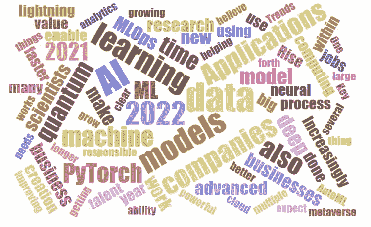

# 2021 年 AI、数据科学、机器学习技术的主要发展和 2022 年的关键趋势

> 原文：[`www.kdnuggets.com/2021/12/trends-ai-data-science-ml-technology.html`](https://www.kdnuggets.com/2021/12/trends-ai-data-science-ml-technology.html)

评论 2021 年充满了起伏，但我希望对大多数人来说，它比 2020 年要好，生活逐渐回归正常，并且有一些愉快的传统。KDnuggets 的传统之一是我们每年的专家预测总结。

我们问专家的问题是

> **2021 年 AI、数据科学、机器学习的主要发展是什么？你对 2022 年有什么关键趋势的看法？**

一些提到的重要话题包括 **AutoML、自动化和 RPA、应用：更多更好、数据网格、数据结构和以数据为中心的方法、深度学习和 PyTorch、GPT-3 类系统、边缘设备、外部数据源、低代码和无代码 AI、MLOps、负责任的 AI、人才缺口和人员配置，以及量子计算/机器学习**。

这里是我们的专家意见，包括 Marcus Borba、Kirk Borne、Tom Davenport、Carla Gentry、Doug Laney、Pierre Pinna (IPFConline)、Ganapathi Pulipaka、Kate Strachnyi 和 Mark van Rijmenam 的贡献。

同意？不同意？请在下方评论！

* * *

**[Marcus Borba](https://twitter.com/marcusborba)，全球 AI、机器学习、数据科学领域的思想领袖和影响者**。

目前，AI 正在被应用于大多数知识领域，并迅速发展，扩展到多个新领域，如 **多模态** 应用和更小的设备，使得技术发展以空前的速度增长。到 2021 年，对透明和 **可信赖** 的 AI 的关注促使负责任和可解释的 AI 概念变得更加重要，有助于理解 AI 如何运作。另一个看到强劲增长的领域是 **超自动化**，利用多种互联技术，如 AI 和机器学习、物联网、RPA 和增强分析，提升人机协作并实现更好的生产力。

对于 2022 年，我相信 **量子机器学习** 将是下一个大趋势。量子机器学习是量子计算和 AI 的交集，将使得创建更强大的机器学习和 AI 模型成为可能。随着大型技术公司对量子计算机上机器学习的开发和支持，资源将通过云模型可用。**智能过程自动化** 的不断发展和应用将为公司提供更大的灵活性，不仅仅是节省时间，还提高了操作效率并帮助简化流程。**低代码** 和 **无代码 AI** 解决方案也将越来越使公司能够开始使用 AI，从而更快且更低成本地开发 AI 模型。

* * *

**[Kirk D. Borne](https://twitter.com/KirkDBorne)**，数据科学家 [**@DataPrime_ai**](https://twitter.com/DataPrime_ai)，首席科学官。全球讲者。创始人 @LeadershipData。顶尖 #BigData #DataScience #AI #IoT #ML 影响者。博士，天体物理学。

2021 年的重大趋势包括 AI/ML 在**医疗应用**、金融应用、面向客户的应用、物流/供应链应用以及元宇宙（游戏应用）中的快速扩展。即：应用、应用、应用，组织对其数据、AI、ML、数据科学资产和投资的生产力和价值要求越来越高。

到 2022 年，这种情况将持续，但**人才缺口**正带来越来越大的阻力，这可能成为这种增长势头的障碍。因此，我们可以预期组织会选择更多的低代码/无代码部署（如 AutoML），以利用和维持不断增长的 AI/ML 势头，这将进一步区分 AI 领先者与 AI 落后者，这也支持了老话“完成任务总比完美无瑕好”。

* * *

**[Thomas H. Davenport](https://www.linkedin.com/in/davenporttom/)**，Babson College 杰出教授；牛津大学 Said 商学院访问教授。

2021 年的一个重大进展是**MLOps**的兴起，以监控模型一旦投入生产后的表现。这在一定程度上是因为疫情的需要，在许多公司中，预测需求和供应的模型不再准确。检测模型漂移是 MLOps 的一个重要能力。但 MLOps 的兴起也是许多公司对机器学习模型依赖增加的结果，跟踪模型及其性能成为业务成功的关键。

这将在 2022 年继续，公司将使用 **AutoML**、MLOps 以及其他工具和流程改进来专业化 ML 开发。他们还会更明确地“谁做什么”在 AI 开发和部署中，为模型创建、模型部署、模型监控等任务创造专业角色。这些任务不能全由数据科学家负责。

* * *

**[Carla Gentry](https://www.linkedin.com/in/datanerd13/)**，Zuar 数据科学家和数据倡导者。

随着 Covid 继续影响我们的工作，公司在**员工配置**、远程与内部、数据在云端还是本地等方面进行了调整。一个明确的事实是，我们在数据及其影响力方面正处于十字路口。**数据扩散**已成为组织内部一个真实且昂贵的问题，正在损害创新。Hakkoda 调查，

> “6% 的商业和 IT 领导者将他们的数据组织和流程称为垃圾堆。”
> 
> 来自 (VentureBeat)

2022 年：我们将继续这种数据孤岛路径，因为每个部门总会有自己的议程和需求。能够将多个数据平台整合在一起的公司对于那些没有足够人才、时间或能力将所有数据结合起来进行决策的企业至关重要。对不良理念投入大量资金已不再被接受，**投资回报率**必须实现。让我们拥抱创新技术，但也要记住，数据本身是无用的，除非你对其进行处理！

* * *

**[道格拉斯·B·拉尼](https://www.westmonroe.com/our-team/doug-laney)，创新研究员，数据与分析战略专家。《信息经济学》一书的作者——CIO 杂志年度必读书籍**。

在 2022 年，人工智能、数据科学和机器学习的主要重点将是利用日益增长的**外部数据源**。由于 Covid-19 大流行和各国以及地方响应的不同、不断变化，使得许多组织的基本分析模型变得无用，甚至对业务有害。

随后，企业被迫放弃了依赖公司自身历史数据的趋势分析模型，转而采用基于驱动因素的模型，这些模型考虑了表现的领先指标。企业不再只是盯着自己的肚脐，而是被迫向组织外部寻找以诊断、预测和建议客户行为、库存水平、供应商可用性、人才需求、设备行为、竞争对手反应、合作伙伴能力等方面的信息。

这意味着数据科学家和人工智能开发者的新最佳伙伴（如果不是其他同样吸引人的人）是那些专注于研究和获取新的高价值替代数据源的个人。2022 年将是**数据策展人**的年代。

* * *

**[皮埃尔·皮纳，IFFConline CEO](https://twitter.com/ipfconline1)，数字化转型咨询**。

对于 IPFConline 团队来说，2021 年标志着**OpenAI GPT-3**类型系统在自然语言处理领域的“战斗”，这些模型变得越来越强大且数据密集。同时，Yoshua Bengio 团队发布了一篇关于[GFlowNet 基础](https://arxiv.org/abs/2111.09266)的非凡新论文，提出了在机器学习中实现**因果发现与推理**的重大进展。

对于 2022 年，我们相信人工智能领域的愿景将是提升**模型可解释性**。因此，研究将越来越多地转向**符号 AI 与实际统计深度神经网络的混合模型**。这种解决方案将使得从业者对负责任系统的可信采用充满信心。

* * *

**[甘纳帕提·普利帕卡博士](https://twitter.com/gp_pulipaka)，首席人工智能高性能计算科学家，演讲者，畅销书作者**。

PyTorch Lightning 使深度学习研究社区能够将更多时间用于研究，减少工程方面的时间。今年，它作为一个流行的深度学习框架取得了进展，可以在分布式硬件和高性能计算机器上读取和重现研究成果。PyTorch Lightning 在 GPU、TPU 和 CPU 上都是一个不容忽视的力量。自然语言处理在 2021 年随着 PyTorch Tabular 的推出取得了进展。PyTorch Tabular 在深度学习中处理 Pandas 数据框，因为没有像 Scikit-learn 这样的现成库用于深度学习。它运行在 PyTorch 和 PyTorch Lightning 上。

在 2022 年，我们可以期待分布式量子计算机上的**量子机器学习**以及量子卷积神经网络的训练。2022 年的图神经网络研究继续加速。企业在 2022 年继续采用 PyTorch、TensorFlow、Python 以及诸如 DQN 等强化学习算法，服务于各个行业。

* * *

**[凯特·斯特拉赫尼](https://datacated.com/)，DATAcated 创始人。**

2021 年主要进展

+   我们看到越来越多的公司认识到数据的价值，并拥抱**数据驱动的文化**。

+   数据平台内的创新使企业更容易理解其数据，并缩短洞察和数据驱动决策的时间。

2022 年关键趋势

+   **数据网格、数据织物**、数据仓库的兴起以及向数据中心化的转变；逐渐远离应用/模型中心化。

+   对能够处理大规模合成数据集创建、处理和评估的数据科学家的需求增加；这与元宇宙中的创新有关。

* * *

**[马克·范·赖门南博士](https://www.thedigitalspeaker.com/)，未来技术战略家，主题演讲者，三次著作作者及企业家。**

人工智能和机器学习将在自动化工作中发挥更大的作用。对于非编码人员或非数据科学家来说，这将导致更先进的机器人流程自动化，使办公室工作人员和经理能够在不需要编码知识的情况下进一步自动化自己的工作。因此，员工将能够完成更多的工作，因为大多数单调的工作现在可以被自动化。然而，如果没有编码专长的员工和管理层可以利用 AI 和 ML 来自动化他们的工作，那么那些拥有这些技能的人当然也可以应用相同的策略。

当然，这可以与使用 GPT-3 更快地编写代码相关联，但在 2022 年我们还将看到更先进、自动化和智能的黑客攻击。黑客们将越来越多地转向 AI 来完成更多工作、更快地渗透组织并窃取更多数据。同时，保护公司的人也将转向 AI，因此黑客和 IT 安全人员都会使用 AI，导致一场在光速下进行的战斗。

* * *

也可以查看人工智能、分析、机器学习、数据科学、深度学习**研究**2021 年的主要发展及 2022 年的关键趋势，本周早些时候发布。

**相关：**

+   人工智能、分析、机器学习、数据科学、深度学习**研究**2021 年的主要发展及 2022 年的关键趋势

+   [2020 年人工智能、分析、机器学习、数据科学、深度学习研究的主要发展及 2021 年的关键趋势](https://www.kdnuggets.com/2020/12/predictions-ai-machine-learning-data-science-research.html)

+   [2020 年的主要发展及 2021 年人工智能、数据科学、机器学习技术的关键趋势](https://www.kdnuggets.com/2020/12/developments-trends-ai-data-science-machine-learning-technology.html)

### 更多相关主题

+   [人工智能、分析、机器学习、数据科学、深度学习…](https://www.kdnuggets.com/2021/12/developments-predictions-ai-machine-learning-data-science-research.html)

+   [2021 年数据科学与分析行业主要发展及关键预测](https://www.kdnuggets.com/2021/12/developments-predictions-data-science-analytics-industry.html)

+   [2022 年数据科学、机器学习、人工智能和分析的关键发展](https://www.kdnuggets.com/2022/12/key-data-science-machine-learning-ai-analytics-developments-2022.html)

+   [2022 年及未来 10 大人工智能与数据分析趋势](https://www.kdnuggets.com/2021/12/10-key-ai-trends-for-2022.html)

+   [5 大数据科学趋势与分析趋势](https://www.kdnuggets.com/2022/08/5-key-data-science-trends-analytics-trends.html)

+   [人工智能/机器学习技术整合将如何帮助企业实现目标](https://www.kdnuggets.com/2021/12/aiml-technology-integration-help-business-achieving-goals-2022.html)
