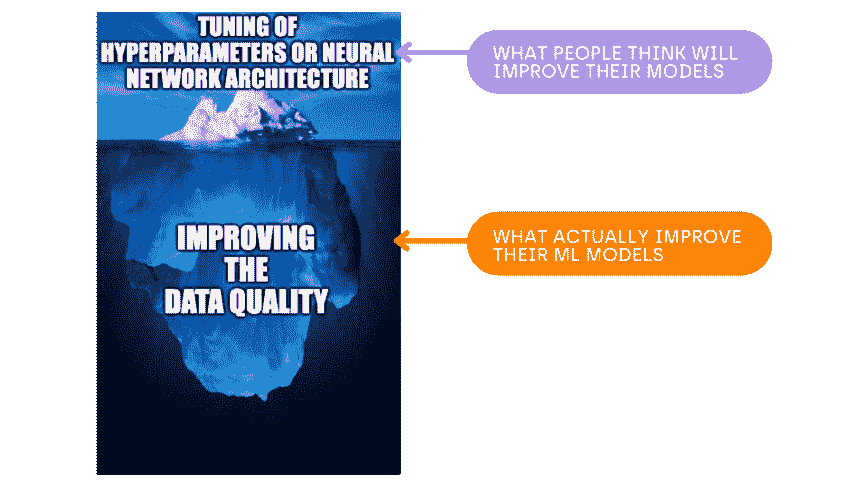
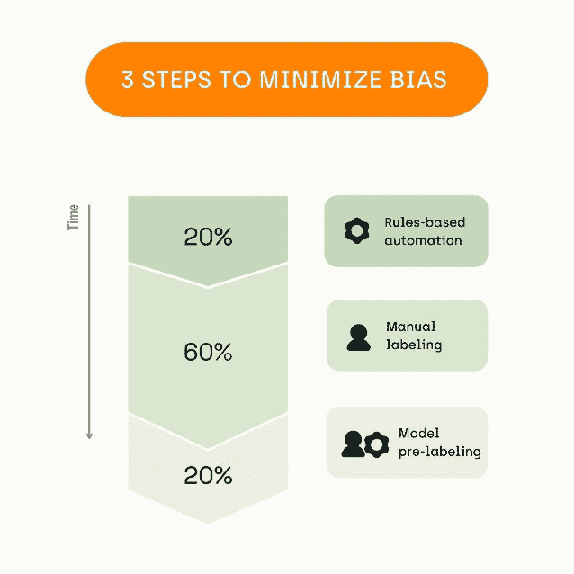
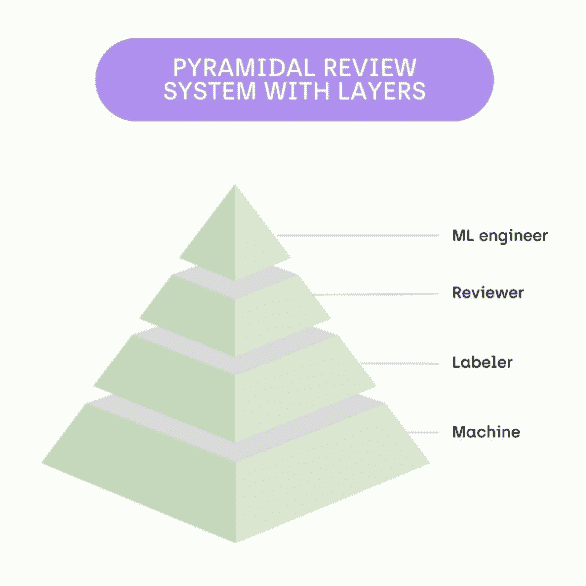

# 对 AI 的信任是无价的

> 原文：[`www.kdnuggets.com/2022/08/trust-ai-priceless.html`](https://www.kdnuggets.com/2022/08/trust-ai-priceless.html)

作为一个数据驱动的 AI IDE 平台（[Kili Technology](https://kili-technology.com/)）的联合创始人和首席技术官，我看到太多的机器学习模型无法交付成果。遗憾的是，这通常是因为对数据质量的关注不足。

* * *

## 我们的前三个课程推荐

 1\. [Google 网络安全证书](https://www.kdnuggets.com/google-cybersecurity) - 快速进入网络安全职业生涯。

 2\. [Google 数据分析专业证书](https://www.kdnuggets.com/google-data-analytics) - 提升你的数据分析技能

 3\. [Google IT 支持专业证书](https://www.kdnuggets.com/google-itsupport) - 支持你的组织 IT 事务

* * *

# 快速跟进

十年前，在模型驱动的 AI 时代，我们这些 AI 从业者在模型上挣扎。我们缺乏基础设施、工具、工具包或框架来帮助我们创建和训练 ML 模型。

今天，像 Tensorflow 和 PyTorch 这样的拯救生命的包存在。我们现在必须专注于数据，从数据的发现、排序到标注。

但这很值得。在许多情况下，提高数据质量对性能的影响会比调整超参数或神经网络架构更为显著。

你在 [数据驱动的 AI](https://kili-technology.com/blog/data-centric-ai-manifesto) 中只需要两个东西：

+   高质量的数据，包括干净和多样化的数据

+   充足的训练数据量。

# 大的并不总是更好

大量的数据是许多深度学习成功的关键。但大量的数据也带来了挑战：

+   在硬件和人力计算资源方面，它既繁琐又昂贵；

+   它带来了问题：偏差、技术债务和与新基础模型范式的兼容性。

## 模型偏差

如果你专注于标注生产力，并过早地对文档进行预标注，会鼓励标注者将模型中的错误包含到数据中。

如果你想最小化偏差，没有免费的午餐。以下是如何进行：

1.  如果你对任务有一些先验知识，可以从基于规则的自动化开始。例如，正则表达式和字典对 NLP 很有用。

1.  然后进行手动标注。这是你真正为模型创造价值的地方，因为你标注了那些非平凡的例子和边缘案例。质量管理对这一阶段至关重要，因为它需要标注者之间的高度同步以保持一致。

1.  最后，模型预标注，以便 [从一个好的数据集变成一个出色的数据集](https://kili-technology.com/blog/create-dataset-for-machine-learning)。这应该只在最后使用；否则，你会产生偏差。

## 技术债务

在软件开发中，代码量翻倍意味着很多事情翻倍：

+   我们系统创建的行为数量

+   所需的单元测试数量。

对于 AI 来说，代码 = 数据。数据量翻倍意味着：

+   我们机器学习系统创建的行为数量

+   所需的机器学习单元测试数量

+   否则的技术债务。

## 与基础模型不兼容

今天，我们拥有已经在互联网所有文本或图像上预训练的巨大基础模型（GPT-3、BERT 或 DALL-E 2）；它们理解语言规则。由于你的模型需要巨大的泛化能力，因此它需要的数据非常少。因此，每个数据将产生更强的影响。因此，与其标注大量潜在错误的数据，不如标注较少的数据并更准确地提供示例，因为不良数据很容易影响模型。

# 为什么获取高质量数据具有挑战性？

为了减少我们机器学习模型所需的数据量，我们必须提高数据质量。然而，这很有挑战性，因为我们必须同时解决这两点：

+   [数据代表性](https://kili-technology.com/blog/a-brief-introduction-to-imbalanced-datasets)（数据是否存在偏见？数据是否涵盖了边缘情况？）

+   标签一致性（标注者是否以相同的方式进行标注？他们是否理解任务？）。

数据集不容易调试。并非总是容易给出“是”或“否”的回答。例如，在图像分类任务中，一张房屋窗户的图像是否就是房屋的图像？

答案将取决于背景、任务、用途等。这对于非专家任务是正确的，对于专家任务也是如此。

比如：

+   类风湿性关节炎和疟疾已经用了几十年的氯喹进行治疗。 -> 处理氯喹与疟疾之间的关系。

+   在 56 名因疟疾症状前往诊所的受试者中，有 53 人（95%）血液中氯喹的水平通常是有效的。 -> 不处理氯喹与疟疾之间的关系。

# 如何在规模上管理质量

在 Kili Technology，我们致力于与愿意管理质量和规模的用户分享[最佳实践](https://resources.kili-technology.com/nurture/directory-collaboration-project-management)。

## 标签一致性

这里有一些建议：

+   在标注时小步迭代。这里是[构建高质量数据集](https://kili-technology.com/blog/building-a-training-dataset-ml)的具体过程。

    仅供参考：每次迭代应持续 3 天为限。

+   负责构建模型的工程师手动标注 50 到 100 个示例，帮助你了解存在的不同类别。

+   编写你希望模型识别的类别的稳固定义和概念。这应包括处理特定边缘情况的说明。

+   迭代获取更多批量的文档注释（每次 100 或 200）由外部合作伙伴或公司内部的其他人进行。

+   在任何步骤迭代调试：[说明](https://kili-technology.com/blog/my-state-of-the-art-machine-learning-model-does-not-reach-its-accuracy-promise-what-can-i-do#123)、本体，[共识](https://docs.kili-technology.com/docs/consensus-overview)覆盖。

+   使用工具设计来避免设计上的错误注释手势。

+   防止不良注释。例如，在关系抽取中，禁止 UX 中不合理的关系。

+   最小化注释动作的数量和复杂性。例如，在某些任务中，最好先绘制对象然后选择类别，而在其他任务中则相反。

+   培训你的人员：标注需要适当的培训，以使标注人员能够快速上手。

+   检测可能的错误。

+   从项目开始就实施基于规则的质量检查。例如，注释的椎骨数量是否大于人体椎骨数量？

+   使用模型计算标签的可能性，并在项目结束时优先审查。

+   使用指标，例如资产和标注者级别的共识，来调试你的标注过程并优先进行审查。

+   设立一个金字塔式的审查系统，包括：预注释模型，然后是标注人员，然后是审查员，最后是 ML 工程师。

## 数据代表性

这里有两个重要的点：

+   拥有无偏的数据。

+   拥有足够丰富的数据。

我们的世界充满了需要从模型中去除的偏差。例如，如果我使用 GPT-2 的嵌入来构建一个金融新闻情感分析模型，单公司的名称已经带有情感色彩：由于过去几年的丑闻，大众汽车在 GPT-2 训练数据中被过度代表，因此情感是负面的。为了纠正这一点，以下是一些想法：

+   在训练语言模型之前，用占位符替换敏感的命名实体（公司）；

+   生成反事实数据以平衡与公司名称相关的情感；

+   正交化嵌入空间以去除偏差效应。

我们的世界充满了[边缘案例](https://kili-technology.com/blog/guide-to-human-in-the-loop-machine-learning#104)。例如，自驾车图像中的一把椅子飞在高速公路上。为了建立一个多样化的数据集，你可以将 ML 中知名的提升方法应用于数据。从数据候选库中：

+   训练一个初始模型并在验证集上进行预测。

+   使用另一个预训练模型来提取嵌入。

+   对于每个分类错误的验证图像，使用嵌入检索最近邻。将这些最近邻图像添加到训练集中。

+   使用新增图像重新训练模型，并在验证集上进行预测。

+   重复直到做得好为止。

# 结论

到目前为止，机器学习社区一直关注数据的数量。现在，我们需要的是质量。还有许多其他方法可以在大规模上获得这种质量。

附言：[推特](http://@edarchimbaud) 给我你的反馈！

**[爱德华·达尔钦博](https://www.linkedin.com/in/edouard-d-archimbaud/)** （[**@edarchimbaud**](https://twitter.com/edarchimbaud)）是一名机器学习工程师，CTO 以及[Kili](https://kili-technology.com/)的联合创始人，该公司是企业 AI 领先的训练数据平台。他对**数据中心人工智能**充满热情，这是成功 AI 的新范式。

### 更多相关话题

+   [我们信任数据：数据中心的人工智能](https://www.kdnuggets.com/2022/10/data-trust-data-centric-ai.html)

+   [天空才是极限：了解 JetBlue 如何使用 Monte Carlo 和 Snowflake…](https://www.kdnuggets.com/2022/12/monte-carlo-jetblue-snowflake-build-trust-improve-model-accuracy.html)

+   [模型信心的探索：你能信任黑箱吗？](https://www.kdnuggets.com/the-quest-for-model-confidence-can-you-trust-a-black-box)
