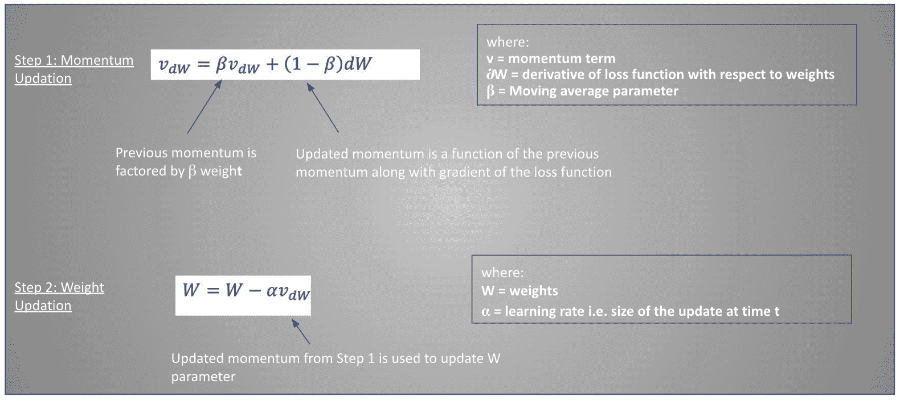
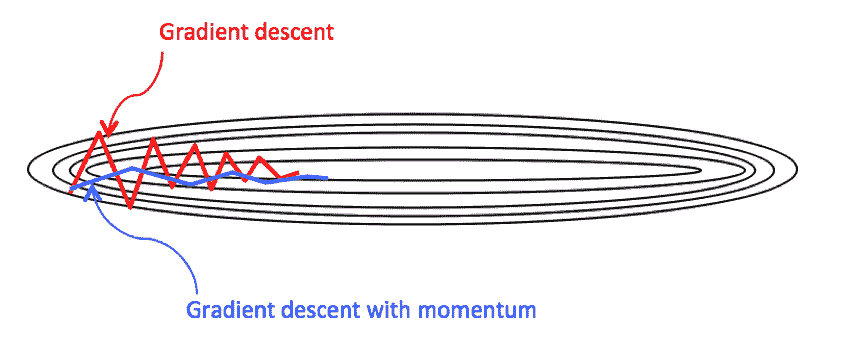
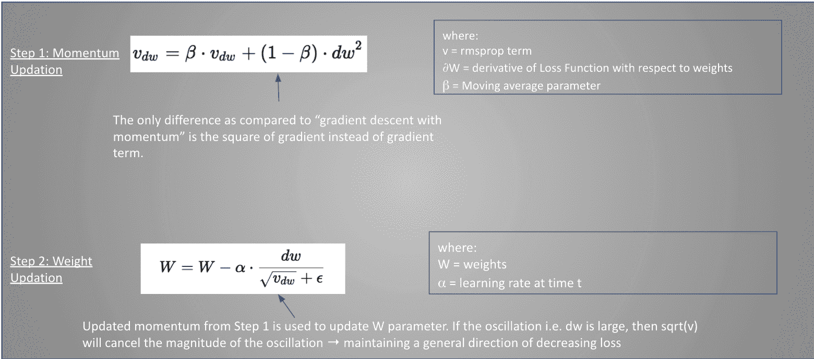
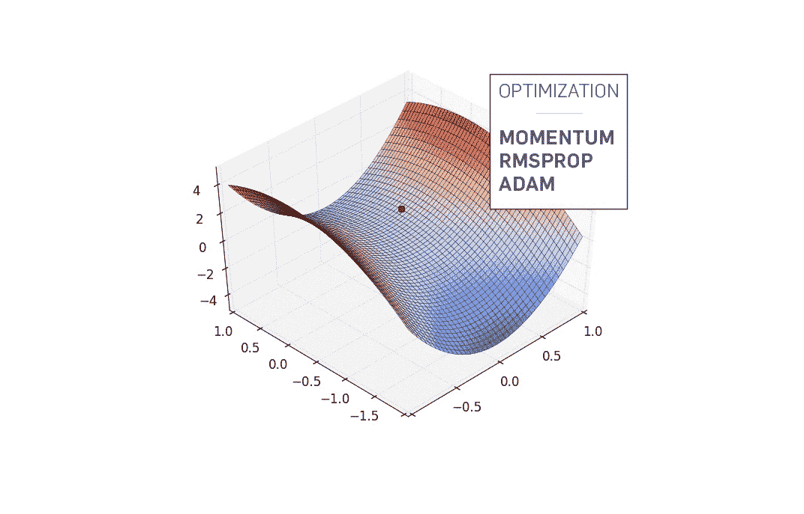
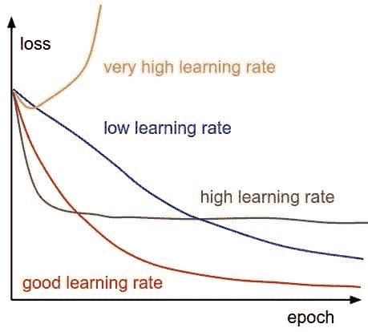
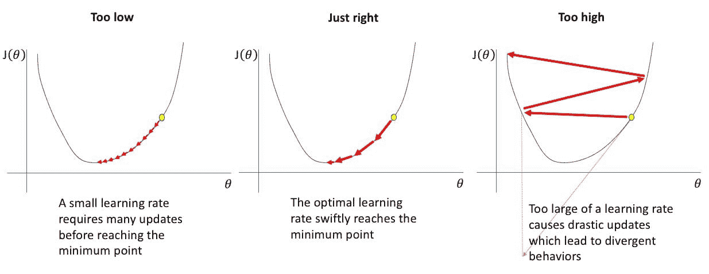
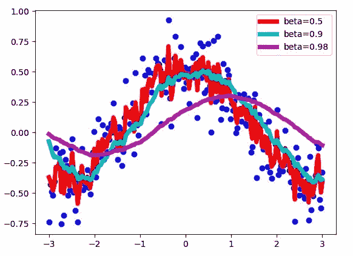

# 在 PyTorch 中调整 Adam 优化器参数

> 原文：[`www.kdnuggets.com/2022/12/tuning-adam-optimizer-parameters-pytorch.html`](https://www.kdnuggets.com/2022/12/tuning-adam-optimizer-parameters-pytorch.html)

随着数据宇宙的快速扩展和人工神经网络提供高性能的能力，世界正朝着解决以前从未解决过的复杂问题迈进。但是，等一下，有一个难点 - 构建一个稳健的神经网络架构不是一件简单的事。

选择合适的优化器来最小化预测值与真实值之间的损失是设计神经网络的关键要素之一。这种损失最小化是在训练数据的批次中进行的，导致参数值的收敛速度较慢。优化器减少了参数空间中的横向移动，从而加速了模型的收敛，并进一步导致更快的部署。这就是为什么很多重视开发高性能优化器算法的原因。

* * *

## 我们的前三大课程推荐

 1\. [Google 网络安全证书](https://www.kdnuggets.com/google-cybersecurity) - 快速进入网络安全职业生涯。

 2\. [Google 数据分析专业证书](https://www.kdnuggets.com/google-data-analytics) - 提升你的数据分析水平

 3\. [Google IT 支持专业证书](https://www.kdnuggets.com/google-itsupport) - 支持你的组织的 IT

* * *

文章将解释 Adam 优化器的工作原理，这是一种常用的优化器，并演示如何使用 PyTorch 框架对其进行调优。

# Adam 优化器

自适应矩估计，即 Adam 优化器，是一种优化技术，是梯度下降算法的衍生算法。在处理大数据和密集神经网络架构时，与随机梯度下降或基于动量的算法相比，ADAM 更为高效。它本质上是‘带动量的梯度下降’算法和‘RMSProp’算法的最佳结合。让我们先了解这两种优化器，以便自然地过渡到 Adam 优化器。

## 带动量的梯度下降

该算法通过考虑过去 n 步梯度的指数加权平均来加速收敛。从数学上讲，



作者提供的图片

注意，较小的? 表示向最小值迈出小步，较大的? 表示迈出大步。类似于权重更新，偏差也按照下面的方程进行更新：


动量不仅加快了收敛速度，还有能力跳过局部最小值。

下图说明了蓝色路径（具有动量的梯度下降）相比于红色路径（仅梯度下降）具有较少的振荡，因此更快地收敛到最小值。



来源：[梯度下降解释](https://towardsdatascience.com/gradient-descent-explained-9b953fc0d2c)

## RMSProp

均方根传播，也称为 RMSprop，是一种自适应学习算法，根据梯度幅度调整振荡。与动量方法不同，当梯度增加时，它会减小步长。

添加一个小的 epsilon 值以避免除零错误。



图片来源于作者

Adam 优化器结合了“具有动量的梯度下降”和“RMSprop”算法。它从“动量”（具有动量的梯度下降）中获得速度，从 RMSProp 中获得在不同方向上调整梯度的能力。这两者的结合使其功能强大。如下图所示，ADAM 优化器（黄色）比动量（绿色）和 RMSProp（紫色）收敛更快，但结合了两者的优势。



来源：[Paperspace 博客](https://blog.paperspace.com/intro-to-optimization-momentum-rmsprop-adam/)

现在你已经了解了 Adam 优化器的工作原理，我们来深入探讨如何使用 PyTorch 调整 Adam 超参数。

# 在 PyTorch 中调整 Adam 优化器

ADAM 优化器有三个参数需要调整以获得优化值，即 ? 或学习率、? 的动量项和 rmsprop 项，以及学习率衰减。让我们了解每一个，并讨论它们对损失函数收敛性的影响。

## 学习率（alpha 或 Lr）

学习率，也称为步长，是参数更新与梯度/动量/速度的比率，具体取决于使用的优化算法。



来源：[CS231n 视觉识别中的卷积神经网络](https://cs231n.github.io/neural-networks-3/)

较小的学习率意味着模型训练较慢，即需要对参数进行许多更新才能达到最小值点。另一方面，较大的学习率意味着较大的步伐或剧烈的参数更新，从而往往倾向于发散而不是收敛。

一个最佳的学习率值（默认值 0.001）意味着优化器会刚好更新参数以达到局部最小值。在大多数情况下，学习率在 0.0001 到 0.01 之间是最佳的。



来源：[设置神经网络的学习率](https://www.jeremyjordan.me/nn-learning-rate/)

## Betas

β1 是动量项的指数衰减率，也称为一阶矩估计。它在 PyTorch 中的默认值为 0.9。不同 beta 值对动量值的影响在下图中显示。



来源: [带动量的随机梯度下降](https://towardsdatascience.com/stochastic-gradient-descent-with-momentum-a84097641a5d)

β2 是速度项的指数衰减率，也称为二阶矩估计。在 PyTorch 实现中，默认值为 0.999。对于稀疏梯度问题，尤其是在图像相关问题中，这个值应尽可能接近 1.0。由于大多数高分辨率图像的像素密度和颜色变化很小，这会导致微小的梯度（甚至更小的梯度平方），导致收敛缓慢。对速度项给予高权重可以通过朝着最小化损失函数的总体方向移动来避免这种情况。

## 学习率衰减

学习率衰减使参数值接近全局最优解时降低 ?。这可以避免过度跳过最小值，通常会导致损失函数的更快收敛。PyTorch 实现中将此称为 weight_decay，默认值为零。

## ε

虽然不是一个调整超参数，但它是一个非常小的数字，以避免实现中的除零错误。默认值为 1e-08。

初始化具有所有超参数的 PyTorch 代码如下所示。

```py
torch.optim.Adam(params, lr=0.001, betas=(0.9, 0.999), eps=1e-08, weight_decay=0)
```

剩余的超参数如 maximize、amsgrad 等可以参考 [官方文档](https://pytorch.org/docs/stable/generated/torch.optim.Adam.html)。

# 总结

在这篇文章中，你了解了优化器的重要性、三种不同的优化器，以及 Adam 优化器如何将动量和 RMSProp 优化器的优点结合起来，在性能上领先于其他优化器。文章跟进了 Adam 优化器的内部工作，并解释了各种可调超参数及其对收敛速度的影响。

**[Vidhi Chugh](https://vidhi-chugh.medium.com/)** 是一位 AI 策略师和数字化转型领导者，致力于在产品、科学和工程交汇处构建可扩展的机器学习系统。她是一位获奖的创新领导者、作者和国际演讲者。她的使命是使机器学习民主化，并打破术语，让每个人都能参与这一转型。

### 更多相关主题

+   [用 PyTorch 解释神经网络](https://www.kdnuggets.com/2022/01/interpretable-neural-networks-pytorch.html)

+   [完整免费的 PyTorch 深度学习课程](https://www.kdnuggets.com/2022/10/complete-free-pytorch-course-deep-learning.html)

+   [开始使用 PyTorch Lightning](https://www.kdnuggets.com/2022/12/getting-started-pytorch-lightning.html)

+   [YOLOv5 PyTorch 教程](https://www.kdnuggets.com/2022/12/yolov5-pytorch-tutorial.html)

+   [使用 PyTorch 的迁移学习实用指南](https://www.kdnuggets.com/2023/06/practical-guide-transfer-learning-pytorch.html)

+   [提升 PyTorch 生产力的技巧](https://www.kdnuggets.com/2023/08/pytorch-tips-boost-productivity.html)
