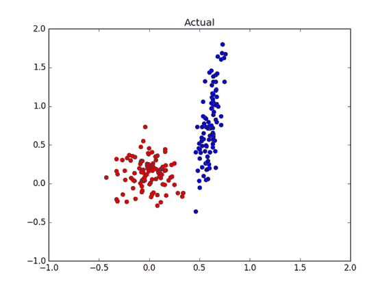
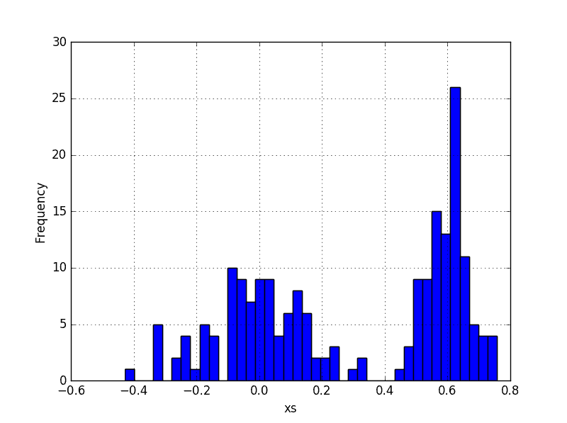

# 关于期望最大化（EM）算法的教程

> 原文：[`www.kdnuggets.com/2016/08/tutorial-expectation-maximization-algorithm.html`](https://www.kdnuggets.com/2016/08/tutorial-expectation-maximization-algorithm.html)

**作者：Elena Sharova，[codefying](https://codefying.wordpress.com/)**。

我们得到一些未标记的数据，并被告知这些数据来自多变量高斯分布。我们的任务是提出每个分布的均值和方差的假设。例如，图 1 展示了（标记的）来自两个高斯分布的数据。我们需要估计蓝色和红色分布的 x 值和 y 值的均值和方差。我们将如何做到这一点？

* * *

## 我们的前三个课程推荐

 1\. [谷歌网络安全证书](https://www.kdnuggets.com/google-cybersecurity) - 快速进入网络安全职业生涯。

 2\. [谷歌数据分析专业证书](https://www.kdnuggets.com/google-data-analytics) - 提升你的数据分析技能

 3\. [谷歌 IT 支持专业证书](https://www.kdnuggets.com/google-itsupport) - 支持你组织的 IT 需求

* * *

*图 1\. 从 2 个正态分布中抽取的二维数据。*

我们可以绘制每个维度的数据，并通过查看图表来估计均值。例如，我们可以使用直方图来估计蓝色分布的 x 均值大约为 0.6，红色分布的 x 均值大约为 0.0。通过观察每个簇的扩展，我们可以估计蓝色 x 的方差较小，可能是 0.0，而红色 x 的方差大约是 0.025。这将是一个相当好的猜测，因为实际分布是从* N(0.6, 0.003)*（蓝色）和* N(0.02, 0.03)*（红色）中抽取的。我们能比查看图表做得更好吗？我们能否用更稳健的方法得出均值和方差的良好估计？

*图 2\. 从 2 个正态分布中抽取的（未标记）数据的直方图。*

**期望最大化（EM）**算法可以用来生成一些多模态数据的最佳分布参数假设。注意我们说的是“最佳”假设。但什么是“最佳”？最佳的分布参数假设是最大似然假设——即最大化我们看到的数据来自 K 个分布的概率，每个分布具有均值 m[k]和方差 sigma[k]²。在本教程中，我们假设我们处理的是 K 个正态分布。

在单模态正态分布中，这个假设 *h* 是直接从数据中估计出来的：

`estimated m = ­m~ = sum(x[i])/N`*方程 1*`estimated sigma2= sigma2~= sum(xi- m~)²/N`*方程 2*

这些只是信任的算术平均值和方差。在多模态分布中，我们需要估计 `h = [ m[1],m[2],...,m[K]; sigma[1]²,sigma[2]²,...,sigma[K]² ]`。EM 算法将帮助我们做到这一点。让我们看看如何进行。

我们从每个 m[k]~ 和 sigma[k]²~ 的一些初始估计开始。我们将总共对每个参数进行 K 次估计。估计可以来自我们之前制作的图表、我们的领域知识，或者它们甚至可以是大胆的猜测（但不要太过分）。然后我们继续处理每个数据点，并回答以下问题——这个数据点来自均值为 m[k]~ 和 sigma[k]²~ 的正态分布的概率是多少？也就是说，我们对每组分布参数重复这个问题。在图 1 中，我们绘制了来自 2 个分布的数据。因此，我们需要回答这些问题两次——数据点 x[i]，i=1,...N，从 N(m[1]~, sigma[1]²~) 中抽取的概率是多少？从 N(m[2]~, sigma[2]²~) 中抽取的概率是多少？通过正态密度函数我们得到：

`P(x[i] belongs to N(m[1]~ , sigma[1]²~))=1/sqrt(2*pi* sigma[1]²~) * exp(-(x[i]- m[1]~)²/(2*sigma[1]²~))`*方程 3*`P(x[i] belongs to N(m[2]~ , sigma[2]²~))=1/sqrt(2*pi* sigma[2]²~) * exp(-(x[i]- m[2]~)²/(2*sigma[2]²~))`*方程 4*

单独的概率只能告诉我们一半的故事，因为我们还需要考虑从 N(m[1]~, sigma[1]²~) 或 N(m[2]~, sigma[2]²~) 中抽取数据的概率。我们现在得出每个数据点的每个分布的责任。在分类任务中，这个责任可以表示为数据点 x[i] 属于某个类别 c[k] 的概率：

`P(x[i] belongs to c[k]) = omega[k]~ * P(x[i] belongs to N(m[1]~ , sigma[1]²~)) / sum(omega[k]~ * P(x[i] belongs to N(m[1]~ , sigma[1]²~)))`*方程 5*

在方程 5 中，我们引入了一个新参数 omega[k]~，这是从 k 的分布中抽取数据点的概率。图 1 表明我们的两个簇被选择的概率是相等的。但与 m[k]~ 和 sigma[k]²~ 一样，我们实际上并不知道这个参数的值。因此，我们需要对其进行猜测，这也是我们假设的一部分：

`h = [ m[1], m[2], ..., m[K]; sigma[1]², sigma[2]², ..., sigma[K]²; omega[1]~, omega[2~], ..., omega[K]~ ]`

你可能会问，方程 5 中的分母来自哪里。分母是观察到 x[i] 在每个簇中的概率之和，加权以该簇的概率。实质上，它是我们数据中观察到 x[i] 的总概率。

如果我们进行硬性集群分配，我们将取最大 P(x[i] 属于 c[k])并将数据点分配到该集群。我们对每个数据点重复这种概率分配。最终，这将给我们第一个数据的‘重新洗牌’到 K 个集群。我们现在可以更新初始估计值 *h* 到 *h'*。这两个步骤：估计分布参数和在概率数据分配到集群后更新这些参数，将重复直到收敛到 *h*。总之，EM 算法的两个步骤是：

1.  E 步：基于当前假设 *h* 对每个数据点进行概率分配到某个类别；

1.  M 步：基于新的数据分配更新假设 *h* 对分布类别参数。

在 E 步中，我们计算集群分配的期望值。在 M 步中，我们计算我们假设的新最大似然。

**简介: [Elena Sharova](https://codefying.wordpress.com/)** 是一名数据科学家、金融风险分析师和软件开发人员。她拥有布里斯托大学的机器学习和数据挖掘硕士学位。

**相关**：

+   PCA 与层次聚类的比较

+   深度学习和拓扑数据分析能用你的数据做的 6 件疯狂的事情

+   数据科学 102：K-means 聚类不是免费的午餐

### 更多相关话题

+   [遗传算法关键术语解析](https://www.kdnuggets.com/2018/04/genetic-algorithm-key-terms-explained.html)

+   [决策树算法解析](https://www.kdnuggets.com/2020/01/decision-tree-algorithm-explained.html)

+   [机器学习算法完整的端到端部署…](https://www.kdnuggets.com/2021/12/deployment-machine-learning-algorithm-live-production-environment.html)

+   [揭示选择完美机器学习算法的秘密！](https://www.kdnuggets.com/2023/07/ml-algorithm-choose.html)

+   [为你的数据集选择正确的聚类算法](https://www.kdnuggets.com/2019/10/right-clustering-algorithm.html)

+   [机器学习中的 DBSCAN 聚类算法](https://www.kdnuggets.com/2020/04/dbscan-clustering-algorithm-machine-learning.html)
