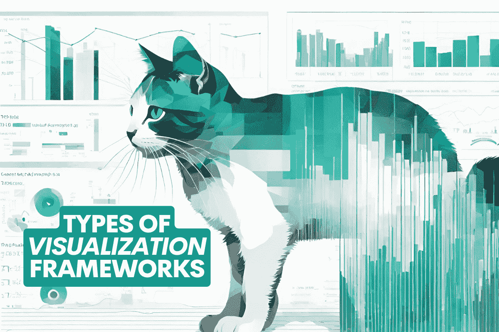
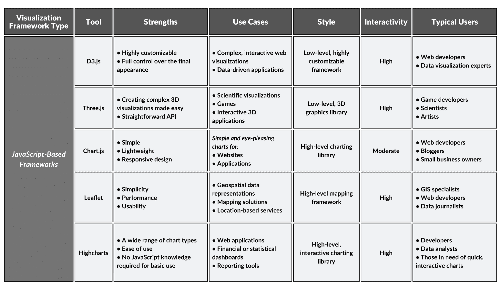
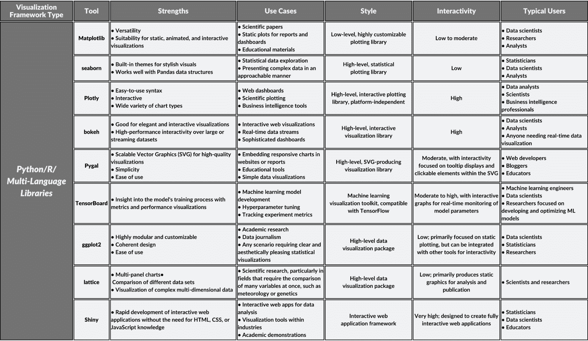
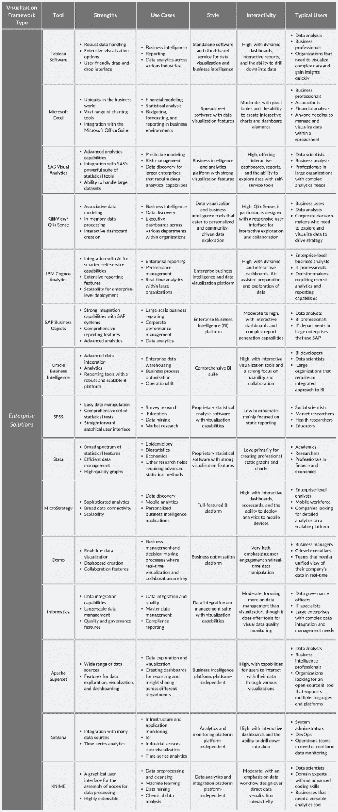

# 可视化框架类型

> 原文：[`www.kdnuggets.com/types-of-visualization-frameworks`](https://www.kdnuggets.com/types-of-visualization-frameworks)

作者图片

数据可视化不仅仅是制作图表。它是关于将数据转化为有意义的信息。当然，还包括用你那独特的色彩选择“烧焦”其他人的视网膜。

* * *

## 我们的前三大课程推荐

 1\. [Google 网络安全证书](https://www.kdnuggets.com/google-cybersecurity) - 快速进入网络安全职业的快车道。

 2\. [Google 数据分析专业证书](https://www.kdnuggets.com/google-data-analytics) - 提升你的数据分析技能

 3\. [Google IT 支持专业证书](https://www.kdnuggets.com/google-itsupport) - 支持你的组织的 IT

* * *

从跟踪全球健康趋势（[还记得 COVID-19 吗？](https://coronavirus.jhu.edu/vaccines/international)）到跟踪你每天的跑步，合适的图表或地图能够揭示原始数据隐藏的模式和答案。然而，并非所有可视化工具都是平等的。有些是为代码精通者设计的，而另一些则适合那些认为 Python 只是他们在诺基亚上玩过的游戏的时髦名称的人。他们仍然叫它 Snake。

在接下来的介绍中，我将帮你找到你的可视化“灵魂伴侣”。有点像 Tinder，只不过是针对图表的。CharTinder？我确信这里面有个笑话。不论你需要一个快速的饼图还是一个互动地图，总有一款工具适合你。

# 有哪些类型的可视化框架？

可视化工具类型有广泛的范围。我将它们分为三大类，其中包含最受欢迎的可视化工具。

我将为每种工具提供简短的描述。你可以在每种可视化框架类型的概述末尾找到每种工具的特性。

为了增强你的理解并提供更互动的学习体验，这里有一段视频，你可以观看，这与本文分享的见解相吻合：

# 基于 JavaScript 的框架

这些是设计用于在网页浏览器中使用 JavaScript 创建互动和动态可视化的库和框架。JavaScript 非常灵活，大多数开发者都懂，所以这些框架被广泛使用。

## 1\. D3.js

[D3.js](https://d3js.org) 是一个强大的 JavaScript 库，用于基于数据操作文档。它允许用户使用 HTML、SVG 和 CSS 创建可视化，提供了巨大的控制力和创造潜力，用于交互式和复杂的可视化。

## 2\. Three.js

[一个开源的 JavaScript 库和 API](https://threejs.org) 用于在网页浏览器中创建和显示动画的 3D 计算机图形。它支持创建复杂的可视化，无需专业的 3D 图形软件。

## 3\. Chart.js

[一个 JavaScript 图表库](https://www.chartjs.org) 提供了八种不同类型的简单图表。它旨在易于使用并高度可定制，适合希望为网页开发者添加响应式数据可视化的用户。

## 4\. Leaflet

[Leaflet](https://leafletjs.com) 是一个基于 JavaScript 的库，非常适合创建能够显示广泛地理空间数据的互动地图，是地理学家、城市规划师和记者等需要动态制图功能的用户的重要资源。

## 5\. Highcharts

[Highcharts](https://www.highcharts.com) 主要是一个用于创建互动的、符合网络标准的图表的 JavaScript 库。它具有广泛的图表功能，适合那些需要一种易于实现的复杂数据可视化解决方案的用户。

## 基于 JavaScript 的框架概述

# Python/R/多语言库

这一类别包括 [Python 数据可视化库](https://www.stratascratch.com/blog/4-python-data-visualization-libraries-you-can-t-do-without/?utm_source=blog&utm_medium=click&utm_campaign=kdn+visualization+frameworks)，以及那些在 R 或其他多种编程语言中使用的库。这些库主要针对为演示创建可视化的数据科学家。大多数这些库对数值和科学计算有强大的支持。

## 1\. Matplotlib

[Matplotlib](https://matplotlib.org) 是一个全面的 Python 库，用于创建静态、动画和互动的可视化。它提供了多种工具来制作复杂的图表，并为构建适合用于科学出版物或演示的详细图表提供了坚实的基础。

## 2\. seaborn

[seaborn](https://seaborn.pydata.org/): 基于 Matplotlib 的 Python 数据可视化库。它提供了一个高级接口来绘制吸引人的统计图形。它简化了创建美观的可视化，以呈现复杂的数据趋势和分布。

## 3\. Plotly

[Plotly](https://plotly.com/graphing-libraries/) 是一个多语言图表库，允许开发人员和分析师直接从浏览器创建互动的、出版质量的图表和可视化。其直观的界面支持多种图表类型，促进了数据可视化的自助服务环境。

## 4\. bokeh

[Bokeh](http://bokeh.org): 一个用于现代网页浏览器的 Python 互动可视化库。它提供优雅而多功能的图形，具有高性能的交互性，适用于大规模或流数据集，旨在创建复杂的可视化应用程序和仪表板。

## 5\. Pygal

[Pygal](https://www.pygal.org/en/stable/) 是一个 Python 库，专为创建 SVG（可缩放矢量图形）图而设计，注重简洁性和风格。你可以生成既互动又高度可定制的图表。

## 6\. TensorBoard

[TensorBoard](https://www.tensorflow.org/tensorboard) 是 [TensorFlow](https://www.tensorflow.org) 生态系统中的一个可视化工具，为 Python 用户提供清晰的机器学习工作流视图。它允许开发人员轻松跟踪指标并可视化模型的各个方面，而无需大量手动绘图或外部工具。

## 7\. ggplot2

[一个 R 包](https://ggplot2.tidyverse.org) 使用图形语法创建数据可视化，允许用户以一致的结构和设计理念构建复杂的图表，编码量最小化。

## 8\. lattice

[一个 R 可视化工具](https://cran.r-project.org/web/packages/lattice/index.html) 专注于创建网格图，这对于通过条件和面板展示多变量数据至关重要，满足需要详细比较视觉研究的科学研究人员的需求。

## 9\. Shiny

[Shiny](https://shiny.posit.co) 将 R 统计代码转化为互动式 web 应用程序，为分析师和科学家提供了一个便捷的框架来创建用户友好的数据驱动界面，从而使复杂的分析工作在无需 web 开发专业知识的情况下也能变得易于访问。

## Python/R/多语言库概述

# 企业解决方案

这些是强大且可扩展的可视化平台，通常包括与数据源和其他商业智能工具的集成。它们允许非技术用户在无需编码的情况下创建可视化和仪表板。它们通常是即插即用的，例如“将其插入你的数据库并进行可视化”。

## 1\. Tableau Software

[Tableau](https://www.tableau.com) 是一种行业标准的分析平台，提供直观的数据可视化和商业智能解决方案，使用户能够轻松连接、理解和以有意义的方式可视化数据，而无需广泛的技术支持。

## 2\. Microsoft Excel

作为个人和专业数据管理的基础工具，[Excel](https://www.microsoft.com/en-us/microsoft-365/excel) 提供了广泛的可视化选项，从基本图表到复杂图形，满足全球企业日常的分析需求。

## 3\. SAS Visual Analytics

[一个先进的分析平台](https://www.sas.com/nl_nl/software/visual-analytics.html) 结合了可视化和商业智能，为数据探索和洞察发现提供了强大的自助服务能力，专为复杂数据环境中的组织量身定制。

## 4\. QlikView/Qlik Sense

[QlikView](https://www.qlik.com/us/products/qlikview) 和 [Qlik Sense](https://www.qlik.com/us/products/qlik-sense) 是互动的商业智能和可视化工具，利用自助式分析赋能用户即时获取洞察，使用关联数据建模提供直观和探索性的用户体验。

## 5\. IBM Cognos Analytics

[一个全面的商业智能套件](https://www.ibm.com/products/cognos-analytics)，通过 AI 增强的分析和智能讲述功能，支持企业级数据探索和决策制定，提供高效的数据管理和可视化能力。

## 6\. SAP BusinessObjects

[这是](https://www.sap.com/netherlands/products/technology-platform/bi-platform.html) SAP 提供的广泛企业分析解决方案，提供多样的工具套件，使组织能够挖掘洞察、生成报告，并通过强大的数据可视化和仪表板功能优化业务表现。

## 7\. Oracle Business Intelligence

[Oracle BI](https://www.oracle.com/business-analytics/business-intelligence/technologies/bi.html) 是一个全面的企业 BI 产品套件，具有全面的功能，包括互动仪表板、临时分析和前瞻性智能。它允许企业从数据中获取可操作的洞察，且只需最少的 IT 介入。

## 8\. SPSS

[SPSS](https://www.ibm.com/products/spss-statistics) 是 IBM 提供的统计分析强大工具，以其在社会科学中的广泛应用而著称。它简化了统计解释的过程，并生成详细的视觉表现，使不同水平的用户都能进行高级统计分析。

## 9\. Stata

[Stata](https://www.stata.com) 是一个全面的数据分析、数据管理和图形工具。它特别设计用于简化研究人员的工作流程，为他们提供强大的统计工具集，并配备高质量的图形功能，以简化数据驱动的查询。

## 10\. MicroStrategy

[MicroStrategy](https://www.microstrategy.com/en) 是一个强大的企业分析平台，以其高扩展性和先进的分析功能脱颖而出，为组织提供互动仪表板、记分卡和报告，推动战略决策而无需大量 IT 依赖。

## 11\. Domo

[Domo](https://www.domo.com) 是一个现代化的 BI 平台，在数据整合、可视化和协作方面表现出色，方便创建自定义仪表板和报告，以支持实时决策，并提供为业务用户设计的用户友好界面。

## 12\. Informatica

[Informatica](https://www.informatica.com)是一款提供云原生数据管理和集成服务的工具，配有可视化工具，使组织能够维护数据质量、简化操作，并通过受控自服务模式提供商业智能洞察。

## 13\. Apache Superset

[Apache Superset](https://superset.apache.org)是一个开源分析和商业智能 Web 应用程序，允许数据探索和可视化。它使用户能够创建和共享互动仪表板，这些仪表板通过拖放轻松组成，无需 IT 人员。

## 14\. Grafana

多平台开源分析和监控解决方案，[Grafana](https://grafana.com)为最终用户提供了丰富、可自定义的数据聚合仪表板，来自多个来源。其用户友好的界面将来自指标、日志和跟踪的复杂数据简化为可操作的洞察。

## 15\. KNIME

一个开源数据分析平台，[KNIME](https://www.knime.com)提供了全面的数据集成、转换和分析工具。它提供了一个直观的无代码图形用户界面，使最终用户能够独立构建数据驱动的解决方案和工作流程。

## 企业解决方案概述

# 结论

可视化框架非常广泛，它们适合的类别也在不断增长。我在这里覆盖了二十九种工具，这应该足够让你找到所需的工具。

请注意，每个类别中的工具具有不同的功能，因此在决定使用的工具之前，请熟悉它们。

****[Nate Rosidi](https://twitter.com/StrataScratch)****是一位数据科学家和产品策略专家。他还是一名兼职教授，教授分析课程，是 StrataScratch 的创始人，该平台帮助数据科学家准备面试，提供来自顶级公司的真实面试问题。Nate 撰写了职业市场的最新趋势，提供面试建议，分享数据科学项目，并涵盖所有 SQL 相关内容。

### 更多相关话题

+   [Python 基础：语法、数据类型和控制结构](https://www.kdnuggets.com/python-basics-syntax-data-types-and-control-structures)

+   [优化数据存储：探索 SQL 中的数据类型和规范化](https://www.kdnuggets.com/optimizing-data-storage-exploring-data-types-and-normalization-in-sql)

+   [处理机器学习过程的框架](https://www.kdnuggets.com/2018/05/general-approaches-machine-learning-process.html)

+   [Chip Huyen 分享了实施 ML 系统的框架和案例研究](https://www.kdnuggets.com/2023/02/sphere-chip-huyen-shares-frameworks-case-studies-implementing-ml-systems.html)

+   [PyTorch 还是 TensorFlow？比较流行的机器学习框架](https://www.kdnuggets.com/2022/02/packt-pytorch-tensorflow-comparing-popular-machine-learning-frameworks.html)

+   [开发安全、可靠且值得信赖的人工智能框架的专家见解](https://www.kdnuggets.com/expert-insights-on-developing-safe-secure-and-trustworthy-ai-frameworks)
