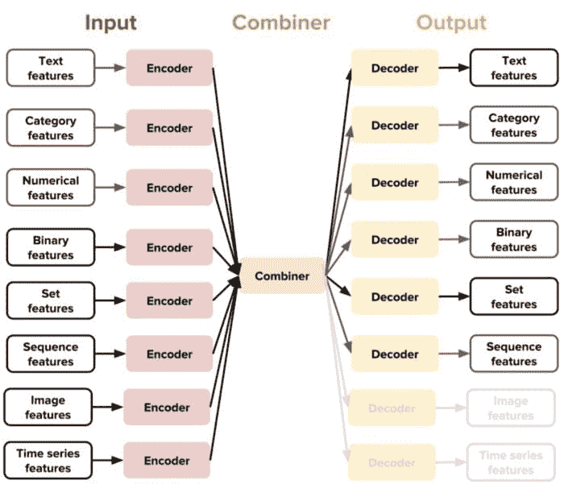
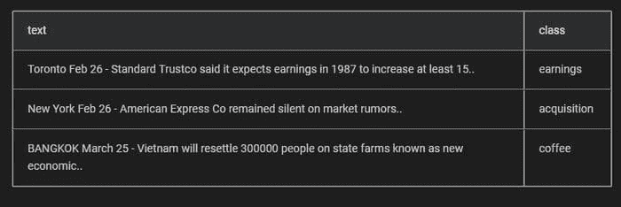
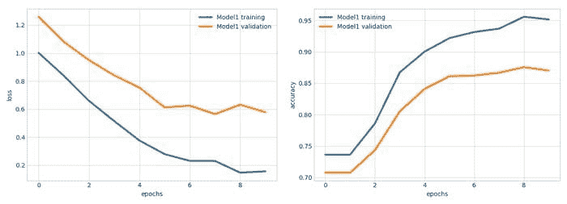
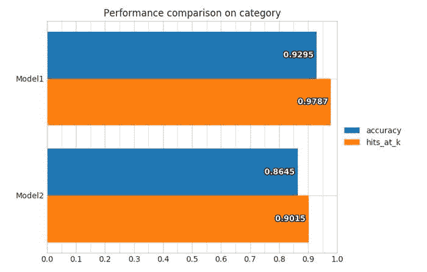

# Uber 的 Ludwig 是一个开源低代码机器学习框架

> 原文：[`www.kdnuggets.com/2020/06/uber-ludwig-open-source-framework-machine-learning.html`](https://www.kdnuggets.com/2020/06/uber-ludwig-open-source-framework-machine-learning.html)

评论

来源：[`ludwig-ai.github.io/ludwig-docs/`](https://ludwig-ai.github.io/ludwig-docs/)

训练和测试深度学习模型是一个困难的过程，需要对机器学习和数据基础设施有深刻的了解。从特征建模到超参数优化，训练和测试深度学习模型的过程是现实世界数据科学解决方案中的主要瓶颈之一。简化这一环节可以帮助加快深度学习技术的采用。虽然低代码训练深度学习模型仍处于初期阶段，但我们已经看到了一些相关的创新。解决这一问题的最完整解决方案之一来自 Uber AI Labs。*[Ludwig](https://ludwig-ai.github.io/ludwig-docs/?from=%40)*是一个无需编写代码即可进行机器学习模型训练和测试的框架。最近，Uber 发布了 Ludwig 的第二版，包含了主要的增强功能，以便为机器学习开发者提供主流的无代码体验。

Ludwig 的目标是通过声明式的无代码体验简化训练和测试机器学习模型的过程。训练是深度学习应用中最费开发者精力的方面之一。通常，数据科学家需要花费大量时间尝试不同的深度学习模型，以更好地对特定的训练数据集进行优化。这个过程不仅仅涉及训练，还包括模型比较、评估、工作负载分配等多个方面。由于其高度技术性，深度学习模型的训练通常仅限于数据科学家和机器学习专家，并且需要大量的代码。尽管这个问题可以概括为任何机器学习解决方案，但在深度学习架构中情况更为严重，因为它们通常涉及许多层次。Ludwig 通过使用易于修改和版本控制的声明式模型，抽象了训练和测试机器学习程序的复杂性。

### Ludwig

功能上，Ludwig 是一个简化选定、训练和评估机器学习模型过程的框架。Ludwig 提供了一组模型架构，可以将这些架构组合在一起，以创建一个针对特定需求优化的端到端模型。从概念上讲，Ludwig 是基于一系列原则设计的：

+   **无需编码**：Ludwig 使得无需任何机器学习专业知识即可训练模型。

+   **通用性**：Ludwig 可以应用于许多不同的机器学习场景。

+   **灵活性**：Ludwig 足够灵活，既适合经验丰富的机器学习从业者，也适合没有经验的开发人员使用。

+   **可扩展性**：Ludwig 的设计考虑了可扩展性。每个新版本都包含了新功能，而不改变核心模型。

+   **可解释性**：Ludwig 包括有助于数据科学家理解机器学习模型性能的可视化工具。

使用 Ludwig，数据科学家只需提供一个包含训练数据的 CSV 文件和一个包含模型输入和输出的 YAML 文件，即可训练深度学习模型。利用这两个数据点，Ludwig 执行多任务学习例程来同时预测所有输出并评估结果。这种简单结构是快速原型设计的关键。Ludwig 在后台提供了一系列不断评估并可以组合成最终架构的深度学习模型。

Ludwig 的主要创新基于特定数据类型编码器和解码器的理念。Ludwig 使用针对任何给定数据类型的特定编码器和解码器。与其他深度学习架构类似，编码器负责将原始数据映射到张量，而解码器则将张量映射到输出。Ludwig 的架构还包括一个合并器的概念，它是一个将所有输入编码器的张量合并、处理，并将张量返回给输出解码器的组件。



来源：[`eng.uber.com/introducing-ludwig/`](https://eng.uber.com/introducing-ludwig/)

数据科学家将使用 Ludwig 完成两个主要功能：训练和预测。假设我们正在处理一个文本分类场景，数据集如下。



来源：[`ludwig-ai.github.io/ludwig-docs/examples/`](https://ludwig-ai.github.io/ludwig-docs/examples/)

我们可以通过以下命令安装 Ludwig 并开始使用：

```py
pip install ludwig
python -m spacy download en
```

下一步是配置一个模型定义 YAML 文件，该文件指定模型的输入和输出特征。

```py
input_features:
    -
        name: text
        type: text
        encoder: parallel_cnn
        level: wordoutput_features:
    -
        name: class
        type: category
```

通过这两个输入（训练数据和 YAML 配置），我们可以使用以下命令训练深度学习模型：

```py
ludwig experiment \
  --data_csv reuters-allcats.csv \
  --model_definition_file model_definition.yaml
```

Ludwig 提供了一系列可以在训练和预测过程中使用的可视化工具。例如，学习曲线可视化能让我们了解模型的训练和测试性能。



来源：[`ludwig-ai.github.io/ludwig-docs/getting_started/`](https://ludwig-ai.github.io/ludwig-docs/getting_started/)

训练后，我们可以使用以下命令评估模型的预测结果：

```py
ludwig predict --data_csv path/to/data.csv --model_path /path/to/model
```

其他可视化工具可以用来评估模型的性能。



来源：[`ludwig-ai.github.io/ludwig-docs/getting_started/`](https://ludwig-ai.github.io/ludwig-docs/getting_started/)

### 对 Ludwig 的新添加

最近，Uber 发布了 Ludwig 的第二个版本，扩展了其核心架构，并加入了一系列旨在改善无代码模型训练和测试体验的新功能。许多新的 Ludwig 功能基于与其他机器学习栈或框架的集成。以下是一些关键功能：

+   **Comet.ml 集成：**[Comet.ml](https://www.comet.ml/) 是市场上最受欢迎的超参数优化和机器学习实验平台之一。Ludwig 与 Comet.ml 的新集成使得诸如超参数分析或实时性能评估等功能成为可能，这些都是数据科学家工具箱中的重要组成部分。

+   **模型服务：**模型服务是机器学习程序生命周期的关键组件。新版本的 Ludwig 提供了一个 API 端点，用于服务训练后的模型，并使用简单的 REST 查询来获取预测结果。

+   **音频/语音功能：**Ludwig 0.2 的一个重要新增功能是对音频特性的支持。这使得数据科学家能够用最少的代码构建音频分析模型。

+   **BERT 编码器：**[BERT](https://arxiv.org/abs/1810.04805) 是深度学习历史上最受欢迎的语言模型之一。基于[Transformer 架构](https://arxiv.org/abs/1904.09408)，BERT 可以执行许多语言任务，如问答或文本生成。Ludwig 现在将 BERT 作为文本分类场景的原生构建模块。

+   **H3 特性：**[H3](https://eng.uber.com/h3/) 是一种非常流行的空间索引，用于将位置编码为 64 位整数。Ludwig 0.2 原生支持 H3，允许使用空间数据集实现机器学习模型。

对于 Ludwig 的其他改进包括可视化 API 的改进、新的日期功能、对非英语语言的文本分词支持更好，以及更强的数据预处理能力。特别是数据注入似乎是下一版本 Ludwig 的重点关注领域。

Ludwig 仍然是一个相对较新的框架，仍需大量改进。然而，它对低代码模型的支持是简化机器学习在更广泛开发者中采用的关键组成部分。此外，Ludwig 抽象和简化了市场上某些顶级机器学习框架的使用。

[原文](https://medium.com/@jrodthoughts/ubers-ludwig-is-an-open-source-framework-for-low-code-machine-learning-d7c2fefd6c69)。经许可转载。

**相关：**

+   LinkedIn 开源一个小组件以简化 TensorFlow-Spark 互操作性

+   Facebook 开源 Blender，史上最大的开放领域聊天机器人

+   微软研究院揭示三项推进深度生成模型的努力

* * *

## 我们的前三大课程推荐

 1\. [Google 网络安全证书](https://www.kdnuggets.com/google-cybersecurity) - 快速进入网络安全职业。

 2\. [Google 数据分析专业证书](https://www.kdnuggets.com/google-data-analytics) - 提升你的数据分析技能

 3\. [Google IT 支持专业证书](https://www.kdnuggets.com/google-itsupport) - 支持你的组织进行 IT 工作

* * *

### 更多相关内容

+   [停止学习数据科学以寻找目标，然后以目标来…](https://www.kdnuggets.com/2021/12/stop-learning-data-science-find-purpose.html)

+   [学习数据科学统计学的顶级资源](https://www.kdnuggets.com/2021/12/springboard-top-resources-learn-data-science-statistics.html)

+   [一个 90 亿美元的 AI 失败案例分析](https://www.kdnuggets.com/2021/12/9b-ai-failure-examined.html)

+   [成功数据科学家的 5 个特征](https://www.kdnuggets.com/2021/12/5-characteristics-successful-data-scientist.html)

+   [是什么让 Python 成为初创企业理想的编程语言](https://www.kdnuggets.com/2021/12/makes-python-ideal-programming-language-startups.html)

+   [每个数据科学家都应该了解的三个 R 语言库（即使你使用 Python）](https://www.kdnuggets.com/2021/12/three-r-libraries-every-data-scientist-know-even-python.html)
