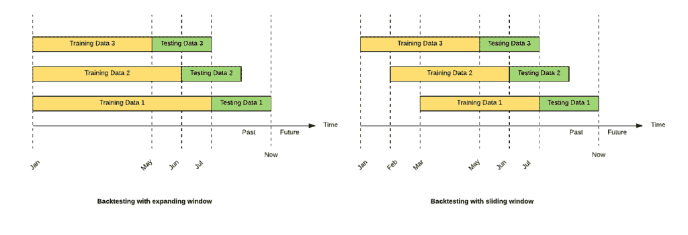

# Uber 推出了一项新的服务，用于大规模回测机器学习模型

> 原文：[`www.kdnuggets.com/2020/03/uber-unveils-service-backtesting-machine-learning-models-scale.html`](https://www.kdnuggets.com/2020/03/uber-unveils-service-backtesting-machine-learning-models-scale.html)

评论

回测是机器学习模型生命周期中极其重要的一环。任何运行多个预测模型的组织都需要一个机制来定期评估其有效性并从错误中恢复。回测的相关性随着环境中使用的机器学习模型数量的增加而呈指数级增长。尽管回测如此重要，但与模型训练或部署等机器学习生命周期的其他方面相比，回测仍然相对被忽视。最近，Uber 推出了一项全新服务，完全从零开始构建，用于大规模回测机器学习模型。

Uber 运营着全球最大的一些机器学习基础设施之一。在其多个属性中，Uber 在诸如乘车计划或预算管理等不同领域运行着成千上万的预测模型。确保这些预测模型的准确性远非易事。模型的数量和计算规模使得 Uber 的环境对大多数回测框架来说相对不切实际。即便 Uber 自身也曾构建过像 [Omphalos](https://eng.uber.com/omphalos/) 这样的回测框架，这些框架对一些特定的用例有效，但无法与 Uber 的运营规模匹配。

我们讨论的是何种规模？为了提供背景，Uber 需要协调大约 1000 万次回测，涵盖其不同的预测模型。除了规模，Uber 的运营在回测方面有不同的特性，这些特性最终使得建立一个客户回测服务成为了有利的选择。

### 理解 Uber 方式的回测

并非所有的回测都是平等的。不同的组织依赖不同的向量来回测模型，这反映了它们业务的领域特性。对于 Uber 来说，交通巨头需要考虑城市数量或测试窗口等元素，以便有效地回测模型。对一个城市有效的模型在另一个城市可能效果不好。类似地，一些模型需要实时回测，而其他模型则可以有更大的窗口。综合考虑，Uber 确定了四个关键向量，这些向量对于回测预测模型非常相关。

+   回测窗口数量

+   城市数量

+   模型参数数量

+   预测模型数量

四个向量的组合导致了一个大多数主流回测服务无法处理的规模。

有效回测的关键要素之一是确定如何拆分测试数据。与[cross-validation](https://en.wikipedia.org/wiki/Cross-validation_(statistics))等技术不同，回测利用时间序列数据和非随机拆分。这也意味着任何回测策略需要明确了解如何以适应模型性能的方式拆分测试数据。以 Uber 为例，这也需要在成千上万的模型中完成。为了解决这一挑战，Uber 选择了两种主要的回测数据拆分机制：使用扩展窗口的回测和使用滑动窗口的回测。每个窗口被拆分为训练数据（用于训练模型）和测试数据（用于计算训练模型的误差率）。

回测策略的最后一个组成部分是准确测量模型的准确性。最常见的指标之一是平均绝对百分比误差（MAPE），其数学模型如下：

在模型回测中，MAPE 值越低，预测模型的表现越好。通常，数据科学家依赖 MAPE 指标来比较同一模型使用的误差率计算方法的结果，以确保它们准确反映了预测中出现的问题。

综合这三个要素：回测向量、回测窗口和误差度量，Uber 建立了一个新的回测服务，以简化组织中的预测操作。

### Uber 的回测服务

多年来，Uber 建立了不同的专有技术，帮助简化机器学习模型的生命周期管理。新的回测服务能够利用这种复杂的基础设施，通过运用技术如[Data Science Workbench](https://eng.uber.com/dsw/)，即 Uber 的互动数据分析和机器学习工具箱，以及[Michelangelo](https://eng.uber.com/scaling-michelangelo/)，即 Uber 的机器学习平台。

从架构角度来看，新的回测服务由一个 Python 库和一个用 Go 编写的服务组成。Python 库充当 Python 客户端。由于 Uber 目前许多机器学习模型都是用 Python 编写的，因此选择利用这一框架来实现回测服务是一个简单的决定，这使得用户可以无缝地上手、测试和迭代他们的模型。Go 服务被编写为一系列 Cadence 工作流。[Cadence](https://github.com/uber/cadence) 是一个开源的编排引擎，用 Go 编写，由 Uber 构建，用于以可扩展和弹性的方式执行异步长时间运行的业务逻辑。在高层次上，机器学习模型通过数据科学工作台上传，回测请求通过 Python 库提交，后者将请求转发给回测 Go 服务。一旦计算出错误测量值，它要么存储在数据存储中，要么被数据科学团队立即使用，这些团队利用这些预测错误来优化训练中的机器学习模型。

详细来说，回测工作流由四个阶段组成。在阶段 1，模型要么在数据科学工作台 (DSW) 上本地编写，要么上传到机器学习平台，该平台返回一个唯一的模型 ID。DSW 通过我们的 Go 服务触发回测，然后 Go 服务返回一个 UUID 给 DSW。在阶段 2，Go 服务获取训练和测试数据，将其存储在数据存储中，并返回一个数据集。在阶段 3，回测数据集在 ML 平台上进行训练，生成预测结果并返回给 Go 服务。在阶段 4，回测结果存储在数据存储中，供用户通过 DSW 获取。

Uber 已开始将新的回测服务应用于多个用例，如金融预测和预算管理。除了最初的适用性外，新回测服务还可以作为许多开始大规模应用机器学习模型的组织的参考架构。回测服务架构中概述的原则可以应用于不同数量的机器学习框架和平台。看看 Uber 是否决定在不久的将来开源回测服务栈将是很有趣的。

[原文](https://towardsdatascience.com/uber-unveils-a-new-service-for-backtesting-machine-learning-models-at-scale-430c7b127f4c)。经许可转载。

**相关：**

+   Uber 一直在悄悄组建市场上最令人印象深刻的开源深度学习栈之一

+   Uber 创建了生成性教学网络，以更好地训练深度神经网络

+   [谷歌、优步和 Facebook 的开源项目：数据科学和 AI](https://www.kdnuggets.com/2019/11/open-source-projects-google-uber-facebook-data-science-ai.html)

* * *

## 我们的前三大课程推荐

 1\. [谷歌网络安全证书](https://www.kdnuggets.com/google-cybersecurity) - 快速通道进入网络安全职业。

 2\. [谷歌数据分析专业证书](https://www.kdnuggets.com/google-data-analytics) - 提升你的数据分析技能

 3\. [谷歌 IT 支持专业证书](https://www.kdnuggets.com/google-itsupport) - 支持组织的 IT 需求

* * *

### 相关话题

+   [百度研究发布 2022 年十大技术趋势预测](https://www.kdnuggets.com/2022/02/baidu-research-unveils-top-10-tech-trends-forecast-2022.html)

+   [如何高效扩展数据科学项目与云计算](https://www.kdnuggets.com/2023/05/efficiently-scale-data-science-projects-cloud-computing.html)

+   [扩展 MLOps 的操作手册](https://www.kdnuggets.com/2023/06/playbook-scale-mlops.html)

+   [从谷歌 Colab 到 Ploomber 管道：使用 GPU 扩展机器学习](https://www.kdnuggets.com/2022/03/google-colab-ploomber-pipeline-ml-scale-gpus.html)

+   [学习数据隐私，实施技术隐私解决方案……](https://www.kdnuggets.com/2022/04/manning-data-privacy-learn-implement-technical-privacy-solutions-tools-scale.html)

+   [311 呼叫中心绩效：服务水平评分](https://www.kdnuggets.com/2023/03/boxplot-outlier-311-call-center-performance.html)
