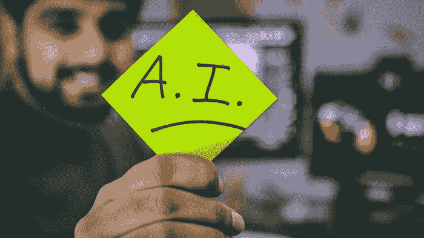

# 数据科学家编程面试的终极指南

> 原文：[`www.kdnuggets.com/2021/03/ultimate-guide-acing-coding-interviews-data-scientists.html`](https://www.kdnuggets.com/2021/03/ultimate-guide-acing-coding-interviews-data-scientists.html)

评论

**由[Emma Ding](https://www.youtube.com/c/DataInterviewPro)，Airbnb 的数据科学家和软件工程师，以及[Rob Wang](https://www.linkedin.com/in/robjwang/)，Robinhood 的高级数据科学家撰写**

图片由[Christopher Gower](https://unsplash.com/@cgower?utm_source=medium&utm_medium=referral)提供，来源于[Unsplash](https://unsplash.com/?utm_source=medium&utm_medium=referral)

### 介绍

* * *

## 我们的三大课程推荐

 1\. [Google 网络安全证书](https://www.kdnuggets.com/google-cybersecurity) - 快速开启网络安全职业之路。

 2\. [Google 数据分析专业证书](https://www.kdnuggets.com/google-data-analytics) - 提升你的数据分析技能

 3\. [Google IT 支持专业证书](https://www.kdnuggets.com/google-itsupport) - 支持你的组织的 IT 需求

* * *

数据科学（DS）相较于软件工程和产品管理等技术行业的其他职位是一个相对较新的职业。最初，DS 面试中的编码环节很有限，仅包括 SQL 或使用 Python 或 R 进行的数据处理会话。然而近年来，DS 面试越来越强调计算机科学（CS）基础知识（数据结构、算法和编程最佳实践）。

对于希望进入数据科学领域的人来说，这种面试中越来越多的计算机科学内容可能会让人感到望而生畏。在这篇文章中，我们希望提高你对编程面试的理解，并教你如何准备。我们将对不同的编程问题进行分类，并提供破解这些问题的技巧，帮助你在面试中表现出色。如果你觉得我们可以在任何方面帮助你，让你的旅程更轻松，请[联系我们](https://data-interview-questions.web.app/)！

### 为什么在数据科学面试中会有编程题？

编程面试究竟是什么？我们使用“编程面试”这一短语来指代任何涉及使用编程语言（而非 SQL 等查询语言）的技术会话。在当今市场上，几乎所有的数据科学职位都可能涉及编程面试。

为什么？编程是你数据科学职业中的重要部分。以下是三个原因：

+   数据科学是一个技术性强的领域。大部分数据科学工作的内容涉及将数据收集、清洗和处理成可用格式。因此，基本的编程能力是必不可少的。

+   许多现实世界的数据科学项目高度协作，涉及多个利益相关者。具备更强基本计算机科学技能的数据科学家将更容易与工程师和其他合作伙伴紧密合作。

+   在许多公司中，数据科学家负责交付生产代码，如数据管道和机器学习模型。强大的编程技能对于这类项目至关重要。

总结来说，强大的编码技能在许多数据科学职位中是必需的。如果你不能在编码面试中展示这些技能，你将无法获得工作。

### 可能会有编码面试的角色

当然，所需的编码水平会因职位而异。如果你对了解不同数据科学角色之间的差异感兴趣，可以查看 [这个 YouTube 视频](https://www.youtube.com/watch?v=l93hVZZ7qm0)。如果你正在寻找任何以下类别的数据科学家角色，遇到编码面试的机会非常高：

+   **重机器学习（ML）或建模重点的数据科学家角色**：对于这类角色，期望候选人能够独立工作或与工程师紧密合作，将机器学习、统计或优化模型投入生产。这些角色虽然称为“数据科学家”，但更类似于“机器学习工程师”或“研究科学家”的角色。例如，Facebook 的核心数据科学、Airbnb 和 Lyft 的数据科学家——算法等职位。

+   **数据科学家属于工程组织的公司**：对于这样的职位，一般期望每位数据科学家具备足够的编程能力。Robinhood 的数据科学家职位就是这种角色的例子。

+   **小型到中型科技公司的数据科学家角色**：这类公司的环境往往节奏快速，数据科学家可能需要扮演多个角色。特别是，他们需要展示全栈技能，以便快速高效地完成任务。

相比之下，如果你正在面试一个以产品分析为重点的数据科学家角色，那么遇到编码问题的可能性较低。这些角色的面试通常不会超出 SQL 熟练度的评估，但一般编程技能可能仍会不时被测试。没有基本编码知识的候选人在面试中可能会感到措手不及，从而可能无法继续下一步。不要让这种情况发生在你身上！确保做好准备。你可以通过了解编码面试的预期来开始准备。

### 何时期待编码面试？

编码面试可以出现在技术电话筛选（TPS）、现场面试或两者都有。现场部分可能会有多轮编码面试，具体取决于预期的编码熟练程度。通常，你应该在整体 DS 面试环节的至少一个阶段中期待编码面试。

在 TPS 期间，编码面试通常通过在线集成开发环境（IDE），如 CoderPad、HackerRank 和 CodeSignal 进行。在现场面试中，可以使用在线 IDE 或白板。在当前的远程面试环境中，默认使用前者。

编码会话的时长从 45 分钟到 1 小时不等，通常涉及一个或多个问题。语言选择通常是灵活的，但大多数候选人会选择 Python，因为其简洁。

### 编码面试的不同类别

根据我们与多个大型和中型公司（如 Airbnb、亚马逊、Facebook、Intuit、Lyft、Robinhood、Slack、Snapchat、Square、Stitch Fix、Twitter、Upstart 等）的面试经验，我们将编码问题分类为以下四种类型。

### 基本数据结构

这类问题旨在评估候选人在计算机科学基础知识方面的熟练程度。这些基础主题可以包括但不限于：

+   数据结构：数组、哈希表/字典、堆、集合、栈/队列、字符串和树/二叉树。

+   算法：二分查找、递归、排序和动态编程。

一些额外的话题，如链表和图（深度优先搜索或广度优先搜索），在这种类型的面试中出现的可能性较小。

通常，会对一个场景提出多个问题，从简单到困难。每个问题可能涉及一个独特的数据结构或算法。以下是一个经典问题的示例，围绕找到一组数字的中位数展开：

+   第一部分：使用任何方法找出中位数。候选人可以使用内置排序函数，排序后直接返回中位数。

+   第二部分：面试官现在要求提供更优化的中位数查找版本。在这种情况下，了解常见算法，如[quickselect](https://www.geeksforgeeks.org/quickselect-algorithm/)，将会很有帮助。

+   第三部分：最后，问题变为“流式”中位数计算版本，这意味着数据以在线方式而不是固定的数字列表形式出现。在这种情况下，候选人可能会使用堆（稍微更具挑战性）。

这类问题也可能以**应用商业问题**的形式出现。对于这类问题，候选人需要编写解决方案来应对一个假设的应用问题，这通常与公司的商业模式相关。这些问题的难度级别通常为简单到中等（基于 Leetcode 的分类）。关键在于理解业务场景和具体要求，然后再编写代码。

### 数学和统计

这些问题将要求具备本科级别的数学和统计知识，此外还需具备编程能力。一些最常见的概念包括：

+   模拟：蒙特卡罗模拟、加权抽样、模拟马尔可夫链等。

+   素数/可除性：涉及自然数可除性的计算，求两个自然数最大公约数的欧几里得算法等。

一些常见的问题包括：

+   使用模拟估算 π 的值。

+   列举所有不超过给定自然数 N 的素数。

+   使用均匀随机数模拟多项分布。

### 机器学习算法

照片由[Hitesh Choudhary](https://unsplash.com/@hiteshchoudhary?utm_source=medium&utm_medium=referral)拍摄，发布在[Unsplash](https://unsplash.com/?utm_source=medium&utm_medium=referral)上。

这类问题涉及从头编写一个基本的机器学习算法。除了通用的编程能力外，面试官还会评估候选人的应用机器学习知识。你需要熟悉常见的机器学习模型家族以回答这些问题。

这是在编程面试中最常见的模型家族列表：

+   监督学习：决策树、线性回归和逻辑回归（使用随机梯度下降），以及 K 最近邻。

+   无监督学习：K 均值聚类。

其他模型家族，如支持向量机、梯度提升树和朴素贝叶斯，出现的可能性较小。你也不太可能被要求从头编写深度学习算法。

### 数据处理

这种类型的问题不像其他类型那样常见。它们要求候选人在不使用 SQL 或任何数据分析库（如[pandas](https://pandas.pydata.org/https://pandas.pydata.org/)）的情况下进行数据处理和转换。相反，候选人只能使用所选编程语言来解决问题。一些常见的例子包括：

+   将两个数据集表示为字典，并在某些给定的键值上将它们连接起来。

+   给定一个表示 JSON 数据块的字典字典，通过一些基本的解析来提取特定的条目。

+   编写一个类似于 R 的 tidyr 包中的“spread”或“gather”函数的函数，并使用数据集进行测试。

+   计算 30 天滚动利润。

+   解析事件日志并按天/月/年返回唯一字符串的数量。

了解你可以预期到这四种类型的问题将有助于你系统地准备。在下一节中，我们将分享如何具体做到这一点的一些技巧。

### 如何准备？

这些问题类型的清单初看可能会让人感到气馁，但不要灰心或感到不知所措！如果你对基础计算机科学知识和机器学习算法有很好的掌握，并且花时间准备（我们将在本节中教你如何准备），那么你将能够在编码面试中表现出色。

为了准备不同类别的编码问题，我们推荐以下策略：

### 温故基础知识：

对于上述四大主要问题主题中的每一个，首先要复习基础知识。这些描述可以在各种在线资源和书籍中找到。具体而言：

+   数据结构（通常面向软件工程师）： [编程面试破解](https://www.amazon.com/Cracking-Coding-Interview-Programming-Questions/dp/0984782850/ref=sr_1_1?dchild=1&gclid=Cj0KCQiA5vb-BRCRARIsAJBKc6IV-fE5scAobpLOmzo9tgvqYx6UH93Hg7W9HNHv95pvQWGCEiOO-igaArgfEALw_wcB&hvadid=177138104581&hvdev=c&hvlocphy=9031933&hvnetw=g&hvqmt=e&hvrand=4065587860709028632&hvtargid=kwd-20040243067&hydadcr=16409_9734494&keywords=cracking+the+coding+interview&qid=1608405460&sr=8-1&tag=googhydr-20) 由 Gayle Laakmann McDowell 编著和 [最佳 Python 书籍](https://realpython.com/best-python-books/)

+   机器学习： [介绍 Facebook 机器学习视频系列](https://research.fb.com/blog/2018/05/the-facebook-field-guide-to-machine-learning-video-series/) 和 [统计学习的元素](https://www.amazon.com/Elements-Statistical-Learning-Prediction-Statistics/dp/0387848576) 由 Jerome H. Friedman, Robert Tibshirani 和 Trevor Hastie 编著。

+   数学和统计： [brilliant.org](https://brilliant.org/) — 是 Facebook 现场面试准备指南中推荐的材料之一。

### 分类问题：

一旦你对基础知识相对熟悉，就可以扩展你的复习范围，涵盖更多常见的问题集。你可以在[Leetcode](https://leetcode.com/)、[GeeksForGeeks](https://www.geeksforgeeks.org/)和[GlassDoor](https://www.glassdoor.com/index.htm)上找到这些问题。你可以将问题陈述以有序的方式保存，理想情况下使用 Notion 或 Jupyter notebooks 等工具按主题分组。对于每一个主题，练习大量简单问题和少量中等难度问题。花时间创建一个分类的编码问题集合不仅对你当前的求职有帮助，而且对未来的求职也会有用。

### 比较多种解决方案：

仅依赖死记硬背是不足以通过面试的。为了获得更全面的理解，我们建议对同一个问题提出多个解决方案，并比较不同方法的优缺点（例如，运行时间/存储复杂性）。

### 向他人解释：

为了加深理解，使用简单的英语向非技术人员解释你的解决方案/方法。对常见问题解决方法的高级理解往往比详细实现更有价值，并且对将现有知识适应到新的和陌生的环境中尤其有帮助。

### 模拟面试：

与同事一起进行模拟面试，或自行进行。你可以使用在线编码平台，如 Leetcode，在有限的时间窗口内解决实际面试问题。

运用这些准备技巧，你将不仅拥有更多的知识，还会更加自信地进入面试！

### 如何进行评估？

你在面试中想要展示的主要有 4 种素质。

### 逻辑推理：

面试官希望看到候选人能够将提供的信息与最终答案之间建立逻辑联系。因此，你应该清晰地描述计算所需的内容以及你将如何编写代码来解决问题，然后再进入实际编码。

### 沟通：

你的沟通效果非常重要。在编码之前，清晰地传达你的思路。如果面试官在面试过程中任何时候提问，你需要能够解释你假设和选择的理由。

### 代码质量和最佳实践：

面试官还会评估你的整体代码质量。尽管数据结构面试中的标准期望可能不会像软件工程面试那样高，但候选人仍应关注以下几个方面：

+   代码是否可以执行且没有任何语法错误。

+   清晰和简洁。

+   解决方案在运行时间/存储效率方面是否经过优化。

+   一般编码最佳实践，例如模块化、处理边界情况、命名规范等。

### 熟练程度：

就像软件工程编码面试一样，数据结构编码面试中也可能会有多个部分的问题，有时甚至是多个问题。换句话说，速度也很重要。在有限的时间内能够解决更多的问题是整体熟练程度的一个标志。

### 提升编码面试成功的技巧

在面试前，最好与招聘人员确认会问哪些类型的编程问题，以及大致的难度水平。很多数据科学面试不需要重度编程，但这并不意味着面试官不会期望你掌握基本的编码能力。始终向招聘人员询问预期内容。如果你对面试中可能出现的问题类型做出错误的假设，可能会导致准备不足。

在面试过程中，使用这些技巧来有效回答编程问题。

+   **在开始编码之前**：明确问题及其潜在假设。沟通是关键。一个在过程中需要一些帮助但沟通清晰的候选人，可能比一个轻松完成问题的候选人更好。此外，在开始实际实现之前，向面试官解释整体方法。

+   **编写代码时**：从一个简单的暴力解法开始，然后再进行优化。大声思考。说出你认为可能（或可能不会）有效的东西。你可能会很快发现某些方法确实有效，或者其修改版本有效。如果在某个部分卡住了超过几分钟，询问面试官适度提示是可以的。

+   **编码完成后**：如果没有提供测试用例，你应该提出几个正常情况和边界情况。用示例输入大声讲解你的解决方案。这将帮助你找到错误，并澄清面试官可能对你做的事情的任何困惑。

### 最终思考

编程面试，如同其他技术面试，需要系统性和有效的准备。希望我们的文章能为你提供一些有关数据科学职位编程面试的预期以及如何准备的见解。记住：提升你的编码技能不仅能帮助你获得理想的工作，也能帮助你在工作中表现出色！

### 感谢阅读！

+   *如果你在这篇文章中学到了新东西，请点赞！这将激励我们写更多的内容来帮助更多的人！*

+   *在 LinkedIn 上与*[*Emma*](https://www.linkedin.com/in/wzding/)*和*[*Rob*](https://www.linkedin.com/in/robjwang/)*连接！*

+   *订阅 Emma 的*[*YouTube 频道*](https://www.youtube.com/channel/UCAWsBMQY4KSuOuGODki-l7A)*！*

**[Emma Ding](https://www.youtube.com/c/DataInterviewPro)** 是 Airbnb 的数据科学家兼软件工程师。

**[Rob Wang](https://www.linkedin.com/in/robjwang/)** 是 Robinhood 的高级数据科学家。

[原文](https://towardsdatascience.com/the-ultimate-guide-to-acing-coding-interviews-for-data-scientists-d45c99d6bddc)。经许可转载。

**相关：**

+   我如何在被解雇两个月后获得 4 个数据科学职位，并将收入翻倍

+   如何获得数据科学面试机会：寻找工作、联系门卫和获取推荐

+   你应该了解的 10 个统计学概念，以备数据科学面试之需

### 更多相关主题

+   [停止学习数据科学以寻找目标，并通过寻找目标来…](https://www.kdnuggets.com/2021/12/stop-learning-data-science-find-purpose.html)

+   [学习数据科学统计学的顶级资源](https://www.kdnuggets.com/2021/12/springboard-top-resources-learn-data-science-statistics.html)

+   [成功数据科学家的 5 个特征](https://www.kdnuggets.com/2021/12/5-characteristics-successful-data-scientist.html)

+   [每个数据科学家都应该知道的三个 R 库（即使你使用 Python）](https://www.kdnuggets.com/2021/12/three-r-libraries-every-data-scientist-know-even-python.html)

+   [一个 90 亿美元的人工智能失败案例分析](https://www.kdnuggets.com/2021/12/9b-ai-failure-examined.html)

+   [是什么使 Python 成为初创企业理想的编程语言](https://www.kdnuggets.com/2021/12/makes-python-ideal-programming-language-startups.html)
