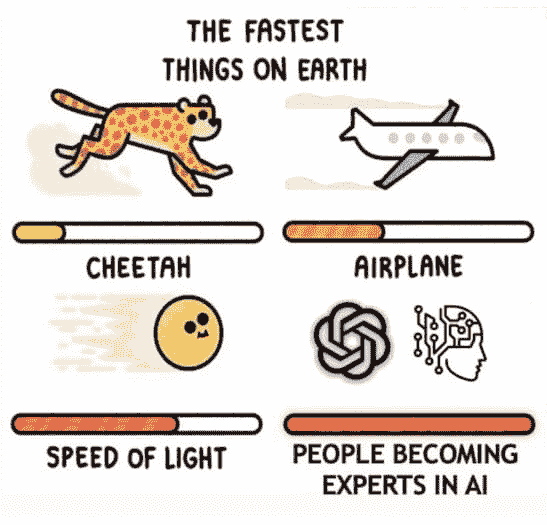

# 你的终极指南：Chat GPT 和其他缩写

> 原文：[`www.kdnuggets.com/2023/06/ultimate-guide-chat-gpt-abbreviations.html`](https://www.kdnuggets.com/2023/06/ultimate-guide-chat-gpt-abbreviations.html)

## 所有这些缩写 - ML、AI、AGI - 代表什么？

* * *

## 我们的前三名课程推荐

 1\. [谷歌网络安全证书](https://www.kdnuggets.com/google-cybersecurity) - 快速进入网络安全职业道路。

 2\. [谷歌数据分析专业证书](https://www.kdnuggets.com/google-data-analytics) - 提升你的数据分析技能

 3\. [谷歌 IT 支持专业证书](https://www.kdnuggets.com/google-itsupport) - 支持你的组织的 IT。

* * *

*ML*（机器学习）是一种解决复杂计算问题的方法——与其使用编程语言编码，不如构建一个从数据样本中“学习”解决方案的算法。

*AI*（人工智能）是计算机科学的一个领域，处理一些传统编程难以解决的问题（例如图像分类、处理人类语言）。ML 和 AI 是相辅相成的，ML 是解决 AI 中提出问题的工具。

*AGI*（人工通用智能）——是流行文化中通常所指的 AI 的正确术语——计算机实现类人智力能力和广泛推理的能力。它仍然是 AI 领域研究人员的终极目标。

## 神经网络是什么？

人工神经网络（ANN）是一类机器学习算法和数据结构（或简称*模型*），因其受到生物神经组织结构的启发而得名。但这并没有完全模拟其背后的所有生物机制。相反，ANN 是复杂的数学函数，基于生物学中的概念。

## 当我看到“模型有 20 亿个参数”时，这是什么意思？

神经网络是由统一单元组成的分层结构，这些单元在网络中相互连接。这些单元的连接方式称为*架构*。每个连接都有一个称为*权重*的相关数字，权重存储模型从数据中学习到的信息。因此，当你看到“模型有 20 亿个参数”时，这意味着模型中有 20 亿个连接（及权重），大致表示神经网络的信息容量。

## 深度学习是什么意思？

神经网络自 1980 年代以来一直在研究，但真正产生影响的是计算机游戏行业引入了便宜的个人超级计算机，即图形处理单元（GPUs）。研究人员将这一硬件适配到神经网络训练过程中，并取得了令人瞩目的成果。第一个深度学习架构之一，卷积神经网络（CNN），能够进行复杂的图像识别，这在传统的计算机视觉算法中是困难的。从那时起，带有神经网络的机器学习被重新命名为*深度学习*，“深度”指的是网络能够探索的复杂神经网络架构。

## 我在哪里可以获得更多关于这项技术如何工作的细节？

我推荐 Grant Sanderson 的视频，您可以在他的动画[数学频道](https://www.youtube.com/watch?v=aircAruvnKk&list=PLZHQObOWTQDNU6R1_67000Dx_ZCJB-3pi)上观看。

## 大型语言模型（Large Language Model）是什么意思？

要在计算机上处理人类语言，语言必须用数学方式定义。这种方法应该足够通用，以涵盖每种语言的独特特征。2003 年，研究人员发现了如何用神经网络表示语言，并称之为神经概率语言模型（n*eural probabilistic language model*）或简称为 LM。这就像手机中的预测文本——给定一些初始的单词（或标记）序列，模型可以预测下一个可能的单词及其相应的概率。继续使用先前生成的单词作为输入（这就是*自回归*）——模型可以生成其训练语言中的文本。

## 当我阅读语言模型时，我经常遇到“变换器”这个术语。这是什么？

对于神经网络来说，表示项序列是一个具有挑战性的问题。有几个尝试解决该问题的方法（主要是围绕*递归神经网络*的变体），产生了一些重要的思想（例如，*词嵌入*、*编码器-解码器*架构和*注意力机制*）。2017 年，谷歌的研究团队提出了一种新的神经网络架构，称为*变换器*。它将所有这些思想与有效的实际实现结合在一起。它旨在解决语言翻译问题（因此得名），但证明对于捕捉任何序列数据的统计特性也很有效。

## 为什么大家都在谈论 OpenAI？

OpenAI 尝试使用变换器（transformer）构建神经概率语言模型。他们实验的结果被称为 GPT（生成预训练*变换器*）模型。预训练意味着他们在大量互联网文本上训练了变换器神经网络，然后使用其*解码器*部分进行语言表示和文本生成。GPT 模型有多个版本：

+   GPT-1：一个初步实验模型，用于验证这种方法。

+   GPT-2：展示了生成连贯人类语言文本的能力和*零样本学习*——将其推广到从未特别训练过的领域（例如语言翻译和文本摘要，仅举几例）的能力。

+   GPT-3 是对架构的扩展（GPT-2 的 15 亿参数与最大 GPT-3 的 1750 亿参数），并在更大且多样的文本体上进行训练。其最重要的特点是能够通过仅仅看到几个示例来生成各种领域的文本（因此称为*少样本学习*），而无需任何特殊的*微调*或预训练。

+   GPT-4：一个更大的模型（具体特征未公开）、更大的训练数据集，以及*多模态性*（文本与图像数据相结合）。

考虑到 GPT 模型拥有巨大的参数量（实际上，你需要一个由数百到数千个 GPU 组成的大型计算集群来训练和服务这些模型），它们被称为*大型* *语言模型*（LLMs）。

## GPT-3 和 ChatGPT 有什么区别？

原始的 GPT-3 仍然是一个词预测引擎，因此主要对 AI 研究人员和计算语言学家感兴趣。给定一些初始的*种子*或*提示*，它可以无限生成文本，这在实际应用中意义不大。OpenAI 团队继续对模型进行实验，尝试微调以将提示视为需要执行的指令。他们输入了大量由人类策划的对话数据集，并发明了一种新的方法（RLHF – *基于人类反馈的强化学习*），通过另一个神经网络作为验证代理（在 AI 研究中很常见）显著加快了这一过程。他们发布了一个名为*InstructGPT*的 MVP 版本，基于较小的 GPT-3 版本，并于 2022 年 11 月发布了一个功能齐全的版本，称为 ChatGPT。凭借其简单的聊天机器人和网页界面，它改变了 IT 世界。

## 什么是语言模型对齐问题？

由于 LLM 只是复杂的统计机器，因此生成过程可能会出现意想不到且不愉快的方向。这种结果有时被称为*AI 幻觉*，但从算法的角度来看，尽管对人类用户来说是意外的，但它仍然是有效的。

如前所述，*原始* LLM 需要进行处理和额外的微调，包括人工验证者和 RLHF。这是为了*使* LLM 符合人类的期望，不足为奇的是，这个过程本身被称为对齐。这是一个漫长而繁琐的过程，涉及大量的人力工作；这可以被视为 LLM 质量保证。模型的对齐是区分 OpenAI/Microsoft ChatGPT 和 GPT-4 与其开源对手的关键因素。

## 为什么会有停止进一步开发语言模型的运动？

神经网络是 *黑箱*（一个具有某种结构的大量数字）。虽然有一些方法可以探索和调试它们的内部结构，但 GPTs 的 *泛化* 特性仍未得到解释。这是禁止运动的主要原因——一些研究人员认为我们在玩火（科幻小说给我们提供了有关 AGI 诞生和 *技术奇点* 的迷人情景），在我们对 LLMs 的基本过程有更好理解之前。

## LLMs 的实际应用场景有哪些？

最受欢迎的包括：

+   大型文本总结

+   反之亦然 - 从总结生成文本

+   文本风格（模仿作者或角色）

+   用作个人导师

+   解决数学/科学练习题

+   回答文本中的问题

+   从简短描述生成编程代码

## 现在 GPT 是唯一的 LLM 吗？

GPTs 是最成熟的模型，通过 OpenAI 和 Microsoft Azure OpenAI 服务（如果需要私人订阅）提供 API 访问。但这是人工智能的前沿，自 ChatGPT 发布以来，许多有趣的事情发生了。Google 构建了 [PaLM-2](https://ai.google/discover/palm2) 模型；Meta 为研究人员开源了他们的 [LLaMA](https://github.com/facebookresearch/llama) 模型，这激发了许多调整和改进（例如，斯坦福的 [Alpaca](https://crfm.stanford.edu/2023/03/13/alpaca.html)）和优化（现在你可以在你的 [laptop](https://github.com/ggerganov/llama.cpp) 甚至 [smartphone](https://github.com/Bip-Rep/sherpa) 上运行 LLMs）。

Huggingface 提供了 [BLOOM](https://huggingface.co/docs/transformers/model_doc/bloom) 和 [StarCoder](https://huggingface.co/bigcode/starcoder) 以及 [HuggingChat](https://huggingface.co/chat/) —— 这些都是完全开源的，没有 LLaMA 仅限研究的限制。Databricks 训练了他们自己完全开源的 [Dolly](https://huggingface.co/databricks/dolly-v2-12b) 模型。Lmsys.org 提供了他们自己的 [Vicuna](https://lmsys.org/blog/2023-03-30-vicuna/) LLM。Nvidia 的深度学习研究团队正在开发其 [Megatron-LM](https://github.com/bigcode-project/Megatron-LM) 模型。 [GPT4All](https://gpt4all.io/index.html) 计划也值得一提。

然而，所有这些开源替代品仍然落后于 OpenAI 的主要技术（特别是在对齐方面），但差距正在迅速缩小。

## 我该如何使用这些技术？

最简单的方法是使用 OpenAI 的 [public service](https://chat.openai.com/) 或他们的平台 API [playground](https://platform.openai.com/playground)，它提供了对模型的低级访问权限，并对网络内部运作有更多控制（指定系统上下文、调整生成参数等）。但你应该仔细审查他们的服务协议，因为他们使用用户交互来进行额外的模型改进和训练。作为替代方案，你可以选择 Microsoft Azure OpenAI 服务，它提供相同的 API 和工具，但具有私人模型实例。

如果你更具冒险精神，你可以尝试 HuggingFace 托管的 LLM 模型，但你需要更熟练地使用 Python 和数据科学工具。

**[Denis Shipilov](https://www.linkedin.com/in/denis-shipilov-3351512/)** 是一位经验丰富的解决方案架构师，拥有从分布式系统设计到大数据和数据科学相关项目的广泛专业知识。

### 更多相关话题

+   [认识 Gorilla: UC Berkeley 和微软的 API 增强型 LLM…](https://www.kdnuggets.com/2023/06/meet-gorilla-uc-berkeley-microsoft-apiaugmented-llm-outperforms-gpt4-chatgpt-claude.html)

+   [使用 Llama 和 ChatGPT 构建多聊天后端的微服务](https://www.kdnuggets.com/building-microservice-for-multichat-backends-using-llama-and-chatgpt)

+   [Baize: 一个开源聊天模型（但有所不同？）](https://www.kdnuggets.com/2023/04/baize-opensource-chat-model-different.html)

+   [介绍 DataCamp 的 AI 驱动聊天界面：DataLab](https://www.kdnuggets.com/introducing-datacamps-ai-powered-chat-interface-datalab)

+   [终极指南：掌握季节性并提升商业成果](https://www.kdnuggets.com/2023/08/media-mix-modeling-ultimate-guide-mastering-seasonality-boosting-business-results.html)

+   [终极指南：不同的词嵌入技术在 NLP 中的应用](https://www.kdnuggets.com/2021/11/guide-word-embedding-techniques-nlp.html)
