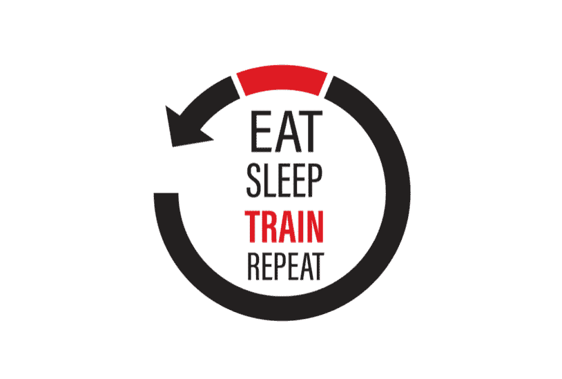

# 模型重训练终极指南

> 原文：[`www.kdnuggets.com/2019/12/ultimate-guide-model-retraining.html`](https://www.kdnuggets.com/2019/12/ultimate-guide-model-retraining.html)

评论

**由[Luigi Patruno](https://mlinproduction.com/about/)，数据科学家及“ML in Production”创始人**。

机器学习模型通过学习一组输入特征与输出目标之间的映射来进行训练。通常，这个映射是通过优化某个成本函数来最小化预测误差而学习到的。一旦找到最优模型，它就会被投入使用，目标是对未来未见数据生成准确的预测。根据问题的不同，这些新数据示例可能来自用户交互、计划的处理过程或其他软件系统的请求。理想情况下，我们希望我们的模型对这些未来实例的预测与训练过程中使用的数据一样准确。

当我们将模型部署到生产环境中并期望观察到与模型评估期间相似的错误率时，我们假设未来的数据将类似于过去观察到的数据。具体来说，我们假设特征和目标的分布将保持相对稳定。但这种假设通常并不成立。趋势会随时间变化，人们的兴趣随季节变化，股市也会涨落。因此，我们的模型必须适应这些变化。

由于我们预期世界会随着时间变化，模型部署应被视为一个持续的过程。机器学习从业者需要重新训练他们的模型，如果发现数据分布与原始训练集有显著偏离的话，而不是仅仅部署一个模型后转向另一个项目。这个概念被称为**模型漂移**，可以通过额外的监控基础设施、监督和流程来缓解，但也涉及到额外的开销。

在这篇文章中，我将定义模型漂移并讨论识别和跟踪模型漂移的策略。我将描述如何使用模型重训练来缓解漂移对预测性能的影响，并建议模型应该多频繁地进行重训练。最后，我将提到几种启用模型重训练的方法。

### 什么是模型漂移？

模型漂移是指由于环境变化违背了模型的假设，导致模型的预测性能随着时间的推移而下降。模型漂移这个术语有些误导，因为变化的不是模型，而是模型操作的环境。因此，[概念漂移](https://machinelearningmastery.com/gentle-introduction-concept-drift-machine-learning/)可能更适合这个名称，但这两个术语描述的是相同的现象。

注意，我对模型漂移的定义实际上包括几个可以变化的变量。预测性能会退化，它会在一段时间内以某种速率退化，这种退化将由于违反建模假设的环境变化。确定如何诊断模型漂移以及如何通过模型再训练进行纠正时，应该考虑这些变量。

**你如何跟踪模型漂移？**

有多种技术可以识别和跟踪模型漂移。在描述一些策略之前，让我指出没有一种通用的方法。不同的建模问题需要不同的解决方案，而且你可能有或没有基础设施或资源来利用某些策略。

**模型性能退化**

识别模型漂移的最直接方法是明确确定预测性能是否恶化并量化这种下降。在实时数据上测量已部署模型的准确性是一个[臭名昭著的难题](https://www.oreilly.com/ideas/lessons-learned-turning-machine-learning-models-into-real-products-and-services)。这种困难部分是因为我们需要同时访问模型生成的预测和真实标签。由于多种原因，这可能是不可能的，包括：

+   预测在生成后未被存储。不要让这种情况发生在你身上。

+   预测被存储了，但你无法访问真实标签。

+   预测和标签都是可用的，但不能将它们结合在一起。

即使预测和标签可以结合在一起，标签可能还要一段时间才能获得。考虑一个预测下季度收入的财务预测模型。在这种情况下，实际收入要等到该季度结束后才能观察到，因此你不能在那时之前量化模型的表现。在这种预测问题中，**回填**预测，即训练过去本该部署的模型并在过去的历史数据上生成预测，可以让你了解模型性能下降的速度。

正如 Josh Wills [指出的](https://www.infoq.com/presentations/instrumentation-observability-monitoring-ml)，在部署模型之前你能做的最重要的事情之一是尝试在离线环境中理解模型漂移。数据科学家应该努力回答这个问题：“如果我使用这组特征对六个月前的数据训练一个模型，并将其应用于今天生成的数据，这个模型比我之前从一个月前的数据中训练出来的模型在今天的数据上表现更差多少？”在离线环境中进行这种分析可以让你估计模型性能下降的速度以及你需要重新训练的频率。当然，这种方法以拥有一个 [时间机器](https://medium.com/netflix-techblog/distributed-time-travel-for-feature-generation-389cccdd3907) 为前提，以便访问过去任何时间点的数据。

**检查训练数据和实时数据的特征分布**

由于模型性能预期会随着输入特征的分布偏离训练数据的分布而下降，因此比较这些分布是推测模型漂移的好方法。请注意，我使用了 *推测* 而不是 *检测* 模型漂移，因为我们不是观察到预测性能的实际下降，而是预期会发生这种下降。这在由于数据生成过程的性质无法观察实际的真实情况时非常有用。

每个特征有许多不同的监控项目，包括：

+   可能值的范围

+   值的直方图

+   特征是否接受 NULL 值，如果接受，预计有多少 NULL 值

能够通过 [仪表盘](https://pair-code.github.io/facets/) 快速监控这些分布是朝着正确方向迈出的第一步。进一步的做法是自动跟踪训练和服务偏差，并在特征的偏离显著时发出警报。

**检查特征之间的相关性**

许多模型假设特征之间的关系必须保持不变。因此，你还需要监控单独输入特征之间的成对相关性。如 [《你的 ML 测试评分是什么？ML 生产系统的评分标准》](https://storage.googleapis.com/pub-tools-public-publication-data/pdf/45742.pdf) 中提到的，你可以通过以下方式实现：

+   监控特征之间的相关系数

+   使用一个或两个特征训练模型

+   训练一组模型，每个模型移除一个特征

**检查目标分布**

如果目标变量的分布发生显著变化，模型的预测性能几乎肯定会恶化。*Machine Learning: The High-Interest Credit Card of Technical Debt* 的作者指出，一个简单而有用的诊断方法是跟踪目标分布。该指标与训练数据的偏差可能意味着是时候重新评估你部署的模型的质量了。但请记住，“这绝不是一个全面的测试，因为它可以被一个简单预测标签发生平均值的空模型所满足，而不考虑输入特征。”

### 我们所说的模型再训练究竟是什么意思？

有时，模型再训练似乎是一个[重载运算符](https://en.wikipedia.org/wiki/Operator_overloading)。这是否仅指寻找现有模型架构的新参数？改变超参数搜索空间呢？不同模型类型（如 RandomForest、SVMs 等）的搜索呢？我们能否包括新的特征或排除以前使用的特征？这些都是很好的问题，明确这些非常重要。要回答这些问题，我们必须直接思考我们试图解决的问题。也就是说，减少模型漂移对我们部署模型的影响。

在将模型部署到生产环境之前，数据科学家会经过一个严格的模型验证过程，包括：

+   数据集组装 – 从不同来源（如不同的数据库）收集数据集。

+   特征工程 – 从原始数据中提取能提高预测性能的列。

+   模型选择 – 比较不同的学习算法。

+   错误估计 – 在搜索空间中进行优化，以找到最佳模型并估计其泛化误差。

这个过程会产生一些**最佳**模型，然后将其部署到生产环境中。由于模型漂移特别指选择的模型由于特征/目标数据的分布变化而导致的预测性能退化，模型再训练**不**应该导致不同的模型生成过程。再训练仅指在新的训练数据集上重新运行生成之前选择的模型的过程。特征、模型算法和超参数搜索空间都应保持不变。可以这样理解，再训练不涉及任何代码更改，仅涉及更改训练数据集。

这并不是说未来版本的模型不应该包括新特性或考虑其他算法类型/架构。我只是说，这些类型的变化会导致完全不同的模型——在部署到生产环境之前，你应该以不同的方式进行测试。根据你的机器学习组织的成熟度，这些变化理想情况下应通过 A/B 测试引入，以测量新模型对预定指标（如用户参与度或留存率）的影响。

### 你应该多久重新训练一次模型

到目前为止，我们已经讨论了模型漂移是什么以及识别它的多种方法。那么问题变成了，我们如何解决它？如果由于环境变化导致模型的预测性能下降，解决方案是用反映当前现实的新训练集重新训练模型。你应该多久重新训练一次模型？你如何确定新的训练集？像大多数困难的问题一样，答案是*这要根据情况而定*。但这究竟取决于什么呢？

有时问题设置本身会提示你何时重新训练模型。例如，假设你在一个大学招生部门工作，负责构建一个预测学生是否会在下学期回归的学生流失模型。这个模型将在期中考试后直接用来生成当前学生群体的预测。被识别为有流失风险的学生将自动被注册参加辅导或其他干预措施。

让我们考虑一下这种模型的时间范围。由于我们每学期生成批量预测，因此没有新的训练数据的情况下，模型不应更频繁地重新训练。因此，我们可能会选择在每学期开始时重新训练模型，在观察到上一学期哪些学生退学后。这是一个**周期性**重新训练的例子。通常，从这种简单的策略开始是一个好主意，但你需要确定确切的重新训练频率。快速变化的训练集可能要求你每天或每周训练一次。变化较慢的分布可能需要每月或每年重新训练。

如果你的团队已经具备了监控前面讨论的指标的基础设施，那么可能有意义去[自动化模型漂移管理](https://www.inawisdom.com/machine-learning/machine-learning-automated-model-retraining-sagemaker/)。这个解决方案需要跟踪诊断信息，然后在实时数据的诊断信息与训练数据的诊断信息出现偏差时触发模型重新训练。但这种方法也有自己的挑战。首先，你需要确定一个触发模型重新训练的偏差阈值。如果阈值设置得过低，你可能会面临过于频繁的重新训练，从而导致计算成本的高昂。如果阈值设置得过高，你则有可能不会足够频繁地进行重新训练，从而导致生产中的模型表现不佳。这比看起来要复杂，因为你需要确定需要收集多少新的训练数据才能代表世界的新状态。即使世界发生了变化，用一个训练集过小的模型来替换现有模型也没有意义。

如果你的模型在对抗环境中运行，则需要特别考虑。在欺诈检测等环境中，对手会改变数据分布以获取利益。这些问题可能会从[在线学习](https://en.wikipedia.org/wiki/Online_machine_learning)中受益，在这种学习中，模型会随着新数据的到来而逐步更新。

### 你如何重新训练你的模型？

最后但同样重要的是，让我们讨论**如何**重新训练模型。你采用的模型重新训练方法直接与决定重新训练的频率相关。

如果你决定定期重新训练你的模型，那么批量重新训练是完全足够的。这种方法涉及使用诸如 Jenkins 或 [Kubernetes CronJobs](https://mlinproduction.com/k8s-cronjobs/) 等作业调度程序来安排模型训练过程。

如果你已经自动化了模型漂移检测，那么在识别到漂移时触发模型重新训练是有意义的。例如，你可能会有定期作业来比较实时数据集的特征分布与训练数据的特征分布。当发现显著偏差时，系统可以自动安排模型重新训练以自动部署新模型。这也可以通过像 Jenkins 这样的作业调度程序或使用 [Kubernetes Jobs](https://mlinproduction.com/k8s-jobs/) 来实现。

最后，利用在线学习技术来更新当前生产中的模型可能是有意义的。这种方法依赖于用当前部署的模型来“播种”一个新模型。随着新数据的到来，模型参数会用新的训练数据进行更新。

### 结论

机器学习模型的预测性能在模型部署到生产环境后通常会下降。因此，实践者必须通过建立针对机器学习的监控解决方案和工作流程，为性能下降做好准备，从而实现模型重新训练。虽然重新训练的频率会因问题而异，但机器学习工程师可以从一个简单的策略开始，即定期在新数据到达时重新训练模型，然后逐步演变为更复杂的过程，以量化和应对模型漂移。

### 参考文献

+   [基于新数据重新训练模型](https://docs.aws.amazon.com/machine-learning/latest/dg/retraining-models-on-new-data.html)

+   [机器学习模型是否应在每次有新观测数据时进行重新训练？](https://www.quora.com/Should-a-machine-learning-model-be-retrained-each-time-new-observations-are-available)

+   [使用 SAGEMAKER 的机器学习和自动化模型重新训练](https://www.inawisdom.com/machine-learning/machine-learning-automated-model-retraining-sagemaker/)

+   [机器学习中概念漂移的温和介绍](https://machinelearningmastery.com/gentle-introduction-concept-drift-machine-learning/)

+   [将机器学习模型转化为实际产品和服务的经验教训](https://www.oreilly.com/ideas/lessons-learned-turning-machine-learning-models-into-real-products-and-services)

+   [你的机器学习测试评分是多少？机器学习生产系统的评分标准](https://storage.googleapis.com/pub-tools-public-publication-data/pdf/45742.pdf)

+   [机器学习：技术债务的高利贷](https://storage.googleapis.com/pub-tools-public-publication-data/pdf/43146.pdf)

[原文](https://mlinproduction.com/model-retraining/)。经许可转载。

**个人简介：** [Luigi Patruno](https://mlinproduction.com/about/) 是一位数据科学家和机器学习顾问。他目前是 2U 的数据科学总监，领导一个负责构建机器学习模型和基础设施的数据科学团队。作为顾问，Luigi 帮助公司通过将现代数据科学方法应用于战略业务和产品计划来创造价值。他创办了 [MLinProduction.com](http://MLinProduction.com) 以收集和分享机器学习运维的最佳实践，并且教授过统计学、数据分析和大数据工程的研究生课程。

**相关内容：**

+   [为什么机器学习部署如此困难？](https://www.kdnuggets.com/2019/10/machine-learning-deployment-hard.html)

+   [如何实时监控机器学习模型](https://www.kdnuggets.com/2019/01/monitor-machine-learning-real-time.html)

+   [部署机器学习模型的不同方法概述](https://www.kdnuggets.com/2019/06/approaches-deploying-machine-learning-production.html)

* * *

## 我们的三大课程推荐

 1\. [Google 网络安全证书](https://www.kdnuggets.com/google-cybersecurity) - 快速开启网络安全职业之路。

 2\. [Google 数据分析专业证书](https://www.kdnuggets.com/google-data-analytics) - 提升你的数据分析能力。

 3\. [Google IT 支持专业证书](https://www.kdnuggets.com/google-itsupport) - 支持你的组织的 IT 需求。

* * *

### 了解更多相关话题

+   [Bark：终极音频生成模型](https://www.kdnuggets.com/2023/05/bark-ultimate-audio-generation-model.html)

+   [终极开源大型语言模型生态系统](https://www.kdnuggets.com/2023/05/ultimate-opensource-large-language-model-ecosystem.html)

+   [终极指南：NLP 中不同的词嵌入技术](https://www.kdnuggets.com/2021/11/guide-word-embedding-techniques-nlp.html)

+   [你的终极指南：Chat GPT 和其他缩略语](https://www.kdnuggets.com/2023/06/ultimate-guide-chat-gpt-abbreviations.html)

+   [终极指南：掌握季节性变化并提升商业成果](https://www.kdnuggets.com/2023/08/media-mix-modeling-ultimate-guide-mastering-seasonality-boosting-business-results.html)

+   [一年内掌握数据科学：终极指南](https://www.kdnuggets.com/master-data-science-in-a-year-the-ultimate-guide-to-affordable-self-paced-learning)
