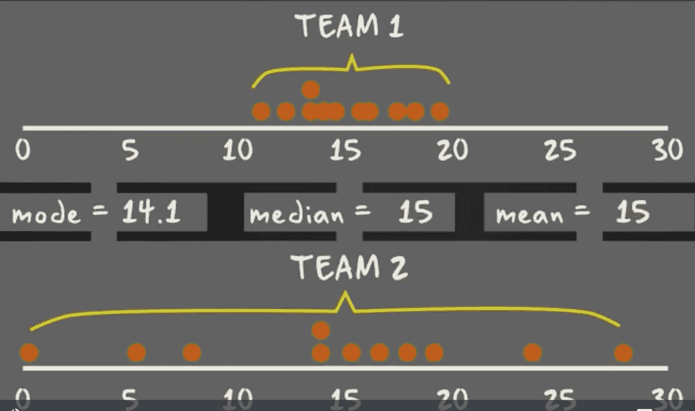
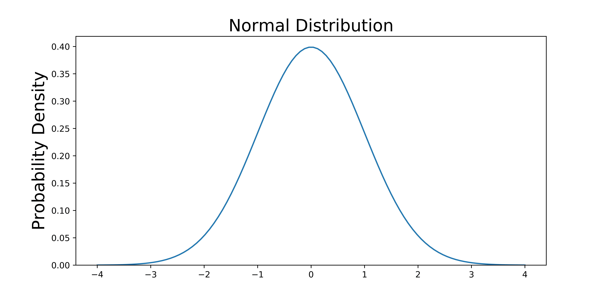
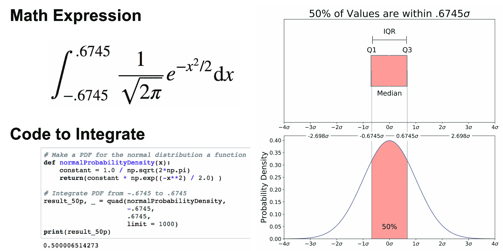
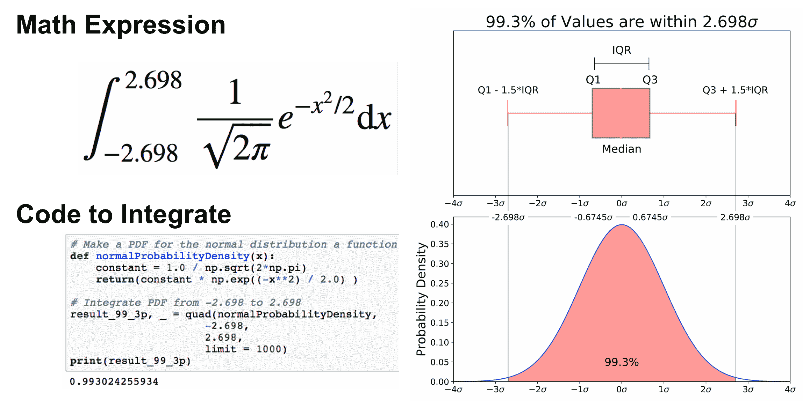
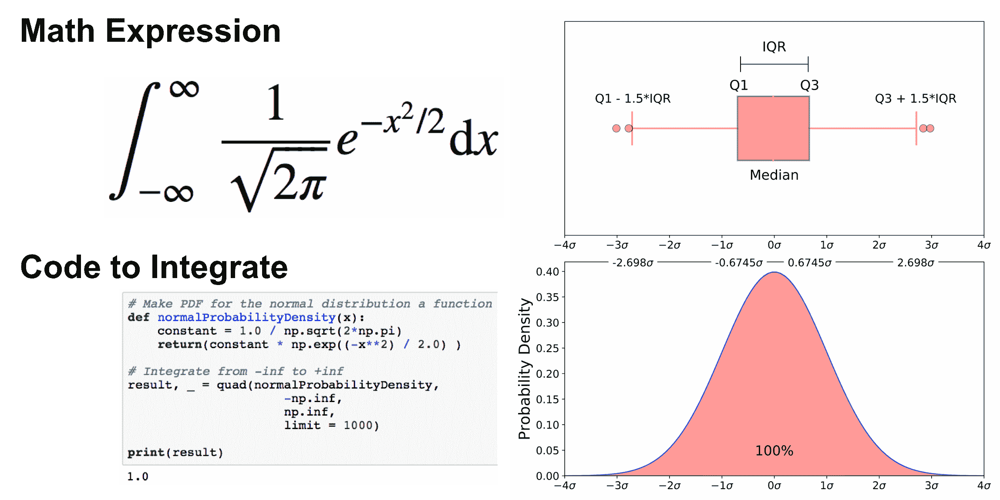
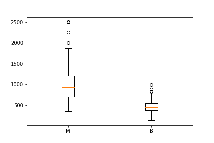
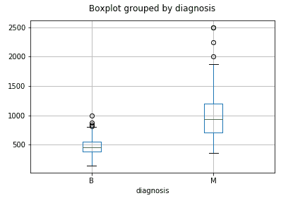

# 理解箱型图

> 原文：[`www.kdnuggets.com/2019/11/understanding-boxplots.html`](https://www.kdnuggets.com/2019/11/understanding-boxplots.html)

评论

**由 [Michael Galarnyk](https://www.linkedin.com/in/michaelgalarnyk/)，数据科学家**


箱型图的不同部分

* * *

## 我们的前三大课程推荐

 1\. [Google 网络安全证书](https://www.kdnuggets.com/google-cybersecurity) - 快速进入网络安全领域的职业生涯。

 2\. [Google 数据分析专业证书](https://www.kdnuggets.com/google-data-analytics) - 提升你的数据分析技能

 3\. [Google IT 支持专业证书](https://www.kdnuggets.com/google-itsupport) - 支持你所在组织的 IT 工作

* * *

上面的图像是一个箱型图**。**箱型图是一种基于五数概括（“最小值”，第一四分位数（Q1），中位数，第三四分位数（Q3），和“最大值”）显示数据分布的标准化方式。它可以告诉你关于离群值及其数值的信息。它还可以告诉你数据是否对称，数据的集中程度，以及数据是否及如何偏斜。

本教程将包括：

+   什么是箱型图？

+   通过将箱型图与正态分布的概率密度函数进行比较，来理解箱型图的结构。

+   如何使用 Python 制作和解释箱型图？

一如既往，用于制作图表的代码可以在我的[github](https://github.com/mGalarnyk/Python_Tutorials/blob/master/Statistics/boxplot/box_plot.ipynb)上找到。好了，开始吧！

### 什么是箱型图？

对于一些分布/数据集，你会发现你需要比中心趋势的度量（中位数、均值和众数）更多的信息。



有时，仅凭均值、中位数和众数不足以描述数据集（摘自[这里](https://www.coursera.org/lecture/basic-statistics/1-05-range-interquartile-range-and-box-plot-RbWIZ)）。

你需要了解数据的变异性或离散性。箱型图是一种图形，能很好地指示数据值的分布情况。尽管与[直方图](https://datavizcatalogue.com/methods/histogram.html)或[密度图](https://datavizcatalogue.com/methods/density_plot.html)相比，箱型图可能显得有些原始，但它们的优点是占用空间较少，这在比较多个组或数据集之间的分布时非常有用。


箱型图的不同部分

箱型图是一种基于五数概括（“最小值”，第一四分位数（Q1），中位数，第三四分位数（Q3），和“最大值”）显示数据分布的标准化方式。

**中位数（Q2/50th Percentile）**：数据集的中间值。

**第一四分位数（Q1/25th Percentile）**：数据集中最小值（不是“最小值”）和中位数之间的中间数。

**第三四分位数（Q3/75th Percentile）**：中位数与数据集的最高值（不是“最大值”）之间的中间值。

**四分位距（IQR）**：第 25 百分位到第 75 百分位。

**须线（以蓝色表示）**

**异常值（以绿色圆圈表示）**

**“最大值”**：Q3 + 1.5*IQR

**“最小值”**：Q1 - 1.5*IQR

目前“异常值”、“最小值”或“最大值”的定义可能还不清楚。接下来的部分将尝试为你澄清这些定义。

### 正态分布上的箱线图


接近正态分布的箱线图与正态分布的概率密度函数（pdf）比较

上图是接近正态分布的箱线图与正态分布的概率密度函数（pdf）的比较。我展示这个图的原因是，查看统计分布比查看箱线图更为常见。换句话说，它可能有助于你理解箱线图。

本部分将涵盖许多内容，包括：

+   异常值占正态分布数据的 0.7%。

+   什么是“最小值”和“最大值”

### 概率密度函数

这部分内容与[68–95–99.7 规则文章](https://towardsdatascience.com/understanding-the-68-95-99-7-rule-for-a-normal-distribution-b7b7cbf760c2)非常相似，但经过了针对箱线图的调整。为了理解这些百分比的来源，了解概率密度函数（PDF）是很重要的。PDF 用于指定随机变量在*特定范围内*的概率，而不是取任何一个值。这种概率由该变量的 PDF 在该范围内的积分给出——即由密度函数下方、水平轴上方以及范围内的最低值和最大值之间的面积给出。这个定义可能不太容易理解，让我们通过绘制正态分布的概率密度函数来澄清这一点。下面的方程是正态分布的概率密度函数。


正态分布的 PDF

我们通过假设均值（μ）为 0，标准差（σ）为 1 来简化这个问题。


正态分布的 PDF

这可以使用任何工具绘制，但我选择用 Python 来绘制。

```py
# Import all libraries for this portion of the blog post
from scipy.integrate import quad
import numpy as np
import matplotlib.pyplot as plt
%matplotlib inlinex = np.linspace(-4, 4, num = 100)
constant = 1.0 / np.sqrt(2*np.pi)
pdf_normal_distribution = constant * np.exp((-x**2) / 2.0)
fig, ax = plt.subplots(figsize=(10, 5));
ax.plot(x, pdf_normal_distribution);
ax.set_ylim(0);
ax.set_title('Normal Distribution', size = 20);
ax.set_ylabel('Probability Density', size = 20);
```



上图并未显示事件的 *概率*，而是它们的 *概率密度*。要获取在给定范围内的事件概率，我们需要进行积分。假设我们感兴趣的是找到一个随机数据点落在四分位距内（均值的 0.6745 标准差）的概率，我们需要从 -0.6745 到 0.6745 积分。这可以通过 SciPy 实现。

```py
# Make PDF for the normal distribution a function
def normalProbabilityDensity(x):
    constant = 1.0 / np.sqrt(2*np.pi)
    return(constant * np.exp((-x**2) / 2.0) )# Integrate PDF from -.6745 to .6745
result_50p, _ = quad(normalProbabilityDensity, -.6745, .6745, limit = 1000)
print(result_50p)
```



对于“最小值”和“最大值”也可以做同样的操作。

```py
# Make a PDF for the normal distribution a function
def normalProbabilityDensity(x):
    constant = 1.0 / np.sqrt(2*np.pi)
    return(constant * np.exp((-x**2) / 2.0) )# Integrate PDF from -2.698 to 2.698
result_99_3p, _ = quad(normalProbabilityDensity,
                     -2.698,
                     2.698,
                     limit = 1000)
print(result_99_3p)
```



如前所述，异常值占数据的剩余 0.7%。

需要注意的是，对于任何 PDF，曲线下的面积必须为 1（从函数的范围内绘制任何数字的概率始终为 1）。



### 绘制和解释箱线图

免费预览 [视频](https://youtu.be/BE8CVGJuftI) 来自 [使用 Python 进行数据可视化课程](https://www.linkedin.com/learning/python-for-data-visualization/effectively-present-data-with-python)

本节内容主要基于来自我的 [Python 数据可视化课程](https://www.linkedin.com/learning/python-for-data-visualization/effectively-present-data-with-python) 的免费预览 [视频](https://youtu.be/BE8CVGJuftI)。在上一节中，我们讨论了正态分布上的箱线图，但显然你不总是会有一个基础的正态分布，让我们讨论一下如何在真实数据集上利用箱线图。为此，我们将利用 [乳腺癌威斯康星（诊断）数据集](https://www.kaggle.com/uciml/breast-cancer-wisconsin-data#data.csv)。如果你没有 Kaggle 帐户，可以从 [我的 GitHub](https://raw.githubusercontent.com/mGalarnyk/Python_Tutorials/master/Kaggle/BreastCancerWisconsin/data/data.csv) 下载数据集。

### 读取数据

以下代码将数据读入 pandas dataframe。

```py
import pandas as pd
import seaborn as sns
import matplotlib.pyplot as plt# Put dataset on my github repo 
df = pd.read_csv('https://raw.githubusercontent.com/mGalarnyk/Python_Tutorials/master/Kaggle/BreastCancerWisconsin/data/data.csv')
```

### 绘制箱线图

下图的箱线图用于分析分类特征（恶性或良性肿瘤）和连续特征（area_mean）之间的关系。

有几种方法可以通过 Python 绘制箱线图。你可以通过 seaborn、pandas 或 seaborn 绘制箱线图。

**seaborn**

以下代码将 pandas dataframe `df` 传递给 seaborn 的 `boxplot`。

```py
sns.boxplot(x='diagnosis', y='area_mean', data=df)
```


**matplotlib**

你在这篇文章中看到的箱线图是通过 matplotlib 制作的。这种方法可能更加繁琐，但可以提供更高的控制级别。

```py
malignant = df[df['diagnosis']=='M']['area_mean']
benign = df[df['diagnosis']=='B']['area_mean']fig = plt.figure()
ax = fig.add_subplot(111)
ax.boxplot([malignant,benign], labels=['M', 'B'])
```



通过一点努力，你可以让这个图形变得更美观

**pandas**

你可以通过在 DataFrame 上调用 `.boxplot()` 来绘制箱线图。以下代码绘制了 `area_mean` 列相对于不同诊断的箱线图。

```py
df.boxplot(column = 'area_mean', by = 'diagnosis');
plt.title('')
```



### 有缺口的箱线图

带刻度线的箱线图允许你评估每个箱线图中位数的置信区间（默认 95% 置信区间）。

```py
malignant = df[df['diagnosis']=='M']['area_mean']
benign = df[df['diagnosis']=='B']['area_mean']fig = plt.figure()
ax = fig.add_subplot(111)
ax.boxplot([malignant,benign], notch = True, labels=['M', 'B']);
```


还不是最美的。

### 解读箱线图

数据科学涉及结果的沟通，所以请记住，你总是可以通过一些额外的工作让你的箱线图变得更漂亮（代码 [这里](https://github.com/mGalarnyk/Python_Tutorials/blob/master/Statistics/boxplot/Box_plot_interpretation.ipynb)）。


使用图表，我们可以比较恶性和良性诊断的 area_mean 范围和分布。我们观察到恶性肿瘤的 area_mean 变异性更大，以及更大的离群值。

此外，由于箱线图中的刻度线没有重叠，你可以得出结论，95% 的置信度下真实中位数确实存在差异。

关于箱线图，还需要注意以下几点：

1.  请记住，你总是可以 [提取箱线图的数据](https://stackoverflow.com/questions/33518472/getting-data-of-a-boxplot-pandas)，以便了解箱线图中不同部分的数值。

1.  Matplotlib **不** 会先估计正态分布，并根据估计的分布参数计算四分位数。中位数和四分位数直接从数据中计算。换句话说，你的箱线图可能会因数据分布和样本大小的不同而有所不同，例如，可能不对称，或有更多或更少的离群值。

### 结论

希望这些关于箱线图的信息不是太多。未来的教程将利用这些知识来讲解如何应用于理解置信区间。我的下一个教程讲解了 [如何使用和创建 Z 表（标准正态表）](https://towardsdatascience.com/how-to-use-and-create-a-z-table-standard-normal-table-240e21f36e53)。如果你对教程有任何问题或想法，请随时在下面的评论中、通过 [YouTube 视频页面](https://youtu.be/BE8CVGJuftI) 或通过 [Twitter](https://twitter.com/GalarnykMichael) 联系我。

**简介: [Michael Galarnyk](https://www.linkedin.com/in/michaelgalarnyk/)** 是一名数据科学家和企业培训师。他目前在斯克里普斯转化研究所工作。你可以在 Twitter (https://twitter.com/GalarnykMichael)、Medium (https://medium.com/@GalarnykMichael) 和 GitHub (https://github.com/mGalarnyk) 上找到他。

[原文](https://towardsdatascience.com/understanding-boxplots-5e2df7bcbd51)。已获许可转载。

**相关内容：**

+   数据科学技能的 4 个象限和创建病毒式数据可视化的 7 个原则

+   如何构建数据科学投资组合

+   Python 中用于分类的决策树理解

### 更多相关话题

+   [停止学习数据科学以寻找目的，并找到目的来…](https://www.kdnuggets.com/2021/12/stop-learning-data-science-find-purpose.html)

+   [90 亿美元的 AI 失败，详解](https://www.kdnuggets.com/2021/12/9b-ai-failure-examined.html)

+   [学习数据科学统计的顶级资源](https://www.kdnuggets.com/2021/12/springboard-top-resources-learn-data-science-statistics.html)

+   [成功数据科学家的 5 个特征](https://www.kdnuggets.com/2021/12/5-characteristics-successful-data-scientist.html)

+   [是什么使 Python 成为初创公司的理想编程语言](https://www.kdnuggets.com/2021/12/makes-python-ideal-programming-language-startups.html)

+   [每个数据科学家都应了解的三个 R 语言库（即使你使用 Python）](https://www.kdnuggets.com/2021/12/three-r-libraries-every-data-scientist-know-even-python.html)
