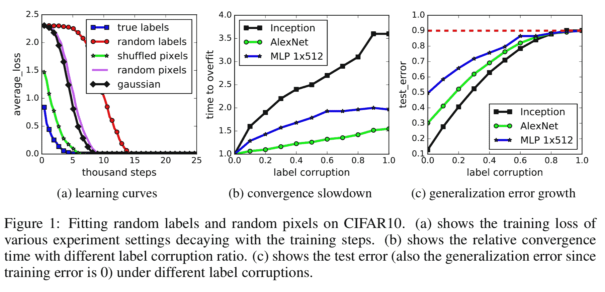
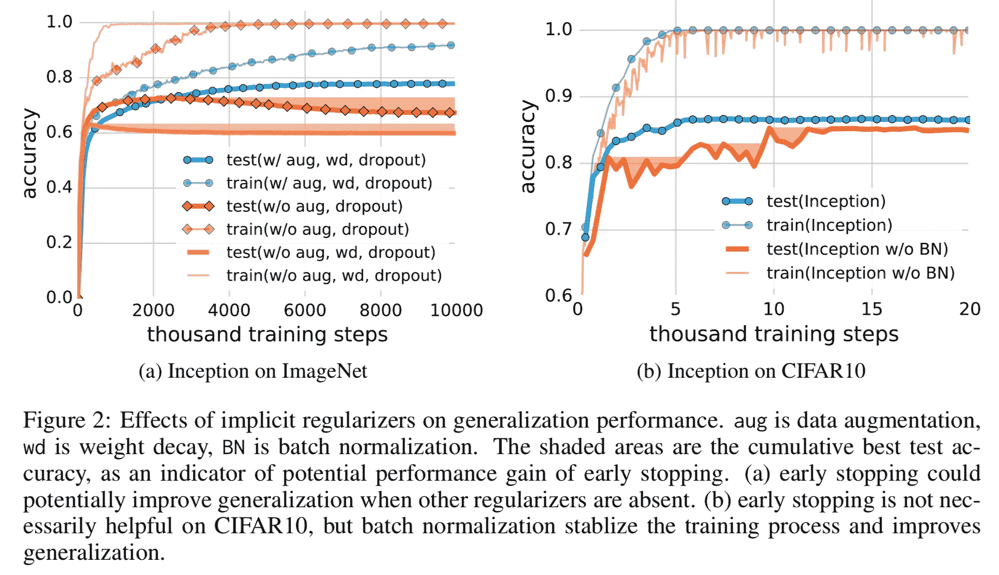

# 理解深度学习需要重新思考泛化

> 原文：[`www.kdnuggets.com/2017/06/understanding-deep-learning-rethinking-generalization.html`](https://www.kdnuggets.com/2017/06/understanding-deep-learning-rethinking-generalization.html)

[理解深度学习需要重新思考泛化](https://openreview.net/forum?id=Sy8gdB9xx&noteId=Sy8gdB9xx) Zhang et al., *ICLR’17*

这篇论文具有令人惊叹的组合特性：结果易于理解，略显惊讶，并且会让你在之后很长一段时间内思考其意义！

* * *

## 我们的前三课程推荐

 1\. [谷歌网络安全证书](https://www.kdnuggets.com/google-cybersecurity) - 快速进入网络安全职业生涯

 2\. [谷歌数据分析专业证书](https://www.kdnuggets.com/google-data-analytics) - 提升你的数据分析水平

 3\. [谷歌 IT 支持专业证书](https://www.kdnuggets.com/google-itsupport) - 支持你的组织 IT 方面的工作

* * *

作者提出要回答的问题是：

> 什么因素使得神经网络能够很好地泛化？对这个问题的令人满意的答案不仅有助于使神经网络更具可解释性，还可能导致更有原则和可靠的模型架构设计。

作者所说的“良好泛化”仅仅是指“什么原因使得一个在训练数据上表现良好的网络也能在（保留的）测试数据上表现良好？”（而不是迁移学习，迁移学习涉及将训练好的网络应用于一个相关但不同的问题）。如果你稍加思考，这个问题实际上就是“为什么神经网络的表现如此之好？” 泛化是仅仅记忆训练数据的一部分并将其重复的差别，以及实际上对数据集有某种有意义的直觉并能用来做预测。所以，如果问题的答案是“我们真的不知道”，那不就有点令人担忧吗？

### 随机标签的奇怪案例

我们的故事开始于一个熟悉的地方——CIFAR 10（50,000 张训练图像分为 10 个类别，10,000 张验证图像）和 ILSVRC（ImageNet）2012（1,281,167 张训练图像，50,000 张验证图像，1000 个类别）数据集，以及 [Inception](https://blog.acolyer.org/2017/03/21/convolution-neural-nets-part-2/) 网络架构的变体。

使用训练数据训练网络，你不会感到惊讶地听到它们在*训练集*上可以达到零误差。这高度表明了*过拟合*——记住训练示例而不是学习真正的预测特征。我们可以使用诸如正则化等技术来对抗过拟合，从而得到泛化更好的网络。稍后会详细讨论。

使用相同的训练数据，但这次随机打乱标签（即，使标签与图像内容之间不再存在真正的对应关系）。使用这些随机标签训练网络，你会得到什么？*零训练误差！*

> 在[这种]情况下，实例和类别标签之间不再存在任何关系。因此，学习是不可能的。直觉上，应该在训练过程中清晰地表现出这种不可能性，例如，训练不收敛或显著减慢。令我们惊讶的是，对于多个标准架构的训练过程的几个特性在标签转换下基本保持不变。

正如作者简洁地表述的，“*深度神经网络很容易拟合随机标签*。”以下是这个第一次实验的三个关键观察：

1.  神经网络的有效容量足以记住整个数据集。

1.  即使在*随机标签*上的优化仍然很简单。实际上，与在真实标签上训练相比，训练时间仅增加了一个小的常数因子。

1.  随机化标签仅仅是数据转换，保留了学习问题的所有其他属性不变。

如果你拿到一个在随机标签上训练的网络，然后看看它在测试数据上的表现，它当然会表现得非常差，因为它并没有真正学到任何关于数据集的东西。换句话说，它有很高的*泛化误差*。将这些因素综合起来，你会意识到：

> …仅通过随机化标签，我们可以使模型的泛化误差大幅上升，*而不改变模型、模型的大小、超参数或优化器*。我们在多个不同的标准架构上进行了验证，这些架构在 CIFAR 10 和 ImageNet 分类基准上进行训练。（强调由我加上）。

换句话说：模型、模型的大小、超参数和优化器无法解释最先进神经网络的泛化性能。这必然是因为尽管它们保持不变，泛化性能却可以显著变化。

### 更加令人好奇的随机图像案例

如果我们不仅仅改变标签，还改变图像本身会发生什么？实际上，如果用随机噪声替换真实图像会怎么样？在这些图中，这被标记为‘高斯’实验，因为使用与原始图像数据集均值和方差匹配的高斯分布来生成每个图像的随机像素。

结果发现，网络仍然训练到零训练误差，但比随机标签的情况更快！一个假设是，这种情况发生的原因是，随机像素图像之间的分离程度比随机标签的情况更大，因为后者的图像原本都属于同一类别，但由于标签交换现在必须被学习为不同的类别。

团队对数据集引入了不同程度和种类的随机化变化进行了一系列实验：

+   真实标签（原始数据集没有修改）

+   部分损坏的标签（对一些标签进行扰动）

+   随机标签（对所有标签进行扰动）

+   打乱像素（选择一个像素排列，然后均匀地应用到所有图像）

+   随机像素（对每张图片独立应用不同的随机排列）

+   高斯（如前所述，为每张图片生成虚假的数据）

在整个范围内，网络仍然能够完美地拟合训练数据。

> 我们进一步改变了随机化的数量，在没有噪声和完全噪声的情况下平滑地插值。这导致了一系列中间学习问题，其中标签中仍然保留了一定程度的信号。我们观察到，随着噪声水平的增加，泛化误差稳步恶化。这表明神经网络能够捕捉数据中剩余的信号，同时用蛮力拟合噪声部分。

对我来说，最后一句话是关键。我们在模型架构中做出的某些选择显然会影响模型的泛化能力（否则所有架构的泛化效果都会相同）。不过，世界上最具泛化能力的网络仍然必须在数据中没有其他真实信号时依赖于记忆。所以也许我们需要一种方法来区分数据集中存在的真正泛化潜力，以及给定模型架构在捕捉这种潜在能力方面的效率。一种简单的方法是对相同的数据集训练不同的架构！（我们当然一直在这样做）。不过，这仍然没有帮助我们解决最初的问题——理解*为什么*有些模型比其他模型更具泛化能力。

### 正则化来救援？

模型架构本身显然不是一个充分的正则化器（不能防止过拟合/记忆）。那么常用的正则化技术呢？

> 我们展示了显式正则化形式，如权重衰减、丢弃法和数据增强，并不能充分解释神经网络的泛化误差：*显式正则化可能改善泛化性能，但既不是必要的，也不是单独足够的来控制泛化误差。*

显式正则化似乎更多的是一种调节参数，有助于改善泛化，但其缺乏并不一定意味着泛化误差差。确实，并不是所有适合训练数据的模型都能很好地泛化。论文中的一个有趣分析表明，我们在使用梯度下降的过程中会得到一定程度的正则化：

> 我们分析了 SGD 如何作为隐式正则化器。对于线性模型，SGD 总是会收敛到具有小范数的解。因此，算法本身隐式地对解进行正则化… 尽管这并不能解释为什么某些架构比其他架构泛化得更好，但它确实表明需要更多的研究来准确理解使用 SGD 训练的模型所继承的特性。

### 机器学习模型的有效容量

考虑到神经网络在有限样本大小为*n*的情况下的情形。如果一个网络具有*p*个参数，其中*p*大于*n*，那么*即使是一个简单的两层神经网络也能表示输入样本的任何函数。* 作者在附录中证明了以下定理：

> 存在一个具有 ReLU 激活和*2n + d* 权重的两层神经网络，可以表示*在*d 维中大小为*n*的样本上的任何函数。

即使是深度为 2 的线性网络也已经能够表示训练数据的任何标记！

### 那么，这一切将把我们带到哪里？

> 这种情况对统计学习理论提出了概念上的挑战，因为传统的模型复杂度度量难以解释大型人工神经网络的泛化能力。我们认为我们尚未发现一个精确的正式度量，这些巨大的模型在该度量下是简单的。另一个实验结果是，即使结果模型无法泛化，优化过程仍然在经验上容易。这表明，优化在经验上容易的原因必须不同于泛化的真正原因。

[原文](https://blog.acolyer.org/2017/05/11/understanding-deep-learning-requires-re-thinking-generalization/)。已获许可转载。

**相关：**

+   深度学习论文阅读路线图

+   深度学习 101：揭开张量的神秘面纱

+   为什么深度学习没有局部最小值？

### 更多关于此话题

+   [停止学习数据科学以寻找目标，并通过寻找目标…](https://www.kdnuggets.com/2021/12/stop-learning-data-science-find-purpose.html)

+   [学习数据科学的统计学顶级资源](https://www.kdnuggets.com/2021/12/springboard-top-resources-learn-data-science-statistics.html)

+   [一个 90 亿美元的 AI 失败，审视](https://www.kdnuggets.com/2021/12/9b-ai-failure-examined.html)

+   [建立一个高效的数据团队](https://www.kdnuggets.com/2021/12/build-solid-data-team.html)

+   [使用管道编写清晰的 Python 代码](https://www.kdnuggets.com/2021/12/write-clean-python-code-pipes.html)

+   [成功数据科学家的五个特征](https://www.kdnuggets.com/2021/12/5-characteristics-successful-data-scientist.html)
