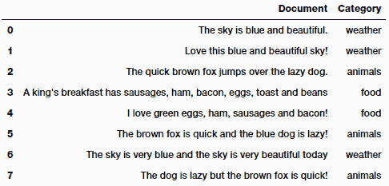

# 理解特征工程：文本数据的深度学习方法

> 原文：[`www.kdnuggets.com/2018/03/understanding-feature-engineering-deep-learning-methods-text-data.html`](https://www.kdnuggets.com/2018/03/understanding-feature-engineering-deep-learning-methods-text-data.html)

 评论

> **编辑说明：** 这篇文章只是一个更为详尽和深入原文的一部分，[原文链接](https://towardsdatascience.com/understanding-feature-engineering-part-4-deep-learning-methods-for-text-data-96c44370bbfa)，涵盖了比这里更多的内容。


### 引言

处理非结构化文本数据非常困难，尤其是当你试图构建一个智能系统，该系统像人类一样解释和理解自然语言时。你需要能够将嘈杂的、非结构化的文本数据处理并转换成一些结构化的、向量化的格式，以便任何机器学习算法都能理解。自然语言处理、机器学习或深度学习的原理，都属于人工智能这个大范畴内的有效工具。基于我之前的文章，需要记住的一个重要点是，任何机器学习算法都基于统计学、数学和优化的原理。因此，它们不足以直接处理文本的原始、自然形式。我们在[***第三部分：文本数据的传统方法***](https://towardsdatascience.com/understanding-feature-engineering-part-3-traditional-methods-for-text-data-f6f7d70acd41)中介绍了一些提取有意义特征的传统策略。***我鼓励你查看该部分以获得简要的回顾。在本文中，我们将探讨更多先进的[特征工程](https://www.kdnuggets.com/2018/12/feature-engineering-explained.html)策略，这些策略通常利用深度学习模型。更具体地说，我们将涵盖[**Word2Vec**](https://en.wikipedia.org/wiki/Word2vec)、[**GloVe**](https://nlp.stanford.edu/projects/glove/)和[**FastText**](https://research.fb.com/fasttext/)模型。

### 动机

我们已经反复讨论，包括在[***我们之前的文章***](https://towardsdatascience.com/understanding-feature-engineering-part-3-traditional-methods-for-text-data-f6f7d70acd41)中提到，特征工程是创建优质和更高性能的机器学习模型的秘密武器。请始终记住，即使有了自动化特征工程的能力，你仍然需要理解应用这些技术的核心概念。否则，它们将只是黑箱模型，你将不知道如何调整和优化以解决你面临的问题。

**传统模型的不足**

传统的（基于计数的）文本数据特征工程策略包括属于一种被广泛称为词袋模型的模型家族。这包括术语频率、TF-IDF（术语频率-逆文档频率）、N-gram 等。虽然它们是从文本中提取特征的有效方法，但由于模型固有的特性是仅仅一个无结构的单词袋，我们丧失了诸如语义、结构、序列和上下文等附加信息。这为我们探索能够捕捉这些信息并提供词向量表示的更复杂模型提供了足够的动机，这些词向量表示被称为嵌入。

**词嵌入的必要性**

尽管这确实有一些道理，但我们为什么要有足够的动力去学习和构建这些词嵌入呢？对于语音或图像识别系统，所有信息已经以高维数据集中的丰富密集特征向量的形式存在，比如音频谱图和图像像素强度。然而，当涉及到原始文本数据时，特别是像词袋模型这样的基于计数的模型时，我们处理的是单个单词，它们可能有自己的标识符，并不能捕捉单词之间的语义关系。这会导致文本数据的稀疏词向量，因此如果我们没有足够的数据，可能会得到较差的模型，甚至由于维度灾难而导致过拟合数据。


比较音频、图像和文本的特征表示。为了克服词袋模型基于特征的语义丧失和特征稀疏的问题，我们需要利用[***向量空间模型 (VSMs)***](https://en.wikipedia.org/wiki/Vector_space_model)，以便根据语义和上下文相似性将词向量嵌入到这个连续向量空间中。实际上，[***分布假设***](https://en.wikipedia.org/wiki/Distributional_semantics#Distributional_Hypothesis)在[***分布语义学***](https://en.wikipedia.org/wiki/Distributional_semantics#Distributional_Hypothesis)领域告诉我们，出现在相同上下文中的词在语义上是相似的，具有相似的意义。简单来说，*“一个词的特征由它的搭配词决定”*。有一篇著名的论文详细讨论了这些语义词向量及其各种类型，[*“不要计数，预测！语境计数与语境预测语义向量的系统比较”*](http://clic.cimec.unitn.it/marco/publications/acl2014/baroni-etal-countpredict-acl2014.pdf)由 Baroni 等人撰写。我们不会深入探讨，但简而言之，针对上下文词向量有两种主要方法。***基于计数的方法***，例如[***潜在语义分析 (LSA)***](https://en.wikipedia.org/wiki/Latent_semantic_analysis)，可以用来计算词在语料库中与邻近词一起出现的频率，并从这些度量中构建每个词的密集词向量。***预测方法***，如[***基于神经网络的语言模型***](http://www.scholarpedia.org/article/Neural_net_language_models)，试图从邻近词中预测词，观察语料库中的词序列，在这个过程中学习分布式表示，给出密集的词嵌入。我们将在本文中重点关注这些预测方法。

### 特征工程策略

让我们看看一些处理文本数据和提取有意义特征的高级策略，这些特征可以用于下游机器学习系统。请注意，你可以在[**我的 GitHub 仓库**](https://github.com/dipanjanS/practical-machine-learning-with-python/tree/master/bonus%20content/feature%20engineering%20text%20data)中访问本文中使用的所有代码，以便将来参考。我们将从加载一些基本依赖项和设置开始。

```py
import pandas as pd
import numpy as np
import re
import nltk
import matplotlib.pyplot as plt

pd.options.display.max_colwidth = 200
%matplotlib inline
```

我们现在将采用一些文档语料库，对其进行所有分析。对于其中一个语料库，我们将重用之前文章中的语料库，[***第三部分：传统文本数据方法***](https://towardsdatascience.com/understanding-feature-engineering-part-3-traditional-methods-for-text-data-f6f7d70acd41)。我们将为方便理解提到代码。



我们的样本文本 语料库我们的玩具语料库包含属于多个类别的文档。我们将在本文中使用的另一个语料库是免费的 [***《钦定版圣经》***](https://www.gutenberg.org/files/10/10-h/10-h.htm)，可以通过 [***古登堡计划***](https://www.gutenberg.org/) 通过 `corpus` 模块在 `nltk`中获取。我们将在下一节中加载它。在讨论特征工程之前，我们需要对这些文本进行预处理和规范化。

**文本预处理**

清理和预处理文本数据的方法有很多种。自然语言处理（NLP）管道中广泛使用的重要技术在 ***‘文本预处理’*** 部分的 [***第三部分***](https://towardsdatascience.com/understanding-feature-engineering-part-3-traditional-methods-for-text-data-f6f7d70acd41)中已详细介绍。由于本文的重点是特征工程，与我们之前的文章一样，我们将重用一个简单的文本预处理器，该预处理器侧重于去除特殊字符、多余的空格、数字、停用词，并将文本语料库转为小写。

一旦我们准备好基本的预处理管道，我们首先对我们的玩具语料库应用相同的处理。

```py
norm_corpus = normalize_corpus(corpus)
norm_corpus

Output
------ array(['sky blue beautiful', 'love blue beautiful sky',
       'quick brown fox jumps lazy dog',
       'kings breakfast sausages ham bacon eggs toast beans',
       'love green eggs ham sausages bacon',
       'brown fox quick blue dog lazy', 
       'sky blue sky beautiful today',
       'dog lazy brown fox quick'],
      dtype='<U51')
```

现在让我们加载基于 [***《钦定版圣经》***](https://www.gutenberg.org/files/10/10-h/10-h.htm)的其他语料库，使用 `nltk` 并预处理文本。

以下输出显示了我们语料库中的总行数以及预处理如何处理文本内容。

```py
Output
------

Total lines: 30103

Sample line: ['1', ':', '6', 'And', 'God', 'said', ',', 'Let', 'there', 'be', 'a', 'firmament', 'in', 'the', 'midst', 'of', 'the', 'waters', ',', 'and', 'let', 'it', 'divide', 'the', 'waters', 'from', 'the', 'waters', '.']

Processed line: god said let firmament midst waters let divide waters waters
```

**简介： [Dipanjan Sarkar](https://www.linkedin.com/in/dipanzan)** 是 Intel 的数据科学家，作者，Springboard 的导师，作家，以及体育和情景喜剧爱好者。

[原始](https://towardsdatascience.com/understanding-feature-engineering-part-4-deep-learning-methods-for-text-data-96c44370bbfa)。经许可转载。

**相关：**

+   文本数据预处理：Python 中的详细指南

+   文本数据预处理的通用方法

+   处理文本数据科学任务的框架

### 更多内容

+   [特征存储峰会 2022：关于特征工程的免费会议](https://www.kdnuggets.com/2022/10/hopsworks-feature-store-summit-2022-free-conference-feature-engineering.html)

+   [机器学习中的替代特征选择方法](https://www.kdnuggets.com/2021/12/alternative-feature-selection-methods-machine-learning.html)

+   [理解 Python 的迭代和成员：指南……](https://www.kdnuggets.com/understanding-pythons-iteration-and-membership-a-guide-to-__contains__-and-__iter__-magic-methods)

+   [机器学习中的特征工程实用方法](https://www.kdnuggets.com/2023/07/practical-approach-feature-engineering-machine-learning.html)

+   [构建一个可操作的特征工程管道用于多变量时间序列…](https://www.kdnuggets.com/2022/03/building-tractable-feature-engineering-pipeline-multivariate-time-series.html)

+   [使用 RAPIDS cuDF 利用 GPU 进行特征工程](https://www.kdnuggets.com/2023/06/rapids-cudf-leverage-gpu-feature-engineering.html)
